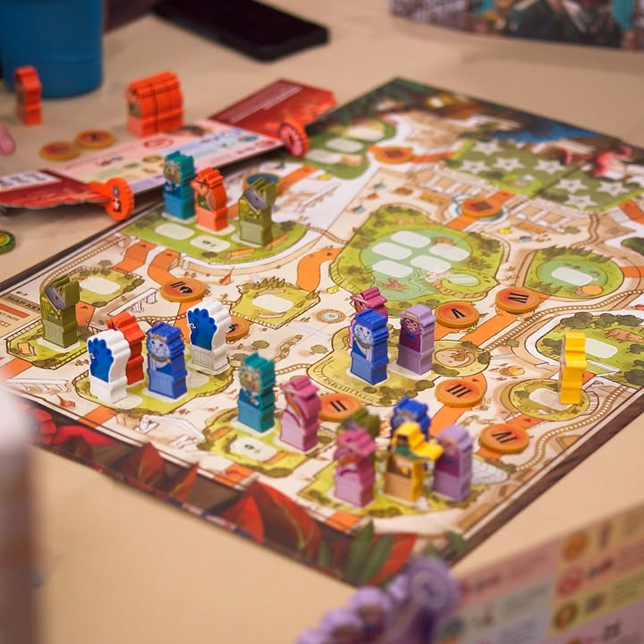

Zoo Vadis - โอ้เหล่าสรรพสัตว์ทั้งหลาย เจ้าจักไปสู่ที่แห่งใด? #bite_size #first_impression

verdict : อยากหากิจกรรมปาร์ตี้เป็นเกมเจรจาทำดีลฟรีฟอร์มคุยจนลิงหลับพร้อมกล้าล้มดีลที่คุยอย่างนั้นหรือ? เอาเกมนี้ไปเลย!

.
ไอเดียเกมง่ายมาก คือมันเป็นการเล่าถึงการชิงดีชิงเด่นของสัตว์ต่างๆในสวนสัตว์แห่งหนึ่ง พวกเราจะเริ่มจากจุดล่างสุดของสวนสัตว์และจะพยายามไต่ขึ้นมาทีละกรง ทีละขั้นไปเรื่อยๆจนไปอยู่ในกรงระดับ A List ที่จะได้มีสิทธิ์นับคะแนนเสียงในตอนจบ ....... แล้วคุณจะไปข้างหน้าได้ยังไงน่ะเหรอ?  ก็ด้วยคะแนนเสียงจากระบบเสียงข้างมากยังไงล่ะ!!!!

.
ในเรื่องของแผนที่เกมนี้ให้มองเป็นห้องที่จุคนได้ไม่เท่ากันแล้วเดินต่อลึกเข้าไปพร้อมเลี้ยวไปมาได้ละกัน การจะขยับขึ้นไปได้เราต้องมีเสียงรวมเกินครึ่งของ 'ขนาดห้อง' แปลว่าห้องขนาด 5 ที่ ต่อให้มีเรา 2 ตัวไม่คนอื่นอยู่เลยก็ย้ายออกไม่ได้ ต้องมีถึง 3 เท่านั้น

.
ตรงนี้เกมจะเปิดช่องให้เจรจาแบบมหาศาลเลยตั้งแต่พื้นๆที่จ่ายเงินให้ผมจะได้โหวตให้ หรือช่วยกันตอนนี้เดี๋ยวไปช่วยอีกห้อง หรือถ้าไม่โหวตผมเดี๋ยวผมจะเอาคนดูแลสวนสัตว์มายืนขว้างนะไม่ให้ออก ....... and so on

.
นี้ยังไม่รวมว่าสัตว์แต่ละตัวมีความสามารถเพิ่มด้วย และความสามารถนี้จะถูกเอาไป -นำเสนอบริการ- ให้กับเหล่าสัตว์ตัวอื่นเพื่อให้เกิดไดนามิคได้อีก

.
ที่โหดร้ายคือกรงสุดท้ายกันเป็นระดับ A List มีจำกัด ถ้าคุณไม่ได้ไปยืนอยู่ตรงนั้นละก็เงินที่สะสมมาทั้งหมดก็จะไม่ถูกนับมาเป็นคะแนน....

.
จริงๆคือเกมนี้มันเอาเกมเก่าของ Reiner Knizia ที่  Quo Vadis? มาทำใหม่ใส่ธีมสวยๆแล้วใส่สกิลของเหล่าสัตว์ลงไปพร้อมเพิ่มรับคนได้ถึง 7 คน

.
ข้อดีคือเกมมีให้เล่นแค่ 4 แอคชั่นคือลงตัวเพิ่ม ย้ายนกยูงที่เป็น NPC กลางเอาไปเกะกะคนอื่น ย้ายคนดูแลสวนสัตว์บล็อกทาง และสุดท้ายคือย้ายไปกรงถัดไป (ถ้าเสียงสนับสนุนมากพอ) คือมีแค่ 4 แอคชั่นแค่นี้แหละ ที่เหลือก็คุยกันแสบคอไป

.
แต่ทั้งนี้มันก็ไม่ใช่เกมแนวสุดยอดปาร์ตี้เกมสายคุยอะไรแบบนั้น ผมมองว่ามันเป็นกิจกรรมสนุกๆสำหรับวงที่ไดนามิกการคุยไปด้วยกันได้มากกว่า ใครเงียบๆไม่ชอบทำดีลก็อาจจะไม่ชอบอะไรเกมนี้เท่าไร แล้วเกมมันเปิดโอกาสให้ทำตัวจัญไรล้มดีลตลอดถ้าจิตไม่แข็งหรือขี้โวยวายนี้อาจจะเกลียดเลยก็ได้ เพราะสิ่งที่ทำให้มันเป็น 'เกม' คือคนในวง 100% การมีคนไม่อินคนเดียวเกมอาจจะกร่อยทันที แบบมันเป็นเกมสำหรับคนอยากวางแผนเพื่อชนะในขณะเดียวกันก็เข้าใจในความเป็นปาร์ตี้ของเกมด้วย

.
เป็นเกมที่วงที่เล่นด้วยวันนี้คือสนุกมาก scheming วางแผนกันฉิบหาย แต่ก็นึกหน้าออกเหมือนกันว่าวงส่วนมากที่ผมรู้จักอาจจะไม่สนุกเท่าไร แต่ที่แน่ๆสำหรับผมนี้เตะความเกรียนแบบลีลาเยอะสัดของ I'm the boss กับการคุยต่อราคากับคนบวกเลขหากำไรกับสุ่มที่ดินสุ่มของใน ChinaTown ไปแบบเด็ดขาดเลยละ แต่ทั้งนี้ก็ไม่รู้สึกว่ามันเป็นเกมที่เหมาะกับการเล่นบ่อยหรือเล่นติดๆกันนะ อารมณ์นานๆหยิบทีหรืออยากเจรจากลางวงเหล้าชิลๆก็น่าจะเหมาะอยู่

--------------------------------
หมวด Bite Size (พอดีคำ) นี้กะว่าจะเขียนอะไรสั้นๆประมาณนี้ล่ะกัน ใหม่บ้าง ซ้ำบ้าง เกมที่ขี้เกียจเขียนบ้าง เขียนๆไว้ก่อนเผื่อมีอารมณ์อาจจะขยายไปลง Thought บ้าง จริงๆอยากเขียนสั้นกว่านี้ แต่ยังอดไม่ได้ที่จะต้องอธิบายอะไรเพิ่มตามนิสัย เดี๋ยวค่อยๆปรับไปล่ะกัน

