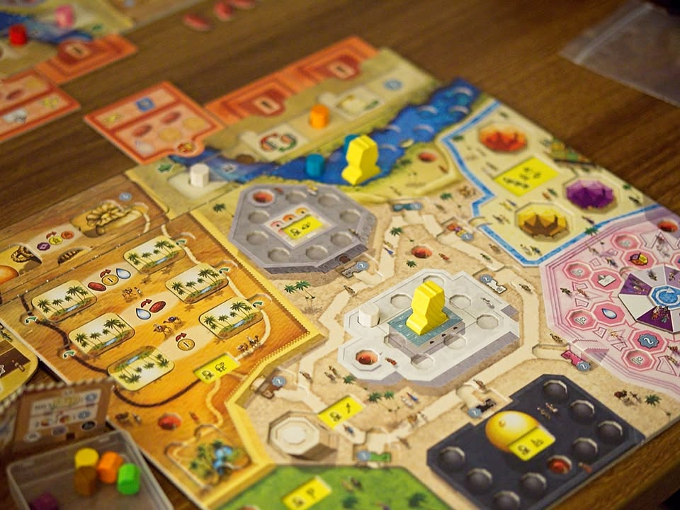
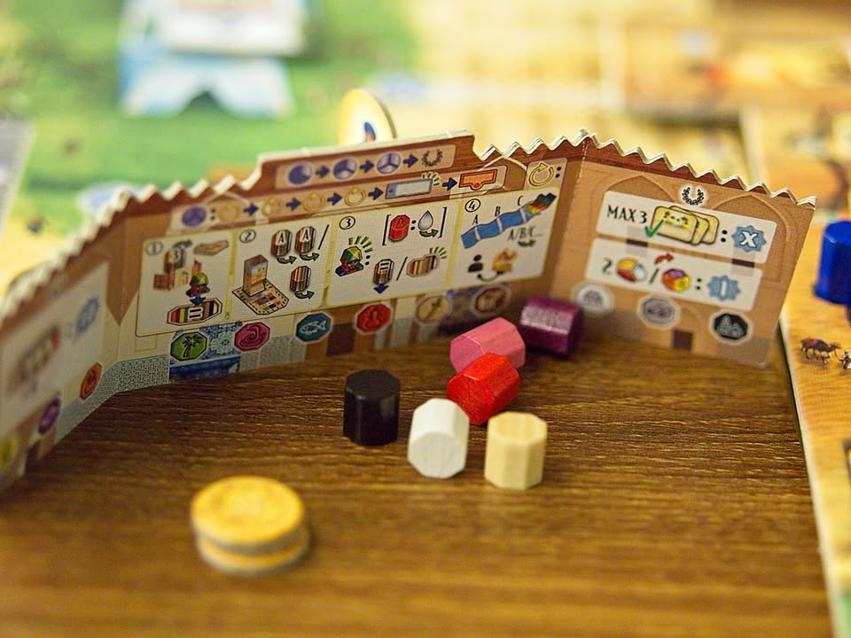

Marrakesh #bite_size #first_impression 

verdict : อีกหนึ่งผลงานตัว top ของนักออกแบบ Stefan Feld ที่แฟนๆควรจะมาลอง!! แต่ก็ยังคิดว่าน้อยกว่าตัว top อันอื่นของเฮียนะ

.
เกมนี้อธิบายยากหน่อยเพราะตามสไตล์คือธีมมันไม่ได้ช่วยบอกอะไรเราเท่าไร แต่เอาเป็นว่าเราจะมี mini game เราจะต้องหาแท่งมาใส่ให้ตรงสีอยู่ 8 เกม แต่ละกลุ่มมันก็มีผลในการหาของต่างๆกันไป แต่ที่เหมือนกันคือยิ่งเยอะยิ่งดี

.
ไอเดียคือเราจะมีแท่งสีที่ว่าอยู่ 12 แท่งตานึงเราจะเลือกมา 3 สีที่เราอยากจะทำแอคชั่นในช่องนั้น จากนั้นทุกคนจะเอาแท่งสีไปรวมแล้วทอยมาตรงกลาง แล้วเราก็ผลัดกัน draft หยิบแท่งจาก pool กลางของทุกคนมา upgrade board ของเรา พอเรียบร้อยก็ทำแอคชั่นที่เราเลือกไว้

.
คือความท้าทายนอกนอกจากจะเป็นแนวหยิบนี้มาสร้างโน้นตามฉบับเกมยูโรแล้ว แอคชั่นที่เราเลือกนั้นเราก็อาจจะไม่มีโอกาสหยิบของกลับมาเพื่อเสริมพลังก็ได้ เป็นเกมวางแผนสองขยักคือการเลือกทำแอคชั่นและการเลือกหยิบของ ตรงนี้ก็ทำให้เกมมีไดนามิกในการคิดไปตลอดทั้งเกม เพราะเรามีโอกาสทำแอคชั่นเดิมแค่ครั้งเดียวในหนึ่งรอบใหญ่เท่านั้น ทำให้บางทีก็ต้องเลือกแอคชั่นที่ยังไม่ได้อยากทำเพื่อดึงเกมสะสมพลังรอแอคชั่นที่ต้องการแทน แต่ว่านี้มันเกมประเภทอยากทำทุกอย่าง!! ก็นั้นแหละความสนุกของเกมนี้

.
ส่วนตัว tower เนี่ยมันจะมีช่องว่างค่ายกลข้างในนิดหน่อยที่จะทำให้ token ของเราบางชิ้นติดอยู่ข้างใน หรือบางทีก็กะแทกของเก่าที่เคยใส่ไว้ออกมาทำให้ของที่หยิบได้ในแต่ละรอบไม่ใช่สิ่งที่ fixed นะ โดยมันโผล่มาในเกมอย่าง Shogun กับ Amerigo มาแล้ว ซึ่งดูค่าย Queen จะภูมิใจกับระบบนี้มากเลยพยายามยัดมาอยู่นั้น

.
คือไม่รู้จะอธิบายอะไรเยอะเกมมันฟังดูยากๆแต่ถ้าเล่นยูโรมาเยอะพอมันก็ไม่มีอะไร แค่หยิบๆมาโปะๆกันเฉยๆ เลยอยากแนะนำกับผู้เล่นที่เพดานบินสูงหน่อยจะได้ไม่งงเยอะ แต่เกมมันก็ไม่ได้ยากเกินกว่าที่คนพี่งพ้น gateway มาจะไม่เข้าใจ แค่หยิบๆของ fullfill ไปเรื่อยน่ะ

.
ในแง่ความสนุกคือสนุก!!! แฟนยูโรและแฟนลุง feld ยังไงก็ชอบแน่นอน

.
ส่วนที่ไม่ชอบเป็นการส่วนตัว (และอาจจะตลอดไป) คือระบบ cube tower (ตั้งแต่ใน Shogun ละ) มีกลิ่นของความอยากใส่เพื่อให้มันมีจะได้สุ่มนิดนึง แต่เกมนี้ไม่ได้มีผลมากก็เลยเฉยๆ แต่ไม่ชอบอยู่ดี ระบบเควสเองใช้แบบสุ่มที่ต้องมาไล่ unlock เปิดสุ่มเองก็ไม่ค่อยชอบเท่าไร ดูลำไยๆ

.
และถึงแม้มันจะสนุกแต่ผมมองไม่เห็นภาพตัวเองที่จะกดซื้อโผล่ขี้นมาเลยด้วยเหตุผล 2 อย่าง อย่างแรกคือผมรู้สึก enjoy มันน้อยกว่า Burgundy, Luna, Bora Bora, Trajan ไปพร้อมๆกับราคาที่แพงแบบแพงเกิ๊นนน (แต่ทั้งนี้ผมเล่นเกมพวกนี้ในราคาปกติตอนมันออกอ่ะนะ) ในฝั่งเหตุผลดีๆก็มีแค่นี้แหละ แต่พอฝั่งอินเนอร์ก็จะเสริมว่ากล่องมันใหญ่พ่วงด้วยทั้งๆที่มาจากค่าย Queen ที่มีประสบการณ์มานานแต่ดันทำของแบบไม่เข้าใจว่าอะไรเรียกพรีเมี่ยมเห็นละหงุดหงิด มองคนเล่นเกมเป็น cash cow แบบดูถูกสัดๆ ดูงาน Burgundy หน่อยนะ ไม่ใช่ออก KS แถมสติกเกอร์มั่ง โปรเตอร์เฮียมั่ง -_-

.
แต่เอาจริงปัญหาตอนนี้คือเกมเฮียตัวเด็ดที่หาง่ายๆน่าจะเหลือแค่ Burgundy ส่วน Luna ค่ายเจ๊ง,  Trajan ก็น่าจะ OOP อยู่, Bora Bora รอ reprint แต่ดันมาในรูปของ city collection ที่แพง+เห่ย ต่อ -_- เห้ออออออออ

.
เกมนี้ไปเล่นที่งาน Game Till Dawn ขอบคุณ SO-called boardgame เจ้าของสโลแกน #จ่ายก่อนเล่นก่อน ที่เอามาให้ลองเล่นด้วยครับ

