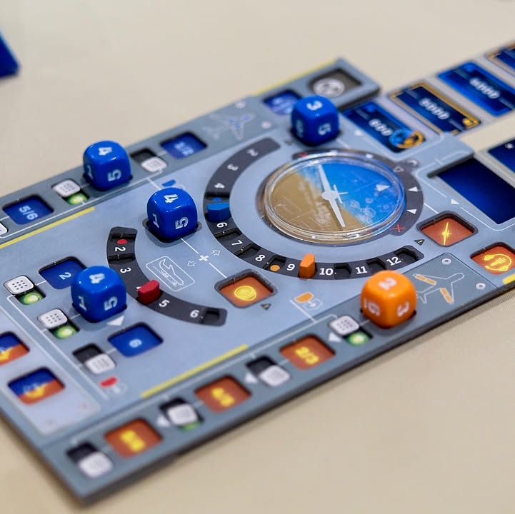
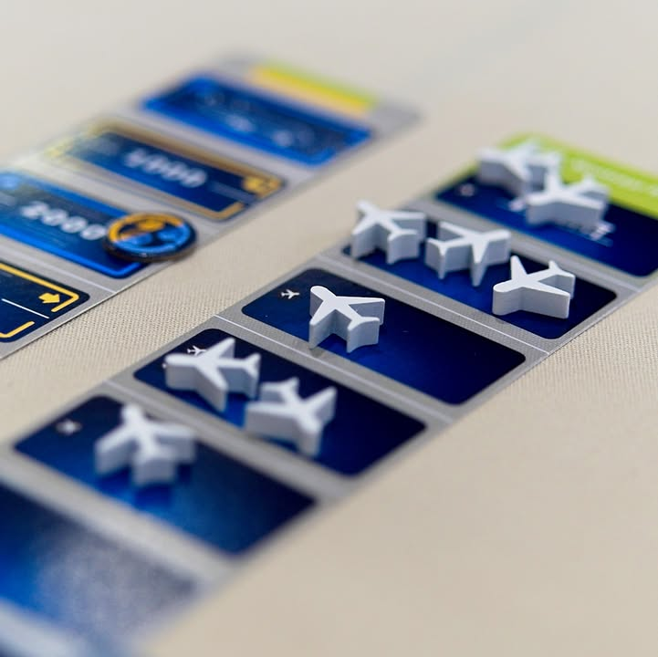
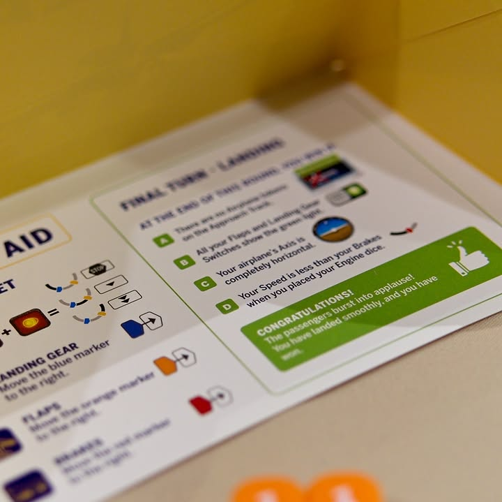

Sky Team #bite_size #first_impression 

verdict : เกมร่วมมือกันสำหรับ 2 คนเล่นไวจัด 15-20 นาที มีเอกลักษณ์ดี ใครมองหาเกมทรงแบบนี้ก็น่าลองมาก

.
ไอเดียเกมคือเราจะพยายามนำเครื่องบินให้ลงจอดในสนามบิน โดยผู้เล่นสองคนจะแบ่งหน้าที่กันเป็น pilot และ co-pilot ที่จะต้องทำงานร่วมกัน แต่ตอนจะทำแอคชั่นดั๊นนนนนนน คุยกันไม่ได้.....

.
ในเกมผู้เล่นจะได้รับเต๋าคนละ 4 ลูกเอามาทอยของใครของมันไว้ในฉาก โดยก่อนทอยก็วางแผนกันก่อนได้แต่หลังจากทอยแล้วก็ห้ามคุยนะ จากนั้นก็ผลัดกันวางเต๋าจนหมดเท่านั้นเอง 

.
อนึ่งเนื่องจากผมไม่รู้จักศัพย์ในวงการการบิน ตรงไหนเรียกผิดก็ทนผมนิดนึงนะ

.
"ท่านผู้โดยสารค่ะ กัปตันและลูกเรือทุกคนมีความยินดีต้อนรับท่านด้วยบริการสายการบินบ่นแล้วบ่นอีกจำกัด......"

.
เกมจะมี 2 ช่องที่บังคับให้ผู้เล่นทั้งคู่ต้องลงประกบคู่กันคนละฝั่งอย่างแรกคือการปรับระนาบเครื่องบินให้ไม่เอียงจนพลิกคว่ำ โดยเครื่องบินจะเอียงไปตามผลต่างของเต๋าสองลูก อย่างถ้า pilot เล่น 6 แต่ co-pilot เล่น 3 เครื่องก็จะเอียงซ้ายไป 3 จึกงี้ 

.
อีกอันคือเครื่องยนต์ที่จะเอาผลรวมของเต๋าสองลูกมารวมกัน ตรงนี้มันจะมีการแบ่งช่วงตัวเลข ที่เดี๋ยวเราไปปรับได้ทีหลังแต่มันจะกำหนดว่าเครื่องบินเราจะเคลื่อนตัวไปข้างหน้ากี่ช่อง แต่ถึงเร็วก็ใช่ว่าดีเพราะมันอาจจะมีเครื่องบินคนอื่นวิ่งวนไปวนมาอยู่ด้วย ถ้าเราไปถึงไวก็บู๊ม!! ชนดิ๊

.
เพราะงั้นแอคชั่นรองๆของเราก็คือสั่งเต๋าไปบอกหอบังคับการณ์ให้เคลียร์ทางหน่อย แต่ว่าเราจะหยิบเครื่องบินออกได้แค่ตามตำแหน่งที่ตรงเลขเต๋าเราเท่านั้น อันอื่นก็ไม่มีอะไรเป็นธีมว่า กางล้อ, ปรับชายปีก, กดเบรค ที่ต้องเล่นเรียงเลขเต๋า แล้วก็มีลงช่องกินกาแฟเอาไว้ให้ใครก็ได้เล่นเพื่อปรับเลขเต๋างี้

.
เกมมีหลาย scenario ให้ลองเล่นด้วยยังไม่ได้ลองแต่ดูน่าสนใจดี มีแก็สรั่ว น้ำแข็งเกาะ ลมแรง กับมันจะพยายามจำลองสนามบินหลายๆที่ด้วย (ซึ่งไม่รู้เหมือนกันว่าเหมือนไม่เหมือนนะไม่เคยไป)

.
โดยรวมผมชอบนะสนุกเพลินๆ ที่ชอบจริงๆก็คือธีมมันแปลกดี ตอนออกคงซื้อเก็บไว้สำหรับเกมสองคนแบบเอาไว้นั่งเล่นรอเพื่อนในวงมางี้ กล่องเล็กพกพาง่าย จุดที่ไม่ชอบในเชิงเกมก็อาจจะเป็นมันมีพลังในการดึงให้เล่นซ้ำหรือต่อเนื่องไม่มาก ดวงก็มีผลเยอะอยู่เพราะมันมีผลต่อการควบคุมทิศทาง ก็มี reroll ให้นิดนึง แต่ถึงอย่างไรมันก็เกมเล็กนะ อยู่ในระดับที่สร้างความบันเทิงกับท้าท้ายดี

.
ระบบไม่ให้พูดระหว่างวางนี้ในเชิงเกมคือแก้ปัญหาและเพิ่มความท้าทายในการสื่อสารได้สนุกดี เพราะต้องเดาเลขเต๋าอีกฝ่ายนิดนึง แต่ในเชิงธีมจะงงๆหน่อยว่าอ้าวทำไมคุยกันไม่ได้ (ว่ะ) แต่เค้าเขียนในคู่มือเลยนะว่าเอานักบินมาช่วยในคำแนะนำในการออกแบบตั้ง 3 คน!

.
เกมนี้ไปเล่นที่งาน Game Till Dawn ขอบคุณ Karn GG ไปหิ้วมาจาก Essen ให้ลองเล่นเกมนี้เล็งไว้เหมือนกันลองเล่นก็ดีเลย

.
images: ถ่ายเอง

--------------------------------
หมวด Bite Size (พอดีคำ) นี้กะว่าจะเขียนอะไรสั้นๆประมาณนี้ล่ะกัน ใหม่บ้าง ซ้ำบ้าง เกมที่ขี้เกียจเขียนบ้าง เขียนๆไว้ก่อนเผื่อมีอารมณ์อาจจะขยายไปลง Thought บ้าง จริงๆอยากเขียนสั้นกว่านี้ แต่ยังอดไม่ได้ที่จะต้องอธิบายอะไรเพิ่มตามนิสัย เดี๋ยวค่อยๆปรับไปล่ะกัน

