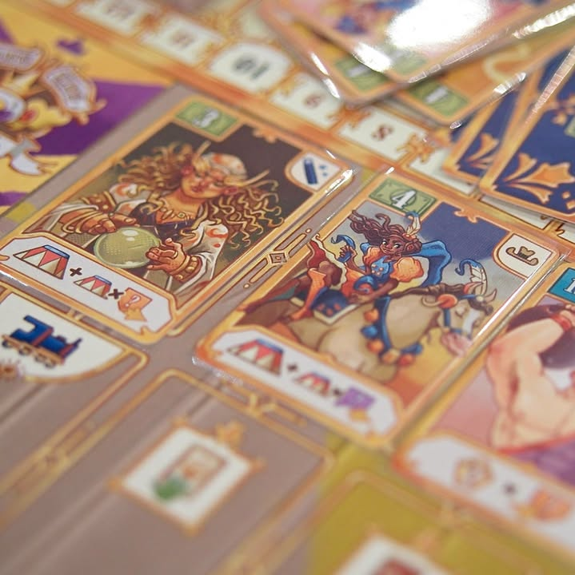
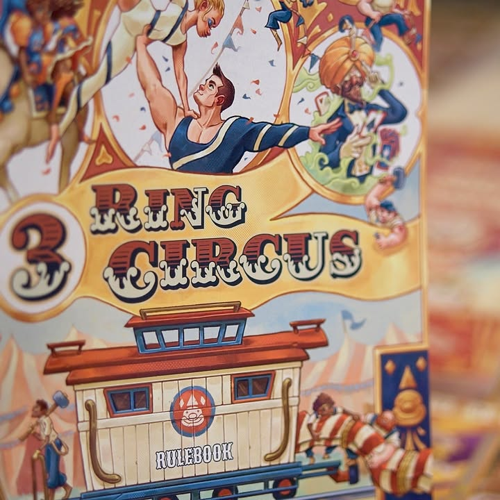

3 Ring Circus #bite_size #first_impression 

verdict : ตอนแรกนึกว่าไม่มีอะไร ที่ไหนได้ชิงจังหวะแย่งกันจัดแสดงกันผิดกับความน่ารักของอุปกรณ์จัดๆ

.
ธีมว่าด้วยการเดินทางไปจัดแสดงทั่วอเมริกาของคณะละครสัตว์ 

.
ไอเดียคือเวลาเราเดินทางไปจัดแสดงตามเมืองมันจะมีเงื่อนไขการทำแต้มว่าคณะละครของเราจะต้องมีเงื่อนไขพื้นฐานบางอย่างก่อน ซึ่งก็ได้จากสมาชิกคณะที่เราเก็บมานั้นแหละ เมืองไหนแสดงแล้วคณะอื่นก็จะมาจัดแสดงไม่ได้ เวลาเดินก็ต้องเดินข้ามอีก ทำให้พื้นที่การเล่นลดลงเรื่อยๆ ตรงนี้ไม่ซับซ้อนและทำมาได้ดี

.
ระบบการจัดการคณะจะมาในรูปแบบว่าเราต้องไปซื้อการ์ดมาเติมในแถวก่อนซึ่งมีสามแถวก่อน แล้วก็มีไอเดียว่ามันต้องเรียกเลขกันแบบน้อยไปมาก ทีนี้กิมมิคเล็กอันแรกคือยิ่งซื้อคนมาเยอะมันก็จะทำให้คณะเราเดินทางได้ช้าลงเพราะการ์ดมันไปบังไอคอนการเดินทาง

.
อย่างที่สองเป็นส่วนที่ผมคิดว่าเป็นทั้งจุดแข็งและจุดอ่อนของเกม คือมันจะการ์ดแบบ ถ้าคุณมี X อยู่ทางขวาคุณจะได้โน้นนี้เพิ่ม หรืออะไรคล้ายๆกันแต่ถ้าอยู่ทางซ้ายของการ์ดใบนี้ คือมันเป็น puzzle ที่น่าสนใจแต่ว่าเห้ยตลาดมันสุ่มจัดๆ! พ่วงกับการแสดงในเมืองใหญ่จะระบุไว้ชัดเจนเลยมันต้องมีการ์ดเบอร์ไหนอยู่ในคณะบ้าง และถ้ามีเบอร์นี้ซ้ายอันนี้ เบอร์โน้นขวาอันนี้จะได้แต้มเพิ่ม ที่นี้เราก็ต้องนั่งก้มๆมองๆหาการ์ดพร้อมกับนั่งดูว่าจะซื้อใบไหนมาลงแถวไหนถึงจะ 'Optimal' ได้มากที่สุด

.
ใช่แล้วเกมนี้เล่นกับความรู้สึกอยากจะ Optimal ของชาวยูโรหนักหัวได้แบบแสบสันเกิน weight โดยรวมได้อย่างฉลาดมาก ก็จะเป็นข้อเสียเหมือนกันที่มันอาจจะกลายเป็นเกมนานเพราะมัวแต่อยากจะหาท่าที่ดีที่สุดเนี่ยแหละ

.
และทุกครั้งที่จัดแสดงมาร์คเกอร์คณะละครสุดยอดแห่งยุคสมัย Barnum & Bailey Circus แวะมาที่รัฐก็จะมีการคิด majority  ด้วยทำให้เราจะมัวแต่เสียเวลาหาคณะที่ดีที่สุดไม่ได้เพราะต้องเดินทางไปจัดแสดงด้วยไม่งั้นที่ว่างจะเต็ม แถมในช่วงท้ายเกมถ้ามัวแต่ปั้นคณะมากไปก็อาจจะเดินช้าจนไปไม่ทันก็ได้

.
จุดที่อาจจะมีปัญหานิดหน่อยคือเนื่องจากมันต้องดูอะไรอยู่ซ้ายอยู่ขวาตลอด คนที่นั่งด้านกลับหัวก็อาจจะมึนๆหน่อยนะ ผมงี้ต้องกลับกระดานตัวเองเอาเพราะขี้เกียจหมุนในหัว 

.
สนุกดีครับเกมนี้เป็นได้ทั้ง Thinky not 'really' filler ที่ไม่หนักมากก่อนเกมหนักหรือก่อนกลับบ้านก็ได้ หรือจะสำหรับกลุ่มพึ่งพ้น gateway ก็พอไหว แต่ก็มีหลายอย่างที่แอบซับซ้อนเกินเบอร์ไปนิดแต่ก็ไม่ได้มากอะไรนะ (พวกทิ้งการ์ดแทนเงิน กับการคูณแต้มโน้นนี้) จุดที่ไม่ชอบนิดหน่อยแต่มีผลกับเกมมากคือเรื่องตลาดมันสุ่มเยอะเนี่ยล่ะ แต่คิดอีกทีเลือกได้มากกว่านี้เกมก็อาจจะงึมงำเกินไปก็ได้

.
เกมสุดท้ายละที่มีรูปตอนไปเล่นที่ Game Till Dawn  ขอบคุณหมอพีท Heavy Meeple ครับที่หยิบเอามาสอนเล่น สนุกดียิ่งเล่นกับวงเขี้ยวลากดินนี้กลายเป็นเกมโหดเฉย

image: ถ่ายเอง

--------------------------------
หมวด Bite Size (พอดีคำ) นี้กะว่าจะเขียนอะไรสั้นๆประมาณนี้ล่ะกัน ใหม่บ้าง ซ้ำบ้าง เกมที่ขี้เกียจเขียนบ้าง เขียนๆไว้ก่อนเผื่อมีอารมณ์อาจจะขยายไปลง Thought บ้าง จริงๆอยากเขียนสั้นกว่านี้ แต่ยังอดไม่ได้ที่จะต้องอธิบายอะไรเพิ่มตามนิสัย เดี๋ยวค่อยๆปรับไปล่ะกัน

