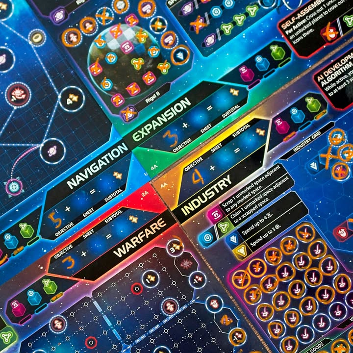
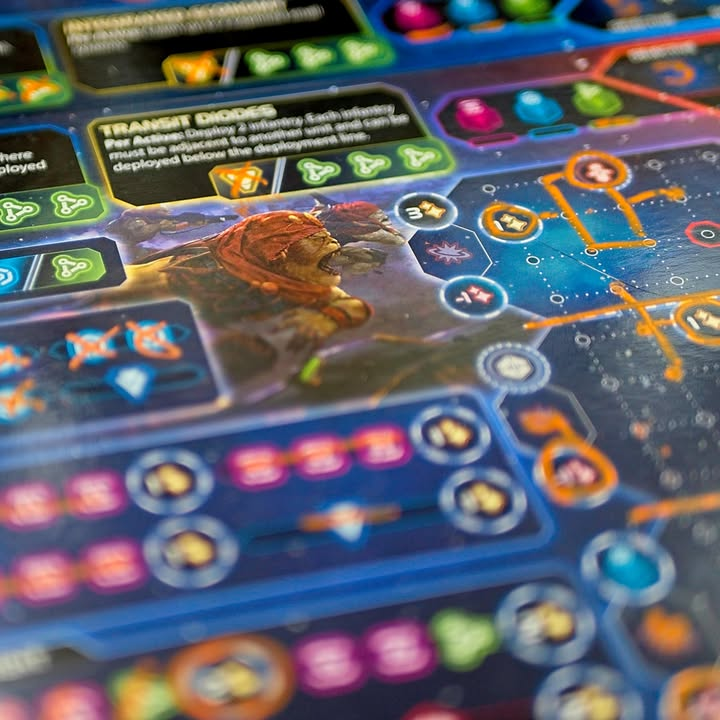
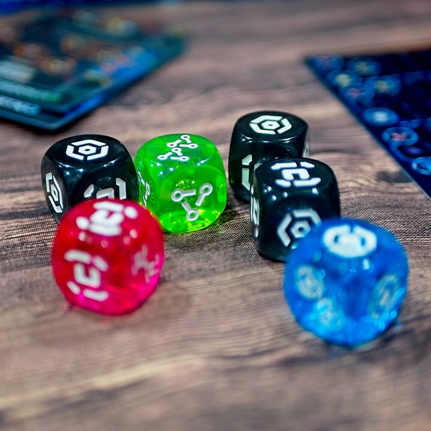

Twilight Inscription #first_impression #bite_size 

verdict : เกม roll & write ที่เล่นแล้ว epic ดั่งคำโปรย แถมฟีล 4X มาหนักกว่าบางเกมที่โปรโมตตัวเองว่า 4X อี๊กกกกกก 

.
ถ้าคุณไม่รู้จักแนว roll & write ไอเดียคือมันจะมีการทอยเต๋า (หรือเปิดการ์ด) เพื่อสุ่มหน้าเต๋ามา จากนั้นคนในวงก็จะ 'เลือก' เอาเลขกลางบางส่วนนี้ลงไปเขียนใส่กระดาษของตัวเอง ความสนุกส่วนมากของเกมแนวจะอยู่ที่การจัดชุดเลข (อารมณ์บิงโก) และการปล็ดล็อกโน้นนี้เพื่อทำคะแนน ขอดีอีกอย่างของเกมแบบนี้คือ scale จำนวนคนเล่นให้เยอะได้ง่าย

.
ส่วน Twilight Inscription  เนี่ยมันคือเกมที่ใช้ธีมกับพยายามย่อฟิลของ  Twilight Imperium เกม space opera  ระดับเล่นครึ่งวันเป็นอย่างน้อยมาอีกทีหนึ่ง 

.
เกมนี้ผู้เล่นแต่ละคนจะได้รับ 4 บอร์ดมีการสุ่มแตกต่างกัน โดยทั้ง 4 จะแทนกลุ่มโฟกัส 4 แบบสไตล์ 4X เกมเลย ได้แก่ Navigation ออกสำรวจอวกาศยึดดวงดาว, Expansion ตักตวงทรัพยากรจากดาวที่เรายึดมา, Industry การลงทุนพัฒนาเศรษฐกิจของบ้านเรา และ Warfare ส่งทหารและยานไปสูงกับพื้นบ้าน

.
ระบบก็แนว  r&w  ทั่วไป แต่เกมจะให้เราเลือกก่อนว่าอยากทำแอคชั่นที่บอร์ดไหน พอทำแล้วก็จะมี event แจกไอคอนเต๋านิดหน่อย แล้วก็มีการทอยเต๋ากลางให้เอาหน้าเต๋าไปทำแอคชั่นของบอร์ดตัวเองอีกที ซึ่งมีหน้าเต๋าแค่ 3 แบบเท่านั้นเอง หรือถ้าใครปลดล็อกหน้าเต๋าพิเศษมาก็จะได้ใช้ด้วย โดยแต่ละหน้าเต๋าก็จะมีหน้าที่ในแต่ละบอร์ดไม่เหมือนกัน มีทั้งแบบใช้ทำแอคชั่นและใช้ขีดฆ่าเพื่อสะสมปลดล็อกท่า

.
- บอร์ด Navigation จะให้เราขีดเส้นเดินทาง หรือ ขีดวงดาวที่เดินทางถึงเพื่อเอาของ
- บอร์ด Expansion จะให้เราขีดช่องไอคอนที่พอครบแถวก็จะได้ของที่ต้องการ
- บอร์ด Industry จะงงนิดหน่อยเพราะต้องกาเพื่อสร้างทางเดินและวงเพื่อเก็บของ ทุกๆชุดจะช่วยให้เรามีผลผลิตเอาไปใช้ต่อ
- บอร์ด Warfare อันนี้จีเนียส คือให้จุดแทนทหารเยอะก็ชนะเพื่อนข้างๆ แต่เราเอาไอคอนไปสะสมเพื่อออกเป็นยานได้ด้วย คำว่ายานก็คือการขีดเส้นเป็นรูปทรงแล้วแต่ยาน ฟังดูตลกๆแต่เล่นจริงแม่งเออหว่ะ puzzle ใช้ได้

.
ส่วนที่คิดว่าดีมากคือ เข้! มันเอา r&w มาทำเกมฟีล 4X ได้ดีจัด อารมณ์ของการเลือก focus การมีจังหวะสร้างทหารหวังเบียดเคลมของจากเพื่อนบ้าน puzzle ในการแก้บอร์ดตัวเอง เล่นแล้วอิ่มเอม เผ่าแม่งก็เยอะจัดคือ 24 เผ่าบอร์ดก็สุ่ม เล่นๆได้ 8 คน คือ replayability ดีมาก (พูดเหมือนขายของแต่ไม่ใช่นะ :P)

.
ส่วนจุดที่ไม่ชอบมันจะมาแบบเอ๊ะ! ก็คือ แล้วเราจะมาเล่นเกมนี้ทำไมว่ะเนี่ย? คือไม่ได้บอกว่าไม่สนุก ผม enjoy กับมันมากเลย แต่เกมมันเล่นกันหลักชั่วโมงแล้วระบบเกมมันก็ไม่ได้ซับซ้อนอะไรเล่นละอิ่ม แต่มันก็ขัดอารมณ์ฟิลเบาสบายสไตล์ r&w เหมือนกันนะ แต่นั้นแหละเกมเล่นสนุกก็ยังไงก็ได้ 

.
ข้อเสียอีกอย่างคือแม้ระบบมันจะไม่ได้วุ่นวายอะไรแต่เกมมันมีความจุกจิกในการปลดล็อกโน้นนี้และมัน 'มั่ว' ได้ง่ายมากเพราะไม่มีใครมานั่งดูของเรา และด้วยความที่มันบอร์ดเยอะกาแยะก็คือพังแล้วยาวปายเพราะมันอันล็อกเป็นเชน

.
อีกอย่างคือปากกา... ลบยากฉิบหายเลยโว๊ยยยยยย คือมันจะเป็นชอล์กน้ำนะ ไม่ใช่ปากกาไวท์บอร์ด เหตุผลคือเกมมันบอร์ดสีเข้ม เขียนธรรมดามองไม่ออก เลยต้องเป็นสีส้มสะท้อนแสงสดใสเข้าธีม แต่ตอนขัดออกนี้มันแน่นแบบแน่นเมื่อยมือ เพราะใช้ทิชชู่เปียกเช็ดก็ไม่ได้เละกว่าเดิมต้องใช้แบบแห้ง

.
ส่วนตัวคิดว่าเป็นเกมที่เหมาะกับการหามื้ออิ่มสบายของ advance gamer ที่ผ่านการเล่นเกมมาเยอะหน่อย เพราะถึงมันจะเล่นง่าย แต่ก็มี concept พื้นฐานหลายอย่างที่ยกมาจากเกมอื่นๆเยอะเหมือนกัน มือใหม่อาจจะหยุบหยับไปหน่อย

.
เกมนี้หมอพีท Heavy Meeple เอามาให้ลองขอบคุณมากครับ 

--------------------------------
หมวด Bite Size (พอดีคำ) นี้กะว่าจะเขียนอะไรสั้นๆประมาณนี้ล่ะกัน ใหม่บ้าง ซ้ำบ้าง เกมที่ขี้เกียจเขียนบ้าง เขียนๆไว้ก่อนเผื่อมีอารมณ์อาจจะขยายไปลง Thought บ้าง จริงๆอยากเขียนสั้นกว่านี้ แต่ยังอดไม่ได้ที่จะต้องอธิบายอะไรเพิ่มตามนิสัย เดี๋ยวค่อยๆปรับไปล่ะกัน

