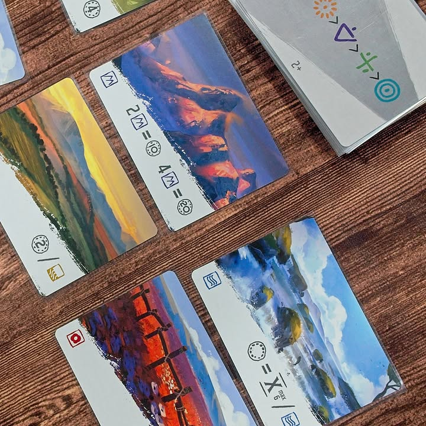
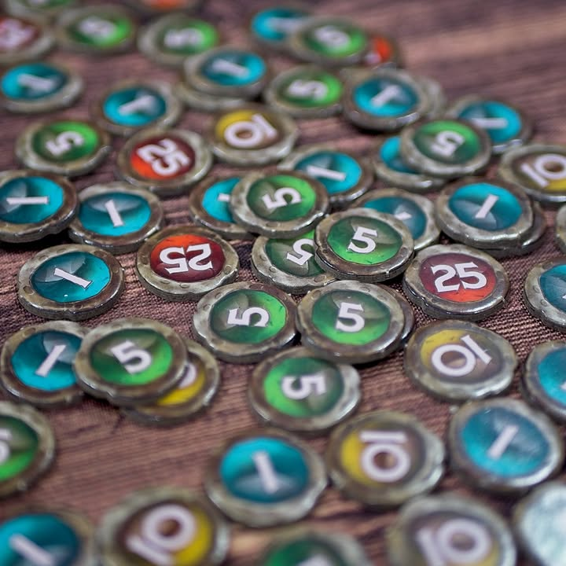

Vaalbara #bite_size #first_impression 

verdict: การ์ดเกมเล่นสั้นสไตล์ Citadels คั่นเวลาเพลินๆ รูปสวย

.
มันเป็นการ์ดเกมที่ผู้เล่นจะมีชุดการ์ดเหมือนกัน 12 ใบ จั่วมา 5 จากนั้นในแต่ละรอบก็ลงพร้อมกันหนึ่งใบ ใครเลขน้อยกว่าก็ได้เลือกการ์ดดินแดนที่เอาไว้ทำคะแนนก่อน ทำแบบนี้วนๆกันจนเล่นการ์ดครบ 9 ใบก็จบเกม..... อีซี่

.
แน่นอนว่าความสนุกมันมีทั้งจากเลเยอร์ลำดับการลง และความสามารถของตัวการ์ดเองก็จะมีกวนๆบ้างทำ ทำแต้มบ้าง รวมไปถึงการสับเปลี่ยนการ์ดดินแดนในตลาด

.
ตัวการ์ดดินแดนมันก็จะมีอารมณ์ของการสะสมทำชุดแต้มแตกต่างกันไป มีทั้งพวกแต้มดิบเลย หรือเก็บซ้ำ ไม่ก็ทำชุดไรงี้ ด้วยความที่มันเปิดตามจำนวนคนพอดี การนั่งมองหน้าเพื่อนว่ามันจะลงเลขต่ำมาแย่งอะไรเราไหมก็คือความสนุกของเกมละ

.
กิมมิคที่แอบชอบในเกมนี้คือทุกการ์ดดินแดนมันจะมีลายหลังการ์ดไม่เหมือนกันซะทีเดียว โดยจะเป็นลายสีเผ่าของผู้เล่นเรียงสลับสุ่มกัน เวลาเล่นแล้วเลขชนกันก็ให้ไปดูตรงลายนี้แหละว่าใครได้ก่อน คือมันเป็นเรื่องเล็กก็จริงแต่ผมคิดว่ายอดมากเพราะไม่วุ่นวายดี

.
แต่ทั้งนี้มันก็เป็นเกมการ์ดเกมเล็กๆเล่น 20 นาทีอ่ะนะ ตามโจทย์ผมก็คิดว่าทำได้ดีเลยละ อาจจะเหมาะกับแก๊งเล่นช่วงเบรคซัก 4-5 คน

.
เกร็ดความรู้ - Vaalbara เป็นชื่อทวีปแห่งแรกของโลก ที่ตอนนี้ก็ประมาณทวีปแอฟริกา (ไม่ใช่ Pangaea และเห็นเค้าคุยกันว่าถ้าไม่ใช่อันนี้ก็จะเป็น Ur ที่อยู่แถวๆอินเดีย คือมันเกิดใกล้ๆกันแต่ไม่รู้อันไหนเกิดก่อน) และแน่นอนว่าตอนนั้นยังไม่มีมนุษย์....

.
แน่นอนว่าเป็นเกมของหมอพีท Heavy Meeple อีกแล้วแกบอก back มาเพราะหาการ์ดเกมเล็กๆ ซึ่งเกมมันก็เพลินๆดีนะ

--------------------------------
หมวด Bite Size (พอดีคำ) นี้กะว่าจะเขียนอะไรสั้นๆประมาณนี้ล่ะกัน ใหม่บ้าง ซ้ำบ้าง เกมที่ขี้เกียจเขียนบ้าง เขียนๆไว้ก่อนเผื่อมีอารมณ์อาจจะขยายไปลง Thought บ้าง จริงๆอยากเขียนสั้นกว่านี้ แต่ยังอดไม่ได้ที่จะต้องอธิบายอะไรเพิ่มตามนิสัย เดี๋ยวค่อยๆปรับไปล่ะกัน

