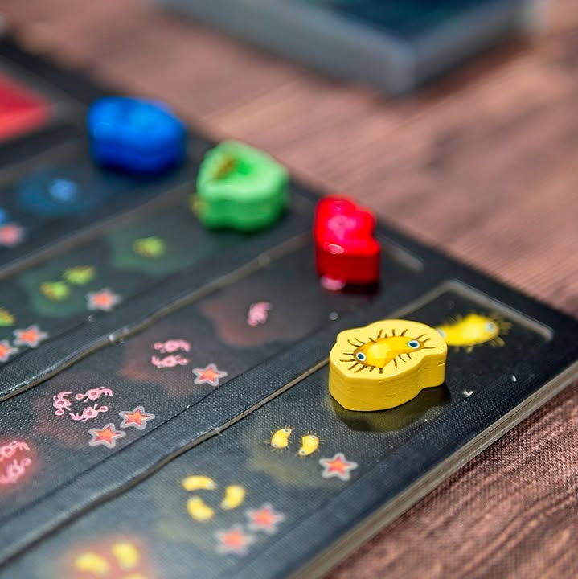
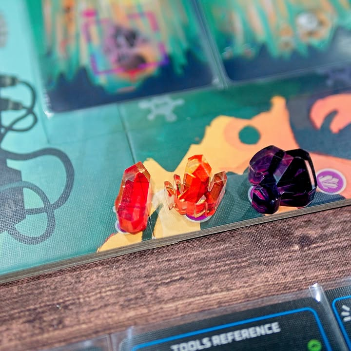

So, You've Been Eaten #bite_size #first_impression 

verdict : เกม 2 คนที่คนหนึ่งเป็นสัตว์ประหลาดยักษ์และอีกคนหนึ่งเป็นนักขุดที่จะมาทะลวงลำไส้ฝ่าเชื้อโรคเพื่อหาของมีค่าออกไปทำคะแนน เป็น asymmetric game ที่สนุกกว่าที่คิด

.
ธีมก็แถวๆนั้นแหละนักขุดที่ถูกกลืนอยู่ในลำไส้ (ใหญ่...ละมั้ง) ของสัตว์ยักษ์ต่างดาว โดยฝั่งนักขุดจะเดินการโดยการทอยลูกเต๋าทำ risk magament ในขณะที่เอเลี่ยนจะพยาพยามยื้อและยัดเยียดเชื้อโรคเข้าตัวนักขุดจนตายดับ

.
ไอเดียคือกระดานมันจะเป็นลำไส้ของเอเลี่ยน ฝั่งเอเลี่ยนก็จะจั่วและวางการ์ดเชื้อโรคลงไปเป็นการเปิด 'puzzle' ให้กับฝั่งคน  จากนั้นฝั่้งคนก็จะได้ทำแอคชั่นหลักๆอยู่ 3 อย่างคือเก็บผลึกหินหรือไอเท็มที่อยู่บนการ์ดเชื้อโรค หรือเลือกผลักการ์ดบางใบออกไปข้างหลัง หรือไม่ก็ยิงปิ้วๆๆทำลายการ์ดเชื้อโรคซะ โดยถ้าใบที่ติดๆกันมีสีเหมือนกันก็จะได้ทำลายฟรีด้วย

.
ความยากของฝั่งคนคือไอ้แอคชั่นที่ทำได้มันจะต้องตำแหน่งตรงกับหน้าเต๋า ก็ต้องคิดกันนิดนึง พอเรียบร้อยเชื้อโรคที่อยู่ใกล้สุดก็จะโจมตีใส่ผู้เล่น ซึ่งถ้าโดนอันใดอันหนึ่งถึงจำนวนที่กำหนดก็ม่องไป ในขณะที่ผู้เล่นถ้าเก็บหินครบ 8 ชนิดก็จะจบเกมชนะไปเลย

.
ฝั่งเอเลี่ยนเองระหว่างเล่นก็จะมีสิทธิ์ในการสะสมการ์ดที่เหลืออยู่เอาไปซื้อการ์ดภูมิคุ้มกัน (ก็คนมันเป็นสิ่งแปลกปลอมนี้นะ) ที่จะช่วยกำจัดให้คนเล่นยากขี้นเรื่อยๆได้เช่นกัน

.
จุดที่ชอบก็คือรู้สึก puzzle มันก็มีสัดส่วนของดวงและการวางแผนที่ดีเพลินดีนะมีความรู้สึกแบบกูจะตายแล้ววววววว และพอหาทางรอดได้ก็แบบเป็นไงล่ะ!! ดี กิมมิคเล็กๆที่คิดว่าดีก็คือฝั่งเอเลี่ยนจะต้อง 'เดา' หรือทายว่าไวรัสสีไหนจะวิ่งเข้าทำร้ายผู้เล่นในตานี้ด้วย ตรงนี้ก็จะมีลูกเล่นของการวางแผนซ้อนทางของฝั่งเอเลี่่ยนว่าฝ่ายคนจะเคลียร์การ์ดแบบไหน ทำให้เกมมันดูมีลูกล่อลูกชน

.
จุดที่รู้สึกขัดๆนิดหน่อยคือตอนเล่นเป็นนักขุดครั้งแรกรู้สึกความสามารถของการ์ดเอเลี่ยนมันเยอะแล้วก็หยุบหยับเอาเรื่อง อ่านแล้วบางทีคิดตามไม่ค่อยทัน กับกติกาตอนแรกมันมีความกระแทกหน้านิดนึง แต่เล่นไปเรื่อยๆก็เข้าใจตามได้ไม่ยากนะ

.
ผมเล่นแบบมีตัวเสริมด้วยเป็นตัว Dyspepto-Beastmol ที่รู้สึกว่ามีแล้วสนุกดีนะ ทำให้การกำจัดการ์ดความสามารถของฝั่งเอเลี่ยนทำได้ยากขึ้นกับมีลูกล่อลูกชนในการยอมรับเชื้อโรคแต่ได้หน้าเต๋าฟรีของฝั่งคนด้วย คือถ้าไม่มีคิดว่าฝั่งเอเลี่ยนน่าจะง่อยไปหน่อย

.
เกมนี้เล่น 0 คนก็ได้นะ แต่ว่ามันไม่วางอยู่เฉยๆแต่เราต้องมานั่งขยับบอทสองตัวมาสู้กัน ไม่รู้จะทำไปทำไมแต่มันเท่ดี ส่วนตัวคิดว่าใครมองหาเกม 2 คนที่เน้นดึงกันไปมาแบบที่เล่นกันคนละแบบฉีกๆไปเลยเกมนี้สนุกดีครับ

.
แน่นอนว่าของ Heavy Meeple หยิบมาให้เล่นอีกเช่นเคย เขียนประหนึ่งเป็นร่างทรงเพจหมอพีท ต้องขอบคุณจริงๆที่หยิบเกมที่ปกติผมไม่น่าจะได้เล่นมาให้ลองเรื่อยๆเลย

--------------------------------
หมวด Bite Size (พอดีคำ) นี้กะว่าจะเขียนอะไรสั้นๆประมาณนี้ล่ะกัน ใหม่บ้าง ซ้ำบ้าง เกมที่ขี้เกียจเขียนบ้าง เขียนๆไว้ก่อนเผื่อมีอารมณ์อาจจะขยายไปลง Thought บ้าง จริงๆอยากเขียนสั้นกว่านี้ แต่ยังอดไม่ได้ที่จะต้องอธิบายอะไรเพิ่มตามนิสัย เดี๋ยวค่อยๆปรับไปล่ะกัน

