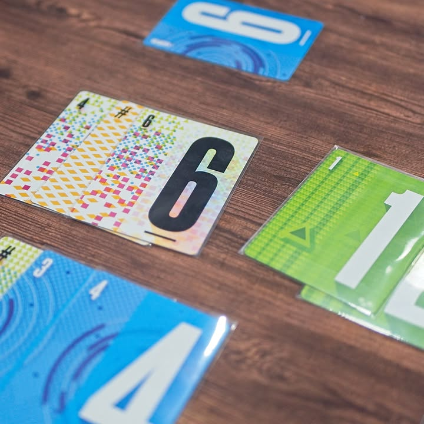
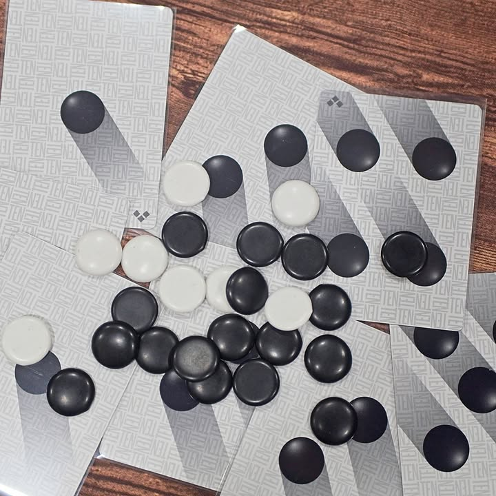

TEN #bite_size #first_impression 

verdict : การ์ดเกมจากทีมผู้สร้าง Point Salad จัด set เรียงเลขที่ดูงงๆแต่จริงๆก็ใช้ได้เลยนินา

.
เอาจริงๆก็เป็นเกมที่ไม่แปลกใจที่คนไม่ค่อยพูดถึงคือมันอธิบายยากอ่ะ แต่เกมเพลินดีนะ

.
เป้าหมายของเราคือการเรียงชุดเลขให้ต่อกันได้ยาวที่สุด โดยมันจะมี 4 สี 4 ชุดแยกกัน

.
ถึงตาเราก็เล่นกันง่ายๆเลยเปิดการ์ดไปเรื่อยๆจนกว่าเราจะพอใจหรือว่าจนกว่าผลรวมจะเกิน 10 เพราะจะอดได้ของทั้งกอง ในขณะที่ถ้าเราเลือกที่จะหยุดก็จะมีตัวเลือกว่าจะเอาการ์ดแต่เพื่อนคนอื่นในวงได้ 'เงิน' ที่หน้าตาเหมือนเม็ดหมากล้อม หรือเราจะเอาเงินเฉยๆแต่การ์ดจะเข้าตลาดกลางก็ได้

.
เงินก็เอาไว้ซื้อการ์ดจากกองกลางในราคาเท่าเลข หรือไม่ก็เอาไว้ประมูลเวลา wild card แทนเลขโน้นนี้ได้โผล่ออกมา เกมก็มีแค่นี้เล่นวนๆกันจนกองหมดก็เอาชุดเลขเรียงที่ใหญ่สุดของแต่ละสีมารวมๆกันแล้วนับแต้มเป็นใบๆ

.
จริงๆผมคิดว่ากิมมิคเล็กๆน้อยๆมันเกลาเกมมาโอเคนะ พวกจำนวนเงินที่เก็บได้ หรือ compensate เวลาเปิดเกินสิบ แต่นั้นแหละมันก็การ์ดเกมแนว push your luck ที่ดวงมีสัดส่วนเยอะพอควร

.
จุดอ่อน (ไม่ใช่ข้อเสีย) จริงๆก็ตามสไตล์เกมที่ดู abstract ทั้งหลายนั้นแหละคือดูแล้วไม่ค่อยเข้าใจว่าเล่นแล้วมันจะสนุกยังไง เอาจริงๆคือถ้าเจ้าของเกมไม่หยิบมาให้เล่นกับมีเวลาเหลือรอคนมาให้ครบวงผมก็ไม่น่าจะสนใจเกมนี้แน่ๆ แต่มันก็เป็นเกมที่เติมเวลาให้เต็มได้โอเคเลย ไปดูก็อ้อทีมงานที่ทำ Point Salad, Point City, Verdant มิน่าเค้าไปจัดมา

.
เป็นเกมสุดท้ายละจากซีรี่ย์หมอพีท Heavy Meeple เอามาให้ลองเล่น ไว้รอแกแวะมาบ้านอีกทีค่อยเอาเกมใหม่มาเล่าให้ฟัง

--------------------------------
หมวด Bite Size (พอดีคำ) นี้กะว่าจะเขียนอะไรสั้นๆประมาณนี้ล่ะกัน ใหม่บ้าง ซ้ำบ้าง เกมที่ขี้เกียจเขียนบ้าง เขียนๆไว้ก่อนเผื่อมีอารมณ์อาจจะขยายไปลง Thought บ้าง จริงๆอยากเขียนสั้นกว่านี้ แต่ยังอดไม่ได้ที่จะต้องอธิบายอะไรเพิ่มตามนิสัย เดี๋ยวค่อยๆปรับไปล่ะกัน

