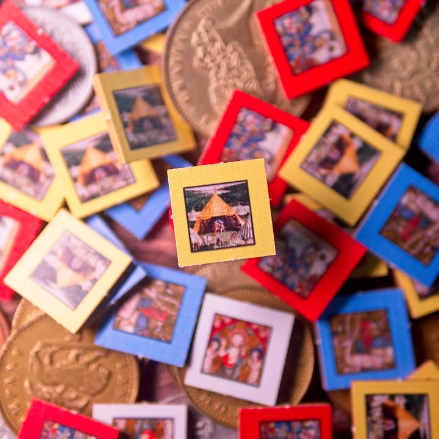
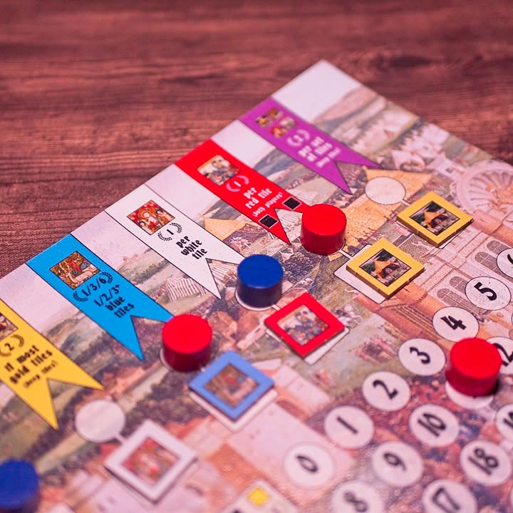

The Field of the Cloth of Gold #bite_size #first_impression 

สุดยอดเหตุการณ์ 'อวดรวย' ที่จารึกในประวัติศาสตร์ยุโรปหรือ "Camp du Drap d’Or" นั้นก็คือเมื่อครั้งที่เฮนรี่ที่แปดของอังกฤษ กับฟรานซิสที่หนึ่งของฝรั่งเศสมาตั้งแคมป์จัดงานเฉลิมฉลองยาวนานถึงสองสัปดาห์ และในช่วงเวลาแห่งนี้สิ่งที่กษัตริย์ทั้งสองทำก็คือการแสดงให้อีกฝ่ายเห็นถึงความมั่งมีโดยการผลัดมอบของขวัญให้กับอีกฝ่าย

.
และในอีก 500 ปีต่อมา เกม The Field of the Cloth of Gold ก็จะนำเรากลับไปสู่ช่วงเวลาแห่งนั้นอีกครั้ง ผลงานจากนักออกแบบ Amabel Holland   (The Vote: Suffrage and Suppression in America, Iberian Gauge, Table Battles)

.
ไอเดียเกมก็เรียกว่าเป็น Set Collection ที่เดินเกมแบบ Worker Placement ที่จะให้ผู้เล่นสลับกันโยกตัวไปมาบนพื้นที่ว่างไม่กี่ช่อง แต่ละช่องก็จะมีแอคชั่นที่จะให้เราเอาของที่มีในมือมาเคลมเป็นแต้มพร้อมของให้เก็บ ก็ง่ายๆแค่นั้นเลย

.
แต่สิ่งที่ทำให้เกมนี้ไม่ง่ายและน่าสนใจก็คือ 'ของที่คุณเก็บนั้นจะต้องมอบให้อีกฝ่ายแทน'

.
ใช่แล้ว... มันเป็นเกมที่เราพยายามที่จะ 'แจกของ' ไปพร้อมๆกับพยายามทำแต้มที่ของที่ได้รับมา แต่ในระหว่างเล่นก็จะมีบางแอคชั่นที่ช่วยให้เราจั่วแบบเป็นความลับอยู่เหมือนกันนะ

.
อารมณ์ตอนเล่นมันก็เลยมีความกั๊กๆกันสนุกดี เพราะกระดานมันมีแค่ 7 ช่องแต่มีคนงานวางอยู่แล้ว 5 ตัว (ผู้เล่น 4 npc 1) แปลว่าเกมมันจะให้เราสลับๆกันเดินแค่ช่องว่าง 2 ช่องเท่านั้นเอง ฟังเหมือนจะมั่วๆหรือเดินๆไปเถอะ แต่เล่นจริงการต้องเลือกว่าจะมอบอะไรให้ และจะต้องยกตัวออกจากช่องไหนเพื่อ 'ดัก' อีกฝ่ายนั้นก็มอบความขบคิดที่สนุกใช้ได้เลยนะ

.
เกมเล่นกันจนผู้เล่นถึง 30 แต้มก่อนหรือว่าไทล์หมดก่อน

.
ในเชิงไอเดียอีกอย่างที่คิดว่าออกแบบมาฉลาดดีคือเกมมันจะมีไทล์เต็นท์สีทองเอาไว้แสดงความอวดรวย ที่นอกจากเอาไว้ทำแต้มระหว่างเกมแล้วก็ยังจะเอาไว้เป็นแต้มตอนจบด้วย แต่ว่าแต้มตอนจบเนี่ยยิ่งน้อยเต็นท์ที่เหลือมันยิ่งคูณเยอะ เกมมันก็เลยมีกลยุทธ์การซ่อนของกับหาจังหวะทำแต้มด้วย

.
ต้อง remark ไว้ว่าเกมทำมาแบบมินิมอลทำมือมากๆตามสไตล์ค่ายนะ แต่สำหรับเกมทำมือผมคิดว่าก็ดีตามท้องเรื่องนะ บอร์ดเป็นผ้าพิมพ์แคนวาส  ไทล์หนาแข็ง 40 กว่าชิ้นกะ token ไม้

.
ในฐานะเกม 2 คนเล่นจบไวๆ ผมประทับใจเกมนี้มากเลย เรียกว่าเป็น gem เกมหนึ่งก็ได้ เล่นง่าย ธีมน่าสนใจ กลยุทธ์ที่มากับดวงกำลังสวย และด้วยความทำมือของมันก็ดูจะเป็นเกมสไตล์ 'ซื้อเป็นของขวัญ' ที่น่าสนใจดีสำหรับนักสะสมนะ เอาเข้าจริงเกมก็เป็นถึง นอมินีของ Golden Geek Best 2-Player Board Game 2020 เลยนะ

.
ถ้าสนใจต้องไปสั่งตรงจากเวบของ hollandspiele เอานะครับ

.
มีเรื่องน่าสนใจอีกอย่างคือเกมนี้กติกามีแค่ 4 หน้าแต่หน้าหนึ่งก็คือ designer note ที่อ่านแล้วก็สนุกดี คือนางบอกที่มาออกแบบเกมแนว wargame เนี่ยเพราะทำแนวยูโรแล้วขายไม่ออก (ฮา) แต่ก็ทำเกมนี้มาเพราะอยากทำเกมยูโรในแบบยุคเดิมๆที่ตัวเองชอบมากกว่ายูโรสมัยใหม่

.
ส่วนเหตุการณ์จริงในยุคนั้นทางฝรั่งเศสอยากจะกระชับมิตรกับอังกฤษที่กับลังจะไปจับมือกับราชวงศ์ฮับส์บูร์ก (แถวๆโรมัน) ก็เลยจัดงานเพื่อโชว์พาวหวังหาพวก แต่สุดท้ายก็ว่าวเพราะอังกฤษก็จับคู่กับพวกฮับส์บูร์กอยู่ดี

--------------------------------
หมวด Bite Size (พอดีคำ) นี้กะว่าจะเขียนอะไรสั้นๆประมาณนี้ล่ะกัน ใหม่บ้าง ซ้ำบ้าง เกมที่ขี้เกียจเขียนบ้าง เขียนๆไว้ก่อนเผื่อมีอารมณ์อาจจะขยายไปลง Thought บ้าง จริงๆอยากเขียนสั้นกว่านี้ แต่ยังอดไม่ได้ที่จะต้องอธิบายอะไรเพิ่มตามนิสัย เดี๋ยวค่อยๆปรับไปล่ะกัน

