CMON Expo Thailand 2023 @Samyan Mitrtown Hall 5th Fl.
❌ ถ่ายรูปงานบอร์ดเกม
✅ ถ่ายรูปคนในงานบอร์ดเกม

.
จบวันแรกกันไปกับงาน CMON ที่เรียกได้ว่าเป็นการประกาศถึงความมุ่งมั่นของบริษัทในประเทศไทยเราอีกครั้งหนึ่ง

.
tldr; เหมาะไปซื้อกล่องสุ่มเพราะค่ายมาเองของเลยคุ้มจัด, เอาเกมไปขอลายเซ็นและพบปะนักออกแบบดัง, ไปลองเกมต่างประเทศที่แปลกๆอินดี้ๆ ส่วนเกมสายหลักไม่ต้องรีบ มีไปพวกนายก็เอาไปดองอยู่ดี โชคดีที่คนตามเพจนี้ไม่น่าโดนปั่น แต่เราว่าพวกนายก็คงไปซื้ออยู่ดีเพราะอยากขิง.....

.
เปิดด้วยด้วยเรื่องที่ก็เห็นคนบ่นกันเต็มไปหมดซึ่งก็เห็นด้วยละว่าการจัดการผู้เข้าร่วมงานนั้นยังไม่พร้อมเท่าไร คือคนซื้อบัตรล่วงหน้ามาแต่ดันต้องไปยืนออยาวเหยียดกันหน้างาน หลุดมาเดินไปซื้อกล่องสุ่มก็ต่อคิวไปดิ๊มี  ที่จ่ายเงินอยู่อันเดียวกว่าจะเสร็จเจ้าหนึ่งก็ยืนรอวนไป อันนี้ก็คนเค้าน่าจะทักกันเยอะละก็ฝากไปปรับปรุงนะครับ

.
ต่อมาก็ยอมรับเลยว่านี้เป็นปีแรกที่มาครับ สองปีก่อนหน้าไม่ค่อยสนใจเท่าไรเนื่องจากเกมของค่ายไม่ตรงแนวนัก แต่รอบนี้เค้าเชิญบวกกับกิจกรรมและของที่เอามาลงมันดูน่าสนใจกว่ามากๆก็เลยมาดีกว่า

.
ส่วนตัวแล้วถ้าตัดเรื่องต่อคิวไปแล้วก็ค่อนข้าง happy กับงานนะ ในแง่การเดินไปมาแถมได้เจอนักออกแบบดังๆแบบไม่ต้องเดินทางไปไกล (ปกติคุณต้องบินไปเยอรมัน ไปอเมริกาเลยนะเห้ย!) มีจุดสอนเกมที่จะเอามาขาย รวมไปถึงเปิดตัวเกมที่ยังไม่ทันจะเปิด KS มาให้ลองด้วย (เราได้เล่นก่อนหน้าหลายประเทศเลยนะ) แล้วก็ vibe ของงาน fiar ที่โอเคมันยังมีความขาดๆเกินๆอยู่แต่ก็มันเป็นก้าวที่ใกล้ขึ้นมาอีกจริงๆนะ ผมคิดแวะมางานเพื่อให้เค้าสอนเกมยูโรที่เค้านำเข้ามาพร้อมเดินงานนิดหน่อยก็ถือว่าคุ้มค่าบัตรขั้นเบสิคแล้ว

.
จุดที่ไม่ค่อยชอบนักก็คงเป็นไม่ได้มีพื้นที่เล่นเกมสำหรับนักเล่นทั่วไป กับพื้นที่กิจกรรมที่อยากให้คนอยู่ยาวๆมันไม่มี บรรยากาศมันเลยเหมือนงานที่ให้เดินมาวนๆซื้อของแล้วกลับมากกว่า แต่พอดีผมมีเพื่อนตามบูธไงเลยเดินลอยไปลอยมาได้ 

.
เอาจริงคืออยากเจอคนออกแบบ Klask สุด แบบอยากท้าดวลเป็นเกียรติประวัติหน่อย ติดนิดเดียวมาแต่บูธ ก็น่าเสียดายเหมือนกัน

.
ปล. ฉันรัก BGN...........

.
[disclosure] ได้บัตรสื่อจึงไม่ต้องเสียค่าเข้างานและค่าที่จอดรถครับ นอกนั้นไม่ได้มีสิทธิ์พิเศษอื่นนอกจากได้เข้างานก่อนครึ่งชั่วโมง (ที่ไปไม่ทัน) และทางเข้าออกสำหรับสื่อและทีมงาน (ที่งานไหนๆก็ต้องมีนะ แต่เรื่องตำแหน่งที่ตั้งก็คงต้องไปทำการบ้านเพิ่มหน่อย) อ่อได้เกมอะไรไม่รู้ ยี่สิบเก้าๆ มาให้เผาอีกหนึ่งรายการ

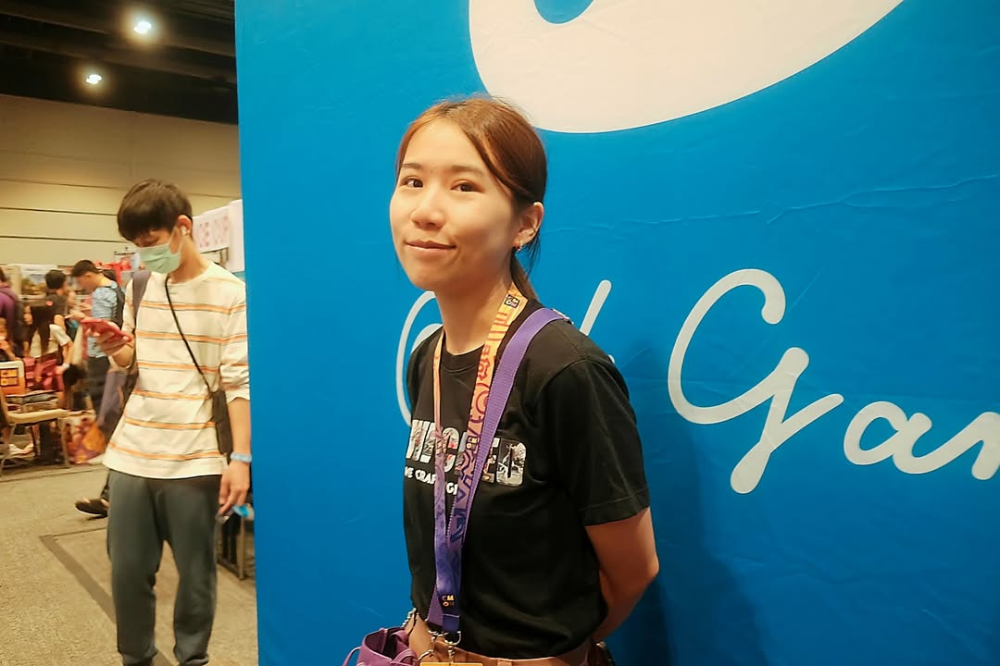

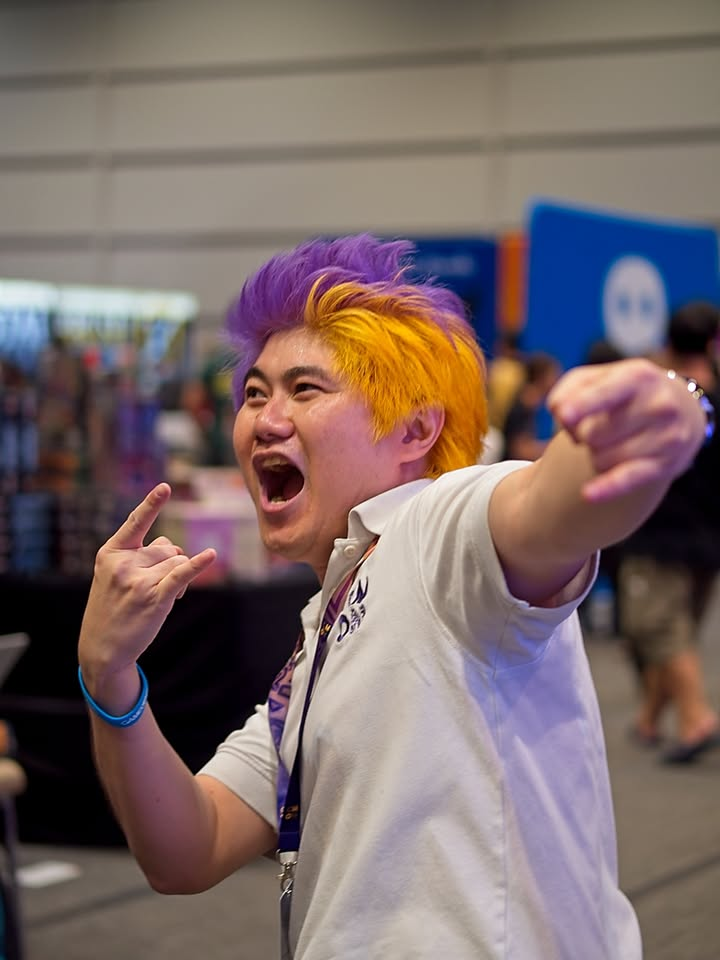

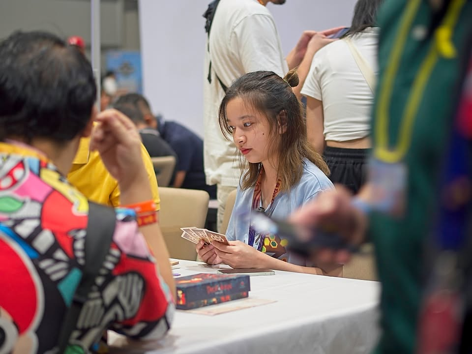

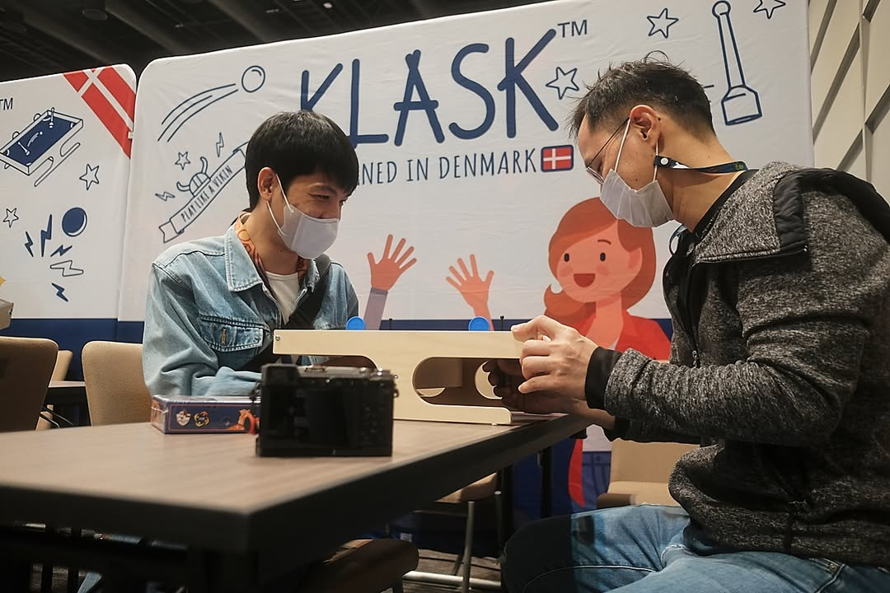

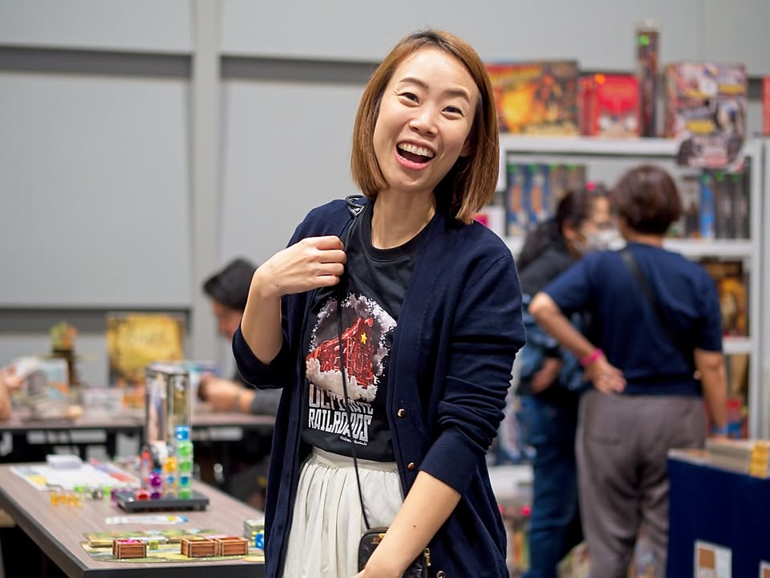

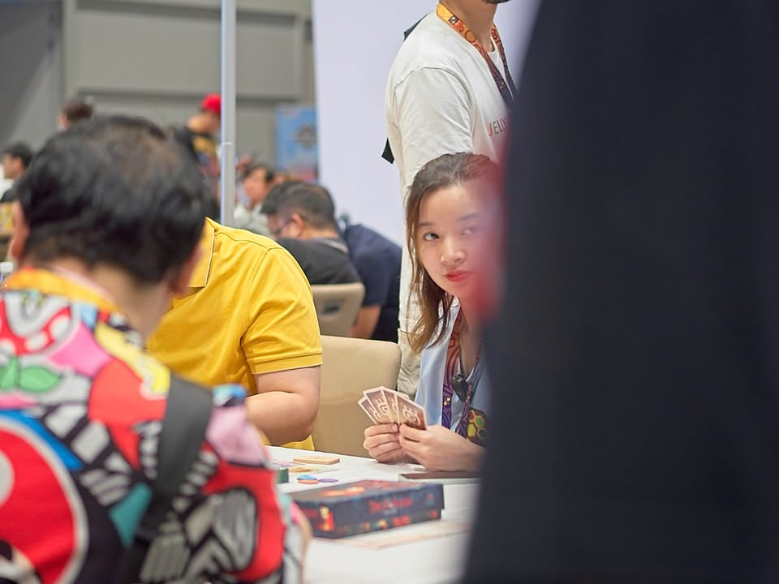

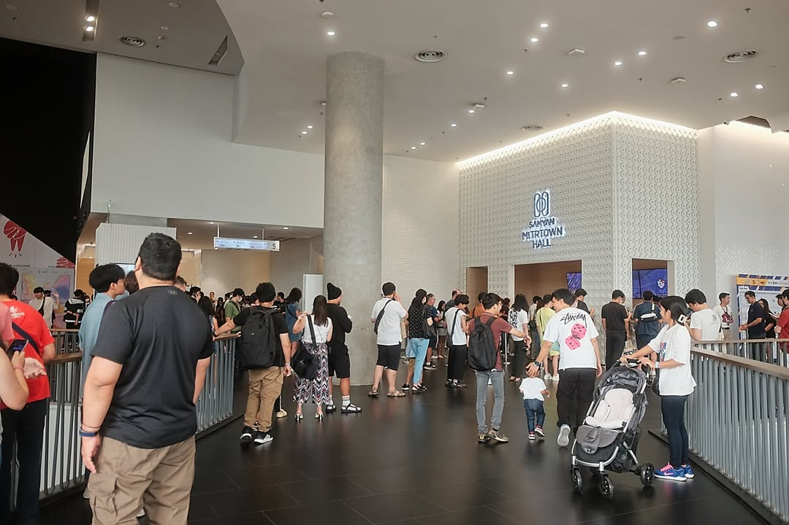

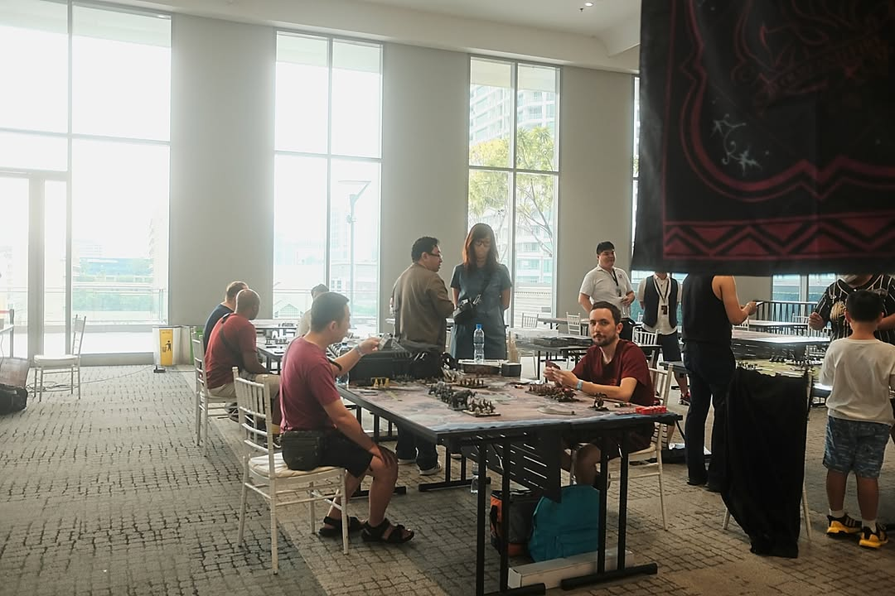

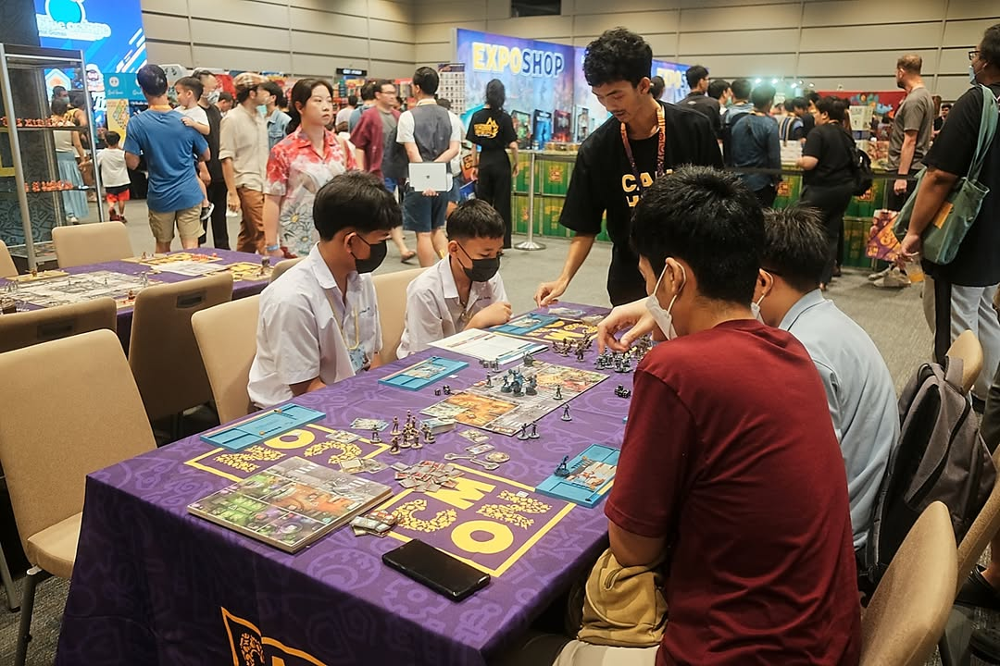

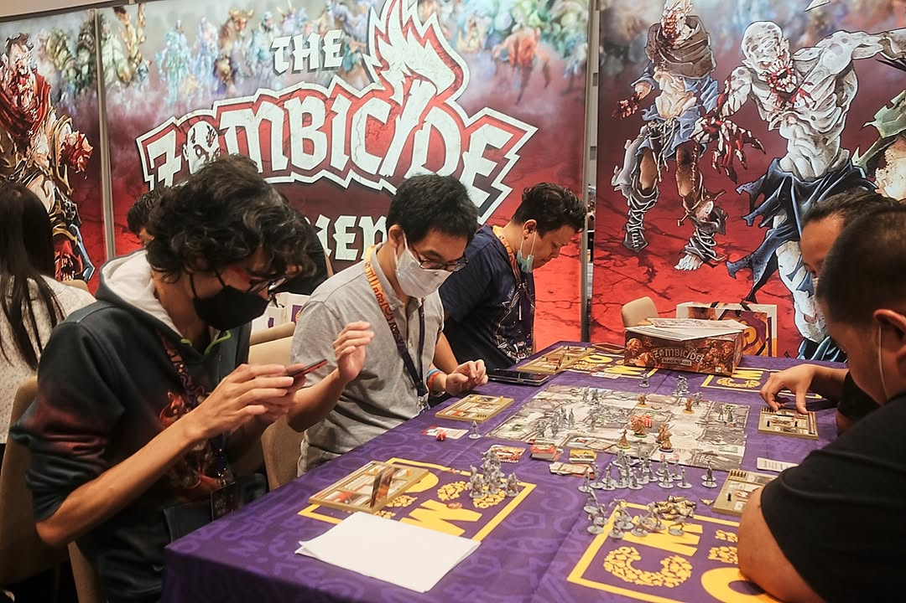

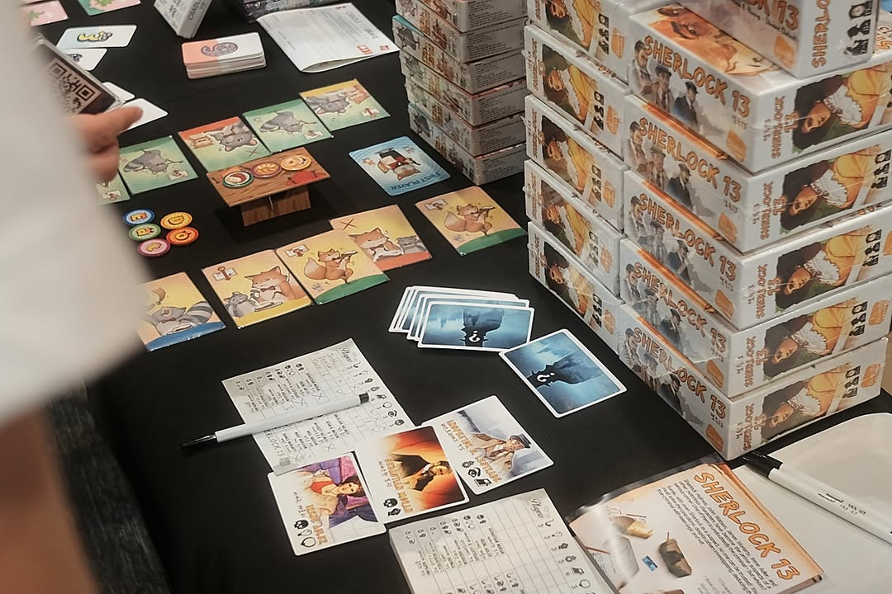
