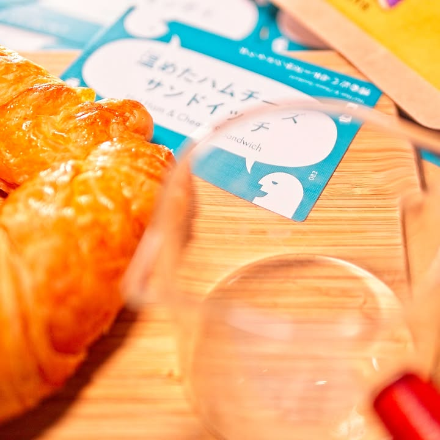
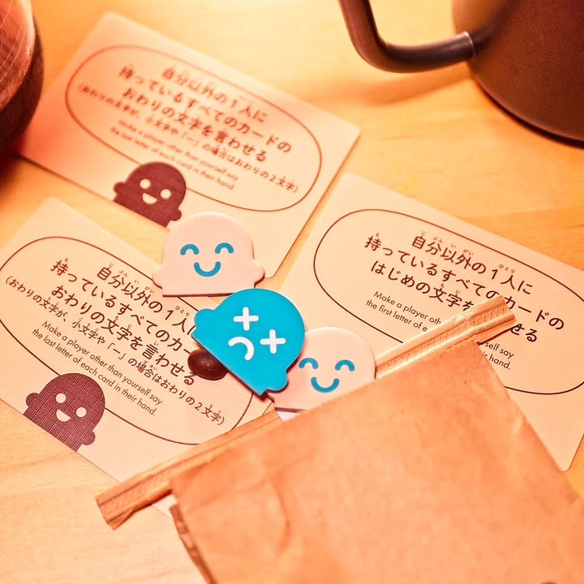

Order Overload: Cafe #thought 

verdict: เกมปาร์ตี้ filler ติดกระเป๋าที่จะทำให้คุณเข้าใจว่าเหล่าพนักงานที่รับออร์เดอร์ยาวๆคือยอดมนุษย์!! "Grande no-whip white chocolate mocha with five pumps and an extra shot, made with soy." โอ้ว!! สั่งเหี้ยไรกันเยอะแยะใจเย็นๆโว๊ยยยยย

.
เกมนี้เป็นเกมช่วยกันเล่นแบบค่อยๆไต่ level ไปโดยการ์ดแต่ละใบจะเป็นเมนูที่เราพบเห็นตามคาเฟ่ทั่วไป ลาเต้, เอสเพรชโซ่, แซนวิช, นมสตอเบอรี่, ........., แต่แบบชื่อยาวหน่อยก็มีเหมือนกันแบบ แฮม&ชีส แซนวิช 'ร้อน' ไรงี้ วิธีเล่นคือเราจะมีคนหนึ่งเปิดการ์ดออเดอร์เท่ากับจำนวนผู้เล่น x level ตอนนั้น (มี 4 คนก็เปิด 4 8 12 16 ตาม level ไปเรื่อยๆ) แล้วเราก็จะมาหาทางเคลียร์คำสั่งที่ลูกค้าส่งเข้ามากัน

.
แน่นอนว่าไอเดียของเกมนี้ก็คือการที่จะให้พวกเรามาช่วย 'จำ' ออเดอร์ทั้งหมดนั้นเอง แต่ว่าเราไม่ต้องจำเองหมดนะเพราะเมื่อจั่วขึ้นมาครบแล้วเราจะสับแจกแบ่งให้ทุกคนเท่าๆกัน ออเดอร์มันก็จะกระจัดกระจายกันไป

.
ที่เหลือก็คือผลัดกันทีละคนให้ขานชื่อของที่เราคิดว่ามีในรายการที่เหลืออยู่ คนที่อยู่ถัดไปก็จะบอกว่ามีหรือไม่มี ถ้าวนถึงใครว่ามีเค้าก็จะทิ้งการ์ดลงมา เล่นวนๆกันจนมีคนหมดมือในจำนวนที่กำหนด

.
แต่ถ้าเราพูดไปแล้วมันไม่อยู่ในมือใครเลยเราก็จะต้องพลิกป้ายสิทธิ์ในการทายไป ทำให้ในรอบนี้เราได้แต่รอบอกคนอื่นละว่ามีของในมือไหมอย่างเดียว

.
เกมมีตัวช่วยให้นิดหน่อยเป็นการ์ดความสามารถแบบบอกตัวอักษรหรือทิ้งการ์ดจากมือก็ทำให้เกมไม่เครียดเกินไปนัก

.
ผมชอบตรงไอเดียมันง่ายดี เป็นเกมที่ฟังเหมือนดูไม่มีเชี้ยไรเลยแต่เล่นแล้วสนุกเฉย แบบอ้าวพูดไปมันของรอบที่แล้วนิหว่า หรือของชิ้นที่เราตั้งใจจำมันดันอยู่ในมือพอดีงี้ ไม่ก็กำหมัดนิดหน่อยตรงพี่มาแย่งการ์ดที่ผมจำได้ทำมายยยยยย คือมันได้อารมณ์แบบเห้ยกรูอย่างปลาทองจำได้แค่ 2-3 ใบแต่ทีมเราก็ผ่านไปได้นะ! ก็คงจะกลายเป็นเกมที่เอาติดท้ายรถหรือใส่กระเป๋าไว้เพราะมันชวนคนกลุ่ม non-gamer ง่ายดี 

.
มาคิดแล้วถ้าเค้าซื้อมาแปลไทย (หรือมีคนทำเกมคล้ายๆกัน) แล้วเปลี่ยนเป็นก๊วยเตี๋ยวเรือ ส้มตำ น่าจะตลกดี แบบพี่ๆ เล็กชิ้นสดไม่เนื้อไม่ใน บะหมี่น้ำตกเผ็ดน้อยไม่งอก ตำโคราชไม่เผ็ดขอพริกเม็ดเดียว ไรงี้

.
กล่องนี้ได้ SoloMeeple ซื้อมาฝากจากญี่ปุ่น ใครไปเที่ยวแล้วอยากหาของฝากก็คิดว่าเป็นกล่องที่น่าสนใจอยู่นะ ผมชอบกล่อง JP มากกว่าตัว International ที่เปิดมาจะเป็น 4 ภาษา 4 บรรทัด ดูแล้วลายตาเพราะมันคล้ายๆกัน แต่อันนี้ก็แล้วแต่รสนิยม กับเค้ามีเวอร์ชั่นเป็นเบอร์เกอร์ด้วย

.
แต่แน่นอนว่าเกมมันการ์ดแน่นๆเต็มกล่องก็ใส่ซองจะปิดไม่ลงนะ ก็ต้องไปหา 3d print ฝาล่างเอา

.
photos: บอร์ดแล้วบ่น

--------------------------------
หมวด Bite Size (พอดีคำ) นี้กะว่าจะเขียนอะไรสั้นๆประมาณนี้ล่ะกัน ใหม่บ้าง ซ้ำบ้าง เกมที่ขี้เกียจเขียนบ้าง เขียนๆไว้ก่อนเผื่อมีอารมณ์อาจจะขยายไปลง Thought บ้าง จริงๆอยากเขียนสั้นกว่านี้ แต่ยังอดไม่ได้ที่จะต้องอธิบายอะไรเพิ่มตามนิสัย เดี๋ยวค่อยๆปรับไปล่ะกัน

