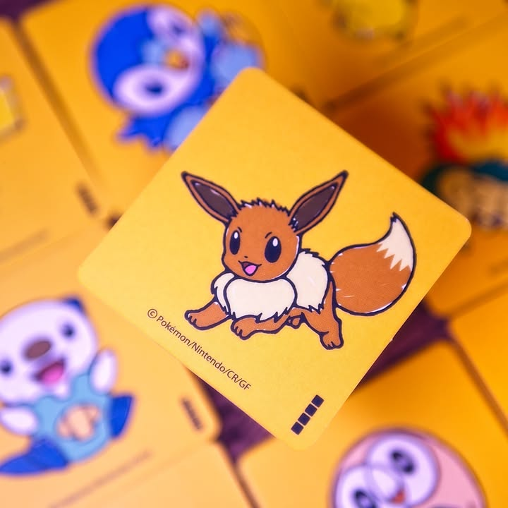
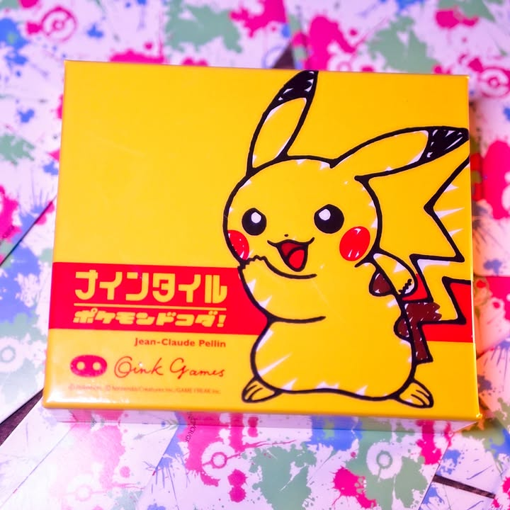
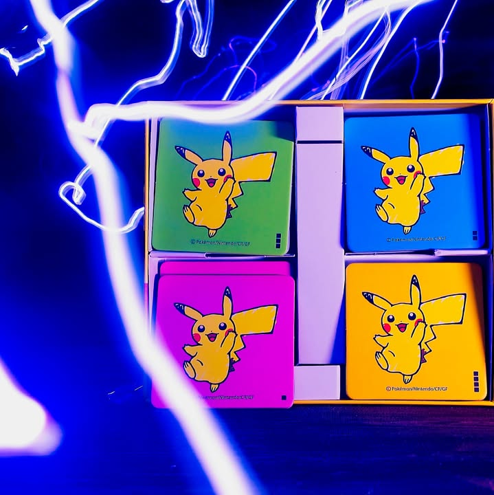

Nine Tiles Pokemon Dokoda #bite_size 

verdict: เกมสำหรับสายสปีดที่คุณกำลังคิดว่ามันเป็นเกมเด็กเล่นง่ายๆโง่ๆอยู่ใช่ป่ะ? โอเคมันเล่นง่ายและโง่จริง แต่จะทำให้ชนะเพราะไวสุดน่ะ ก็มีกำหมัดกันบ้างแน่

.
คือมันก็เกม Nine Tiles ของ Oink เจ้าเดิม (คนละเกมกับ Nine Tiles Panic จากเจ้าเดียวกันนะ) เพียงแต่กล่องนี้เปลี่ยนรูปเป็นปก Pokemon ตามชื่อ กล่องใหญ่ขึ้น เปลี่ยนเป็นไทล์กระดาษแข็งและมีวางขายเฉพาะที่ญี่ปุ่นเท่านั้น อยากได้ต้องฝากหิ้วหรือหาร้านอื่นเอา (คือ offcial เค้าไม่ส่ง น่าจะติดเรื่องลิขสิทธิ์)

.
ไอเดียเกมก็ไม่มีอะไรอธิบายสิบวิจบ ผู้เล่นจะมีไทล์สองหน้าคนละชุด พร้อมก็หงายโจทย์แล้วก็แข่งกันวางให้เหมือนในรูป....

.
แต่เล่นจริงไม่ง่ายนะ คือโจทย์มันออกแบบมาแล้วว่า solve ได้แบบเดียวเท่านั้น ทุกรูปมี 2 ที่แต่ว่ามันจะอยู่กันคนละหน้าคนละไทล์คละๆกัน สิ่งที่คุณจะเจอบ่อยคือเรียงจะเสร็จแล้วอ้าว.... ไม่ลงล็อกแล้วคุณก็จะต้องรื้อหาว่ารูปนั้นอยู่ใต้ไทล์ไหน และพอพลิกมามันก็จะเป็นลูปนรกรื้อต่อกันไปเรื่อย......... สำหรับเกม fillter ไม่รู้ทำอะไรหยิบมาเล่นแป๊บๆก็สนุกสนานดี

.
ในฐานะเกมพกติดตัวก็ถือว่าใช้ได้ แต่ว่าเกมมันอยู่กับตัวเองงึมงำแก้ puzzle และจำนวนสูงสุดอยู่ที่ 4 คนเลยอาจจะเป็นตัวเลือกที่ต้องเบียดสู้กับเกมอื่นของค่ายอยู่นิดหน่อย แต่สำหรับการไม่ต้องจำกติกาอะไรเลยก็เป็นข้อดีของมันอยู่เหมือนกัน

.
เกมนี้ฝาก SoloMeeple ซื้อตอนเค้าไปเที่ยวญี่ปุ่นมานี้แหละ กล่องไม่มีคู่มือ en แต่วิธีเล่นมันก็ไม่ต้องการคู่มืออะไรอยู่แล้ว ตัว IP โปเกม่อนมันก็น่ารักเรียกได้ว่าเป็นของฝากที่ดี นอกจากโปเกมอนแล้วยังมี Chainsaw Man, Sanrio, Moomin ด้วย ถ้าไม่ได้สนใจ ip ไหนเป็นพิเศษตัวธรรมดาก็โอเคละ แต่มันจะเป็นกระดาษแข็งบางๆในกล่อง Oink ปกติแทนนะ

.
ส่วน Nine Tiles Panic นี้มันคนละเกมเลย จะเปลี่ยนเป็นแนวเอาไทล์มาวางพลิกๆไปมาต่อถนนแล้วมีเมืองมีผู้คนอะไรก็ว่าไป แล้วเกมจะมีมิชชั่นบอกว่าคนที่ในเมืองมีโน้นนี้มากสุดจะได้แต้มไปไรงี้ ก็สนุกดีเหมือนกัน

photos: บอร์ดแล้วบ่น 

--------------------------------
หมวด Bite Size (พอดีคำ) นี้กะว่าจะเขียนอะไรสั้นๆประมาณนี้ล่ะกัน ใหม่บ้าง ซ้ำบ้าง เกมที่ขี้เกียจเขียนบ้าง เขียนๆไว้ก่อนเผื่อมีอารมณ์อาจจะขยายไปลง Thought บ้าง จริงๆอยากเขียนสั้นกว่านี้ แต่ยังอดไม่ได้ที่จะต้องอธิบายอะไรเพิ่มตามนิสัย เดี๋ยวค่อยๆปรับไปล่ะกัน

