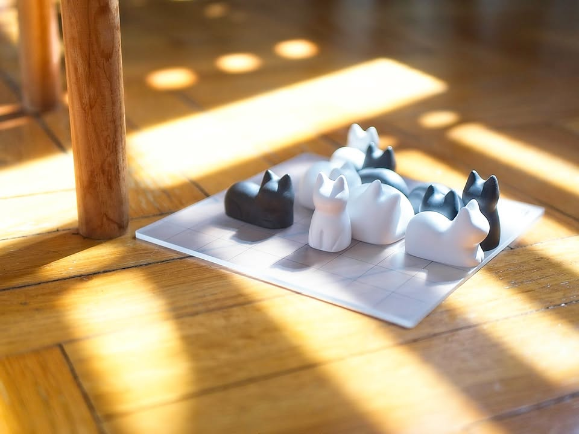
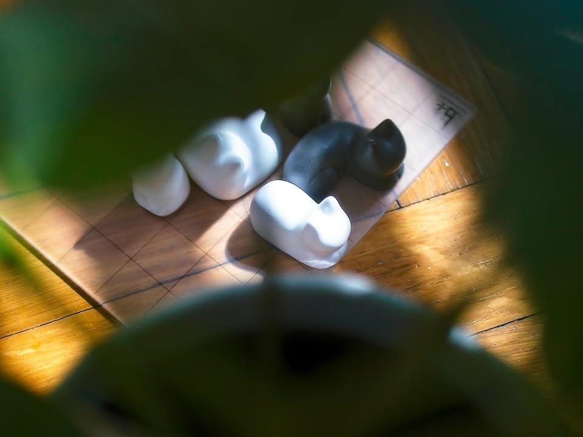
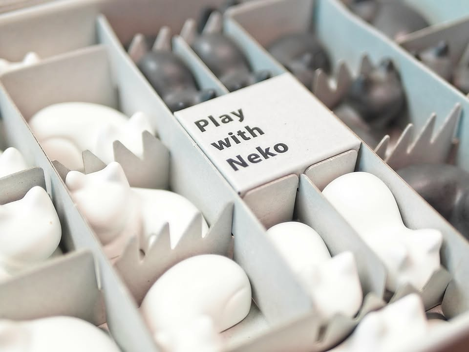
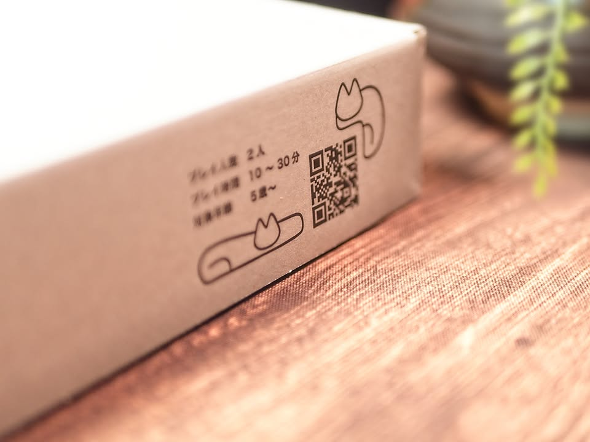
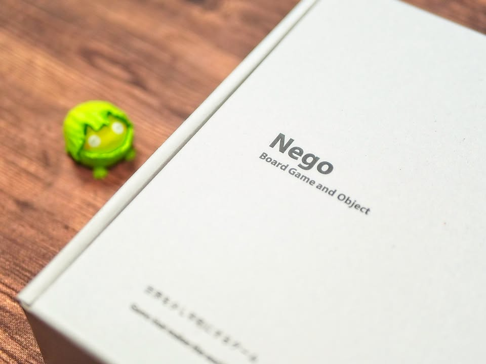

Nego - [update หลังเล่นแล้ว]

.
เกมนี้เป็นเกมแนว abstract จากญี่ปุ่นเล่นเป็นแมวสีขาวดำผลัดๆกันวางแมวมากั้นรั้วสร้างพื้นที่ทำคะแนน พอล้อมรั้วแล้วจะเป็นการตรึงพื้นที่ ทว่าเกมชนะกันที่ใครวางแมวได้เยอะกว่า

.
โดยรวมก็เพลินๆดี แต่กติกาก็แอบจุกจิกนิดนึงเช่นแมวห้ามหันหน้ามองกันเป็นอันขาด แมวบอสอ้วนนอนกลมก็ห้ามวางติดกับแมวบิดขี้เกียจยืดตัว แมวลูกจ๊อกห้ามมองแมวบอส แล้วก็ห้ามแมวเอาหน้าชิดขอบ ตอนเล่นจริงก็ไม่ได้มีปัญหาอะไรนัก แต่ก็มีจังหวะแอบยึกยักอยู่นะ

.
จริงๆถ้าอยากเล่นจริงจัง through the desert จะตอบโจทย์กว่าเป็นเกมขี่อูฐล้อมพื้นที่ในทะเลทราย แต่แน่นอนว่าผมไม่ได้ซื้อเพราะอยากเอามาเล่น แต่เพราะมันเป็นแมว และมันสวย!! ตัวแมวทำจากเข้าใจว่าเซรามิคเหมือนแก้วกาแฟ น้ำหนักดี ส่วนตกแล้วแตกไหมขอไม่ลองนะ....

.
เกมนี้ซื้อเองจ่ายเองราคาเต็มไม่มีส่วนลดอะไรพิเศษกว่าคนอื่น เค้าเปิดรับพรีผมก็ลงเลยไม่ลังเล เค้าขายดีขึ้นผมก็ไม่ได้ตังเพราะไม่มี aff link (ฮา) 

.
photos: บอร์ดแล้วบ่น

