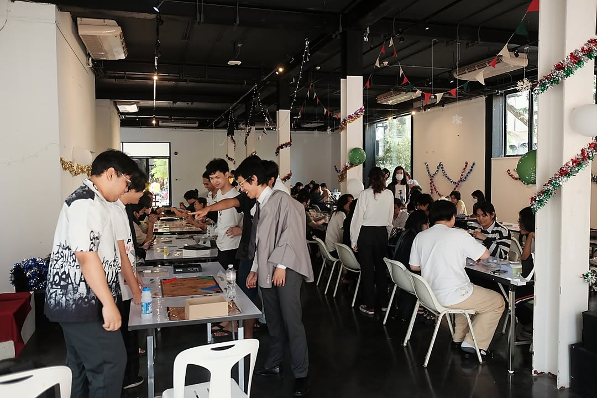
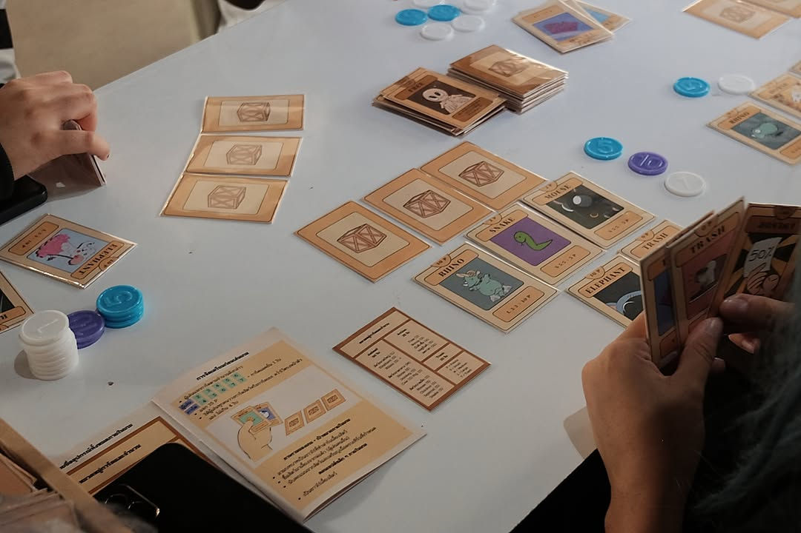
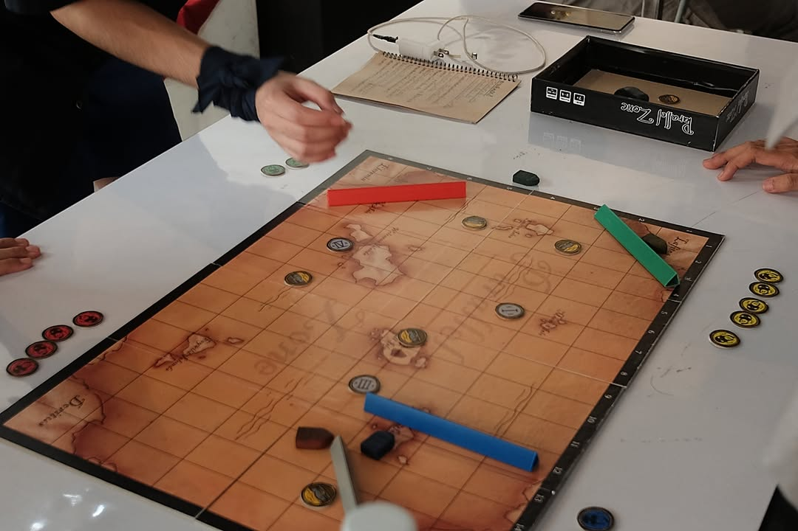
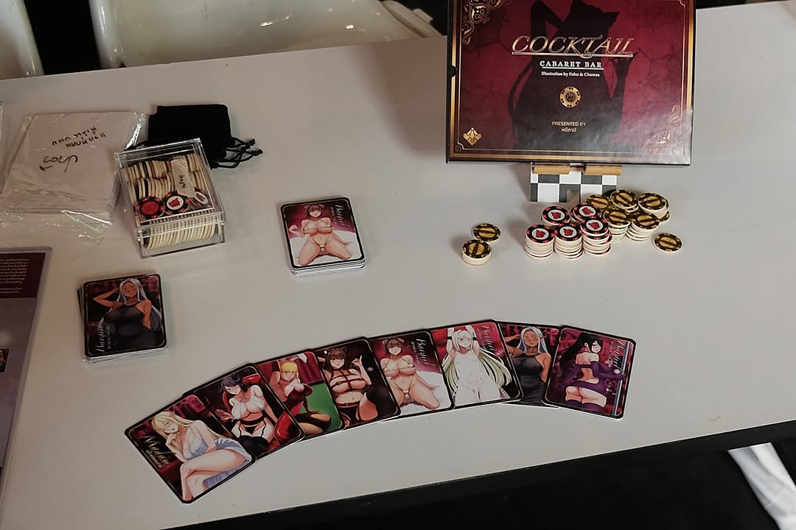
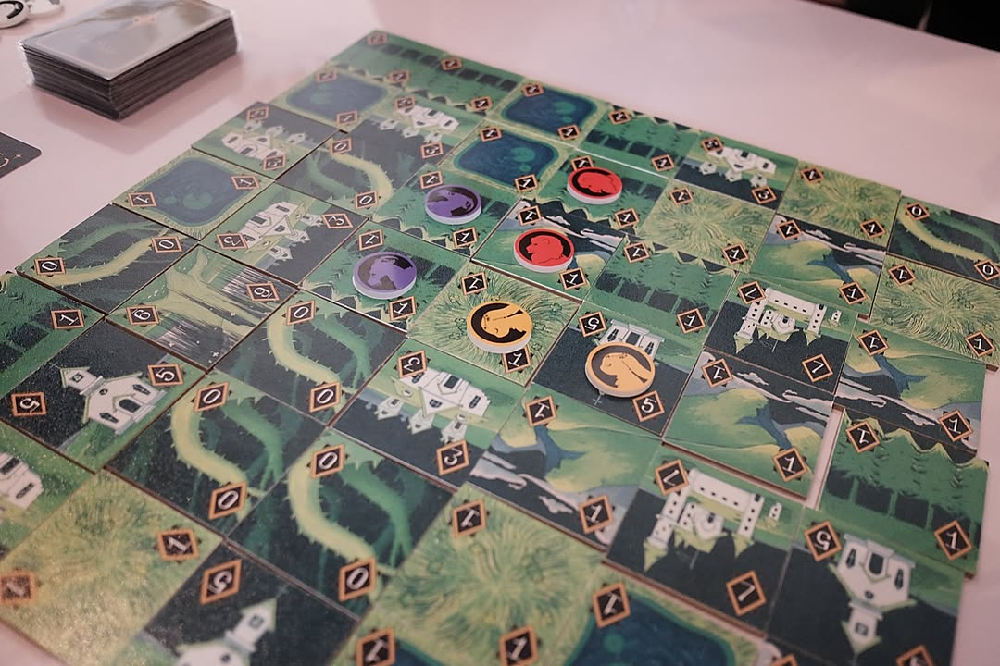
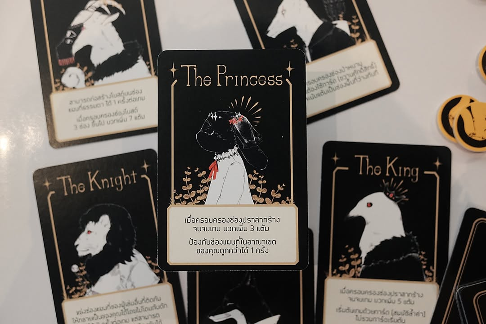
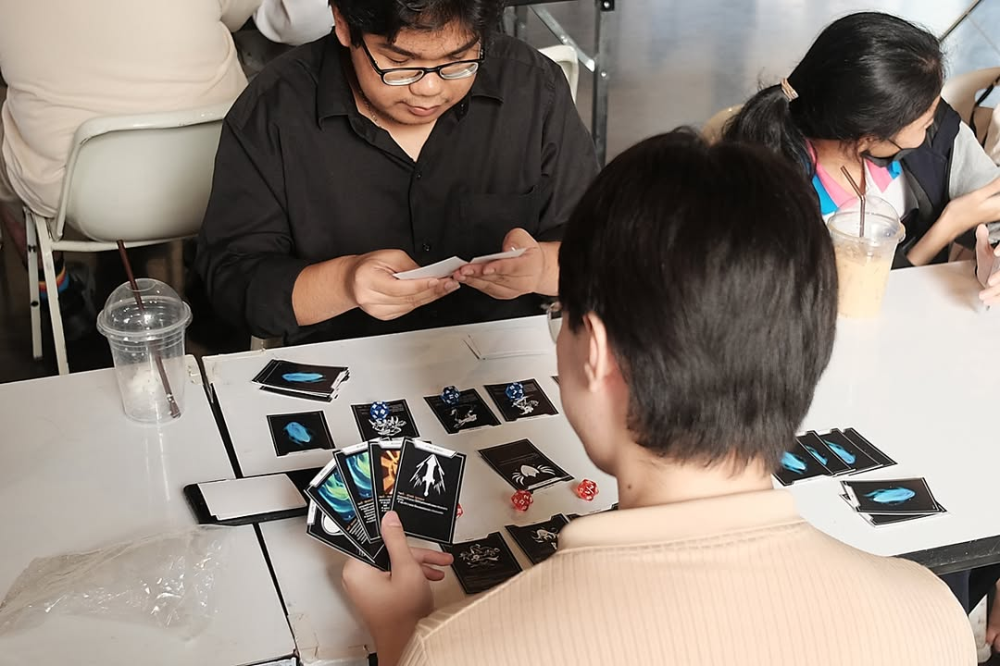
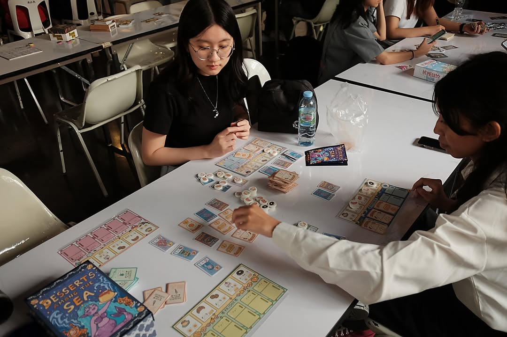
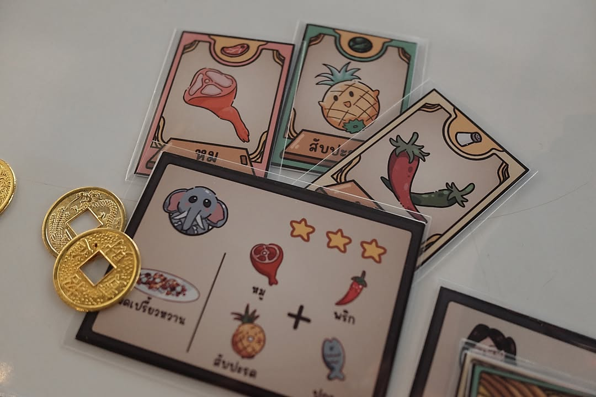
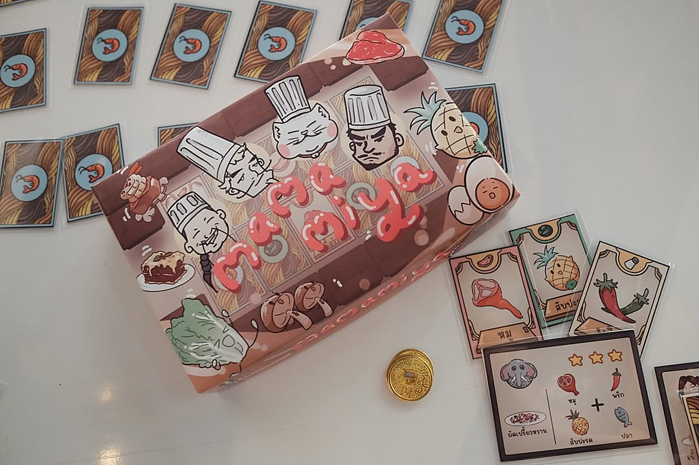

เค้าบอกเด็กรังสิตมันร้าย - เมื่อวานไปมหาวิทยาลัยรังสิต (ที่ไม่ได้อยู่รังสิต) เพราะอาจารย์ที่สอนออกแบบบอร์ดเกมเค้าชวนไปดูงาน นศ คณะ Digital Art เค้าทำงานรายวิชาออกมาให้ดูกันหน่อย (ก็ชวนปากเปล่ากันตอนเจอกันที่งาน TBS2023 นี้แหละไม่ได้แบบจดหมายเชิ๊นนนนจดหมายเชิญ)

.
เป็นงานที่ไปแล้วมีความน่าสนใจหลายอย่าง ซึ่งเราต้อง set ความคาดหวังกันก่อนว่าน้องๆเค้าแบบกรีนนนนนนนนนนเขียวสดใสเฟรชกันมากๆ แบบไม่มีประสบการณ์เกี่ยวกับบอร์ดเกมเท่าไรนัก (เอาแบบไม่น้อยยังไม่รู้จักมีนบุ๊ค เกือบทั้งหมดไม่รู้จักบอร์ดเกมเล้าจ์ บอร์ดแล้วบ่นยิ่งไม่ต้องถาม) และด้วยความที่เป็นคณะสายอาร์ทพวกกลไกเกมก็จะยังขาดๆเกินๆอยู่ ออกไปทางฟิลลิ่งซะมาก แต่งานศิลป์หายห่วง แม้ผลงานเท่าที่ลองไม่ได้มีอันไหนอยู่ในระดับเข้าตาแต่ก็มีโมเม้นในการ enjoy ตลอดนะ แต่ถ้ามองจากมุมมองว่าประสบการณ์และวัตถุดิบที่มีจำกัดมากๆแล้วเรียกได้ว่างานส่วนมากที่ได้ลองก็น่าประทับใจในฝีมือและความตั้งใจเอามากๆ 

.
คือมันจะเป็นเกมแบบที่นั่งปุ๊บเราจะได้กลิ่นจางๆว่าโอเคมันเอาเบสเกมนี้มาแหละ แต่งานของน้องๆคือผสมและต่อยอดออกมาได้แบบว่าหลุดจากเกมโน้นนี้รีธีมไปไกลลิบ คือถ้ามีเวลามากกว่านี้ก็เชื่อว่าไปต่อได้อีกเยอะเลย

.
แต่หลักๆที่เจอน่าจะเป็นปัญหาเรื่องเวลาในคลาสยังไม่เยอะมากพอ คือแทบทุกคนพอคุยเรื่องคณิตศาสตร์แล้วไปไม่เป็นหมดเลย ทำไมต้องเลขนี้ ทำไมไม่มี catch up ทอยพลาดแล้วให้นั่งเหงาเหรอ? ระบบนับแต้มทำไมใช้แบบนี้ล่ะ? spice ของชิ้นงานคืออะไรไรงี้ลืมไปก่อน แต่ก็อย่างที่บอกคือคิดว่ามันเป็นปัญหาเรื่องประสบการณ์เฉยๆ แต่ก็เห็นได้ชัดว่าเป็นจุดที่ทำให้หลายๆเกมเกลาความสนุกออกมาไม่ดีนัก (บางเกมคือไม่มีโมเต๋าเหรอ? ก็ได้รับคำตอบว่ามีๆๆๆๆ ..... มี 3 ใบจากหลายสิบงี้ คือยังไม่เข้าใจว่ามันสำคัญยังไง) หลายเกมเองก็ดูแล้วน้องๆก็อาจจะยังไม่ 'เก็ท' เรื่องความสนุกเพราะภาพกลุ่มเป้าหมายเกมยังไม่ชัดเจนก็มี แบบยังสัมผัสตลาดไม่มากที่จะรู้ว่าช่วงอายุประมาณนี้เค้าเล่นอะไรกัน

.
จริงๆมีมุมส่วนตัวนิดหน่อย คือตอนเราไปนั่งลองงาน นศ เนี่ยเค้าไม่ได้รู้จักเรา น้องเค้าน่าจะ culture shock ประมาณหนึ่งเพราะเปิดด้วย ฟังๆ skipๆ ถามย้อน โดนพ่น terminology ใส่รัวๆ ประมาณว่าน้าๆพวกนี้มาจากไหนว่ะใส่กรูยับเลย แต่จะให้ไปยืนบอกพี่มาจากเพจบอร์ดบ่นมีผู้ติดตามออแกนิค 5 พันคน มันก็น่าจะดูตลกเกิ๊น (อาจจะแบบบอกว่าดังแต่มีคนตามแค่นี้อีกเหรอค่ะพรี่....) แต่มันก็จะมีโมเม้นแบบที่เออ...เค้าไม่ได้ take word เราในเชิง advise แต่เหมือนตั้งป้อมว่ามีใครไม่รู้มาติเค้าไหมนะ? ถ้ามีโอกาสไปงานแบบนี้อีกอาจจะใช้ approch อื่นแทนมั้ง? มีบูธหนึ่งไม่ได้ลองเพราะน้องบอกคนยังไม่ครบ 4 เล่นมะได้ไม่ยอมสอนให้.........แบบเราแค่อยากคุยกับน้องที่ออกแบบตรงๆก็พอละไง

.
กับด้วยข้อจำกัดด้านเวลาผมเลยได้เล่นไปราวๆแค่ 2 ใน 5 ของงานทั้งหมดเท่านั้นเอง คือมีงานเยอะมากจริงๆและผมเองก็ใช้เวลาไปไม่ค่อยดีเท่าไร เพราะต้องนั้งเล่นโดยที่จริงๆแค่ฟังก็พอแล้ว หลายเกมก็ไปทำวาเรี้ยนลดรอบให้น้องเค้าเรียบร้อย แบบ area control เล่น 2-6 คนแต่แผนที่ขนาดไม่เปลี่ยนตามคนเล่นเนี่ยนะ.....

.
คือยกตัวอย่างความสร้างสรรค์ของน้องๆหน่อยละกัน คือมีงานของทีมหนึ่งไอเดียตั้งต้นจะเป็น Risk ดั้งเดิม (อย่างอื่นน่าจะแทบไม่มี) แต่มันออกมาเป็นเกมมี hex วางต่อเป็นนแผนที่ มี phase คลีนๆสวยๆเพิ่มทหาร ขยายยึดพื้นที่ ต่อสู้แบบนับจำนวนแล้ว drive ด้วย event คือเราอาจจะมองว่ามันธรรมดามาก แต่ถ้าเรามองย้อนไปจะเห็นว่าน้องๆเค้าผลิตเกมที่มันมาในทรงเกมสมัยใหม่ได้จากต้นแบบที่วินเทจและมีเครื่องปรุงน้อยมากๆได้ดีเลยนะ

.
อันที่ลองแล้วคิดว่าไอเดียดีแต่ต้องขัดเยอะหน่อย (แต่คิดว่าดีมากพอที่จะเอาไปต่อยอด) เพราะยังลำดับการอธิบายไม่ค่อยดีนัก (แบบอธิบายให้เกมเมอร์ฟังน่ะ) คือเกม Demon Army เป็นแนวประมูล&บลัฟ ไอเดียคือมันจะมีใบแต้มตรงกลางมา ผู้เล่นจะมีไพ่เลขประมูลที่จะต้องเอามาบิดแบบปิดกัน แต่ว่าต้องแสดงจำนวนใบที่ลงและบอกเลขที่จะพูดจริงหรือโกหกก็ได้ แต่สามารถถูก challange ได้ตลอด ก็จะมีระบบพวกเปิดการ์ดกับทิ้งของ ซึ่งเกมนี้เห็นชัดแบบรู้เลยว่าทีมอาจจะไม่ได้คิดไว้แต่เกมมัน poker พร้อมการตัดตัวเลือกเวลาไพ่เปิดกับประเมินได้น่าสนใจดี คือถ้าสนใจ math กับเข้าใจเรื่องลำดับการเล่นดีๆผมคิดว่าดีเลยนะเกมนี้

.
แต่ยังไงจากมุมคนนอกก็ถือว่ามากันไกลเกินที่คาดหวังไปเยอะเลย ก็หวังว่าจะได้เห็นผลงานใหม่ๆจากน้องๆครับ (แบบเมื่อก่อนเราจะเจอแต่อะไรๆก็หมาป่า splender retheme....)

.
จริงๆก็มีเรื่องหนึ่งที่อยากทำมานานล่ะแต่ไว้เดี๋ยวลองดู นั้นคือแนวทางว่า 'เล่นเกมเยอะแค่ไหนถึงเรียกว่าพอ' ซึ่งในแง่นี้มันไม่มีคำตอบตายตัว แต่แบบก็รู้สึกว่าถ้าเคยเล่นเกมซัก 10-20 กลุ่มเกมที่กระจายตัวกันดีพอและมีการชี้จุดสังเกตอย่างเป็นระบบก็น่าจะ 'มากพอ' ที่จะคุยกันเรื่องวัตถุดิบการออกแบบขั้นต้นได้แบบไม่รู้สึกว่าขาดแคลนแล้วเอาไปเชื่อมโยงต่อได้ง่ายละมั้ง? ไว้เดี๋ยวลองคิดเล่นๆดู

