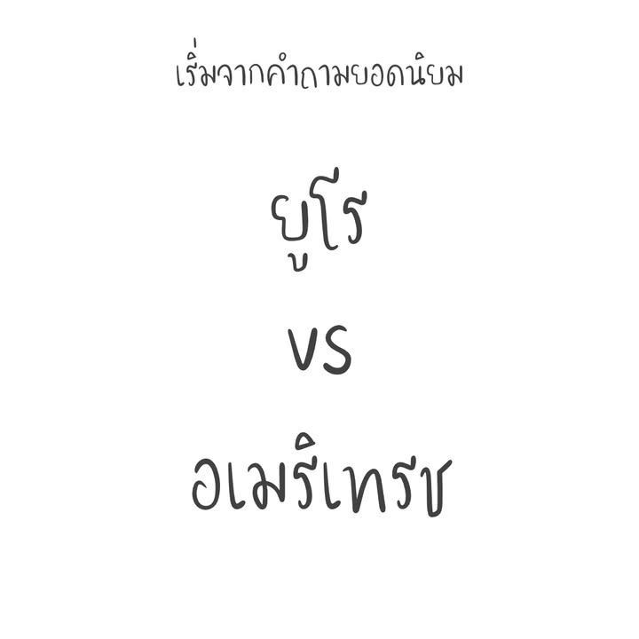
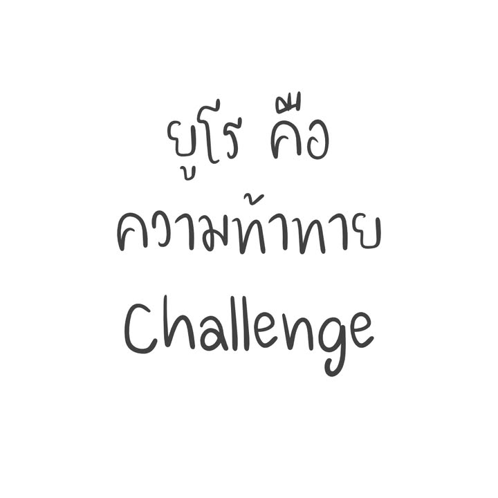
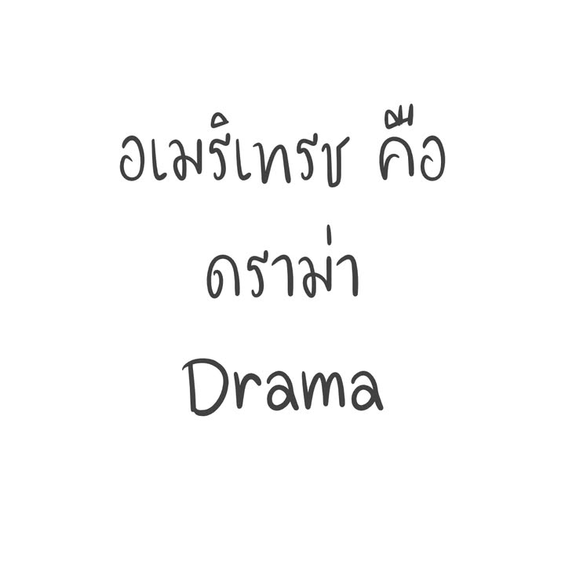
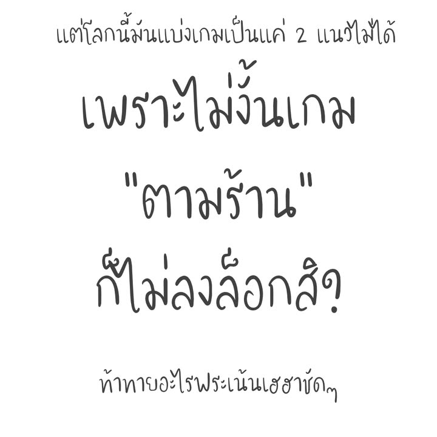
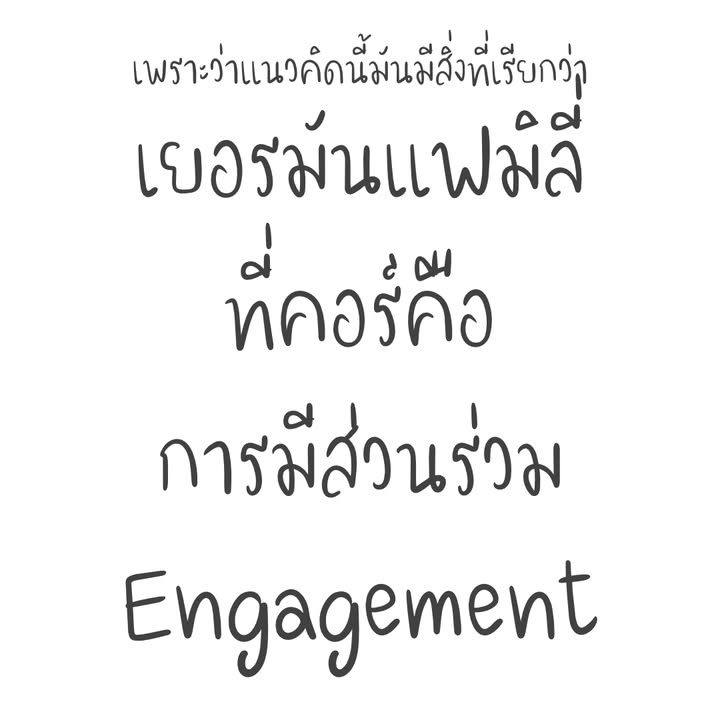
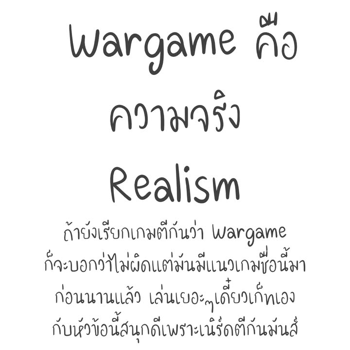

โพสนี้จะมาเล่าต่อยอดจากคำถาม  "ยูโรคืออะไร" ที่มือใหม่ชอบถามกัน แล้วคำตอบจากมือเก่าเองก็ยังไม่ค่อยจะตรงกันเองนัก เพราะเดิมมันก็ไม่ได้มีหลักการอะไรรองรับขนาดนั้น และโพสนี้พูดถึงแค่เกมกระดานนะไม่ได้รวมไปถึงการ์ดเกมหรือ TRPG หรือ miniature wargame หรือกระทั้งเกมปาร์ตี้ ที่มันค่อนข้างชัดเจนในตัวเองอยู่แล้ว 

------
:
โดยข้อเขียนนี้จะเป็นการยกฉบับย่อมากๆของ Schools of Design and Their Core Priorities by Oliver Kiley ที่เขียนใน BGG นะถ้าอ่านอันนี้แล้วสนใจก็แนะนำให้ไปอ่านตรงนั้นต่อ เพราะเจาะได้หลายแง่มุมอ่านสนุกดี ซึ่งจริงๆผมก็เคยเขียนแปลเอาไว้ตั้งแต่สมัย Thaiboardgame อันเก่า แต่รอบนี้อยากรื้อมาเขียนให้มันดูง่ายขึ้น เพราะส่วนตัวชอบการแบ่งแบบนี้มากกว่าเยอะเลย ก็เลยอยากเผยแพร่ให้คนใช้ตามๆกัน

------
:
คือผมก็ไม่ได้ขัดเรื่องประวัติที่มาที่ไปอ่ะนะพวกยูโรอเมริเทรชเนี่ย แต่มัน aged และเก่าแบบไม่เหลืออะไรที่ใช้ได้เท่าไร คือเมื่อก่อนเยอรมันแพ้วอร์เลยเน้นเกมไม่ตีกันไรงี้เป็น fact ก็จริงแต่ไม่ได้ยึดเกี่ยวเชื่อมโยงอะไรกับแนวคิดออกแบบเกมสมัยนี้แล้ว (ผมว่ามันยากมากที่จะเจอนักออกแบบเกมตอนนี้ซักคนมาพูดว่า.... ผมทำเกมยูโรเพราะไม่ชอบสงคราม) แต่ฝั่ง Wargame (แบบ Wargame จริงๆน่ะ) เรื่องประวัติความเป็นมาก็สำคัญอยู่เหมือนกันในการทำความเข้าใจแนวเกม/ตลาด/คนเล่น/การออกแบบที่แตกต่าง 

------
:
ซึ่งเรื่องแนวเกมก็อยากให้ลองนึกถึงอาหารจำพวกเส้นดูนะ แบบบะหมี่, ราเมง, เฝอ, พาสต้า ไรงี้ คือโดยไอเดียมันก็คือเอาแป้งมาทำเป็นเส้นกินพร้อมกับซอสหรือซุปใช่มะ แต่ว่าเราก็จะมองเห็นได้ว่าไอ้คำจำกัดความง่ายๆแค่นี้กลับแตกแขนงไปได้หลากหลายและก็มีวัฒนธรรมอะไรบางอย่างที่คนรับรู้ร่วมกัน แบบอิตาเลี่ยนสไตล์นายจะมาใส่ ketchup ในพาสต้าไม่ได้นะโว๊ยยยยยย.... ซึ่งแนวเกมก็จะเป็นอะไรคล้ายๆแบบนั้นแหละ

------
:
พูดในรวบรัดก็คือในแนวคิดนี้สิ่งที่แบ่งแนวเกมออกจากกันคือ คอร์ หรือแก่นของเกมนั้นพยายามจะเป็น

▪️ ยูโร: "Challenge" คือเกมที่ออกแบบมาเพื่อให้เกิดการแข่งขันกัน ดวงถูกจำกัดอยู่ในระดับสีสันหรือเพื่อให้เกิดความไม่แน่นอนเพื่อสร้าง puzzle ที่ท้าทายคนเล่น การแข่งขันมันก็เน้นที่เอาฝีมือมาวัดกันเซ่!! สมัยก่อนมันก็แบบนี้เลยมีแต่ cube ก็พอ เลยโดนล้อว่า Cube Pusher เลยนะ

▪️อเมริเทรช: "Drama" ทุกสิ่งทุกอย่างออกแบบมาเพื่อให้เกิดอารมณ์ร่วมไปกับเรื่องที่เกมจะเล่า ดวงและความสุ่มรวมถึงกติกา section พิเศษแบบดาบในตำนานยาว 1 หน้าที่โอกาสจะออกคือสิบเกมหนึ่งครั้งไรงี้ จะออกแบบมาเพื่อให้เกิดความพิเศษและความตื่นเต้นในการเล่น การแข่งขันในเกมมันก็มีแต่ประเด็นมันคือเพื่อสร้างอารมณ์ร่วมให้เกิดความดราม่าในทุกมูฟเม้น สมัยก่อนก็เลยเน้นพวก miniature เพื่อเสริมสร้างบรรยากาศ เดี๋ยวนี้เรียก Thematic เพราะคนนึกว่าเรียก Trash คือเหยียด แต่เอาจริงๆมันมีความหมายกึ่งๆแบบ sooooo american style มากกว่า

▪️ เยอรมันแฟมมิลี่: "Engagement" เรียกได้ว่าเป็นร่างแยกจากยูโรในนิยามที่ใช้กันทั่วไปก็ได้ (หลายๆกรณีก็ใช้ร่วมกันนั้นแหละ) เกมออกแบบมาเพื่อให้ผู้เล่นมีส่วนร่วมในการเล่น ดวงทำมาเพื่อสีสัน เฮฮา ทุกคนอยู่ด้วยกันจนจบเกม ซึ่งเกมยอดนิยมก็คือเกมอย่างคาทานนั้นเอง

▪️ abstract: "Minimalism" น่าจะเป็นหมวดที่ไม่ต้องอธิบายเท่าไรเพราะมันตรงตัว ก็คือเกมที่พยายามลดทอนกลไกให้น้อยชิ้น แต่สร้างความท้าทายไปกับการแก้ปัญหาที่แทบไม่มีดวงเป็นส่วนประกอบ

▪️ Wargame: "Realism" คือเกมสงครามเนี่ยมันเริ่มมาจากการจำลองการรบของจริง (ที่ก็แยกไปมีสายอย่าง Miniature Wargame) คือเกมตีกันแบบยูโรก็จะมาดูเรื่อง chance บริหารทรัพยากร  ส่วนอเมริเทรชจะมาดูความบู้ทหารตัวเล็กๆล้มกองทัพใหญ่พลิกไปมา แต่ใน Wargame มันคือการมองถึงความเป็นไปได้ในการศึก ว่ามันสมเหตุสมผลไหม กำลังบำรุงมาตรงนี้ได้จริงไหม รุกคืบเป็นอย่างไร ไหนมี setting ทางประวัติศาสตร์มารองรับด้วยหรือเปล่า มันคือการพยายามเอาความจริงมาเล่าให้แบบที่ไม่เว่อร์ แต่เป็นการลดทอนเพื่อให้เกมมันเล่นได้

------
:
จริงๆอยากให้ take note ไว้เหมือนกันนะว่าแนวเกมแต่ละแบบมีการใช้ (หรือไม่ใช้) 'ดวง' หรือความสุ่มด้วยเหตุผลที่แตกต่างกันเยอะทีเดียว คือมันเป็นเครื่องมือที่เอาไปใช้ในการเล่าเรื่องที่แตกต่างกันขึ้นอยู่กับการนำไปใช้

------
:
ซึ่งเรื่อง Wargame นี้คุยได้อีกเยอะเพราะถ้าพูดอีกมุมมันก็เหมือนโลกคู่ขนานของ ยูโร+อเมริเทรชเลย คือบทจะเรียบก็เรียบ บทจะยากก็ยากหยุบหยับเหลือเกิน แต่ก็เน้นไปที่การพยายามเล่าความจริงอะไรบางอยางในแง่มุมที่ไม่เหนือจริงไรงี้

------
:
แต่ถึงอย่างนั้น มันก็มีหลายเกมที่ยังไม่ลงล็อกแนวคิดการแบ่งแบบนี้อยู่ดี อย่าง 18XX / Pax Series นี้จะเป็นอะไร? แยกออกมาอีกหมวดเลยละกัน? แล้วคุณค่าของมันคืออะไรน่ะ? แต่ผมคิดว่าสำหรับเกมที่เราพบเจอกันส่วนมากนั้้นการเข้าใจว่าโอเคนี้แนวคิดแบบยูโร / อเมริเทรช / แฟมมิลี่ มันก็ช่วยให้การคุยไม่หลงทางกันจนเกินไปนะ

------
:
รู้แล้วช่วยอะไรได้? โอเคมันไม่ได้ช่วยอะไรนักแต่ผมคิดว่าการเข้าใจว่าฅเกมมันทำงานบนปรัชญาแบบไหนก็จะช่วยให้เราปรับตัวและสนุกไปกับสิ่งที่เกมพยายามจะนำเสนอได้มากขึ้นครับ และแน่นอนว่าถ้าเป็นเนิร์ดที่ชอบเล่นเกมแล้วการมานั่งคิด วิเคราะห์ แยกแยะอะไรพวกนี้มันก็สนุกดียังไงล่ะ!

-----
:
ใดๆก็แล้วแต่มันไม่ได้มีแนวเกมไหนที่ 'เหนือ' หรือสูงต่ำชั้นกว่ากัน ผมอยากลากคนมาเล่นยูโรเพราะผมชอบแนวนี้ ไม่ได้แบบอี๋.... family party หว่ะ แต่ fact ที่ว่าเกมมันมีความซับซ้อนกับใช้ mindset ที่แตกต่างกันมันก็ไม่ได้หายไปไหน การถูกพูดถึงว่ามันเบากว่าหรือซับซ้อนมากกว่าก็เป็นเรื่องของการอธิบายในเชิง quantity เฉยๆ การลองหรือย้ายไปเล่นแนวเกมอื่นๆมันไม่ใช่การเลื่อนขั้นหรือลดเกรดตัวเองแต่อย่างใด

-----
:
As always, love to talk with everyone.

font: maaja (หมาจ๋า)ใช้ฟรีแต่ถ้าเอาไปหารายได้อย่าลืมแบ่งไปช่วยสัตว์ยากไร้

