TIBM - ตลาดนัดบอร์ดเกมอินดี้ ยังมีอาทิตย์ที่ 10 อีกวันนะครับ ซื้อบัตรได้ที่หน้างานเลยราคา 199 บาท!! คุ้มสัดๆแน่นอน

.
จบวันแรกไปกับงานที่สนับสนุนและผลักดันนักออกแบบเกมอินดี้อย่างมั่นคงที่จัดมาเป็นครั้งที่สองแล้ว ตัวงานเรียกได้ว่าขยายจากปีที่แล้วเป็นเท่าตัวทั้งคุณภาพงาน คุณภาพเกม

.
เอาแบบไวๆที่เล่นมานะ เผื่อใครสนใจหาซื้อ ยังเกมอีกบานที่ยังไม่ได้เล่นแต่ถ้าเก็บตกอีกวันได้ก็จะมาขยายแล้วก็เล่าให้ฟังเพิ่มว่าอันไหนคิดว่ามีข้อดีข้อเสียยังไงนะ

.
Dawn - เกม R&W หน้าปกสุดเท่ระบบง่ายจับคู่สีพื้นดินและเลข จากนั้นก็เอาไปเขียนๆในแผนที่ตัวเอง จุดเด่นคือแผนที่เป็นดาวเคราะห์ที่แต่ละแผ่นเล่นไม่เหมือนกันแม้แต่อันเดียวแม้ว่าจะใช้ทรัพยากรส่วนกลางแบบเดียวกันเรียกว่าซื้อหนึ่งกล่องเหมือนมีสิบเกม!

.
Dinner Time - เกมปาร์นี้ที่ตลกเฮฮาสมกับที่ขายหมด 100 กล่องในงาน TBS 2023 ไอเดียง่ายๆว่าเรามีสองทีมคือหนูและแมลงสาบ ตานึงๆก็จะเลือกระหว่างแอบยัดอาหารของแต่ละทีมเข้าไปกองกลางหรือจะคุ้ยออกมาเป็นแต้ม ส่วนตัวคิดว่าเหมาะกับ 6 คนเป็นอย่างน้อย ออกแนวเฮฮาดี 

.
Tidy Home - Cozy Filler เกมที่ตอนเล่นอาจจะไม่ Cozy สมชื่อเพราะมีแอบดักแอบตัดกันยับอยู่ ไอเดียว่าด้วยการทิ้งของจากบ้าน (แรงบันดาลใจจากเจ๊สปากร์จอย) เล่นง่ายๆคือทิ้งการ์ดสีไปยังกองกลาง ทิ้งเลขน้อยไม่เป็นไร แต่ทิ้งเลขใหญ่ต้องรวบกองทิ้งกลางมาไว้กับตัวมาเป็นแต้มรกเพราะไม่ยอมทิ้งของ แต่กระนั้นถ้าเราเก็บสีนั้นเยอะสุดก็จะเสียแต้มนั้นนิดเดียว

.
ศึกชิงสีดา - surprisingly good เลย ไอเดียพื้นฐานคืออีแก่กินน้ำแบบ reverse เพราะว่าเราอยากจะถือนางสีดาไว้ในมือตอนหมดกอง หรือว่าตอนที่เล่นการ์ดหมดมือแล้วนางสีดาอยู่เป็นใบสุดท้าย ระหว่างเล่นจะเอาการ์ดยักษ์และทหารพระรามมาจับคู่สร้าง effect ในการดักหานางสีดาจากมือคนอื่น เป็นเกมที่ในตัวกลไกคิดเรื่องระบบมาชิงการ์ดอีแก่ได้ดีเลย แบบเอ๊ะจะแกล้งทิ้งมันหมดมือเกิดมันมีสีดาก็ชนะดิว่ะ หรือระหว่างเล่นถ้าถือสีดาอยู่จะหลอกเค้าไงดีว่ะ?

.
Run Zombie!! Run - เกมอย่างฮาสำหรับสายที่พร้อม roleplay หน่อยๆเพราะเราจะมาวิ่งหนี zombie กัน เล่นแบบ deck building ลงการ์ดเพื่อวิ่งแข่งกัน แต่มันมีความแบบเกม console ตรงที่เราวิ่งเบียดเพื่อนได้เอาของฟาดให้แม่มออกไปข้างหลังก็ได้ วิ่งๆอ้าวอีเว้นท์ห่าเหวทางชันมั้ง แก๊สพิษมั้ง  เกมมี table present เท่จัดเพราะเป็นถาดเลื่อนเอา zombie มาวิ่งไล่ตามตูด ตอนเล่นรู้ได้เลยว่าเกลาต่อได้อีกเยอะ (เกมกำลัง pre-order ปรับได้อยู่)

.
Dying Message - อันนี้จริงๆไม่อินดี้ละ แต่ไหนๆได้เล่นครั้งแรกในงานก็เลยเล่าด้วย ไอเดียก็หมาป่านั้นแหละแต่พัฒนาแก้ปัญหาน่ารำคาญของเกมแนวนี้ที่แม่งชี้มั่วฉิบหายด้วยการมีการ์ดหลักฐานจำนวนหนึ่งให้คนตายที่โดนคิลมาชี้ dying message ที่ระบุถึงคนร้าย แต่ว่าไอ้หลักฐานที่ว่ามันก็ไม่แน่นอนเพราะคนร้ายก็จะส่งหลักฐานปลอมมาทำให้เราเขวด้วย คือถ้าจะเล่นหมาป่าเนี่ยข้ามมาเล่นเกมนี้ดีกว่าเยอะ

.
เชฟขนมไทย - เป็นเกมที่ไอเดียมาจากการที่พบว่าเกมเดี๋ยวนี้แม่มเล่นยากเกิ๊นอยากได้เกมง่ายๆให้คุณแม่กับหลานได้เล่นด้วยกันสบายๆ ก็ออกมาเป็น set collection ที่สะสมเครื่องปรุงทำขนมไทย ตัวเกมในกติกา as is จะเรียบไปนิดเพราะจั่วๆ เจรจาแลกของง่ายๆ แต่คิดว่าถ้าใส่ทวิสจำพวกจั่วจากกองกลางก็ยังคงเป็นเกมที่ไม่ยากเกินกลุ่มเป้าหมายและยังไม่ต้องแก้อะไรนอกจากคู่มือนะ

.
ควงพลิ้ว - เกมจัญไรเบอร์สุด (นี้คือคำชม ถ้าใครบอกเกมดีย์แม่งคือไม่ได้เล่นเองแน่นอน) คนออกแบบแม่มก็ยืนเชียร์ขายของโดยการบอกมาถอดกางเกงกันไหมครับ..... แต่เห้ยตลกจริงเพราะเกมมันจะให้เราสุ่มกองที่เริ่มจาก เออ... จอนจ้อน ทับด้วยกางเกงในและทับด้วยกางเกงวอร์ม จากนั้นก็เอ้า หนี่ง สอง ซั่ม ชี้นิ้วกันเลยว่าใครจะถกกางเกงใคร ใครโดนถอดจดเห็น 'ไอ้นั้น' ก่อนก็เอ้าท์ไป มันจะมีพวกสกิลอะไรด้วยตลกดี แต่ที่ตลกจริงๆคือ event เวลาใครโดนรุมชี้ที่ผลมักจะตลกเกินเบอร์ แบบที่ผมโดนคือพอโดนรุมชี้ก็จะเกิด event 'กูไหว้ล่ะ' พร้อมกับปัดให้เพื่อนที่ชี้ผมไปถอดกางเกงคนอื่นแทน ใครเป็นคนจัญควรมีเกมนี้ในครอบครอง

.
Treasure Ten - เกมแนว set collection ที่เราจะเดินเรือไปมาในทะเลเพื่อสะสมลูกเรือที่เป็นเลข 1-9 พอเก็บแล้วรวมกันหารสิบได้เราก็จะไปเคลมเอาการ์ดสมบัติตามโซนที่เราอยู่ จุดที่น่าสนใจมีสองอย่างคือการเลือกทิศทางการเดินเรือที่มีผลต่อการเลือกของคนถัดไปและการสลับหรือแอบดูว่าสมบัติแบบไหนแต้มคูณจะเท่าไร ก็ต้องไปสลับให้ของที่เรามีเยอะมันแต้มมากๆสิ!!

.
Mine of Wonder Gems - เกมสไตล์ set collection แบบปาร์ตี้ที่ take that หน่อยๆ ไอเดียคือการสะสมเพชรตรงหน้าให้ครบ 5 สี แต่ว่าการ์ดแกล้งแม่มเยอะสัดเดี๋ยววางเดี๋ยวพลิกการ์ดกรู ก็วนๆตบตีกันไป จุดที่น่าสนใจคือระบบการ์ดแกล้งมันสามารถป้องกันได้ถ้ามีผลึกสีตรง หมายความว่าพอเล่นไปเรื่อยๆเราจะแกร่งขึ้นและถูกทำร้ายได้ยากขึ้น ทำให้ pacing เกมมันขยับไปโดยที่การเล่นไม่ต้องเปลี่ยนไป

.
เห้ยก็เล่นไปพอควรเลยนะ ขนาดว่าเน้นยืนคุยกับเพื่อนเป็นหลัก.....

.
ถ้าอิงจาก 1st impression เกมที่ชอบจะเป็น (แต่ทั้งนี้ก็แล้วแต่บริบทที่จะไปกางอ่ะนะ) 
- Dawn, Tidy Home, Run Zombie!! Run 

ส่วนเกมที่อยากแนะนำแต่แนวมันฉีกผมเยอะไปหน่อยเวลาปกติผมน่าจะไม่ได้กางก็
- ควงพลิ้ว, ศึกชิงสีดา, Dinner Time,  Dying Message

.
ข้อสังเกต - ถ้าเรียกนักออกอินดี้แบบทำมือว่า Lv1 แล้วนักออกแบบอินดี้แบบที่เริ่มมีการสั่งโรงพิมพ์ทำอะไรจริงจังมาหน่อยว่า Lv2 ก็จะสังเกตได้ว่าในปีนี้กลุ่ม Lv1 แทบไม่ค่อยมีเมื่อเทียบกับปีก่อน ก็คุยๆกับหลายๆคนก็ได้ความเห็นว่าไม่ใช่ว่า Lv1 มีน้อยลงแต่ว่าส่วนมากได้รับข้อมูลจากคนก่อนหน้ามาเยอะทำให้ก้าวข้ามขั้นตอนทำมื๊ออออทำมือมาได้อย่างรวดเร็วกันอันนี้คือดีตรงทำให้เห็นว่ากลุ่มนักออกแบบมีการช่วยเหลือกันดีมาก แต่ในมุมของผมเองก็มีข้อเสียหน่อยๆตรงพอมันผลิดเยอะมาแล้วเวลาเจออะไรอิหยั่งๆก็คือแก้ไม่ได้ละ แบบน่าเสียดายเยอะเลยเพราะยังไปต่อได้อีกแต่กลายเป็นโดนฟรีซไปแล้วเฉย...แบบไม่ได้พูดอวดตัวแต่ถ้าได้ผ่านมือสายเล่นเกมมาเยอะอีกหน่อยมันจะแบบเปล่งประกายได้อีกนะ!!

.
ฉันรักบอร์ดเกมไนท์......

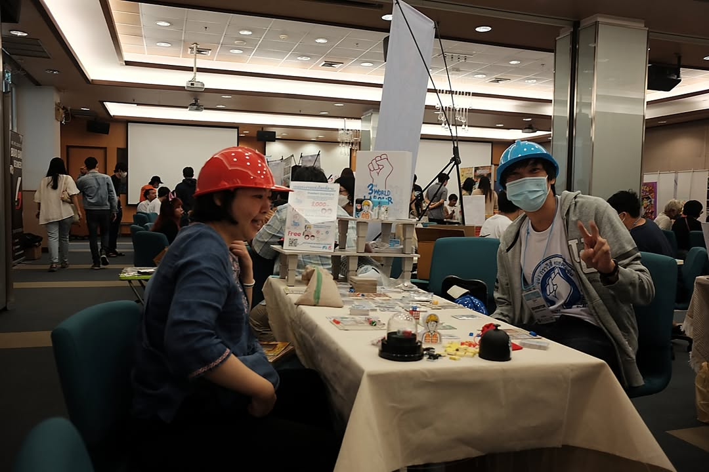

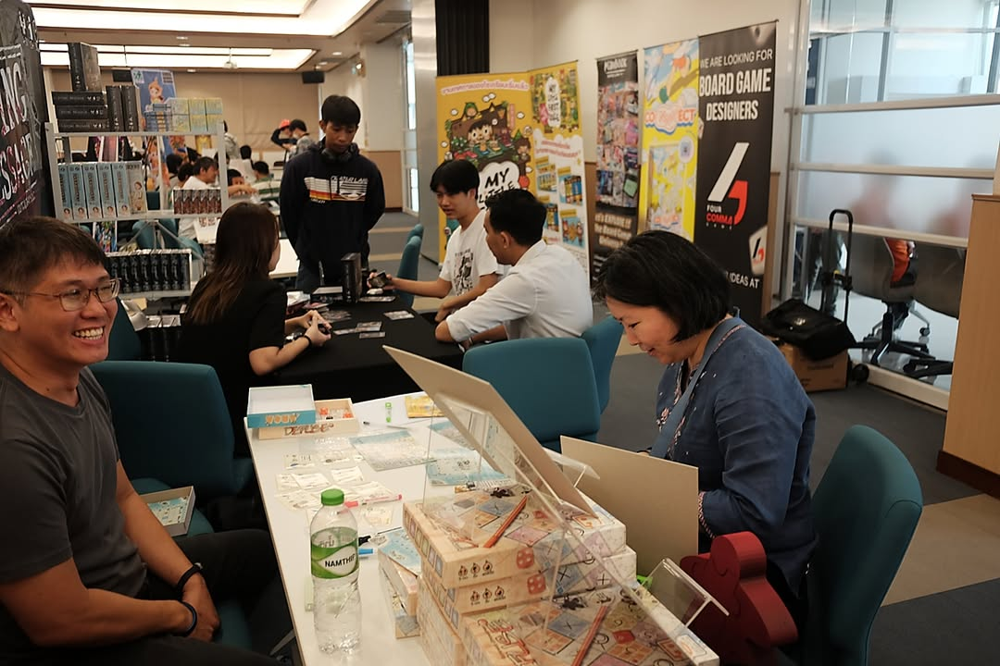

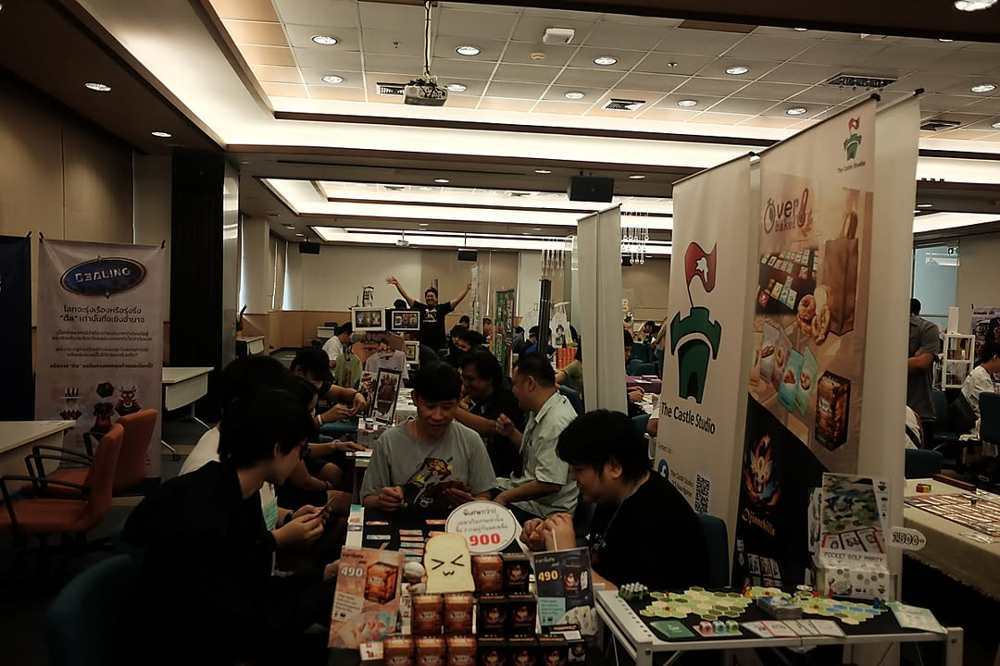

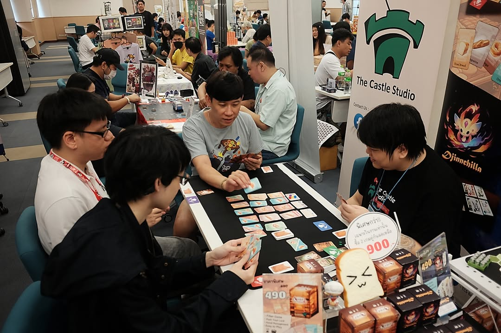

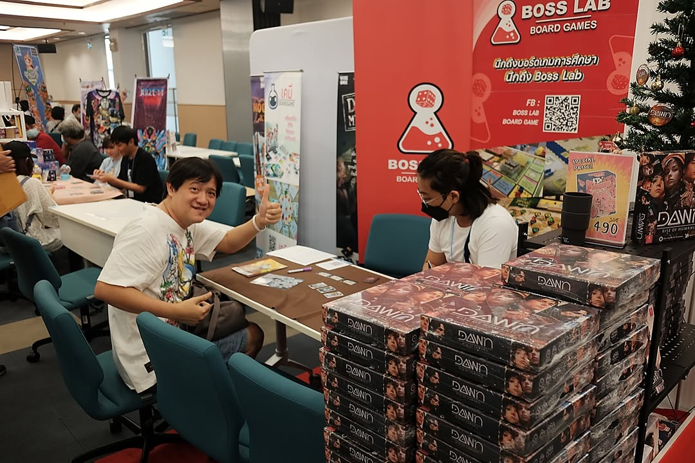

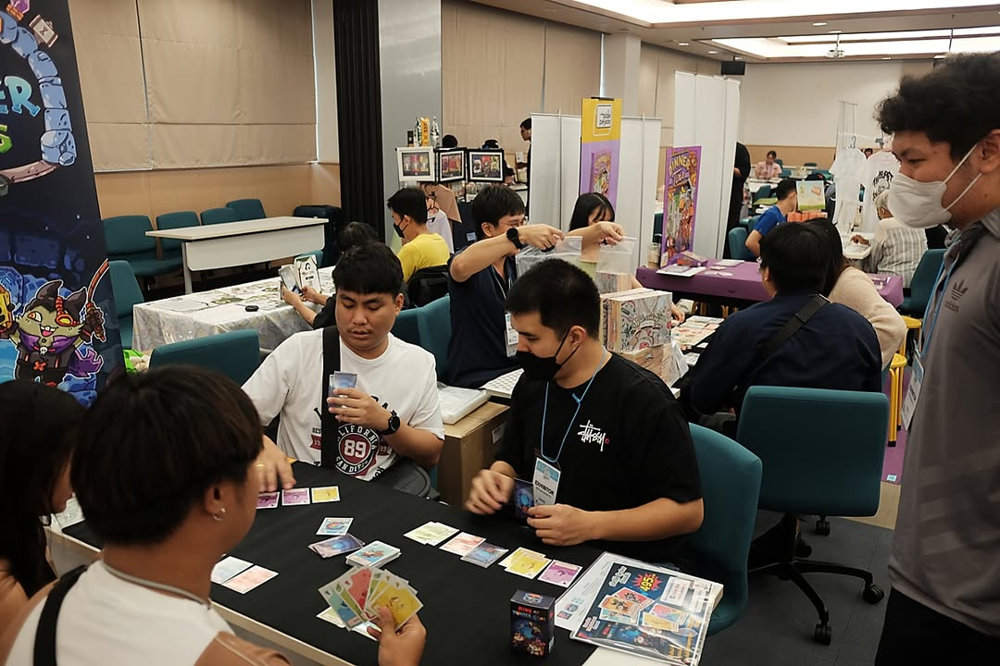

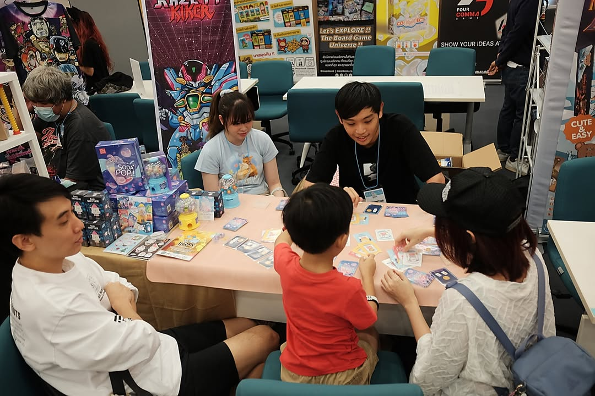

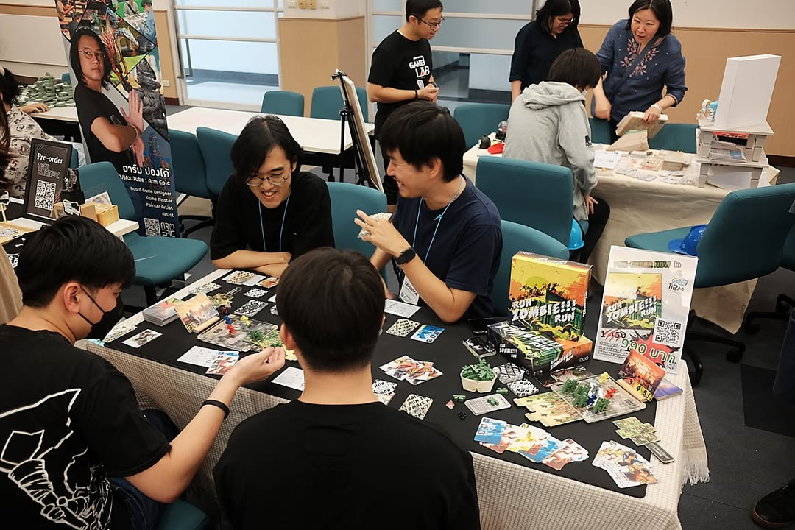

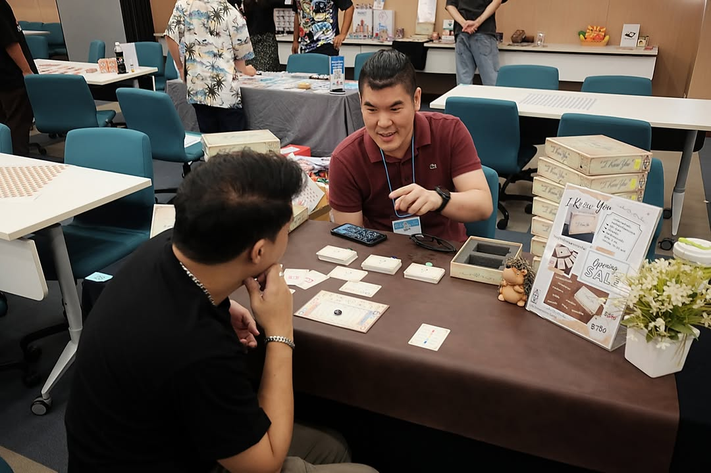

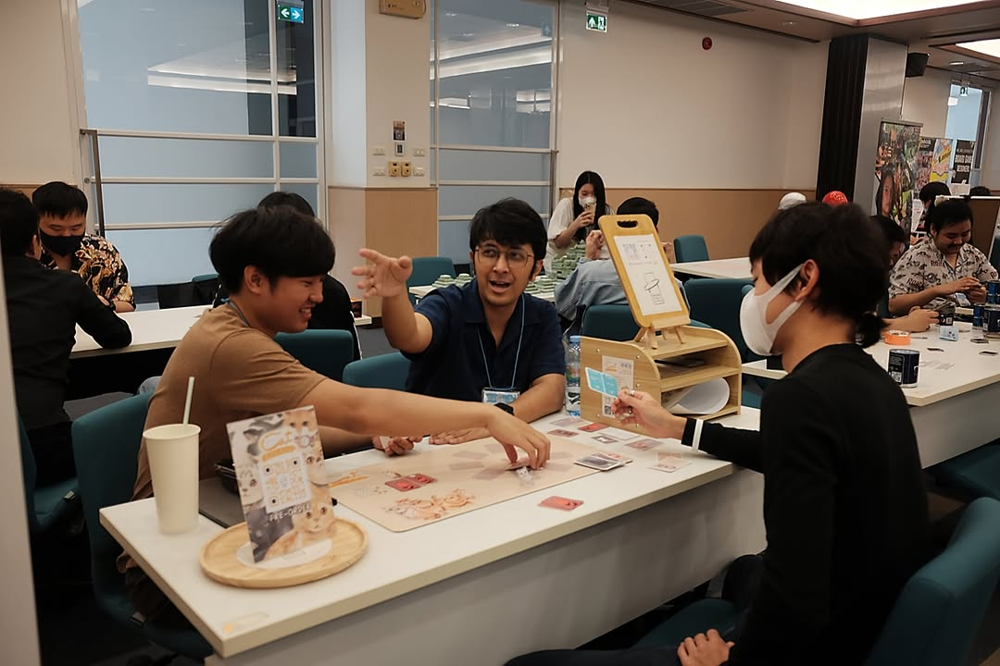

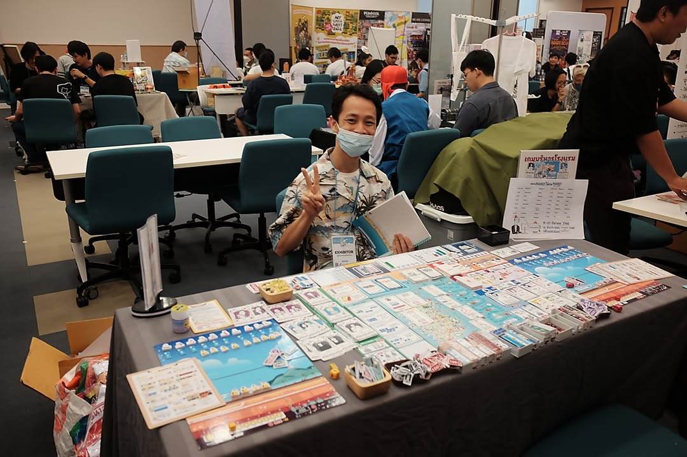
