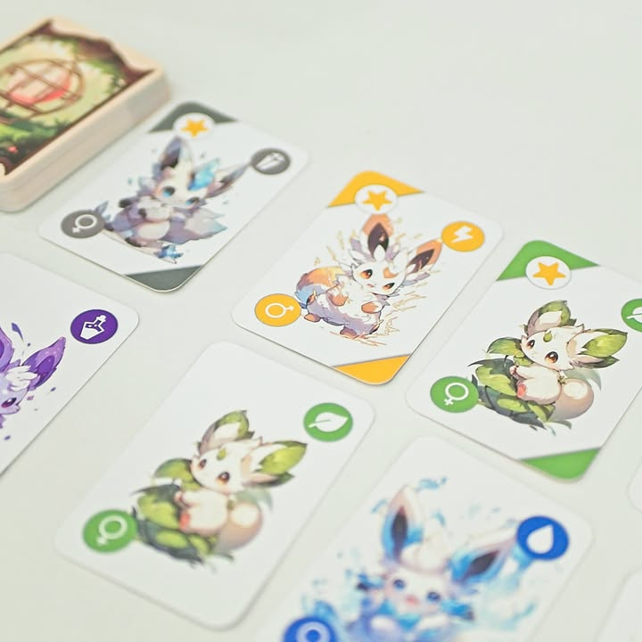
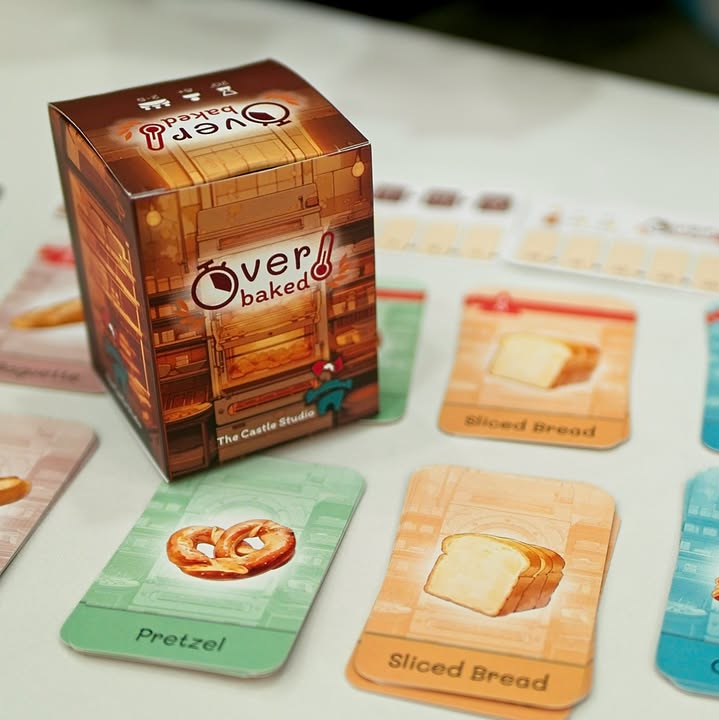
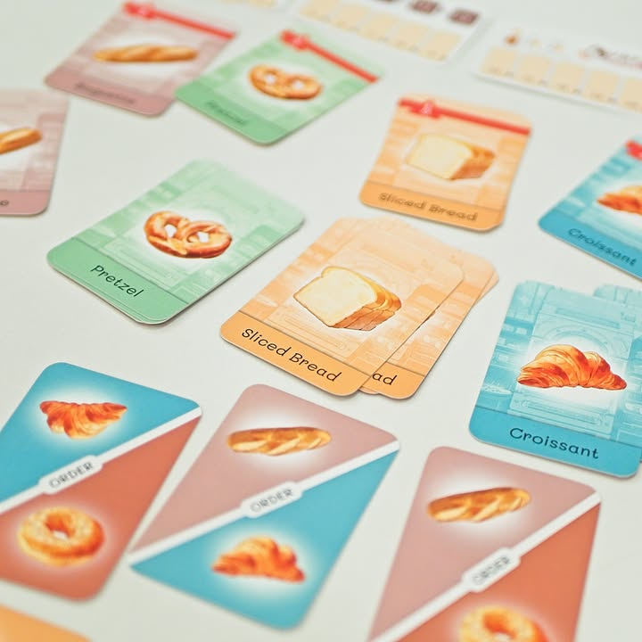

มัดรวมเลยละกัน Djinnchilla (ญิน + ชินชิล่า) และ Over Baked เป็นการ์ดเกมกล่องเล็กภาพสดใสทั้งคู่ ผลงานของ The Castle Studio - TCS Boardgame ดีกรีแชมป์ยูเรก้า 2022 กับรองแชมป์ยูเรก้า 2023!! #bite_size

---
.
Djinnchilla - เนี่ยเป็นแนวสะสมภูติสีทำคะแนนที่มีทวิสน่าสนใจหลายอย่าง อันแรกก็คือระบบเพศ ที่จะต้องจับมาผสมพันธ์เพื่อออกลูกมา โดยมีสองขยักคือผสมเพื่อเกิดร่างสอง หรือเอาร่างสองมาเป็นพ่อ/แม่ พันธ์ให้เกิดรุ่นลูกๆที่มีสีตรงกัน อีกระบบคือการบริหารกรงของตัวเองที่มันจะยากนิดหน่อยตรงมันวางได้จำกัดแต่เราสามารถหยิบเอาฝูงภูติที่เราบลีดมาส่งออกไปจัดชุดทำเควส (ก็คือเคลียร์กรงแล้วไปรวมทำแต้มเพิ่มนั้นแหละ)

.
เพลินๆดีครับ ส่วนตัวแอบติดเรื่องกลวิธีทำโบนัสบางอย่าง กับไม่รู้ทำไมไม่ค่อยชอบเกมที่เฉือนชนะกันแค่แต้มสองแต้มไรงี้เพราะขยับอะไรถ้าไม่เล่นพลาดจนเกินไปมันก็ได้แต้มนึงซักทางอยู่ดี (อารมณ์ว่าทำ math balance กว่าที่ชอบไปนิด)

---
.
Over Baked - แนวทำของไปส่งออร์เดอร์ที่น่าสนใจตรงผสมระบบ deck building + push your luck เข้ามาด้วยกัน ไอเดียในแต่ละรอบจะเปิดออเดอร์ลูกค้าเข้ามาจำนวนหนึ่ง จากนั้นผู้เล่นจะผลัดกันเลือกชนิดขนมปังที่อยากจะผลิตเข้ามาไว้ในกองตัวเอง จากนั้นก็สับกองแล้วจั่วเรื่อยๆจนพอใจ ซึ่งของที่เราเปิดเนี่ยจะนำไปสู่เฟสสองที่จะเอาของไปส่งลูกค้าอีกที

.
แต่ทวิสมันอยู่ตรงนี้แหละ คือไอ้การผลิตขนมปังเนี่ยมันจะมีใบที่แบบบอกว่าเตาร้อนไปแล้วโว๊ยยยยยอยู่ 2 ใบในกองเสมอ ถ้าเราเปิดเจอสองใบก็บ้งเลย แต่ถ้ามั่นใจในดวงก็เปิดต่อได้เพื่อที่จะได้ของมาส่งออเดอร์เยอะขึ้น

.
พอมาตอนส่งของก็ผลัดๆกันส่งโดยที่หนึ่งใบรับของสองชิ้น ถ้าผู้เล่นส่งด้วยกันก็แบ่งแต้มกันไป วนๆกันแบบนี้ 4 รอบจบ

.
เป็นเกมที่ผมรู้สึกว่าไอเดียน่าสนใจแต่ยังไม่ถูกใจตรงที่จังหวะ push your luck มันเล่นอยู่กับตัวเอง คืออารมณ์เกมแบบนี้ผมชอบจังหว่ะปั่นเพื่อนมากกว่าทั้งแบบเปิดแข่งว่าใครเยอะ หรือพูดเป่าหูให้หยุดหรือไปต่อจะได้พังไรงี้ พอหยิบๆก้มหน้าก้มตาสับๆเปิดก็แบบดูมันเงียบไปหน่อย ตอนส่งของมันก็ค่อนข้าง automatic แบบเราต้องส่งของไปตัดแบ่งแต้มคนโน้นคนนี้สิ ของที่ผลิตมาเกินเพราะ push luck จนได้มาเยอะเหลือก็ทิ้งอยู่ดีเลยแบบอ้าวแล้วจะมาลุ้นผลิตเยอะๆทำไมหว่า? เอาจริงคืออยากบอกว่าเกมนี้เก็บอุปกรณ์ไว้แต่ทำคู่มือใหม่เลยเป็นอีกเกมได้มะอยู่เหมือนกัน คือมันใกล้สปาร์คล่ะอีกนิดเดียว

---
.
เกมนี้ผมไปเล่นตอนไปงาน TIBM - ตลาดนัดบอร์ดเกมอินดี้ มาครับ สนใจก็ไปติดต่อกับผู้ผลิตได้เลย ผมไม่มีส่วนได้เสีย แต่แบบอยากบอกนักออกแบบอีกอย่างคือเกมพวกนี้ทำกล่องมาเท่าๆกันแบบนี้ อยากให้ลองทำตัวโหดเหี้ยมด้วยการ 'รันนัมเบอร์'!!

