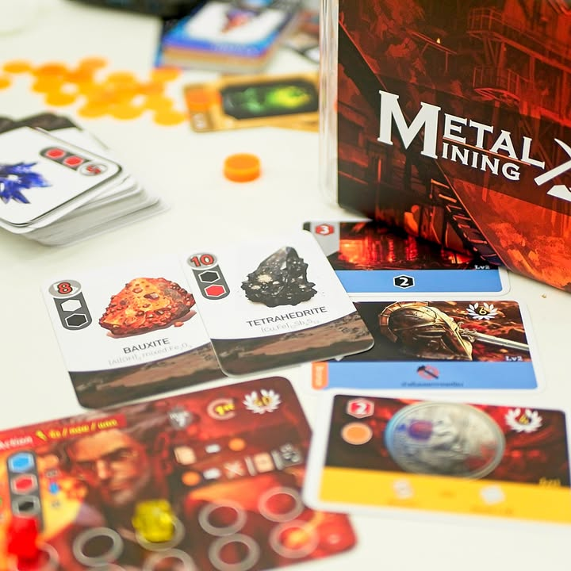
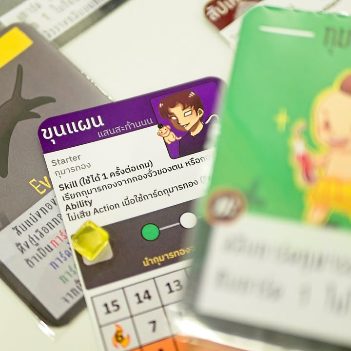
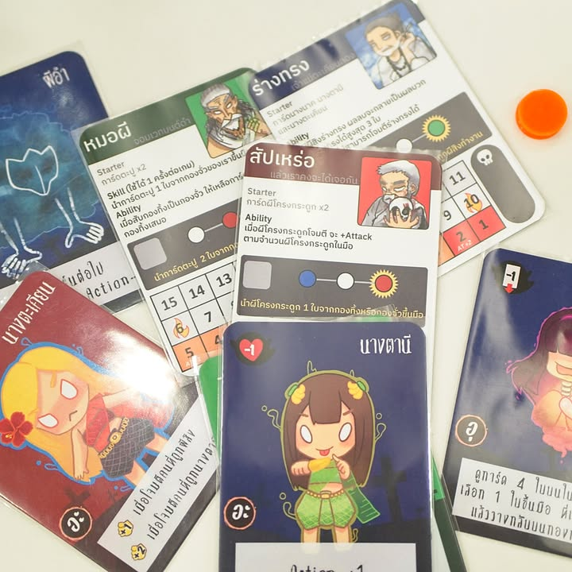

มัดรวม 3 เกม: 1 Deck Building + Metal Mining +  Ion Alchemy จาก เคมีboardgame ผู้นำยาขมอย่างเคมีมานำเสนอในมุมมองสนุกสนานได้อย่างน่าสนใจ #bite_size

verdict: เอาไปเผา ผมตกเคมี #ไม่ใช่เฟ้ย 

โอเค 3 เกมนี้ผมฟังบรีฟอย่างเดียวตอนเค้าจะเก็บของปิดงาน คือคิวแน่นตลอดดดดดดดดดด ปีก่อนก็ไม่ได้เล่น ทั้งหมดก็จะเป็นการ overview นะ ตัวเกมไม่ยุ่งยากฟังกับขยับนิดหน่อยก็เห็น flow all game ละ (แต่ก็ไม่เรียบแบบน่าเบื่อ)

---
.
1 Deck Building - จริงๆผมเห็นเกมนี้และเอามาลงตั้งแต่ TIBM 2022 ปีก่อนละ ผมชอบอาร์ทเป็นพิเศษคือมันน่ารักดี ไอเดียเป็นเกมการ์ดต่อสู้กล่องเล็กเล่นง่ายธีมภูมิพลังวัฒนธรรมไทยที่ไปทั่วโลกแล้วอย่างหมอผี!!

.
เกมก็ให้เราเลือกตัวละคร แล้วก็มีชุดการ์ดกลางอันนึงแล้วใช้ระบบเราจั่ว 3 เก็บ 2 แล้วให้ฝ่ายตรงข้าม 1 จากนั้นก็เอาการ์ดมาสู้ๆกันตบพลังไป มีระบบน่าสนใจคือ 'combo' ที่การลงการ์ดสีต่อเนื่องกันถูกลำดับ 3 ครั้งจะได้ใช้ท่าประจำตัว และระบบ catch up ไฟลุกที่พอเลือดใกล้หมดจะตีแรงเป็นพิเศษ!! 

.
ชอบไอเดียแบบอยากให้ขายดีๆให้เค้าออกตัวเสริมมาเยอะๆ คือมันไประดับ unmatch ไรงี้ได้เลยนะมีผีอีกหลายชาติหลายตัวให้เล่น

---
.
Ion Alchemy - แกนมันคือเกมจับคู่ส่งของให้ลุกค้านั้นแหละ แต่ลูกค้าเรามันเป็นธาตุที่จับตัวกันแล้ว ส่วนการ์ดเราจะเป็นพวกสารเคมีต่างๆที่พอประกบกันแล้วมันเกิดการแตกตัวไปจับกับอีกใบเป็นธาตุใหม่ๆ คือมันฟังดูง่ายๆแต่ผมคิดว่ามันเป็นสอดแทรกเรื่องพันธะได้แบบไม่ยัดเยียดดี ในแง่เกมพวกลูกค้าก็จะมีความสามารถเสริมที่ช่วยให้เราลีลาได้อีกนิดหน่อย

---
.
 Metal Mining - เกมที่ชวนให้นึกถึง Century แบบที่ต้องมาสกัดแร่เหล็กแทน ไอเดียก็คือเอาเหล็กมาเคลมออเดอร์นั้นแหละแต่ว่ามีจุดที่ปรับนิดผสมหน่อยตรงโน้นตรงนี้เยอะเหมือนกัน 

.
อย่างการได้สินแร่มาคือจะเริ่มจากเราได้การ์ดก้อนเหล็กมาก่อน (พร้อมชื่อเคมียาวเหยียดแทน favor text หรูหราสมกับมาจากคนเคมี) ที่จะบอกว่าสกัดออกมาแล้วสีอะไร แต่ไอ้การจะสกัดเนี่ยต้องทอยเต๋าเอา แต่ละการ์ดจะมีความยากอยู่ ระบบจะเป็น ทอย 3 แล้วเลือกมา 2 ลูกให้เป็นเลขที่ต้องการ พร้อมกับจ่ายเงินโมได้ ทำให้การเล่นมันไม่แบบดวงจนน่ารำคาญ อีกอันที่บอกเหมือน Century ก็คือระบบแลกแร่ตามลำดับขั้นไปมาเพื่อเอาไปเคลมของ

.
ก็เป็นแนวเพลินๆดีเกมครับ 

---
.
เกมนี้ไปฟังเค้าเล่ามาตอนไปงาน TIBM - ตลาดนัดบอร์ดเกมอินดี้ สนใจก็ติดต่อกับคนทำได้โดยตรงเลยครับ ผมไม่มีส่วนได้ส่วนเสียอะไร

