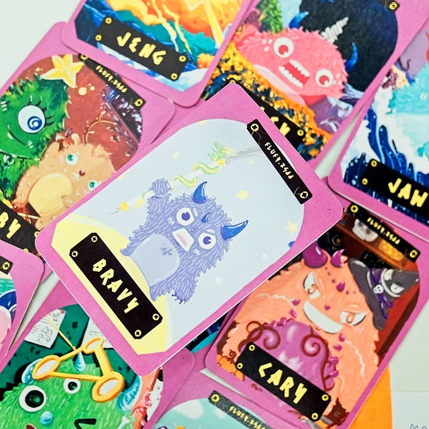
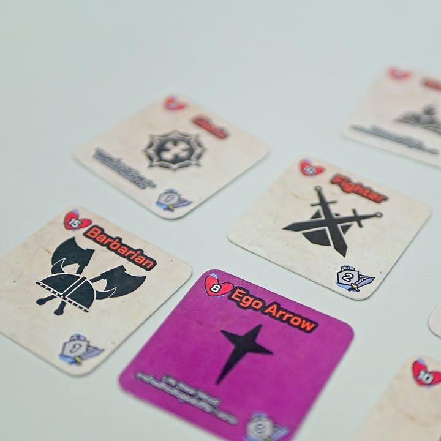
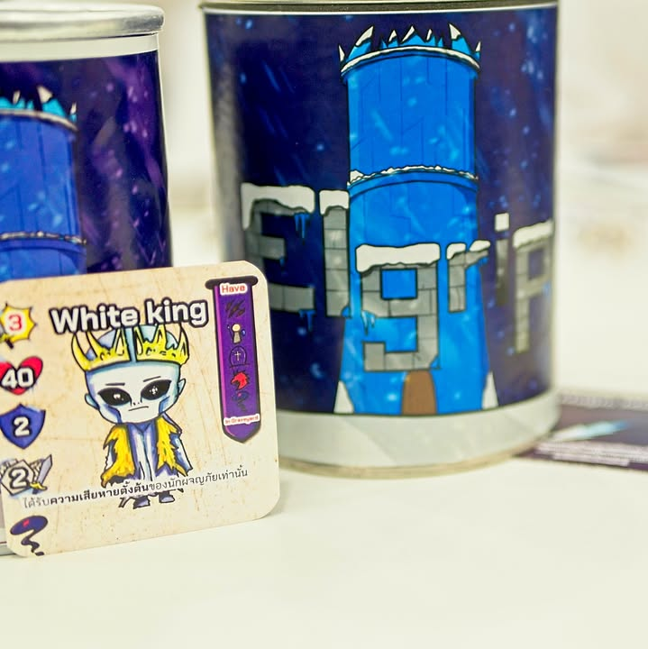

มัดรวม 2 เกมจาก #LazzyBread (หาไม่เจออีกละเดี๋ยวถ้าเจอจะเอามาลงนะ) คือ Looking for Fluffy กับ Elgrip

---
.
Looking for Fluffy - เนี่ยเป็นการ์ดเกมที่จะให้ผู้เล่นมาแข่งกันขุดหาการ์ด fluffly ให้ได้ 4 (จาก 10 ใบ) และแย่งชิงมันจากมือคนอื่น

.
ระบบเกมที่เหลือก็ไม่ซับซ้อนละการ์ดทั้งหมดทั้งมวลจะอยู่กับจากเร่งจั่ง หรือแย่งจากมือ แต่การ์ดห้ามก็มีนะ มีขุดการ์ดมีอะไรก็ว่าไปตามสไตล์ ระหว่างเล่นถ้าจั่วเจอการ์ด fluffy ก็ต้องพูดด้วยว่า 'ขนปุย'!!

.
เป็นการ์ดเกมน่ารักๆสนุกๆสำหรับวงที่อยากได้อะไรแกล้งๆกันนั้นแหละ ไม่ได้รู้สึกว่าเรียบไปอาจจะเหมาะกับคนที่อยากได้อะไรทรงๆแมวระเบิดที่มันใสๆหยิกๆกันไม่เถื่อนหรือเข้มข้นหัวใจจะวายตอนจั่วมั้ง?

---
.
Elgrip - เอาจริงๆชื่อเกมมาจากคำว่า Pirgle ที่เป็นมันฝรั่งแผ่นนั้นแหละเกมก็ใส่มาในกระป๋องทรงแบบเดียวกันเลย เป็นเกมธีม RPG ลงดันไปปราบจอมมาร

.
เกมนี้เราจะเริ่มจากให้เลือกอาชีพก่อนกับจะมีผู้เล่นคนหนึ่งรับบทเป็น DM ที่ในแต่ละตาจะมีหน้าที gen monster มาให้ผู้กล้าตี ระหว่างเล่นก็ทอยเต๋า assign damage จบรอบมีการขุดหา item พร้อมกับระวังการโดน damage จากตัวตึกที่จะคอยทิ่มแทงพลังชีวิตเราไปเรื่อยๆ เกมจบเมื่อเราพิชิตไปถึงชั้นที่ 5 ของหอคอย

.
เป็นเกมที่เสียดายครับ คือมี room อีกมากที่จะต่อยอดจากที่เป็นอยู่ได้ ปัญหาหลักเลยคือ 'ไม่อิน' คือผมเป็นคนที่ถ้าบอกเล่นเกมแล้วมันต้องโรลเพลย์ผมก็สลับสมองให้มันเป็นโหมดนั้นนะ แต่เกมนี้เข้าไม่ถึง เพราะกลไกเกมมันไม่ส่งเสริมให้เราเข้าไปถึงเกม สาเหตุหลักคือตัวคลาสมันมาพร้อมสกิลนิดนึง ไม่ได้ represent ในการเล่นอะไร อยากถืออาวุธอะไรก็ได้ บาบาเรี่ยนอยากร่ายเวทก็ได้งี้ คือด้วยขนาดเกมแล้วผมคิดว่ามันสามารถใส่ความเป็นเกม RPG สไตล์ console 8bit ได้มากกว่านี้อีกเยอะ

.
ระบบ combat ที่เป็นเต๋าผมไม่มีปัญหาอะไร แต่เกมใช้ระบบทุกคนทอยเต๋าแล้วตามใจไป assign ใส่ monster กันเอาเองซึ่งมันไม่ได้มี decision making อะไรเลยว่าใครอยากทำอะไร มันก็เลยย้อนกลับไปว่าไม่อินเท่าไรเมื่อมานั่งทอยเต๋างงๆโอเคเจ้าน่ะตายไปแล้ว.....

.
แต่ทั้งนี้ผมคิดว่ารูปแบบอุปกรณ์สวยและน่าสนใจดี และตัววัตถุดิบที่มีมันก็พร้อมมากๆที่จะเสริมต่อไปอีกหน่อยให้เกมมันสมบูรณ์ครับ ในตอนนี้กลุ่มเป้าหมายก็น่าจะเหมาะกับน้องเด็กๆที่เล่นเกมแบบไม่คิดมาก เจอมอนสเตอร์แล้วก็ทอย หวังว่ารอบนี้จะดวงดีฝ่าฟันอุปสรรคไปได้

---
.
เกมนี้เล่นในงาน TIBM - ตลาดนัดบอร์ดเกมอินดี้ สนใจก็ติดต่อผู้ผลิตได้เลยครับผมไม่ได้มีส่วนได้ส่วนเสียอะไร ทางทีมงานเองก็รับงานวาดด้วยนะเผื่อชอบใจในสไตล์

