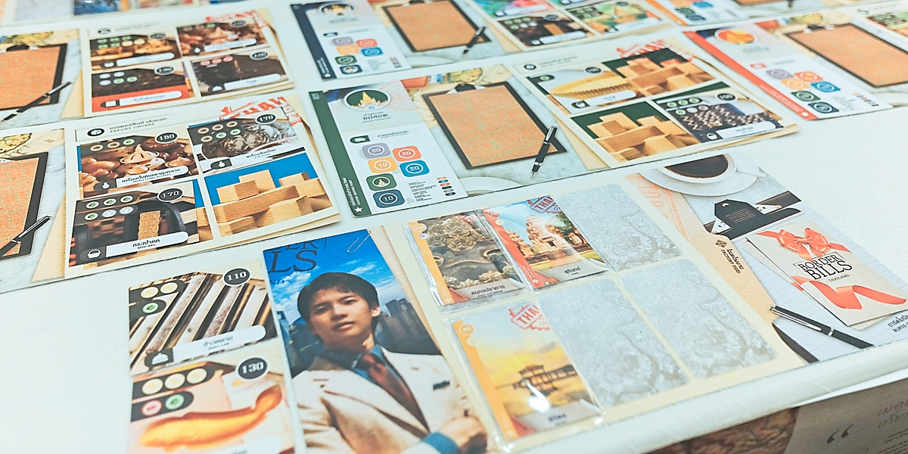

Border Bills เกมจาก Pradchaya Nadee (ไว้เดี๋ยวหาที่ติดต่อได้จะเอามาลงอีกทีนะ) เป็นเกมสไตล์ set collection ที่จะให้เราผลิตสินค้าไปขายทั่วประเทศ

---
.
คือก็ set collection นั้นแหละตานึงเราจะเลือกทำ 1 ใน 3 อย่าง นั้นคือจ่ายเงินตั้งโรงงาน (เป็น passive skill) หรือหยิบวัตถุดิบ หรือส่งของที่เรามีไปแลกเงินตามภูมิภาคต่างๆของประเทศ

.
ทวิสที่เกมนี้นำเสนอคือโรงงานของเราจะมีตำแหน่งภูมิภาคอยู่การไปส่งออเดอร์ในต่างพื้นที่เราจะต้องเสียเงินค่าขนส่งเพิ่มด้วยยิ่งไกลก็ยิ่งแพงทำให้เราได้เงินน้อยลง

.
จริงๆชอบไอเดียเรื่องตำแหน่งพื้นที่นะ แต่ปัญหาของเกมนี้เท่าที่เจอในตอนเล่นคือเราเล่น set collection เก็บของใช่มะ? ปกติคุณมีออเดอร์ตรงหน้ากี่ใบ? 3? 5? 7?  โอเคเกมนี้ให้คุณฉ่ำๆ 24 ใบ......สุ่มแบบไม่มีความหมายอะไร แต่กระจายไปยังบอร์ดภูมิภาคทั้ง 6 ที่ละ 4 ใบแล้วบอร์ดมันสีสันค่อนข้างฉูดฉาดก็เลยดูแล้วลายตาพอดู

.
ส่วนทรัพยากรที่ให้หยิบเองก็จะเป็นสุ่มมาให้หยิบซื้อแค่ทีละ 5 ใบถ้าไม่มีของที่อยากได้ก็ทำอะไรไม่ได้ นั่งมองหน้ากันไปแบบงงๆ คืออย่าง Splender มันก็จะมี pool กลางอะไรก็ได้แต่เกมนี้มี seed จากการสุ่มอย่างเดียว

.
จริงๆก็คุยกับนักออกแบบไปเหมือนกันหลักๆคือถ้าลดจำนวนการ์ดต่อภาคกับเรื่องตำแหน่งของเมืองหรือพวกโบนัสอะไรแบบนี้ให้มันกระทัดรัดขึ้นก็จะทำให้เกมน่าสนใจขึ้น พวก UI/UX ที่เหลือทางนักออกแบบก็ noted ไว้ละรอบขายก็น่าจะปรับแก้หมดแล้ว

---
.
เกมนี้เล่นในงาน TIBM - ตลาดนัดบอร์ดเกมอินดี้ ตัวเกมกำลังอยู่ในช่วง pre-order สนใจก็ติดต่อต้นทางได้ครับ

