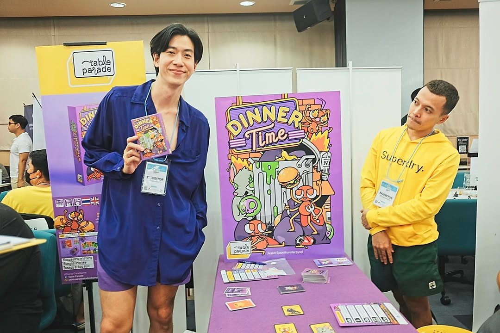
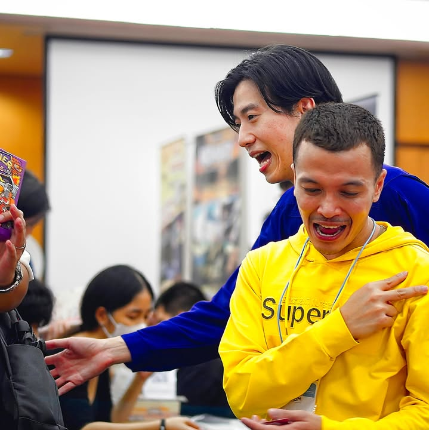

Dinner Time เกมปาร์นี้สไตล์บลัฟเพลินๆแนวหาพวกจาก Table Parade ที่ขายดีระดับ sold out ในงาน TBS 2023 เลยทีเดียว

---
.
เกมนี้เราจะถูกสุ่มออกเป็นสองทีมคือทีมหนูและแมลงสาบ จากนั้นเราก็จะมาคุ้ยหาอาหารจากกองขยะเพื่อทำคะแนนกัน! ฟังดูยี้ๆแต่เห้ยมันตลกจริง อาร์ดกวนๆ แมลงสาบก็ดูหน้าตาเหมือนมดมากกว่าไหมนะ?

.
แอคชั่นที่ทำได้หลักๆก็คือการส่งการ์ดในมือเข้ากองขยะตรงกลาง ซึ่งของหลักๆก็คือพิษที่เป็นอาหารของหนู และเบอร์เกอร์ที่เป็นอาหารของแมลงสาบ แต่ไอ้กองตรงกลางนี้ยังไม่ใช่แต้มนะ เราต้องมีใครซักคนทำแอคชั่นเพื่อขอดูกองขยะซักหน่อยว่ามีอาหารแนวไหนเยอะ และใครอีกซักคนที่ขอสุ่มเปิดกองขยะเพื่อให้ของที่ออกมาเป็นอาหาร(แต้ม)ให้กับทีม

.
คือพอสุ่มเปิดกองอาหารมาเนี่ยฝ่ายไหนได้อาหารฝั่งตัวเองครบจำนวนที่กำหนดก็จะชนะไป แต่เกมมีเลเยอร์ที่้ขยักอีกหน่อยว่ามันจะมีการ์ดจำพวกเป็นแต้มได้ทั้งสองฝ่ายด้วยแล้วแต่ว่าคนเปิดอยากให้เป็นของฝั่งไหนตรงนี้ก็จะเป็นการเผยตัวเองไปในตัว

.
ในเชิงกลยุทธ์เกมไม่ได้เน้นตรงนี้แต่มันก็มีการ์ดกวนๆเรียกความตื่นเต้นได้อยู่เหมือนกัน อย่างการลงการ์ดหมาเฝ้ากองขยะทำให้ใครก็ไปคุ้ยเปิดกองไม่ได้เพื่อยืดเกม หรือการ์ดเทศบาลที่จะมากวาดกองขยะทิ้งไปให้หมด ซึ่งมีประโยชน์มากเวลาคนก่อนหน้าดูแล้วเฟิร์มว่าโอเคไอ้ของที่มีเยอะๆในกองขยะไม่ใช่ของฝั่งเรา

.
คือมันไม่ใช่เกมบลัฟจริงจังน่ะ คือรู้ฝ่ายไปเกมก็ไม่ได้เปลี่ยนอะไร ก็ต้องใช้โหมดปั่นๆเล่นแบบถอดสมองวางไว้แล้วอินไปกับการบลัฟๆขิงๆมันก็ตลกดีแบบเห้ยทีมกรูมาแล้วๆๆๆ ไรงี้ เกมไม่ได้ยุ่งยากอะไรแอคชั่นก็มีแค่ยัดหรือเปิดเท่านั้นแหละ 

.
เอาจริงคือชอบในความคุมโทนของทีมงาน (หลายๆคนก็น่าจะคุ้นหน้าคุ้นตาคุณโจ๊กกับคุณตงอยู่แล้วจากใน BGN Squad) ผ้าปูโต๊ะ สีเก้าอี้ ยันคลิปบอร์ดจดออเดอร์สินค้า (ขาดแค่ปากกาแหละสียังไม่ตรง....)

.
เกมนี้ผมไปเล่นมาในงาน TIBM - ตลาดนัดบอร์ดเกมอินดี้ ครับ สนใจก็ไปสั่งจากเพจเค้าได้โดยตรงเลย เข้าใจว่าเป็น pre-order ที่ของกำลังมานะ

