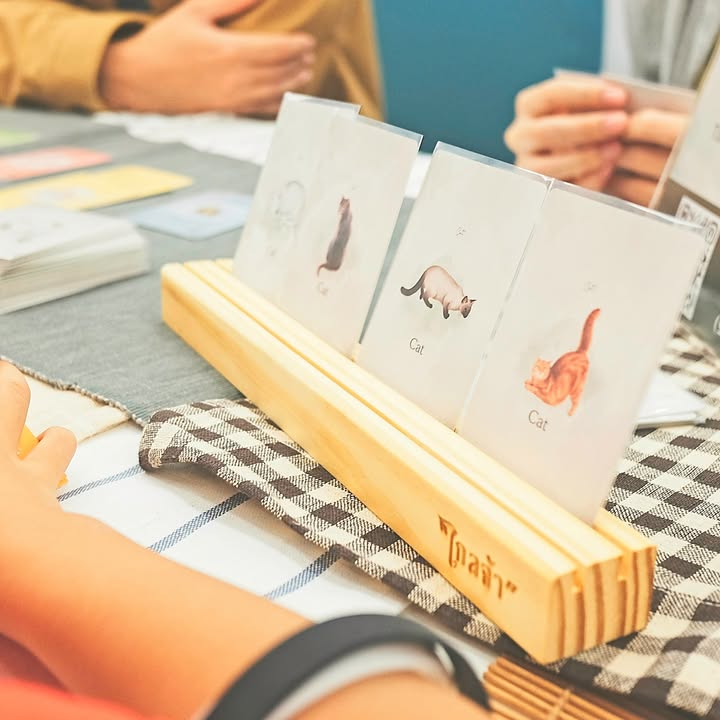
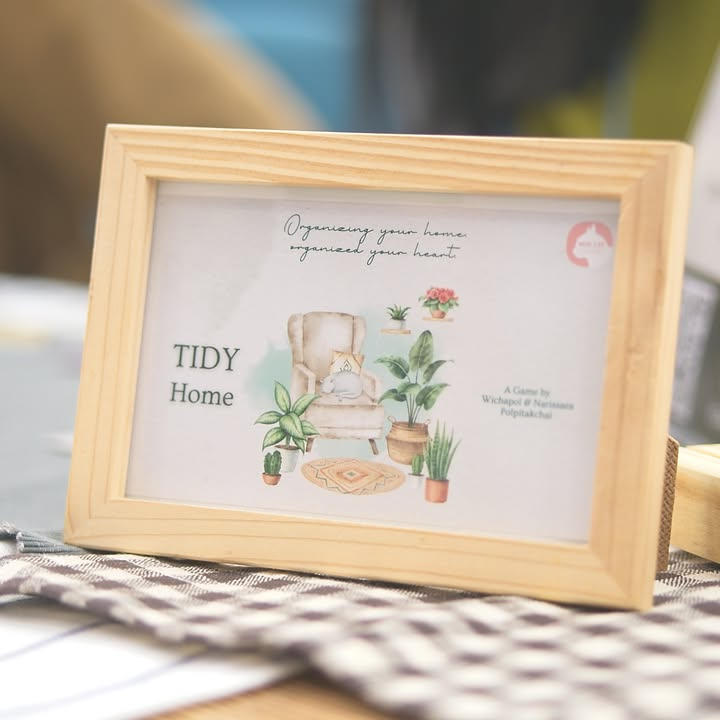

Tidy Home จาก Wise Cat Studio เป็นการ์ดเกมแนว hand management ที่จะให้เรามาทิ้งของรักออกจากบ้านรก .... แต่เห้ยไหงรวบของคนอื่นมาเก็บที่บ้านเพิ่มฟระ!!

---
.
ไอเดียคือเกมจะมีการ์ดสีอยู่ชุดหนึ่งและแต่ละชุดมีเลขเรียงไม่ซ้ำกัน หลังจากแจกการ์ดแล้วสิ่งที่เราต้องทำก็คือทิ้งการ์ดในมือไปตาหนึ่งละใบ

.
เวลาทิ้งมันจะเอาการ์ดสีเดียวกันไปเกาะอยู่ด้วยกันลงเลขน้อยไม่เป็นไรก็ทิ้งไว้ตรงนั้นแหละ แต่ถ้าดันเล่นเลขที่ใหญ่กว่าใบล่าสุดลงมาเราจะต้องรวบทั้งกองกลับมาเป็น 'แต้มลบ' ตรงหน้าเรา .... ก็นี้มันเกมทิ้งของให้บ้านมินิมอลสปาร์กจอยนินา

.
ทวิสอีกนิดหน่อยคือถ้าเราเก็บสีไหนเยอะสุดสีนั้นไม่นับเป็นคะแนนลบนะ ตรงนี้เกมมันเลยต้องวางกลยุทธ์หาจังหวะเหมือนกันว่าเราอยากจะลงสีไหนตอนไหนถึงจะไม่เจ็บตัว หรือถ้าจะเจ็บแล้วเราต้องเป็นอันดับหนึ่งให้ไม่ติดลบ!! 

.
ผมชอบนะสนุกดี มีต้องคิดดักทางกับเดามือคนอื่นด้วยจากเลขที่เหลือ ส่วนตัวติดนิดเดียวจริงๆคือชอบ layout ที่รูปแนวโคซี่ๆแบบใหญ่ๆเต็มใบมากกว่า อันนี้มันดูเล็กจนไม่รู้สึกอยากมาคลี่มองการ์ดแล้วเสพงาน หรือตอนเล่นเราก็ไม่ได้มีฟิลอยากพูดแบบขอทิ้งของรกบ้านหน่อยไรงี้ (แต่มันก็เกมสวมธีมอะนะ จะว่าอะไรมันก็นิดนึง) กับอีกเรื่องที่นักออกแบบจะหลุดเรื่องนี้กันประจำอยู่แล้วคือตัวการ์ดไม่ได้ทำสัญลักษณ์กำกับชนิดไว้ ใครตาบอร์ดสีก็จะเล่นลำบากนิดๆ

---
.
เกมนี้เล่นที่งาน TIBM - ตลาดนัดบอร์ดเกมอินดี้ สนใจก็ติดต่อกับต้นทางได้โดยตรงเลยครับ เหมาะกับสายเล่นเกมเล็กใช้ความคิดคั่นเวลา พรีตอนนี้แถมการ์ดแมว

