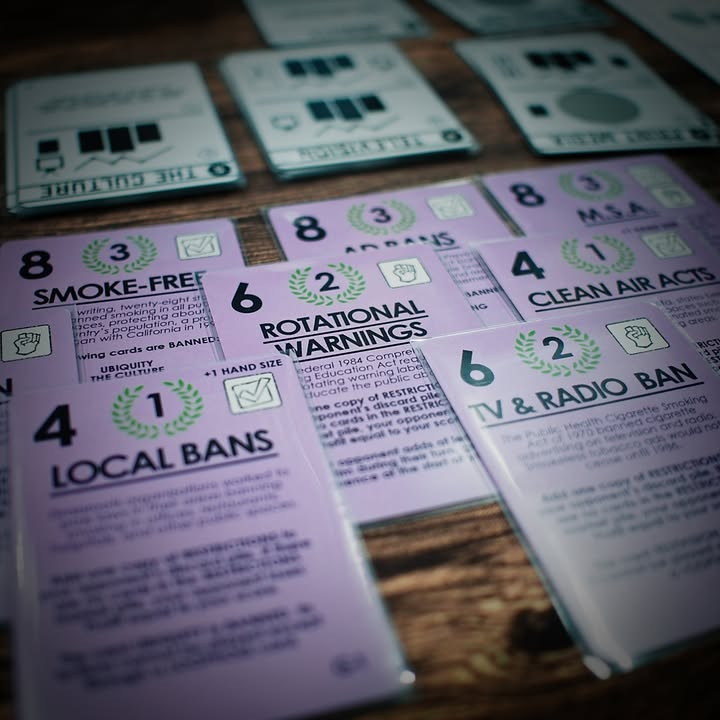
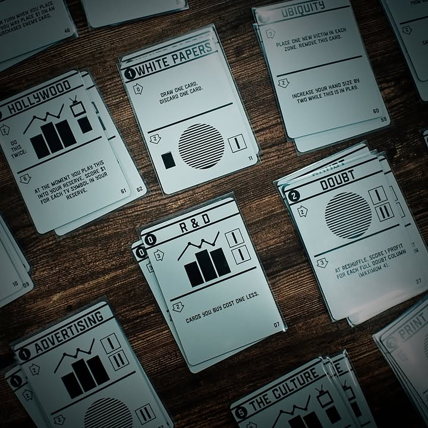

Doubt is our product - ยาสูบ: ธุรกิจที่การฆ่าลูกค้าผู้ภักดีคือกำไร #bite_size  
  
:  
"ความสงสัยคือสินค้าของเรา - เพื่อที่จะต่อสู้กับข้อมูลทางการแพทย์ (เกี่ยวกับพิษภัยของบุหรี่) ที่สาธารณะชนรับรู้ สิ่งที่พวกเราต้องทำคือสร้างความเคลือบแคลงสงสัยให้กับข้อเท็จจริงพวกนั้น" - เรียบเรียงจากคำพูดของผู้บริหารบริษัทยาสูบในปี 1969, ห้าปีหลังจากที่สมาคมการแพทย์ของอเมริกาได้สรุปออกมาว่าบุหรี่เป็นสาเหตุของมะเร็งปอด  
  
:  
verdict: เกมเฉพาะทางที่เล่าเรื่องใหญ่กว่าเกม อีกหนึ่ง experience เกมที่ชวนให้คนเล่นมาตั้งคำถามถึงธุรกิจยาสูบ  
  
:  
"I'm gonna be like you, Dad. you know I'm gonna be like you ...." ตัวผม (บอร์ดแล้วบ่น) ในวัยเด็กโตมากับ ads โทรทัศน์ชิ้นหนึ่งที่ฉายภาพเด็กฝรั่งคนหนึ่งกำลังนั่งดู vdo tape ฉายภาพตัวเองกับพ่อของเค้า ในทุกช่วงตัวเค้าและพ่อก็มีความสุขดี พร้อมกับบุหรี่ในมือพ่อของเค้าในทุกฉาก แน่นอนว่าตอนจบมันเดาไม่ยาก ฉากตัดไปโรงพยาบาล พร้อมกับการสื่อสารที่บอกว่าเสียชีวิตจากมะเร็งปอด
 
:  
ในฐานะของคนที่มีผู้ปกครองสูบบุหรี่ ผมเองในวัยเด็ก (จนโตมาถึงตอนนี้) ก็ยังไม่เข้าใจอยู่ดีว่าทำไมบุพการีผมยังคงสูบบุหรี่อยู่ (เคราะห์ดีที่ยังมีสุขภาพตามอัตภาพอยู่) และนักออกแบบ Amabel Holland ก็สงสัยเช่นกัน โดยเฉพาะเมื่อพ่อของเธอจากไปด้วยโรคมะเร็งปอดทั้งๆที่อายุยังไม่ถึง 40 ปี ความโกรธแค้น ความเสียใจ และความสงสัยก็ได้บ่มเพาะให้เกมนี้ถูกทำออกมา  
  
:  
ไอเดียของเกมนั้นเราจะแบ่งเป็น 2 ฝั่งคือฝั่งผู้ผลิตยาสูบและฝั่งนักรณรงค์ต่อต้าน โดยทั้ง 2 ฝ่ายเล่นกันคนละเกมเลย แน่นอนว่าฝ่ายทุนนิยมก็ต้องทำเงินให้ถึงจุดหมาย ในขณะที่ฝ่ายนักกิจกรรมก็ต้องเร่งผลักดันกฎหมายและทำกิจกรรมเพื่อลดปริมาณคนสูบรอจนฝ่ายทุนแพ้ภัยไป  
  
:  
พื้นที่ส่วนกลางที่ผู้เล่นสองฝั่งจะมาแย่งชิงกันคือตารางสถิติของผู้สูบบุหรี่ในช่วงวัยต่างๆ และสถานะความ 'สงสัย' ในช่วงวัยนั้นๆที่ทำหน้าที่เหมือนกับ 'เกราะ' ที่ทำให้การลดตัวเลขทางสถิติถูกหยิบออกได้ยากขึ้น โดยจำนวนผู้สูบก็คือจำนวนเงินที่ฝั่งผู้ผลิตยาสูบจะได้รับเพื่อเป็นเงื่อนไขในการชนะเกม

:
ในฝั่งผู้ผลิตการเล่นจะเป็นแบบ deck building ที่ตัวการ์ดมีความสามารถแนว multi-use อยู่ 3 อย่างคือเล่นเพื่อเอา effect, เล่นเพื่อเอา passive, และทิ้งเพื่อเป็นเงินในการเล่นและซื้อการ์ดใบอื่น โดยจุดที่น่าสนใจของเกมคือเราจะถูกบังคับให้ซื้อการ์ดจากกองกลางอย่างน้อย 1 ใบเสมอ ถ้าไม่ซื้อเราจะได้การ์ด restrictrion ทางกฎหมายใส่มาเป็น dead card น่ารำคาญในมือที่พร้อมจะผลาญเงินที่เราหามาได้ 

:
พวกแอคชั่นก็จะวนๆอยู่กับการเพิ่มจำนวนลูกค้าและชวนเชื่อให้คนไม่เลิกบุหรี่ง่ายๆ ทั้งตีพิมพ์เปเปอร์ปลอมๆ ฉายหนังฮอลลีวู๊ด ออกทีวี อะไรก็ว่าไป ความท้าท้ายก็จะอยู่ที่การบริหารการ์ดว่าจะเอา passive ตั้งไว้แค่ไหนก่อนที่จะ trigger เพื่อให้ได้ผลที่ทรงพลัง

:
ในฝั่งนักกิจกรรมจะเล่นแบบ tableau building ที่เราจะต้องหยิบการ์ดกิจกรรมต่างๆมาทำแอคชั่น ความน่าสนใจของระบบคือเวลาเล่นการ์ดมันจะเอามาต่อกันเพื่อทำโบนัส ในขณะเดียวกัน icon กิจกรรมมันก็เป็น engine ไปในตัว ซึ่งเราไม่สามารถทำแอคชั่นได้โดยตรงแต่จะทำได้ก็ต่อเมื่อเราไปซื้อการ์ดในตลาดที่มีเครื่องหมายแอคชั่นนั้นอยู่เท่านั้น และการ์ดจะไม่กลับมาเติมจนกว่าฝั่งยาสูบจะได้เล่นการ์ดของตัวเองจนหมดกองเสียก่อน

:
ในระหว่างเล่นอีกส่งที่นักกิจกรรมทำได้คือเก็บสะสมพลังในการโหวตเพื่อผลักดันให้ออกกฏหมายควบคุมยาสูบในรูปแบบต่างๆ ทุกครั้งที่ทำสำเร็จฝั่งผู้ผลิตยาสูบจะใช้การ์ดได้น้อยลงเรื่อยๆ ตรงนี้ก็ต้องไปทำสมดุลย์ระหว่างจะทำ engine ผลักดันกฏหมายเพื่อผลระยะยาวหรือจะเร่งออก campaign ระยะสั้นเพื่อลดจำนวนผู้เสพในตอนนี้ดี

:
เกมนี้มี design choice ที่น่าสนใจอีกอย่างหนึ่ง คือมีการทำให้ 'น่าเกลียดอย่างตั้งใจ' จากนักออกแบบเอง โดยเธอเล่าว่ามันง่ายมากๆเลยที่เธอจะเลือกใช้ภาพสวยงามเพื่อดึงดูดให้ผู้เล่น 'อิน' ไปกับเกม แต่ความขัดแย้งและความแตกแยกคือการเลือกที่ 'จงใจ' เพราะสิ่งที่เกมนี้ต้องการนำเสนอนั้นไม่ได้อยู่แค่ในเกมนั้นเอง และเกมเองก็ไม่ได้มาทำตัวเป็นสื่อการเรียนรู้ที่ต้องมายัดความน่ากลัวโน้นนี้ของยาสูบให้คนหลงประเด็น

: 
ในเชิงเกมอาจจะมองได้ว่าไม่ได้แข็งแกร่งสุดๆ แต่ตอนเล่นก็ไม่ได้รู้สึกว่ายวบยาบไม่เป็นเกมนะ มีการแข่งขันมีความกดดันในการแย่งชิง แต่ก็มีความรู้สึก disconnected ของสองฝ่ายเหมือนกันเพราะมันดูค่อนข้างยากว่าอีกฝ่ายกำลังทำอะไรในเกมของตัวเองแล้วมันจะมีผลอะไรในการแข่งขัน

:  
Amabel Holland เป็นนักออกแบบที่ผมมีโอกาสได้เล่นงานของเธอบ่อยในช่วงนี้ แล้วก็พบว่ามันมีอะไรที่น่าค้นหาอยู่ทุกครั้งในงานที่ทำออกมา อยากให้เปิดมุมมอง ลองเล่นแล้วซึมซับไปกับสิ่งที่นักออกแบบได้ค้นคว้าและพยายามนำเสนอมากๆครับ

:
ผมคิดว่าไอเดียของเกมนี้มันเปิดประตูนี้น่าสนใจที่นักออกแบบบ้านเราเองก็น่าหยิบไอเดียมาใช้เยอะอยู่นะ จริงๆเล่าเรื่องอย่างธุรกิจน้ำมัน,ก่อตั้งเหมือง,โรงไฟฟ้า, เขื่อน กับชาวบ้านและ ngo งี้

:
"The death of one man is a tragedy. The death of millions is a statistic." – Joseph Stalin." - ผมได้แต่หวังว่าตัวเลขทางสถิติของผู้สูบบุหรี่ในชาร์ทจะไม่มีหนึ่งในคนที่ผมรักอยู่ในนั้น

