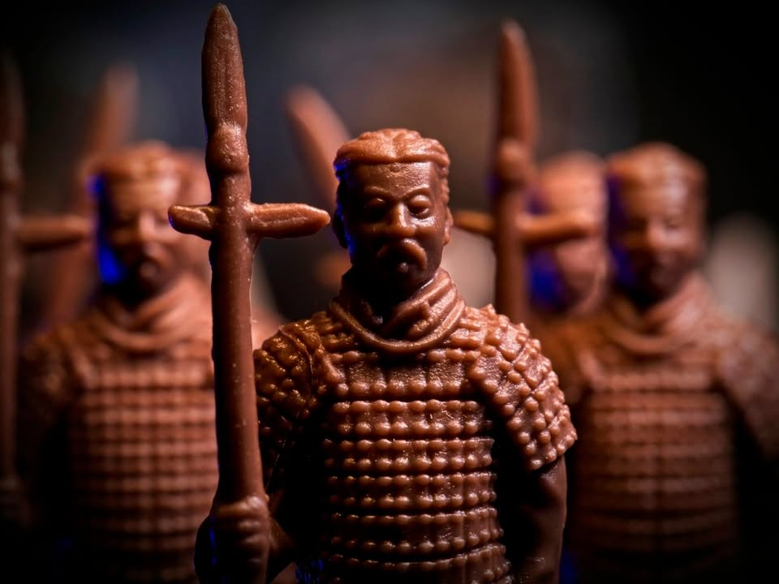
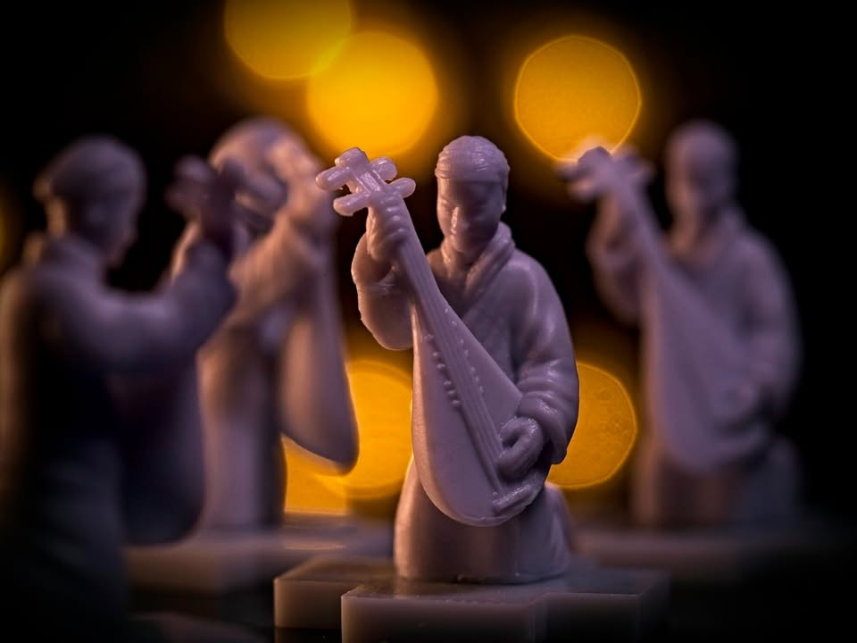
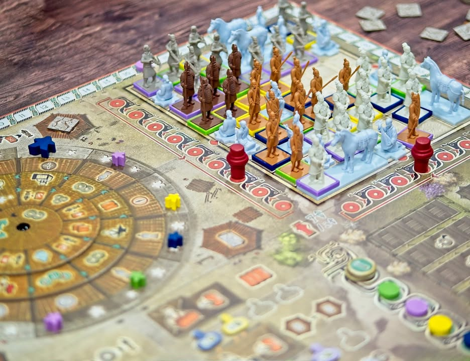

Terracotta Army #thought

จิ๋นซีฮ่องเต้คือนามของบุรุษผู้รวมแผ่นดินจีนเป็นหนึ่งตั้งแต่สมัย 200 ปีก่อนคริสตกาล ในยามที่ทรงสิ้นพระชน พระศพนั้นก็ได้ประดิษฐานไว้ที่สุสานหลวงอันยิ่งใหญ่ที่มีตุ๊กตาทหารเท่าตัวจริงนับพันคอยรับใช้ในโลกหน้า และเราจะได้เป็นหนึ่งในช่างฝีมือที่จะมาทำงานสร้างสุสานนี้ให้ลุล่วงไป ผลงานของ  Adam Kwapiński  (Nemesis, Lords of Hellas, Frontpunk) และ Przemysław Fornal  (Blossoms)

.
flow ของเกมจะแบ่งออกเป็นสองส่วนคือส่วนที่เราต้องไปเก็บของ (ดินเหนียว) กับส่วนที่เราจะต้องเอาดินเหนียวไปสร้างหุ่นเพื่อวางในสุสาน การทำแอคชั่นจะเป็นกลไก worker placement แบบที่ช่องแอคชั่นที่จะทำได้นั้นจะหมุนส่วนผสมไปมาได้ ทำให้การทำแอคชั่นในแต่ละรอบมี combination ที่ไม่ตายตัว

.
ตัวช่องแอคชั่นที่เราจะลงได้เนี่ยมันจะมีแผ่นหมุนวงกลงอยู่สองชั้นทำให้มีช่องแอคชั่นซ้อนกันอยู่สามขั้น เราเอาคนงานไปลงตรงไหนก็จะได้ทำสามแอคชั่นนั้นจากในมานอก ซึ่งแอคชั่นหลักก็คือเก็บดินเหนียวกับเอาดินเหนียวไปสร้างหุ่นนั้นแหละ เกมมีกิมมิคตรงนี้นิดหน่อยว่าเราสามารถจ่ายเงินเผื่อขยับวงในหรือวงนอกได้คลิกนึง ก่อนที่จะทำแอคชั่น

.
ระบบการลงคนงานในเกมมันจะเป็นบล๊อกกันตามแบบ worker placement มาตราฐาน แต่ว่ามีทวิสนิดหน่อยตรงที่คนงานมี 2 ขนาด คือเราสามารถเอาตัวใหญ่ไปวางทับที่ๆมีคนงานตัวเล็กใช้ไปแล้วได้ทีนึง โดยที่ตัวใหญ่เนี่ยต้องเสียเวลาไปลงช่องอัพแรงค์เอา ตรงนี้คนอาจจะคิดว่ามีตัวใหญ่ไว้เยอะก็ดีกว่าสิ? แล้วไปแย่งลงกัน แต่เท่าที่เล่นมาตัวเล็กล้วนก็ชนะได้นะ แค่มีตัวใหญ่ซักตัวมันก็ช่วยให้เล่นสะดวกขึ้น กับเกมนี้เดินตามแนว wp สมัยใหม่ตรงนี้ผู้เล่นทุกคนมีจำนวนคนงานเท่าเดิมทั้งเกม

.
ในส่วนของการวางทหารดินเผาเนี่ยเกมจะเบสออนอยู่กับการที่ผู้เล่นอยากจะวางทหารติดกันเป็นกลุ่มเพราะยิ่งกลุ่มมีทหารจากผู้เล่นหลายคนแต้มตัวคูณก็จะเยอะขึ้น ตัวทหารมีสี่ชนิดซึ่งก็มีความสามารถเสริมนิดหน่อยแต่ไม่ได้มีสาระสำคัญนัก หลักๆจะอยู่ที่การบริหารว่าอยากจะสร้างทหารเกาะกลุ่มดีหรืออยากจะเลือกสร้างบางตัวเพื่อไปอยู่ในตำแหน่งที่จะได้แต้มพิเศษประจำรอบดี 

---
🐸 [กบโอเค]
---

.
ความดีของเกมนี้คือมันเป็นเกมที่ให้ความรู้สึกแบบ solid euro ยุคก่อนที่จะเน้นที่กลไกหลักแค่ 1-2 อย่างแล้วให้เราโฟกัสอยู่ตรงนั้น ไม่ใช่แนวที่จะต้องทำให้แปลกๆเยอะๆเข้าไว้แบบสมัยนี้ ซี่งตรงนี้ไม่ใช่เรื่องที่จะทำได้ง่ายๆเพราะถ้าคุมไม่ดีจะน่าเบื่อทันที ซึ่งเกมนี้ทำออกมาได้ค่อนข้างดี

.
ความสนุกหลักๆจะเน้นทีแผนการระยะสั้นในการเลือกลงแอคชั่นว่าจะทำอะไรดีตามแบบฉบับ worker placement ทั่วไป จุดเด่นหนึ่งคือเกมนี้ทรัพยากรมีแค่ 2 อย่างทำให้เราไม่โดน distract มากนักว่าจะต้องทำอะไรดี (แต่ถูกกดดันด้วยช่องแอคชั่นที่มีอยู่อย่างจำกัด)

.
ตัวเกมมีระบบบริหารทรัพยากรที่น่าสนใจอยู่ตรงที่ดินเหนียวที่พร้อมใช้จะมีสภาพเปียก แต่ถ้าพ้นรอบไปมันจะแห้ง เราก็ต้องไปทำแอคชั่นผสมน้ำให้มันกลับมาพร้อมใช้ใหม่ แต่เราก็สามารถไปอัพเกรดช่างฝีมือให้รักษาดินเหนียวไว้บางส่วนได้ด้วย ตรงนี้ก็ทำให้เกมมีจังหวะการปรับสภาวะทรัพยากรที่น่าสนใจเหมือนกัน

.
ส่วนที่ไม่ค่อยชอบนักคือระบบทำแต้มแบบเกาะกลุ่มที่เอาจริงๆมันค่อนข้างมั่วมากกว่าจะเกิดจากการวางแผนมาตัดกัน คือพอมีคนนึงไปสร้างตัววางไว้อีกคนสองคนก็ต้องมาเกาะกลุ่มตาม แบบมันหาเหตุผลที่คนอื่นจะมาช่วยกันรุมบล็อกให้ผู้เล่นคนหนึ่งแต้มหายไม่ได้เลย ตรงนี้ทำให้ความมิติเรื่อง position placement ของเกมมันน้อยไปหน่อย ไปอยู่ที่ objective ประจำรอบมากกว่าว่าจะทำให้เราอยากสร้างอะไรตอนไหน

.
แต่ก็ไม่ได้หมายความว่ามันจะมั่วซั่วนะ คือมันก็มีเหลี่ยมมุมในการทำแต้มที่เราต้องวางแผนในการมาแย่งทำ position อยู่เหมือนกัน เพียงแต่เกมมันสัดส่วนของความ 'หน้างาน' ที่ชัดเจนเอามากๆ แต่เกมมีแอคชั่นให้ทำน้อยทำให้มันไม่สามารถกลับตัวแก้ทางกันได้ อารมณ์ว่าถ้าโดนดักทางมาก็จะกำหมัดหน่อยๆ

.
อีกส่วนที่ไม่ค่อยชอบนักก็จะเป็นระบบแต้มจากผู้ตรวจการที่จะมีสองตัวเดินตามแนวตั้งและแนวนอน หยุดอยู่ที่ไหนก็จะเช็คว่าใครมีตัวเยอะสุดตรงนั้น ซึ่งมันควบคุมอะไรไม่ได้เลยเพราะมีวิธีอยู่หลายทางเดี๋ยวก็เดินหน้าเดินหลัง ตรงนี้ยิ่งไปเสริมให้ตำแหน่งการวางหุ่นมันไม่ต้องคิดอะไรเยอะเข้าไปอีก คือไอเดียตอนเล่นมันดีนะ แต่รู้สึกมันคุมยากเกินไปดักอะไรไม่ได้ ออกแนวปล่อยๆไหลไปละกัน

.
ส่วนกลางๆคือด้วยความที่ช่องแอคชั่นมันหมุนดิ้นได้นิดนึงช่วยให้เราเล่นง่ายขึ้น แต่ในอีกความหมายก็คือกว่าจะมาถึงตาเรา combination ที่เล็งไว้อาจจะไม่อยู่ล่ะเพราะโดนคนก่อนๆหน้าหมุนไปหลายคลิกแล้ว ตรงนี้ทำให้มิติในการวางแผนเลือกแอคชั่นมันคิดได้ยาก แถมเพิ่ม downtime ให้เกมด้วย

.
ในแง่ presentation เนี่ยเอาจริงๆมันก็เกมวางไทล์นั้นแหละ แต่ปรับมาเป็นทหารสวยๆ (จากมาตราฐานยูโรบ้านๆ) แทนคุณภาพมินิไม่ได้ดีมากอะไรยืนเบี้ยวๆก็หลายตัวแต่โดยรวมก็ให้บรรยากาศของการได้วางทหารในสุสานอยู่หน่อยๆนะ

.
เกมนี้ถือว่าเป็นตัวที่น่าจับตามาคู่กับ Tiletum ที่ออกมาพร้อมกันในปี 2022 ตรงที่มันเป็นการออกแบบทรงเกมยูโรยุคคลาสสิค ข้อดีมากๆคือระบบเกมมันมักไม่วุ่นวายมาก ทุกคนเน้นทำเรื่องเดียวกัน ซึ่งการออกแบบเกมสไตล์นี้ไม่ง่ายนักเพราะระบบมันถูกใช้กันจนเกร่อหมดแล้ว (เกมใหม่ๆถึงต้องไปใช้วิธีทำให้มันยุ่งยากขึ้นแทน) สำหรับขายูโรก็ถือเป็นอีกเกมที่ติดชั้นไว้ก็ดีตรงรื้อกติกามาอ่านง่ายดี สอนง่าย เพียงแต่พลังในการอยากกางซ้ำแก้มือมันไม่สูงเพราะความ tactical ในแบบที่เล่นซ้ำก็ไม่ได้รู้สึกว่าตัวเองเล่นเก่งขี้น แต่เนื้อเกมก็สนุกนะ

-----------------------------------------

😍 กบโปรด - อวยไส้แตก ยากมากที่เล่นแล้วจะรู้สึกไม่สนุก
.
😁 กบชอบ - พร้อมจะเล่นตลอด 
.
🙂 กบโอเค - ชอบในบางแง่มุม แต่อาจจะเล่นไม่บ่อยหรือเล่นแค่บางอารมณ์
. 
😐 กบเฉย - ไม่ได้เกลียดอะไร ถ้าไม่มีตัวเลือกอื่นก็เล่นได้อยู่
.
🖕 กบไม่เล่น - ไม่ตรงจริต (ไม่ได้แปลว่าห่วยหรือไม่ดี) ขอเล่นเกมอื่นล่ะกัน
.
อนึ่ง : เป็นความรู้สึกในความ "อยากจะหยิบมาเล่นไหม?" ของผมเอง ไม่ได้เกี่ยวอะไรกับคุณภาพของเกม ดูให้เป็นแค่ "อีกความคิดเห็นหนึ่ง" เท่านั้นก็พอนะครับ :)
.
ข้อเขียนที่ยาวหน่อยถ้าใน fb อ่านยากสามารถไปอ่านใน boardnbon.wordpress.com ได้ครับจะจัดหน้าดีกว่านี้
-------------------------------------------

