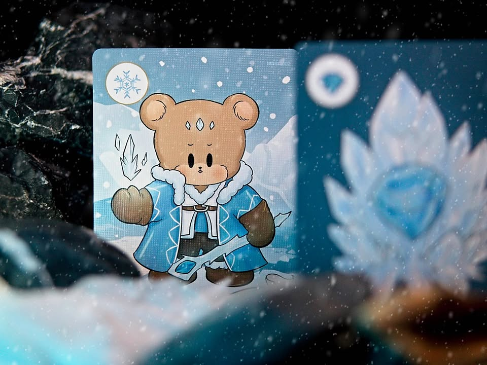
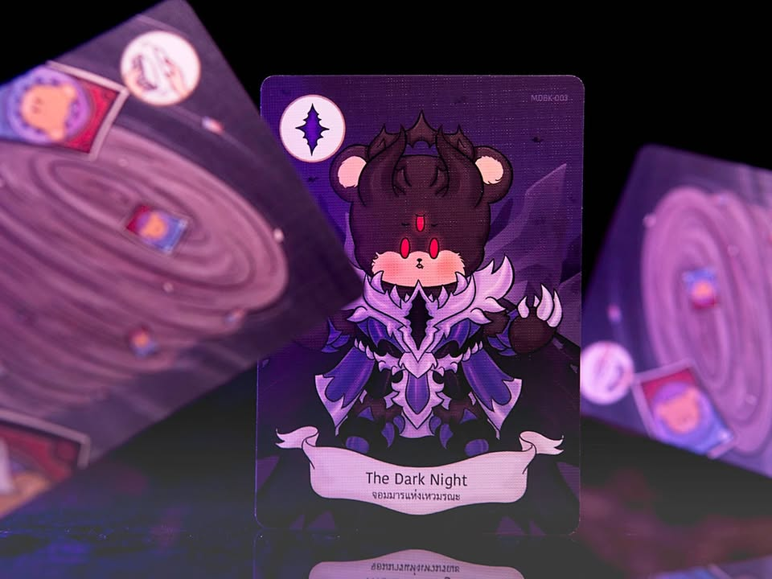
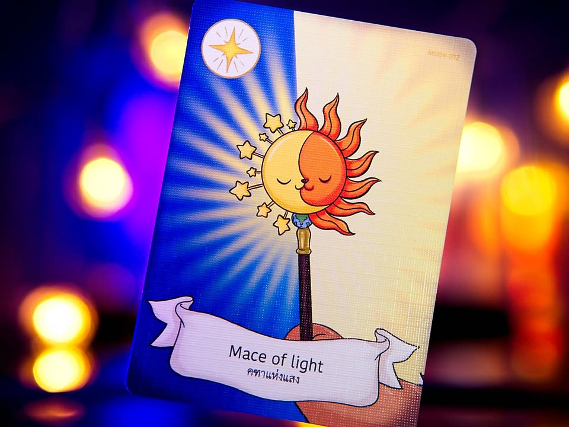
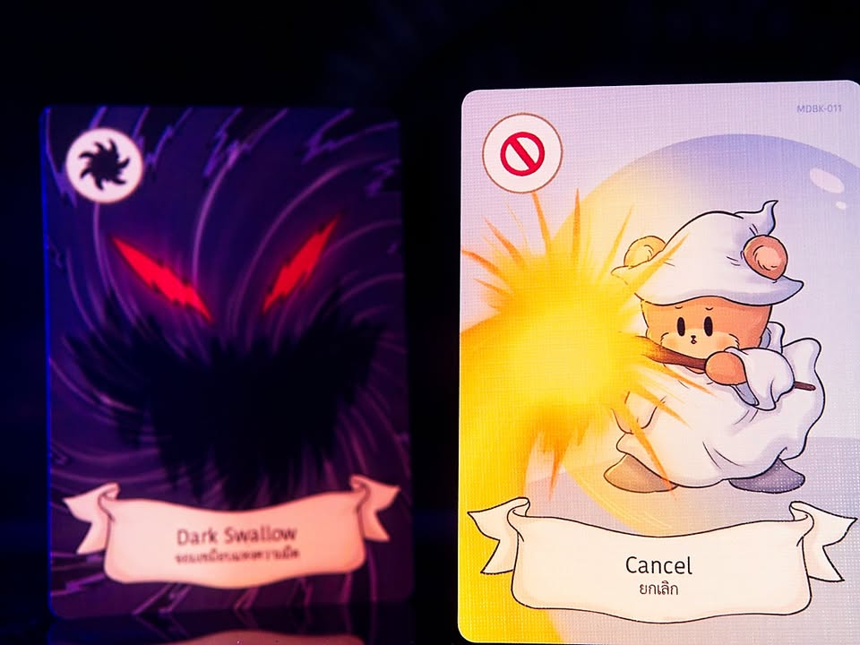
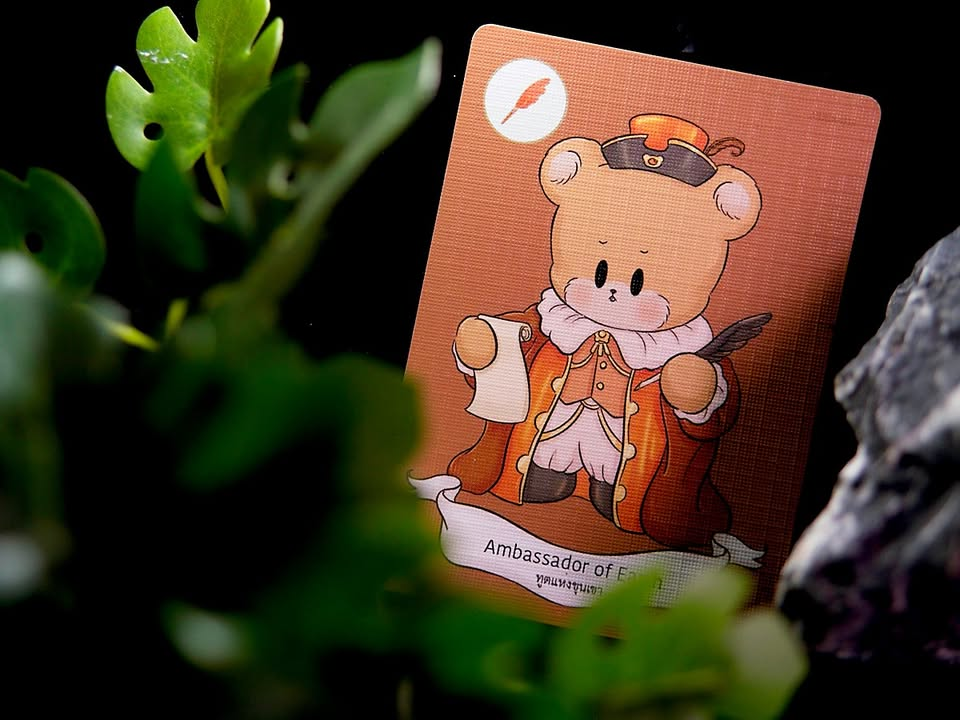
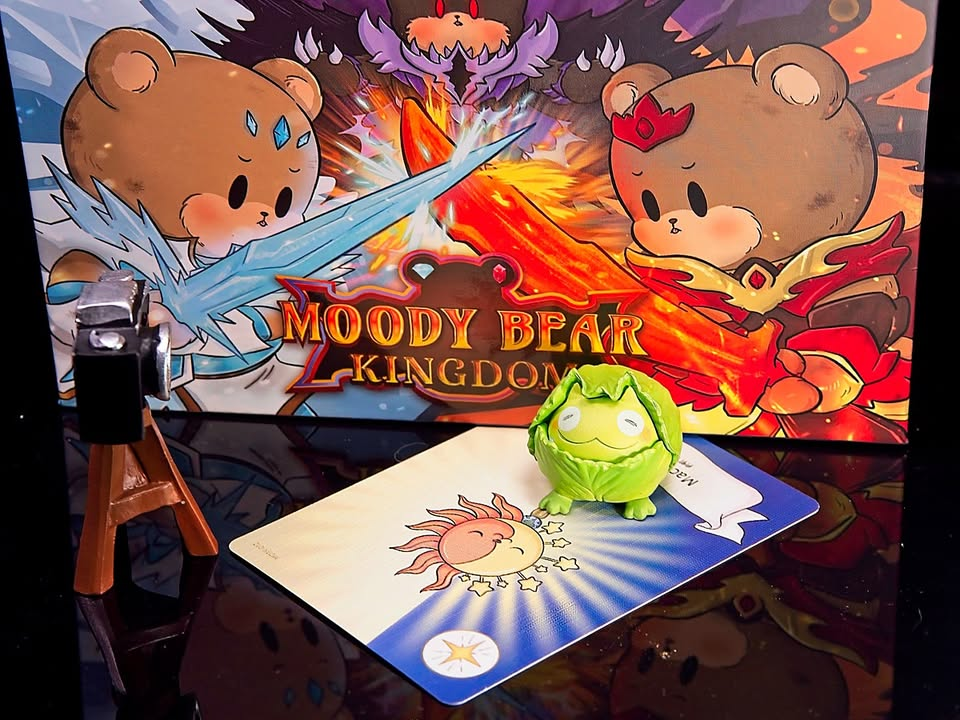

Moody Bear Kingdom

.
งงเหลือหลายอยู่ดีๆมีเกมมาแจก (นั้นมันสโลแกนเพจอื่น!) สนใจข้ามไปอ่านด้านล่างได้เลย

.
มันยากมากที่คุณจะอยู่ในโลก internet แล้วไม่เคยเจอผลงานของคุณ Tum Ulit ผ่านตา ด้วยเอกลักษณ์การวาดรูปและเรื่องราวในการสื่อสารที่มักตบท้ายด้วยการหักมุมขายของได้อย่างสวยงาม (นี้คำชม อันไม่ขายของเค้ามีเยอะ!) แต่นั้นแหละด้วยการเล่าเรื่องที่ไร้คำพูดและสามารถสื่อสารได้ในระดับสากลทำให้คนติดตามเค้ามีอยู่ทั่วโลกผู้ติดตามหลักล้านไปแล้ววว

.
กลับมาที่เรื่องหลักคือตัวเกม Moody Bear Kingdom เป็นผลงานออกแบบของนักออกแบบไทย Songsit Phraephet ค่าย Wise Box เจ้าเดียวกับ V-virus 

.
ไอเดียของเกมคือเราจะถูกแบ่งเป็นทีมพี่หมีสองทีมคือทีมไฟกับน้ำแข็ง ระหว่างเล่นนี้ไม่มีใครรู้ว่าใครเป็นใคร เราก็จั่วเล่นการ์ดทำโน้นนี้ไป แต่ว่าระหว่างนั้นเราก็จะต้องมองหาการ์ดผลึกน้ำแข็ง/ไฟ ประจำทีมด้วยเพราะว่าการที่ทีมเราจะชนะได้จะต้องรวบรวมการ์ดพวกนี้ให้ได้ครบ 3 ใบก่อนประกาศชัยชนะ โดยต้องทำก่อนที่การ์ดจะหมดกองเพราะความมืดมิดมันได้มาบุกอาณาจักรแล้วววววว 

.
แน่นอนว่าตอนประกาศถ้าชี้เพื่อนไม่ถูกคนหรือถูกคนแต่ของดันไม่ครบ (อ้าว) ทีมก็แพ้ไปนะ ซึ่งเกมมีทีมโดดเดี่ยวด้วย เป็นหมีสีดำที่ชนะได้ด้วยการถ่วงเกมให้มันจบไปนั้นเอง

.
เกมนี้หาพวกได้หลักๆสองแบบคือการ์ดดูบท กับอ่านท่าทางของไอ้พวกที่ดูบทแล้วเพราะว่าเกมนี้มันส่งการ์ดให้กันได้ โดยการ์ดที่ส่งก็มักจะเป็นพวกผลึกประจำทีมที่เอาไว้ดูท่าทางคนรับกับท่าทีหลังจากนี้เอาอะไรแบบนั้น แบบเอะตอนแรกคุยกันดีดูบทล่ะใบ้กินเลย เราก็จะเริ่มตัดตัวเลือกได้

.
ส่วนการ์ดอื่นๆที่ไม่มีความสามารถก็มีวิธีการใช้ที่ฉลาดดีนั้นคือการเอามาผสมกันได้ จับคู่เหมือนก็ท่านึง จับสลับก็อีกท่านึง จับสามประสานก็ได้อีกท่าหนึ่ง ตรงนี้ก็เลยลดความอารมณ์งงงวยเวลาเล่นเกมจั่วไอเทมโง่ๆแล้วไม่รู้จะใช้อะไรดี โดยที่ความสามารถก็ไม่ได้ซับซ้อนอะไร พวกดูมือ ส่งของไรงี้

.
จุดที่สงสัยจริงๆก็มีนิดหน่อยตรงหมีอารมณ์มู๊ดดี้มันอยู่ตรงไหน แล้วเกี่ยวอะไรกับเกมฟระ? 

.
อารมณ์ส่วนตัวตอนเล่นแล้วแบบคิดเลยว่า มันมั่ว!! มั่วฉิบหาย ชีวิตอยู่กับการมองสายตาเพื่อน เป็นเกมที่ต้องมาเล่นด้วยอารมณ์เอาฮาพร้อมบวก คือมันมีวิธีชี้ขาดได้น้อยมากว่าใครเป็นใครกันแน่ แต่ไม่ทันได้รู้จริงๆอ้าวเกมจะจบแล้วเพราะเกมมันไวมักตามสไตล์เกมปาร์ตี้ ต้องเน้นดูบรรยากาศเอา ตัวการ์ดชนะแม่มอยู่ครบไม่ครบไม่รู้ต้องประกาศก่อนแล้วโว๊ยยยย ใครสายพินิจพิจารณาอ่านนัยยะเยอะๆนี้หลบไปได้เลย ส่วนใครสายฮาก็มาได้กับเกมนี้

.
ซึ่งถ้าเกมทรงๆนี้แล้วอยากได้การตัดข้อมูลหรือมีเวลาอ่านเกมที่ขยับขึ้นมาหน่อยผมแนะนำเกมโปรดที่ไม่เคยบิ้วติดได้แก่ Die Kutschfahrt zur Teufelsburg เป็นเกมหาพวกในดวงใจที่หาคนเล่นด้วยยากหลาย เกมเหมือนกันมากมีการไล่เก็บของประจำทีม มีการแลกของ มีการโหวตดูบทพร้อมสับขาหลอก เพิ่มเติมคือมีความสามารถพิเศษและการ์ดไอเท็มล้นๆ ตอนฟังกฎนี้นึกว่าโอ้วนี้มันเกมโปรดในร่างใสๆมุ้งมิ้งแล้วพาตัวเองเป็นเกมเอาฮานิหว่า 

.
ส่วนกิจกรรมแจก ที่จริงๆแล้วขี้เกียจคิดฉิบหายแต่เอาเป็นว่าทำหนึ่งในสองเงื่อนไขนี้ละกัน คือฝากแชร์โพสเป็นสาธารณะ หรือเม้นหน่อยว่าเกมแนวแบ่งทีมหาพวกเกมไหนที่คุณชอบกัน ก็จะสุ่มแจกให้ 1 กล่องครับ ตัดรอบซัก เที่ยงคืนวันที่ 14 กพ. วันวาเลนไทน์ละกัน หรือถ้าสนใจเกมหรืออยากสะสมผลงานของนักวาดก็ติดต่อโดยตรงกับค่ายหรือร้านที่ท่านชอบได้เลย 

[disclose]
.
เกมนี้ค่ายไม่ได้ส่งมาให้ เพราะคงกลัวโดนเผา.... แต่หารู้ไม่ว่าฝ่ายประสานงานจากฝั่งศิลปิน ซึ่งเค้ามาจากไหนไม่รู้แต่ที่แน่ๆไม่รู้จักบอร์ดแล้วบ่นแน่นอน ทักมาตอนตีหนึ่ง พร้อมกับส่งแกร็บมาให้ตอนตีสองบอกเพราะค่าส่งถูก ด้วยความนอนไม่หลับเลยถ่ายรูปมันให้เสร็จตอนตีสาม แล้วตื่นมาโพสเอาบ่ายๆเนี่ยแหละ โดยนอกจากเกมที่ส่งมาแบบไม่มีค่าใช้จ่ายแล้วผมไม่ได้รับการตอบแทนอื่นใด แต่ด้วยความที่พื้นมันเกมไม่กบ ความเห็นก็จะใส่ฟิลเตอร์ใสๆหน่อยอ่ะนะ ส่วนรีวิวที่เขียนเร็วนั้นไม่ได้นั่งเทียนมโนมาแต่เพราะไปเล่นมาแล้วววววที่งานบอร์ดเกมอินดี้

