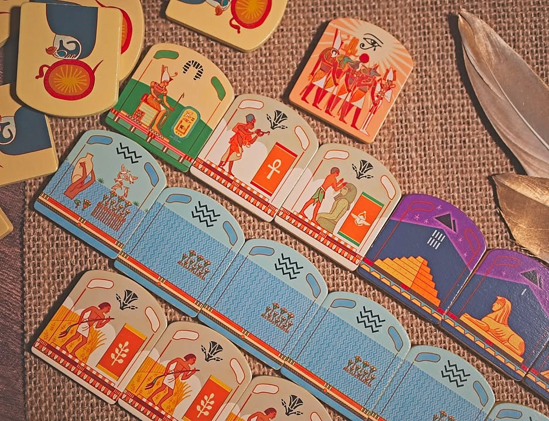
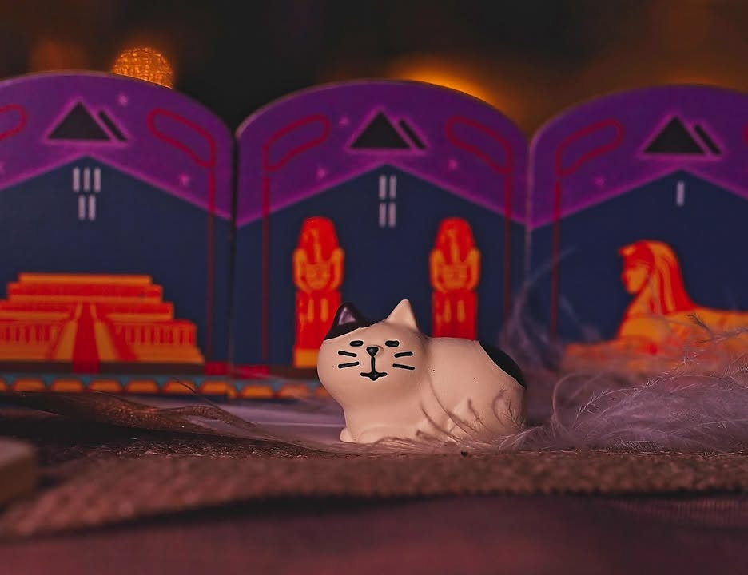

RA: Deluxe Pharaoh Edition #bite_sisze 

.
เขียนสั้นๆเพราะเกมมันไม่ได้ซับซ้อนอะไรอันนี้เป็นตัวครบรอบ 25 ปีของเกมประมูลขี้นหิ้งจากนักออกแบบที่น่าจะทำเกมออกมาเยอะสุดในโลกอย่าง Reiner Knizia

.
เกมนี้เป็นเกมประมูลเพื่อมาจัด set collection ทำแต้ม ไอเดียที่น่าสนใจคือการประมูลนั้นเราจะมีป้ายราคาแค่คนละ 3 ไทล์เท่านั้น

.
ในระหว่างเล่นเราจะเลือกแค่ให้จั่วไทล์เพิ่มเข้าไปในกองกลาง หรือจะทำการเคาะเพื่อเริ่มการประมูล คนในวงก็จะเสนอเลขที่มีอยู่มาสู้ออกเลขสูงก็ชนะกวาดของทั้งกองไป เล่นกันประมูลกันหมดหรือว่ามีการจั่วไทล์ เทพ RA โผล่มาจำนวนหนึ่งก็จะตัดจบรอบไป ส่วนไทล์ประมูลใครชนะแล้วจะใช้อีกไม่ได้ หรือก็คือชนะได้ไม่เกิน 3 ครั้งต่อหนึ่งรอบย่อย

.
ทวิสที่ทำให้เกมง่ายแต่เจ๋งมีสองอย่าง

.
อย่างแรกคือไทล์ราคาที่เป็นเลขตายตัวไม่ซ้ำและเป็นข้อมูลเปิด ตรงนี้มันมีทวิสที่สำคัญคือพอเราประมูลชนะเราจะต้องแลกเลขที่ชนะของเรากับเลขตรงกลางเอาไว้เล่นรอบหน้า ซึ่งมันทำให้เกิดมิติว่าชนะกองนี้ก็จริงแต่เลขที่ได้ไปเล่นรอบหน้าก็อาจจะไม่สูง

.
อย่างที่สองคือมันมีไทล์พังของ ที่ถ้าประมูลชนะมาแล้วต้องพังของทิ้งตาม ทำให้มูลค่าของกองนี้ในแต่ละคนไม่เท่ากันขี้นอยู่กับว่าสะสมอะไรมา

.
ส่วนของให้หยิบก็ทรงๆ set collection มีทั้งแบบให้แต้มเยอะในรอบ, นับแต้มตอนเดียวเวลาจบ, ถ้าไม่มีจะโดนลดแต้ม หรือมีเยอะสุดได้แต้ม ไรงี้ ซึ่งมันทำให้เกมมีมิติในการเลือกหยิบของเข้าชุดกัน

.
จริงๆอีกอันก็คงเป็นความลุ้นของการจั่วเพื่อหวังว่าของจะเข้าชุดกองใหญ่โดยที่ไม่โดนจั่วเทพ RA จนจบรอบไปซะก่อนด้วย

.
ตัวรุ่น Deluxe นี้คืออุปกรณ์และฟิลลิ่งคือดีงามตามราคา ไทล์ไม้ลงสีสวย เงินเหล็กสองสีรมดำมาด้วยไม่สะท้อนแสงแสบตาเป็นทองเก๊ 

.
ในบรรดาเกมประมูลที่มีออกมาเยอะมากของนักออกแบบคนนี้ผมชอบ Ra มากสุด (ไม่รู้ทำไมแต่ผมไม่ค่อยชอบ Modern Art เท่าไรนัก) สำหรับผมเองมันเป็นเกมที่มีคุณค่าและ Timeless มากพอที่จะซื้อตัวสวยๆเก็บไว้เหมือน Ticket To Ride 10/15 ปีไรงี้ (จริงๆ Catan 3D ก็สวยดีนะ แต่เห็นราคาครบชุดแล้วม่ายไหวจริงๆ ยิ่งนึกไม่ออกว่าจะกางเล่นกะใครเนี่ย)

.
แต่ว่ากันตรงๆอันนี้มันสำหรับนักสะสม อยากเล่นจริงๆไปเอากล่องธรรมดาหรือรุ่นเก่าก็ได้ (หรือไปซื้อการ์ดเกม Razzia! ก็ได้มีแปลไทย แล้วก็เล่นเหมือนกัน)  คืออย่าไปคาดหวังว่านี้มันคือสุดยอดเกมเดี๋ยวจะแป๊ก เพราะเกมมันสนุกในสโคป 'เกมเบาเล่นเพลินๆ 45-60 นาที' แค่นั้นแหละ 

--------------------------------
หมวด Bite Size (พอดีคำ) นี้กะว่าจะเขียนอะไรสั้นๆประมาณนี้ล่ะกัน ใหม่บ้าง ซ้ำบ้าง เกมที่ขี้เกียจเขียนบ้าง เขียนๆไว้ก่อนเผื่อมีอารมณ์อาจจะขยายไปลง Thought บ้าง จริงๆอยากเขียนสั้นกว่านี้ แต่ยังอดไม่ได้ที่จะต้องอธิบายอะไรเพิ่มตามนิสัย เดี๋ยวค่อยๆปรับไปล่ะกัน

[non-sponsered post : ซื้อเองราคาเต็ม]

