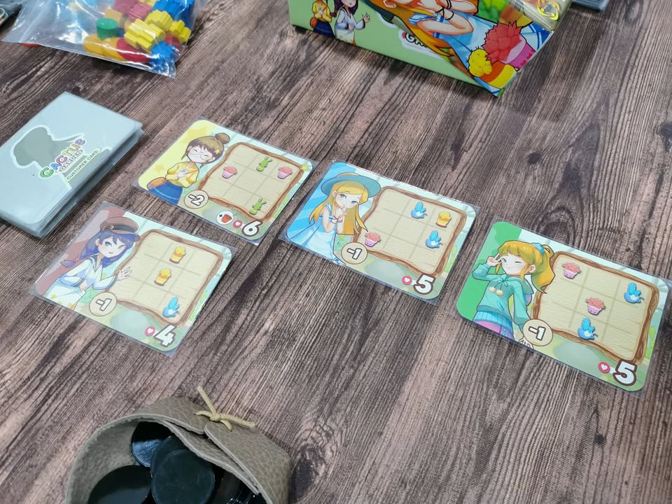
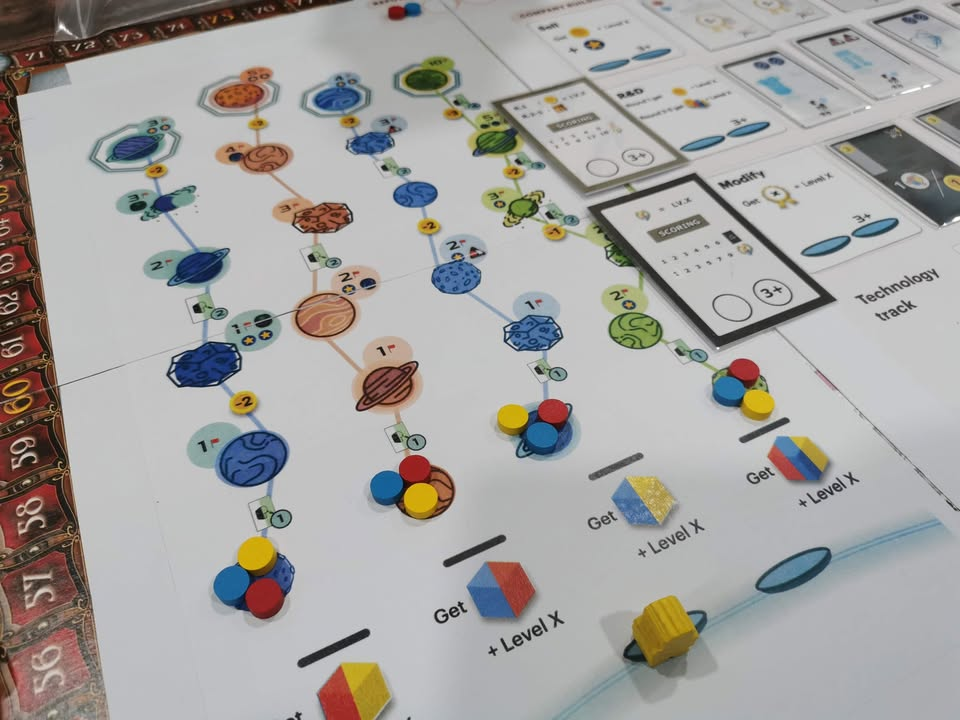

วันนี้คาเนเซียเมืองไทย DNR Boardgame หยิบเอาเกมมาให้ลองเทสไปหลายเกมอยู่

.
Splender Killer v3 (Cactus) : เกมในจักรวาลคาเฟ่แมว(ผมตั้งเอง) เป็นเกม set collection ที่การ์ดมี 2 function คือตอนหยิบมาเป็น resouces เอาไว้ซื้อการ์ดอื่นอีกที จุดเด่นก็คือต้องมีการใช้แอคชั่นเผื่อเดินไปมาด้วย จริงๆก็คิดว่าสมบูรณ์ล่ะ ให้สนุกกว่า Meow และคือๆกับ Elements แต่ยังอยากได้อารมณ์ที่ควบคุมการ์ดที่ออกมามากกว่านี้อีกนิดนะ

ชายคนนี้อีกหน่อยจะมีฉายาศิษย์อูเว่ตามหลัง เพราะมีความหมกมุ่นอยู่กับการทวิสและทดลองกลไกเดิมๆในรูปแบบต่างๆ (นี้เรียกข้อดีนะ) 

.
Nova Luna Killer v1 (เห็นว่าโดนค่ายฉกไปล่ะ ไม่รู้จะชื่อไร) ไอเดียคือเดินวนๆรอบๆตารางเพื่อหยิบแคนตัสไปปลูกในกริด 3x3 ของเรา ซึ่งเราต้องคอยย้ายกระถางต้นไม้ให้ตรงใจลูกค้าด้วย ไอเดียเลยกลับด้านนิดหน่อยตรงที่ไม่ได้หยิบต้นไม้อย่างเดียวแต่ต้อง optimized ทั้งลูกค้ากับสินค้าที่มีแล้วก็พยายามขยับให้น้อยที่สุด 

เฟรมแน่นล่ะแต่ก็ยังมีจุดขัดใจหน่อยๆตรงที่ทำให้เดินวนไปรอบๆเพื่อหยิบของแต่ดันไม่ได้ใช้ศักยภาพของระบบในการสร้างความอยากให้รีบเดินไปข้างหน้าให้เต็มที่

.
Project A : The most complicate Thais game to date ก็ flat earth เดิมนั้นแหละเปลี่ยนธีมเรียบร้อยโดยค่ายชายสามม้า แต่รอบนี้เอามาให้ดูเรื่อง UX ที่ปรับใหม่ ซึ่งเผาทิ้งไปเรียบร้อยว่าทำมาแล้วจริงหรือทำไมรู้สึกเหมือนเดิม (โอเคมันดีขี้นแหละ แต่แบบ 3%......) ส่วนกลไกก็มีการลีนให้เข้ารูปเข้ารอยขี้น เพราะของเดิมมันยังล้นๆอยู่ ตอนนี้รู้สึกว่าเกมมี complexity ที่ challange ดีอยู่ในโซน 3.2-3.4 แต่ depth ยังตามหลังไปหน่อย คิดว่าจูนๆเขย่าๆอีกหน่อยก็ใกล้ล่ะ

.
อีกเกมคือแมวตบที่เป็นแนวปาร์ตี้ซึ่งลืมถ่ายรูปไว้ มีความรู้สึกว่ามันเกือบจะฮาล่ะ แต่รูปมันดูยากไปนิสสสสสสสสสส เลยเป็นฮาแบบชะงักๆ แต่ตาม target เป็นเด็กก็ไม่น่ามีปัญหาอะไร

