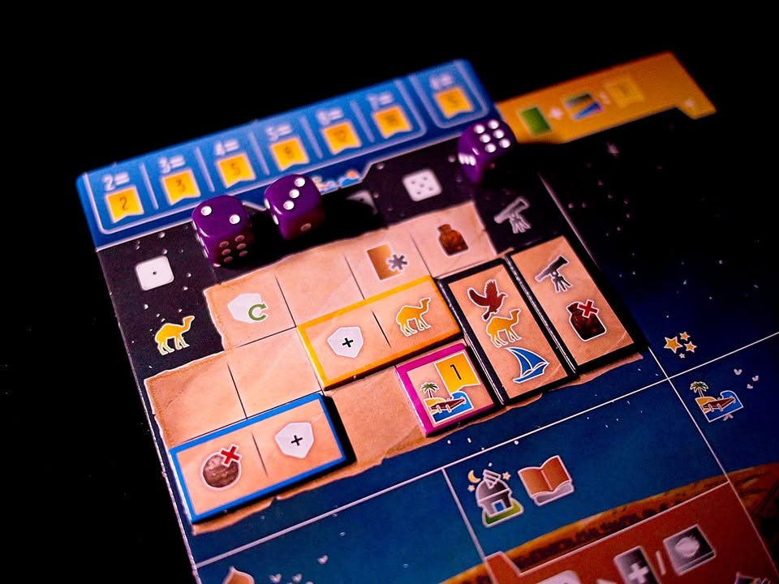
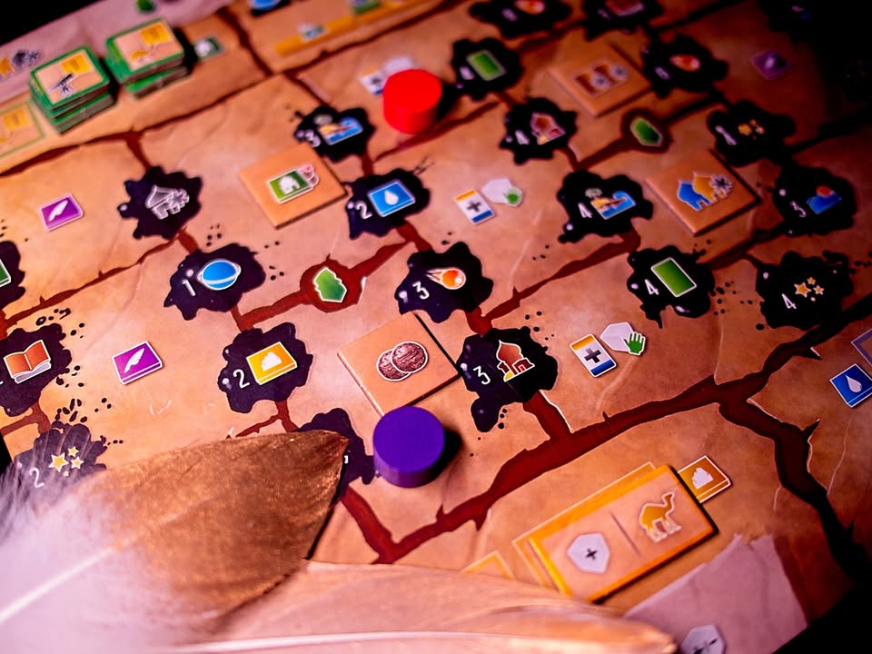

Wayfarers of the South Tigris #thought
. 
เคาะลีฟะฮ์อับบาซียะฮ์ (Abbasid Caliphate) ราชวงค์อันดับที่สามของรัฐอิสลามแห่งเมืองแบกแดดที่ในยุครุ่งเรืองนั้นแผ่ขยายอำนาจไปทั่วเปอร์เซีย เกมจะให้เราเป็นนักสำรวจที่คอยเดินทางออกสำรวจดินแดนอันกว้างใหญ่ทั้งทางบกและทะเลรวมไปถึงบันทึกเหตุการณ์ของหมู่ดาวเพื่อสร้างความประทับใจแก่ราชสำนัก

.
เกมนี้เป็นเกมใหม่จากซีรี่ย์หัวเมืองสี่ทิศของนักออกแบบ S J Macdonald และ Shem Phillips โดยเกมนี้เป็นเกมแรกของฉากทิศใต้โดย setting จะเป็นฝั่งอาหรับใช้โทนสีเหลืองแบบทะเลทราย

.
โดยไอเดียแล้วเกมจะให้เราหยิบการ์ดทิวทัศน์มาต่อบนกระดานของเราเองให้เป็นพาโนราม่าที่สามารถต่อได้ยาวววววววแบบไม่จำกัด ซึ่งเกมจะมีการ์ดหลักๆอยู่ 4 แบบให้เราหยิบจากกระดานกลางคือจะมีการ์ดแผ่นดิน การ์ดทะเล การ์ดดวงดาว และการ์ดผู้คน 

.
ตัวการ์ดแผ่นดิน/ทะล จะต่อออกไปข้างๆแล้วเพิ่มช่องแอคชั่นกับทรัพยากรให้เรา ส่วนดวงดาวก็วางไว้ข้างบนการ์ดพวกนี้อีกทีแต่จะเป็นแนวแต้มโบนัส ส่วนการ์ดผู้คนจะเอาไปเสริมความสามารถการ์ดดินแดนอีกที

.
แต้มเกือบทั้งหมดของเกมจะมาจากการเก็บ 'ไอคอนหลัก 4 ชนิด' ซึ่งก็มีอยู่ตามการ์ดที่ให้ซื้อนั้นแหละ มีทั้งคะแนนเก็บซ้ำเยอะกับคะแนนเก็บกระจาย ถ้าพูดให้ง่ายๆเกมนี้เป็นเกม set collection สะสมไอคอน โดย in progress ของที่เราสะสมไว้มันจะเสริม engine ให้เราไปเก็บของเพิ่มต่อ

.
กลไกในการเดินเกมจะใช้ระบบที่ใช้มันทั้ง worker placement และ dice placement

.
คือในกระดานของเรา เราจะต้องใช้ลูกเต๋าตัวเองเอามาวางทำแอคชั่น ซึ่งมีทวิสที่น่าสนใจตรงในช่องทำแอคชั่นนั้นจะต้องการสัญลักษณ์บางอย่าง เราก็ต้องไปเทียบดูเอาว่าเลขเต๋าของกับในตารางของเราว่ามันมีไอคอนตรงไหม ถ้ามีก็วางได้ แต่เริ่มเกมมาจะโล่งมากแทบไม่มีไอคอนอะไรเลย ระหว่างเกมก็จะมีจังหวะให้เราไปซื้อไทล์มาโมตารางหน้าเต๋านี้อีกที ซึ่งมีเพียบแล้วไปจูนเป็นสายการเล่นอีกที

.
คนงานอีกแบบก็เป็นตัวคนงานเลย แต่เอาไว้วางช่องบนการ์ดในตลาดกลาง ซึ่งมันจะมีระบุอีกทีว่าตรงไหนลงคนงานสีไหนได้ และลงไปแล้วจะได้ effect อะไร ส่วนใครมาซื้อการ์ดที่มีคนงานก็จะได้คนไปด้วยเลย คือมันเป็นวิธีเพิ่ม interaction ตรงกลางที่ง่ายแต่ฉลาดดี

.
เกมนี้จะจบกันเมื่อมีใครเดินแทรคจดบันทึกไปจนสุด จุดที่น่าสนใจคือการจะเลื่อนไปยังช่องถัดๆไปนั้นเกมจะบังคับให้เรามีไอคอนบางชนิดในจำนวนหนึ่งก่อน (ไอคอนก็หาเอาจากการ์ดที่หยิบๆมานั้นแหละ) ซึ่งตรงนี้มันจะทำให้เราต้องวางแผนเก็บของล่วงหน้าด้วยว่าอยากได้อะไรเมื่อไร เพราะถ้าไม่คิดไว้ก่อนมันก็จะติดอยู่ระหว่างทางทำให้เดินยาก

.
เวลาเล่นก็วนๆลงเต๋าลงคนงานพอใช้หมดก็เลือก reset เก็บเต๋ามาเล่นใหม่ จนกว่าจะมีคนเดินแทรคหมึกสุดทาง

----------------------------------------
🐸 [กบชอบ] 
.
ในเชิงการออกแบบแล้วเรียกได้เรียกได้ว่าเอาไอเดียหลายอย่างจาก Paladin of the west kingdom มาทำให้ลีนขึ้น โดยจุดที่ผมชอบมากเมื่อเทียบกับ Paladin คือเกมมันไม่ยึกยักต้องเดินเกลียทุกแทรคกันใกล้ๆกัน แล้วก็เพิ่มมิติ interaction ตรงกลางเข้ามา ไม่ใช่เกมงึมงำแย่งโบนัสจึ๋งๆตรงกลางแบบใน Paladin  ซี่งผลออกมันออกมาดีมากเกมวางสัดส่วนของการเล่นกับตัวเอง / มูลค่าของที่เปลี่ยนไประหว่างเกม / การแย่งของตรงกระดานกลาง ได้ดีมาก

.
จุดที่ชอบอีกอย่างคือเอาเกมมันฉลาดในการเอาระบบแต้มโบนัสพิเศษพื้นๆมาใช้ดี คือเดิมมันก็มีแบบหยิบมาแล้วคูณตามโน้นนี้ แต่มันยังแทรกระบบ 'แต้มคูณสอง' ที่เราต้องเอามาเสียบอีกโดยที่มันก็มีเงื่อนไขที่ต้องปลดก่อนด้วย รวมไปถึงแต้มแบบเก็บตามจำนวนแบบมี majority กับแบบบวกทบอีก ทำให้ระหว่างเล่นแม้จะเหมือนเป็นเกมเก็บของแต่เล่นจริงมันทำให้เกมไหลไปได้หลายทิศทางดี

.
เกมนี้มีเรื่องที่ไม่ชอบอยู่อย่างเดียวคือถึงแม้เกมนี้จะเป็นเกมที่มีแอคชั่นฉับไว และสามารถเล่นให้จบให้ช่วง 90 นาทีได้สบายๆ แต่นั้นมันสำหรับการเล่นครั้งที่ 3 เป็นต้นไป ซึ่งปัญหาของผมคือใน 1 - 2 ครั้งแรกที่เล่นจะมี downtime สูงแบบสูงมากทุกครั้ง อันเกิดจากความเป็นไปได้ในการหยิบจับของมาผสมกัน รวมถึงความเปิดกว้างให้การหยิบของจากส่วนกลางที่มีหลายท่าให้เลือก  แต่เมื่อเข้าใจแล้วในการเล่นครั้งหลังๆเกมจะไวขึ้นมาก

.
ซึ่งในอีกความหมายคือสอนคนใหม่ทีไร ตอนเล่นก็ต้องเผื่อใจไว้เยอะหน่อยว่านานแน่ๆ คือมันนานแบบทำใจเชื่อยากจริงๆ ถ้ารู้สึกว่าเกมนานไปให้เวลามันหน่อยนะ

.
สำหรับผมแล้วทิศเหนือผมเก็บแค่ Raider of the North Sea, ทิศตะวันออกผมเก็บแค่ Architect of the West Kingdom และแน่นอนว่าทิศใต้เกมนี้ก็ไม่ขายแน่นอน เพราะสนุกแบบกำลังดี อีกเหตุผลคือผมรู้สึกว่าทีมนี้เวลาออกแบบเกมที่คิดเยอะแล้วกลายเป็นเกมงึมงำแบบที่ผมไม่ชอบทุกทีเลย (ส่วนอันเบาก็เบาเกิ๊น) แต่ 3 เกมนี้กำลังสวยเลย เล่นง่ายสอนง่ายกิมมิคกำลังสนุก

-----------------------------------------

😍 กบโปรด - อวยไส้แตก ยากมากที่เล่นแล้วจะรู้สึกไม่สนุก
.
😁 กบชอบ - พร้อมจะเล่นตลอด 
.
🙂 กบโอเค - ชอบในบางแง่มุม แต่อาจจะเล่นไม่บ่อยหรือเล่นแค่บางอารมณ์
. 
😐 กบเฉย - ไม่ได้เกลียดอะไร ถ้าไม่มีตัวเลือกอื่นก็เล่นได้อยู่
.
🖕 กบไม่เล่น - ไม่ตรงจริต (ไม่ได้แปลว่าห่วยหรือไม่ดี) ขอเล่นเกมอื่นล่ะกัน
.
อนึ่ง : เป็นความรู้สึกในความ "อยากจะหยิบมาเล่นไหม?" ของผมเอง ไม่ได้เกี่ยวอะไรกับคุณภาพของเกม ดูให้เป็นแค่ "อีกความคิดเห็นหนึ่ง" เท่านั้นก็พอนะครับ :)
-------------------------------------------

