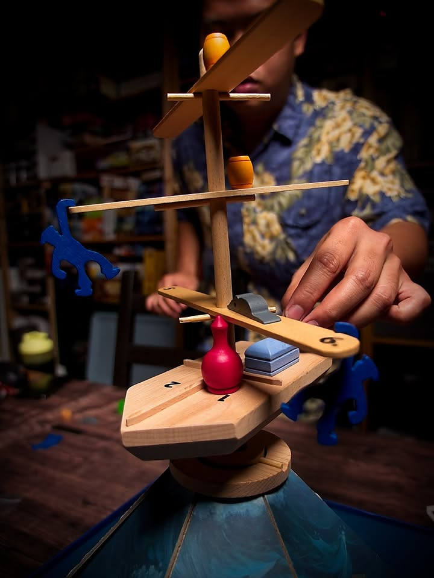

Riff Raff #bitesize 

เป็นเกมแนว dexterity / balancing ที่ไม่ได้หยิบมาเล่นนานแล้ว แต่ก็ยังตลกทุกครั้งที่เล่นนะ 

.
ไอเดียก็ไม่มีอะไร คือเรือมันจะมีตุ้มเหล็กถ่วงอยู่ด้านล่างและมีจุดหมุนอยู่ตคงกลางทำให้มัน 'ลอย' โคลงเคลงอยู่กลางอากาศ ผู้เล่นก็แค่ผลัดกันเปิดการ์ดที่บอกเลข จากนั้นก็หยิบของหลากหลายขนาดและน้ำหนักที่ตัวเองมีอันไหนก็ได้ไปว่างในตำแหน่งเรือนั้นๆ

.
คือเกมมันฮาๆลุ้นๆดี ด้วยความที่มันมีปัจจัยด้านความโคลงเคลงของเรือเลยทำให้เกร็งกว่าปกติว่าเวลาวางไม่เหมือนเกมแนว balance เกมอื่นๆ

.
แล้วเกมมันรื้อเล่นใหม่ได้ง่ายเพราะเอาจริงๆแป๊บๆก็ล้มละถ้าดวงเปิดการ์ดมันเทไปด้านเดียวกันเยอะๆ ไม่ก็เพราะเพื่อนๆจัญไรชอบว่างให้มันหมิ่นเหม่จะตกแหล่มิตกแหล่ ในแง่ presentation สำหรับเกมเมื่อสิบปีก่อนแล้วมาตอนนี้ก็ยังถือว่าว้าว 

.
ข้อเสียเชิงอุปกรณ์คือกระดาษแข็งด้านล่างนี้ทำมาห่วยไปหน่อยดูจะพังเอาง่ายๆ ที่ไม่ค่อยอยากกางบ่อยก็เพราะกลัวมันพังเนี่ยแหละ

--------------------------------
หมวด Bite Size (พอดีคำ) นี้กะว่าจะเขียนอะไรสั้นๆประมาณนี้ล่ะกัน ใหม่บ้าง ซ้ำบ้าง เกมที่ขี้เกียจเขียนบ้าง เขียนๆไว้ก่อนเผื่อมีอารมณ์อาจจะขยายไปลง Thought บ้าง จริงๆอยากเขียนสั้นกว่านี้ แต่ยังอดไม่ได้ที่จะต้องอธิบายอะไรเพิ่มตามนิสัย เดี๋ยวค่อยๆปรับไปล่ะกัน

