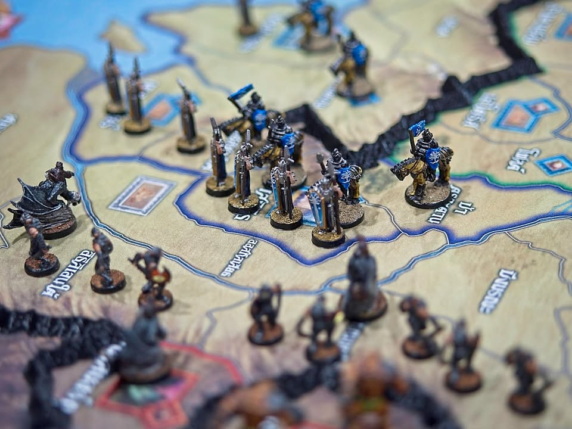
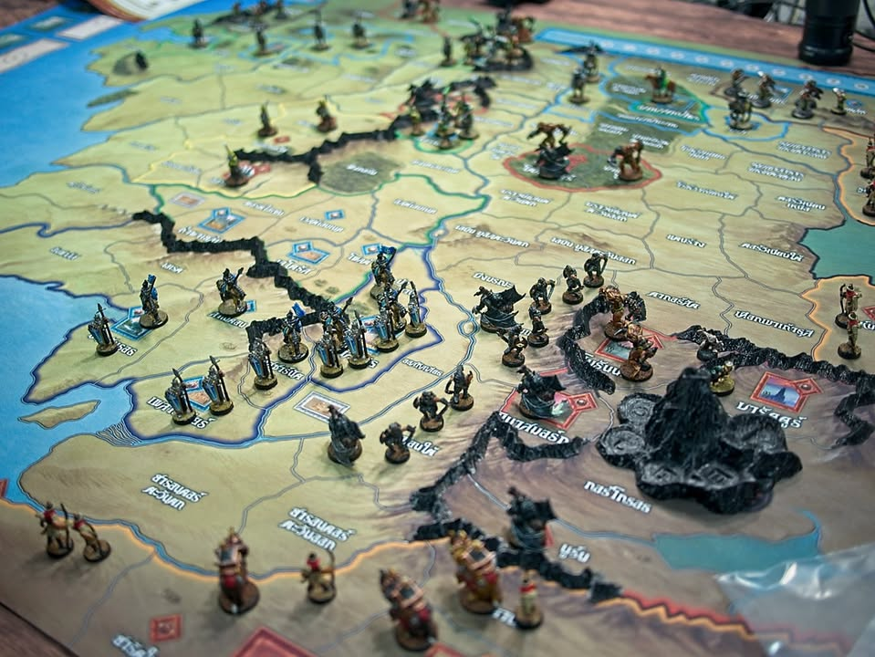
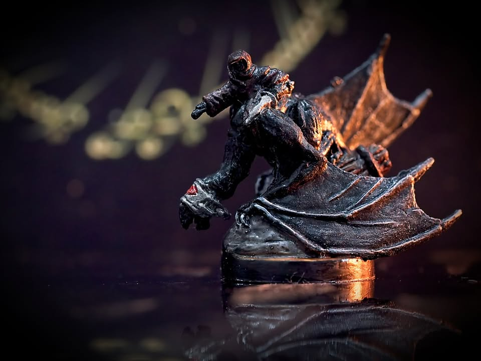
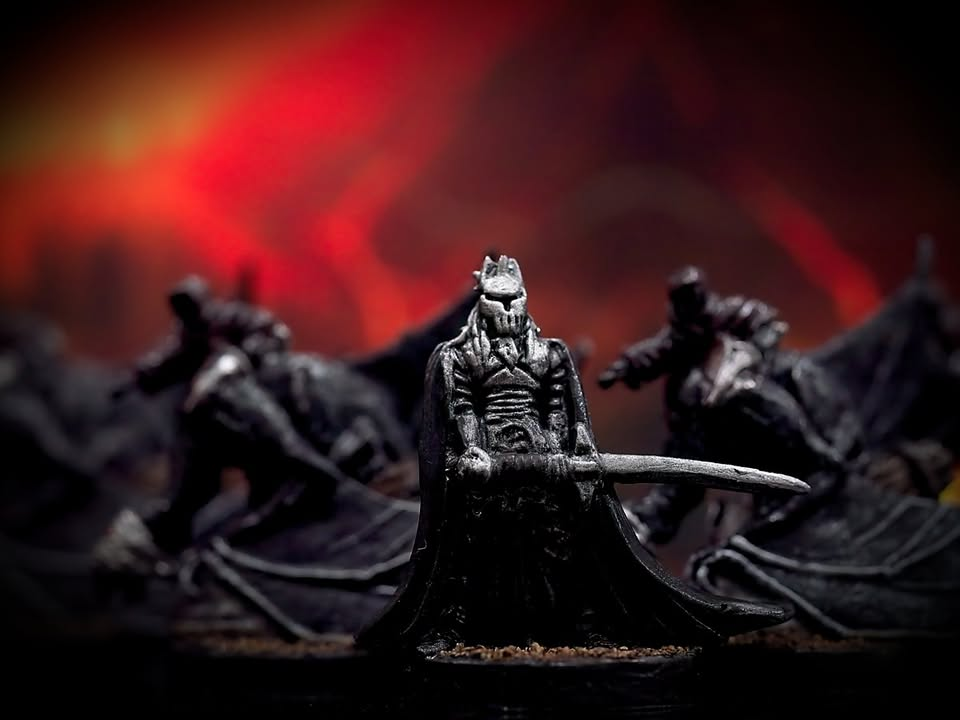
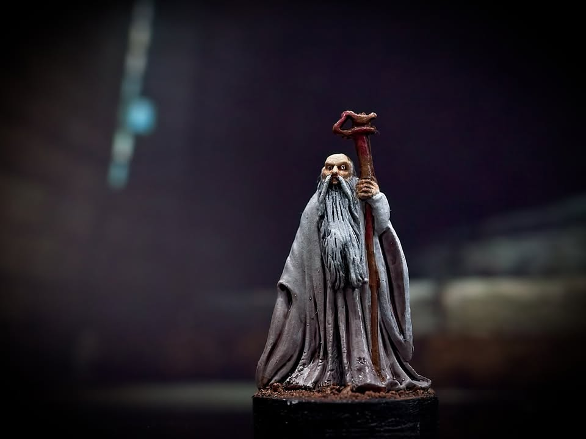
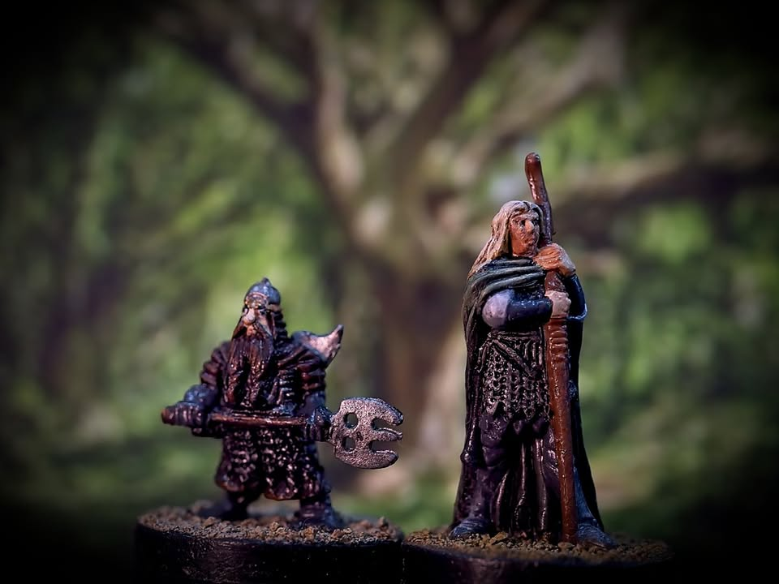
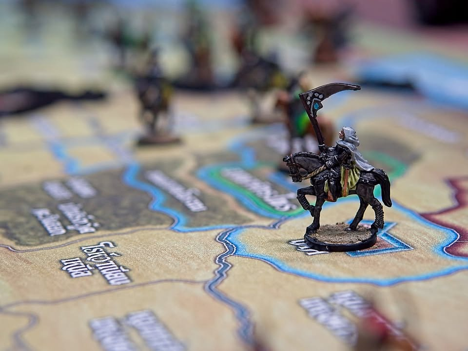
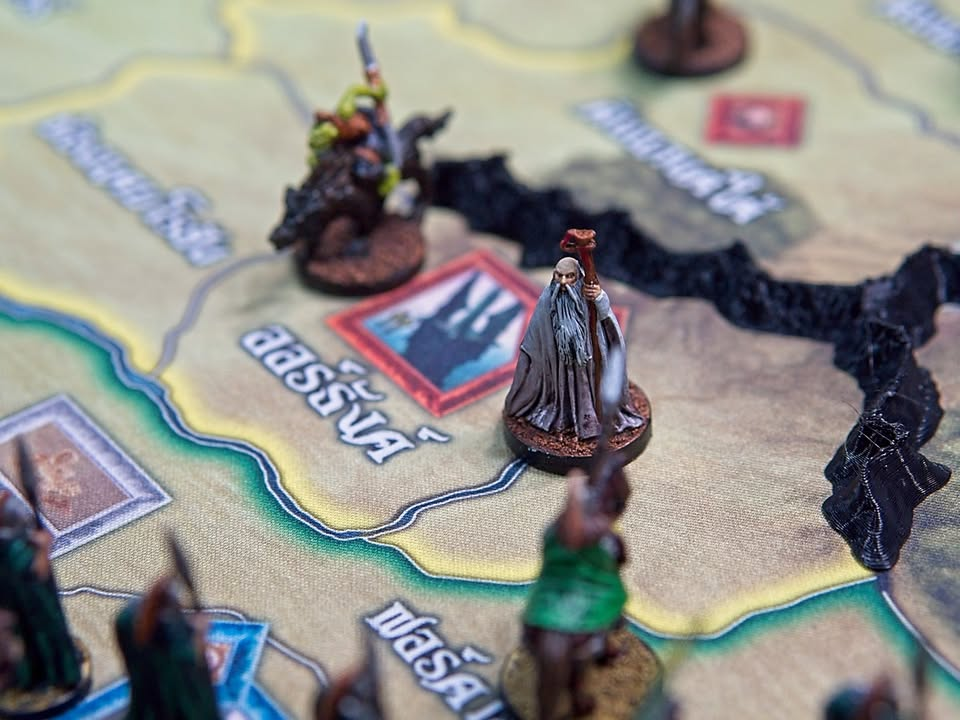

War of the Ring: Second Edition

“ในโพรงใต้ดินแห่งหนึ่ง มีฮอบบิทอาศัยอยู่”

.
คือข้อความที่ เจ. อาร์. อาร์. โทลคีน ได้เขียนลงไปบนกระดาษคำตอบอันว่างเปล่าของนักศึกษาคนหนื่ง และในกาลต่อมาโพรงดังกล่าวก็ได้ขยายลึก แผ่สาขาอันสลับซับซ้อนออกมาเป็นหนึ่งในวรรณกรรมแฟนตาซีที่ยิ่งใหญ่ที่สุดในยุคของเรา 

.
The Lord of the Rings

.
และนี้คือเกมกระดานที่จะพาเราดำดิ่งไปกับเรื่องราวของเสรีชนที่ต้องการทำลายแหวนเอกธำมรงค์ และเซารอนเงามืดอันชั่วร้ายผู้สร้างแหวน

.
เอาผมสรุปให้แบบรวดเร็วเลยคือเรื่องย่อหรือที่มาที่ไปคุณต้องรู้หรือจำได้เลาๆแหละ เพราะถ้าคุณไม่รู้จักหรือไม่เคยอ่านหรือดู Lord of The Rings มาก่อนก็ไปดูมาก่อนที่จะเล่นเกมนี้จะดีกว่า แต่ถ้าคุณและเพื่อนที่เล่นนั้นรู้จักการเดินทางแห่งแหวนนี้แล้วล่ะก็ คุณจะไม่ผิดหวังเลยที่ได้เล่นเกมนี้

.
คือถ้าไม่เก็ทเรื่องมาก่อนก็จะขาดสิ่งที่จำเป็นสำคัญในการเล่นเกมนี้ไปเลยเพราะมันเป็นเกมที่เรียกร้องและปลุกเร้าสิ่งนี้สูง ตัวเกมที่จะฉายภาพนี้ซ้ำจากหลายๆมุมให้กับเรา

.
ตัวเกมจะออกแบบมาเป็นอเมริเทรชที่เน้นการเข้าถึงธีมอย่างหนักแน่นของผู้เล่นสองฝ่าย (เกมบอกว่าเล่นได้ 2-4 คน แต่จริงๆมันก็เกมเล่น 2 คนนั้นแหละ) โดยแบ่งออกเป็นฝั่งเสรีชนที่ต้องควบคุมคณะผู้ถือแหวนเดินทางออกจากไชร์ และฝั่งเซารอนที่จะควบคุมกองทัพจากอีกฝั่ง 

.
ฝ่ายเสรีชนชนะได้สองท่าคือเดินทางเอาแหวนไปหย่อนแบบตามต้นฉบับ หรืออยากจะเปลี่ยนประวัติศาสตร์โดยการชักนำเหล่าเอลฟ์กับคนแคระให้มายกทัพยึดพื้นที่บางส่วนจากฝั่งเซารอนก็ได้ ในขณะที่ฝั่งเซารอนเองก็มีสองเป้าหมายเช่นกันคือไล่ล่าหาแหวนต้อนโฟรโดจนเป็นบ้าหรือโชว์ศักยภาพกำราบกองทัพเหล่าเสรีชนให้เหี้ยนก็ได้

.
ระบบเดินเกม แต่ละฝ่ายจะทอยลูกเต๋าจำนวนหนึ่งแล้วผลัดกันเลือกหน้าเต๋าตัวเองมาทำแอคชั่นซื้อแอคชั่นแต่ละฝ่ายไม่แตกต่างกันมากคือมี เดินทาง เพิ่มกำลังทหาร สั่งกองทหารโจมตี เล่นการ์ดเหตุการณ์

.
ระบบการต่อสู้ไม่ยุ่งยากอะไรก็เอาทหารมายืนชนกันแล้วทอยเต๋าได้ 5-6 ถือว่าโดน แต่ระหว่างการเล่นก็จะมีเปิดการ์ดเหตุการณ์มาช่วยได้ ซึ่งแต่ละฝ่ายมีไม่เหมือนกันและไม่ซ้ำใบกัน ตัวทหารมี 3 แบบหลักๆคือตัวเล็กนับ 1 ตัวใหญ่ (จะขี่ม้า ชี่ช้าง ชี่หมาก็เหมือนกัน) นับ 2 และตัวแม่ทัพนายกองที่ไม่ได้ช่วยทอยเต๋าแต่ว่าช่วยให้ re-roll ได้

.
แต่ถึงจะฟังเหมือนกับว่าไม่ต่างกันแต่บรรยากาศการเล่นและรายละเอียดของทั้งสองฝั่งนั้นแตกต่างกันเป็นอย่างมาก 

.
ฝ่ายเซารอนไม่พูดเยอะก็ปั๊มทหารโหมบุก ส่งนาซกูลบินไปหาผู้ถือแหวนบ้าง นำทัพบ้าง

.
ฝ่ายเสรีชนเริ่มมาจะรวมตัวอยู่กับโฟรโดและเป็นหมากบนกระดาน ทุกครั้งที่ให้กลุ่มผู้ถือแหวนทำการเดินทางฝ่ายเซารอนจะได้สิทธิ์ในการทอยเช็คเพื่อมองผู้ถือแหวนด้วย นี้คือดวงตาของเจ้าแห่งแหวนที่จะกดดันทำให้โฟรโดเข้าสู่การเสียสติ และด้วยระบบเกมคือทุกครั้งที่ผู้ถือแหวนเดินทาง เราจะไม่ต้องเดินหมากในกระดานจริงๆ แต่ต้องรอให้ถูกบังคับเผยตัวก่อนค่อยขยับ เพื่อแทนว่าการเดินทางของคณะนั้นตามหาตัวได้ยาก ที่เห็นน่ะมันแค่ last seen location

.
แน่นอนว่าอาจจะอยู่ๆเช็คเจอก็วาร์ปมาถึงปากเหวที่มอร์ดอเลยก็เป็นไปได้เหมือนกัน 

.
story telling ที่น่าสนใจอย่างหนึ่งของเกมนี้คือฝ่ายเสรีชนเนี่ยเราไปยุ่งวุ่นวายขยับตัวอะไรแทบไม่ได้เพราะมันมีเรื่อง 'การเมือง' อยู่ที่ถ้าพูดง่ายๆก็คนมันไม่เชื่อว่าเซารอนกลับมาแล้ว ต้องรอให้ทัพมันเดินตีบ้านก่อน หรืออย่างพวกเอลฟ์กับคนแคระทางเหนือนี้ยิ่งไม่นำพา คือถ้าอยากจะให้สู้เนี่ยต้องให้ลูกพี่โฟรโดไปโชว์ตัวถึงจะยอมให้เราสั่งการได้ แต่ว่านั้นก็คือต้องเดินไปคนละทิศกับที่ที่จะต้องไปทิ้งแหวนนะ

.
อีกอย่างคือฝั่งเสรีชนจะมีทหารที่จำกัดแบบตายแล้วตายเลยแล้วก็มีน้อยมากๆก๊กละนิดละหน่อย ในขณะที่ฝั่งเซารอนคือออกมาได้ไม่อั้น ตายเท่าไรก็สร้างคืนได้ 

.
นอกจากนี้ฝั่งเสรีชนพวกคณะผู้ถือแหวนก็ยังสามารถแยกตัวออกไปช่วยรบได้ด้วยนะ 

-----------------------------------------

🐸 [กบชอบ]  

.
อย่างที่บอกคือถ้าคุณรู้จัก Lord of The Rings แบบไม่ต้องแม่นมากแต่อย่างน้อยก็ต้องเสพสื่อตัวเต็มมันมาแล้วเกมนี้จะนำความรู้สึกและฉากทัศน์ต่างๆให้โผล่เข้ามาให้หัวคุณอย่างชัดเจน

.
ความกดดันของเหล่าผู้ถือแหวนที่ยิ่งเดินก็ยิ่งโดนเซารอนทอยเช็คอย่างหนักหน่วง ความกดดันของการรวมตัวสร้างทหารไปเพื่อต้านทานกองทัพเซารอนที่โหมตีพร้อมกับทรัพยากรที่ร่อยทหารที่สามารถดึงมาได้หรอลงเรื่อยๆ 

.
คือรู้สึกหดหู่แหละกดดันมาก เพราะรู้ว่าสร้างมาไม่ทันอีกฝ่ายก็โหมตีได้เรื่อยๆ คือยันเพื่อโฟรโดอย่างแท้ทรู

.
แต่เล่นฝั่งเซารอนก็ใช่ว่าไม่กดดันนะ โดยเฉพาะเวลาทอยหาโฟรโดไม่เจอหรือเจอแล้วตัวเลขความใกล้บ้าไปไม่ถึงซักทีก็ได้ขอร้องโชคชะตาให้มันบ้าตายซักที! จังหวะที่โฟรโดมาถึงหุบเขาเตรียมทำลายแหวนนั้นภาพที่ดวงตาเซารอนต้องเร่งดำเนินการทุกสิ่งก่อนที่เกมจะจบนั้นมันบีบคั้นจริงๆ

.
และความกดดันทุกสิ่งที่สะสมมาตลอดเกมนั้นทำให้ทุกครั้งที่เล่นจบมันรู้สึกลุ้นมากจริงๆ

.
ถ้าไม่นับกติกาตรงโน้นตรงนี้ที่โผล่มาตามสไตล์อเมริเทรชแล้วตัวเกมถือว่าค่อนข้างตรงไปตรงมาเอามากๆ คือฝ่ายคนก็เลือกเอาแหละว่าจะเน้นหนักเดินทางไปทิ้งแหวน หรือหนักสร้างทัพที่ก็ต้องเดินทางเหมือนกันแต่ไปเดินชวนเพื่อนหรือเสริมทัพตรงโน้นตรงนี้ ส่วนฝั่งเซารอนก็ต้องเลือกว่าจะบี้ให้บ้าหรือจะออกไปทางสร้างทัพตี  ซึ่งตรงนี้หน้าเต๋าที่ออกก็มีส่วนเยอะเหมือนกัน ก็ต้องบริหารจัดการกันไป

.
ส่วนที่ไม่ชอบนิดหน่อยคือฝั่งคนทหารมันหน้าตาคล้ายๆกัน แต่ต่างแค่ทรงโล่นิดหน่อย ดูแล้วแยกยากต้องใช้เวลาหา คือถ้าทำสีแล้วจะช่วยตรงนี้ได้เยอะ กับกติกาการเล่น 4 คนนี้รู้สึกไร้สาระไปหน่อยคือจะมาแบ่งกันคุมทำไมว่ะ งง เพราะมันก็ใช้เต๋าแอคชั่นพูลเดียวกัน คือมันเกม 2 คนแท้ๆเลยแหละ

.
ส่วนเรื่องการ์ดและการแปลส่วนตัวผมคิดว่าทำมาโอเคเลยนะ คือเกมนี้พวกการ์ด event มันตัวหนังสือพรึบอัดแน่นมาก มีภาษาไทยก็ช่วยให้อ่านได้ไวขึ้น แต่ก็แอบมีสะดุดๆพวก terminology ของเกมอยู่หน่อยๆต้องใช้เวลาแป๊บนึง ส่วนคู่มือแปลมาอ่านเข้าใจอยู่ แต่ด้วย font ที่ทำให้แยกพวกตัวเอียงไม่ค่อยออกก็เลยทำให้ดูมันตัวหนังสือติดกันเยอะเทียบกับของตัว en กับด้วยความที่คู่มือต้นฉบับเรียบเรียงได้ไม่ค่อยดีเท่าไร ตัวแปลก็เลยต้องสืบทอดส่วนนี้มาด้วย

.
อีกเรื่องคือเกมนี้ไม่แนะนำให้นั่งฝั่งตรงข้ามในด้านตรงกับกลับหัว เพราะมันแทบจะเป็นไปไม่ได้เลยที่คุณจะอ่านชื่อภาษาไทยบนแผนที่จากอีกฝั่ง เพราะคุณต้องใช้มันบ่อยมากเพราะการ์ดจำนวนมากมันอ้างอิงสถานที่ คือถ้าไม่คุ้นนี้แทบจะเปิดไต๋หมดเลยว่ามีอะไรในมือบ้าง แต่อันนี้ก็ไม่ใช่เรื่องใหญ่นะ การ์ดมันก็มีคีย์สำคัญอยู่ไม่กี่ที่

.
เอาเป็นว่าถ้ารู้จัก lore ของ Lord of The Rings อยากเล่นเกมอเมริเทรชที่ไม่ใช่ตีกันโล่งๆ แต่ขอแบบมีชั้นเชิงแล้วสองฝ่ายแตกต่างกันอย่างชัดเจน เกมนี้ก็เหมาะสำหรับคุณครับ ตัวเกมกติกาหยิบย่อยก็จริงแต่แอคชั่นหลักก็ไม่ได้มีอะไรซับซ้อน แต่ถ้าไม่รู้จักเกมเนื้อเรื่องอะไรเลยก็อาจจะมานั่งงงกับไม่อินว่ามันทำอะไรไปทำไม เพราะ setting มันเป็น high fantasy แบบที่ตัวละครไม่ค่อยมีอภินิหารอะไร แต่ถ้าอินล่ะสนุกแน่
-----------------------------------------

😍 กบโปรด - อวยไส้แตก ยากมากที่เล่นแล้วจะรู้สึกไม่สนุก
.
😁 กบชอบ - พร้อมจะเล่นตลอด 
.
🙂 กบโอเค - ชอบในบางแง่มุม แต่อาจจะเล่นไม่บ่อยหรือเล่นแค่บางอารมณ์
. 
😐 กบเฉย - ไม่ได้เกลียดอะไร ถ้าไม่มีตัวเลือกอื่นก็เล่นได้อยู่
.
🖕 กบไม่เล่น - ไม่ตรงจริต (ไม่ได้แปลว่าห่วยหรือไม่ดี) ขอเล่นเกมอื่นล่ะกัน
.
อนึ่ง : เป็นความรู้สึกในความ "อยากจะหยิบมาเล่นไหม?" ของผมเอง ไม่ได้เกี่ยวอะไรกับคุณภาพของเกม ดูให้เป็นแค่ "อีกความคิดเห็นหนึ่ง" เท่านั้นก็พอนะครับ :)

--------------------------------
📌 disclosure: 
* Legendary Wargame ผู้แปล/นำเข้า/จัดจำหน่าย ส่งสินค้ามาให้ผมลองเล่น แต่ข้อเขียนนี้เป็นการแสดงความเห็นของผมที่มีต่อเกมโดยไม่ได้เป็นการรับจ้าง หรือเป็นข้อเขียนเพื่อการโฆษณา 

* มินิเจอร์ทำสีโดย Bewitched boardgame cafe ทางร้านแวะเอามาวางถ่ายตอนเล่นเกมด้วย 
--------------------------------

