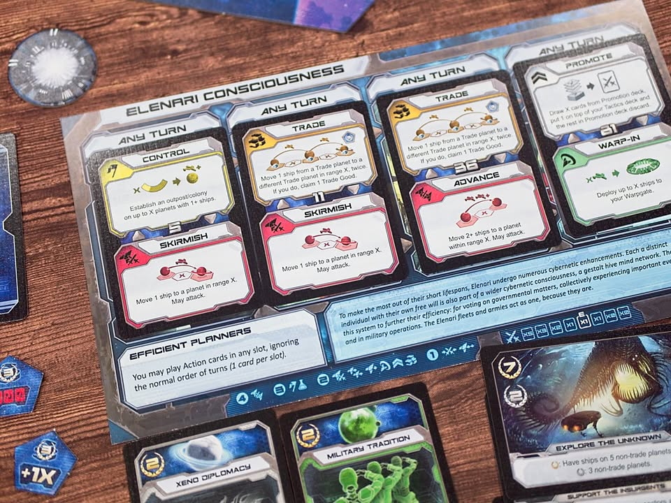
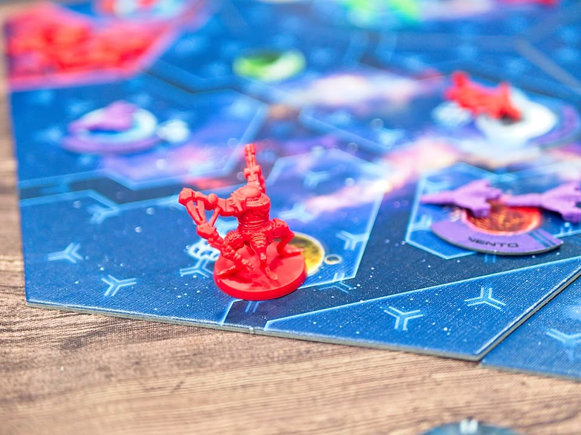

Wrapgate #bite_size

เกมยูโรระดับกลางที่จะให้เรารับบทเป็นเอเลี่ยนหลากชนิดที่ต้องมาแข่งขันกันยึดครองอวกาศผ่านกลไกแบบ Area Control & Hand management ผลงานของ Artyom Nichipurov (Guards Of Atlantis)

.
ไอเดียหลักระหว่างเกมก็จะให้เราส่งกองยานเราไปยึดดาวตรงโน้นตรงนี้เพื่อทำตามแต้มลับที่เก็บมา ความน่าสนใจของเกมจะอยู่ที่ระบบการทำแอคชั่น

.
แอคชั่นของเกมจะอยู่ในรูปแบบการ์ดที่แต่ละใบจะมี 2 ตัวเลือกให้ทำ ตอนแรกผู้เล่นแต่ละคนจะมีสำรับแบบเดียวกัน (แต่ซื้อมาเพิ่มทีหลังได้) แล้วจั่วมา 4 ใบถึงตาเราก็ดูเอาว่าจะลงใบไหน แล้วจะเลือกใช้แอคชั่นอะไรของการ์ดใบนั้น

.
แต่ส่วนที่ทำให้เกมมันมีกิมมิคทางความคิดคือบนบอร์ดเราจะมีช่อง x1 x2 x3 x4 ซึ่งเวลาเราเล่นการ์ดจะต้องวางเรียงไปจากน้อยไปมาก โดยที่ความสามารถของการ์ดที่เล่นก็จะอิงจากเลขที่เราเล่น

.
อย่างเช่นอยากเดินยานถ้าวางที่ x1 ก็จะเดินได้แค่ช่องเดียว หรืออยากเพิ่มตัวก็จะได้แค่ตัวเดียวไรงี้ ตรงนี้เลยนอกจากจะต้องคิดว่าอยากทำอะไรแล้วก็ต้องมาวางแผนด้วยเพราะความสามารถการ์ดที่เล่นได้มันจำกัด และต้องไล่ไต่ระดับไป ซึ่งตรงนี้สนุกดีนะ โดยถ้าคุ้นเคยกับระบบชาร์ทพลังของ Ark Nova ก็ทำงานคล้ายๆกัน แต่ว่าเกมนี้แอคชั่นมันจั่วสุ่มๆมาแล้วเราก็ต้องวางแผนการเล่นเอาเอง 

.
ระบบ combat ก็น่าสนใจดีตรงที่เวลาส่งยานไปตีกันจะได้จั่วกองต่อสู้ของเราเองเลือกมา 2 ใบ จากนั้นก็เลือกเอาว่าจะใช้ใบไหน โดยแต่ละใบจะมีตัวคูณให้เอาเลขนี้ไปคูณกับกองยานของเราอีกที่

.
การต่อสู้ในเกมนี้แก้ก็แค่ถอยยานจะไม่พัง แต่จะพังต่อเมื่อการ์ดบอก ตรงนี้ก็คิดว่าสนุกดีตาม weight เกม เพราะมันจะมีการ์ดลีลาๆแปลกๆให้ซื้อเพิ่มด้วย บางเคสก็ทำเอากองยานเราหายไปครึ่งนึงเลย แต่โดยรวมคือออกแบบฉลาดทำให้การต่อสู้ฉับไวตรงกับความซับซ้อนของเกม 

.
ส่วนที่เป็นข้อสังเกตนิดหน่อยคือพวกมินิยานของเกมจะเป็นแบบแพลนๆถูกๆ คือใช้งานได้ แต่ถ้าติดภาพเกม KS ต้องหรูๆสวยๆนี้ก็ไม่ใช่เลย และเกมนี้ตอนเป็นตัวหลักดั้งเดิมพวกการ์ด objective กับความสามารถมันพื้นๆเรียบๆมาก แบบเรียกว่าน่าเบื่อเลยดีกว่า แต่พอออกตัวเสริมมามันไม่ได้เพิ่มอะไรใหม่แต่ว่าเปลี่ยนเอาการ์ดเดิมทิ้งหมดเลย ก็ยังเบาและซับซ้อนเท่าเดิมแต่ความสามารถและเงื่อนไขการทำแต้มนั้นมีมิติขึ้นมาก แบบที่สำหรับผมแล้วยังไงก็ต้องมีตัวเสริมเท่านั้น!

.
ลักษณะพิเศษอื่นก็คงเป็นพวกการ research ที่ความสามารถมันโกงดียิ่งเล่นยิ่งดู asymmetric แบบต่อยอดจากเผ่าที่แตกต่างกันนิดหน่อยอยู่แล้ว รวมๆคือออกแบบมาค่อนข้างดีและน่าสนใจเลยนะ คือทำออกมาได้เกมสั้น แอคชั่นฉับไว แต่ก็ยังให้ sense ของการ progress ที่ไม่น่าเบื่อยืดเยื้อ

.
แต่ทั้งนี้ด้วยความที่เกมมันเน้นทำแต้มผ่านการยึดครองดาวตามการ์ดลับ ก็แน่นอนว่าเกมมันจะเทมาทางเกมตียึดพื้นที่กันไปมา ถ้ามาแนวสายลองท่าอยากชนะด้วยท่านั้นนี้โน้นเกมนี้ก็ไม่เหมาะนะ และในขณะเดียวกันการต่อสู้มันก็เอาแน่เอานอนยากเพราะการ์ดมันเล่นคูณกันตั้งแต่ 0-5 เลยทีเดียว ซื้อการ์ดพิเศษมาเพิ่มก็ใช่ว่าจะจั่วเจอได้ง่ายๆ

.
จริงๆตอนแรกสนใจเกมนี้เพราะมองหาพวก fast paced 4X เกมเอาไว้เล่น ก็เลยเจอเกมนี้มันเปิด KS ตัวเสริม Warpgate: Beyond ที่ขายตัวหลักด้วยพอดีก็เลยกดมา ซึ่งโอเคนี้มันไม่ได้ใกล้เคียง 4X แต่อย่างใด แต่ในฐานะเกมระดับกลางแอคชั่นฉับไวตีกันนัวๆก็สนุกดี มีจุดที่อยาก optimized กับการดื้ออยากได้พื้นที่บางอย่างระหว่างผู้เล่นทำให้ตีกันไปตีกลับรัวๆแบบแปลกๆดี ระบบคูณแต้มแอคชั่นก็ทำให้เกิดการลำดับความคิดที่น่าสนใจ เกมเล่นไม่นานชั่วโมงเดียวก็จบ เหมาะกับกลุ่มอยากเล่นเพลินๆตีกันแต่ก็ไม่ใช่ว่าแพ้แล้วเครียดบ้านโล่ง

.
แต่เท่าที่ดูเกมมันไม่ได้มีกระแสอะไร ในระดับ publisher คือ soldout ไปแล้ว ใน gamefound ตัวเสริมก็มีคนกดไปแค่ 700 กว่าคนเท่านั้นเอง ก็เลยอาจจะเป็นเกมที่หายากนิดๆ ราคาตัวเกมเองตอนสั่งไม่ได้แพงมากแต่โดนค่าส่งไปรวมๆแล้วก็อาจจะมองว่าแพงไปหน่อยสำหรับของที่ได้นะ

--------------------------------
หมวด Bite Size (พอดีคำ) นี้กะว่าจะเขียนอะไรสั้นๆประมาณนี้ล่ะกัน ใหม่บ้าง ซ้ำบ้าง เกมที่ขี้เกียจเขียนบ้าง เขียนๆไว้ก่อนเผื่อมีอารมณ์อาจจะขยายไปลง Thought บ้าง จริงๆอยากเขียนสั้นกว่านี้ แต่ยังอดไม่ได้ที่จะต้องอธิบายอะไรเพิ่มตามนิสัย เดี๋ยวค่อยๆปรับไปล่ะกัน

