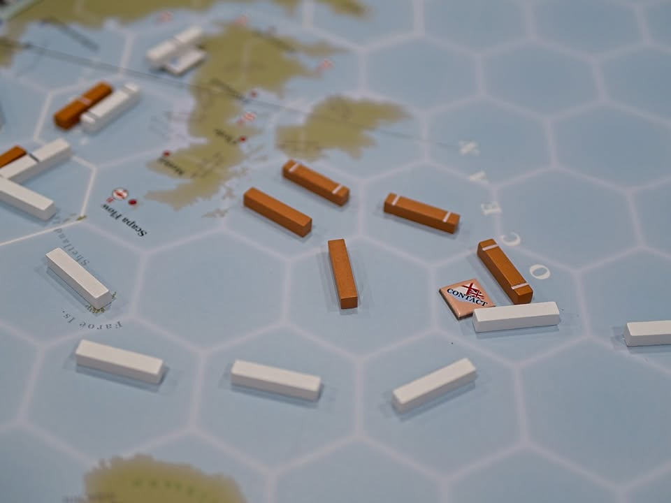
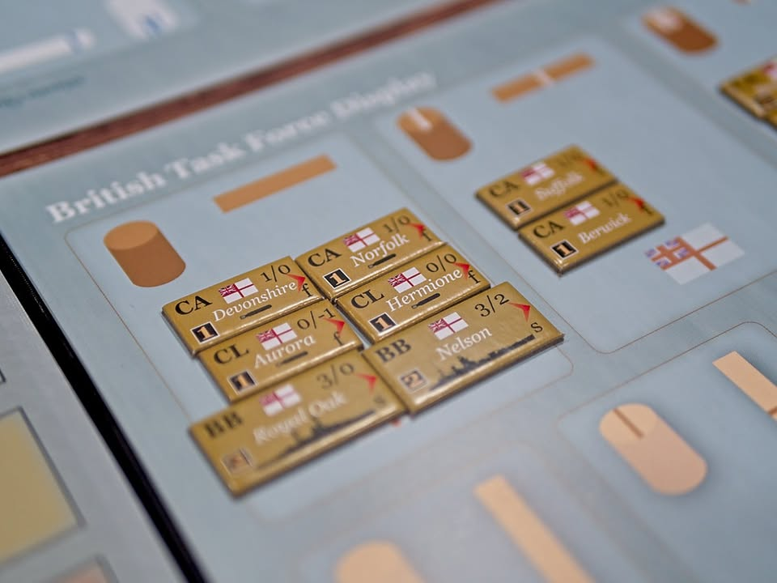

Atlantic Chase #bite_size 
.
ในสมัยสงครามโลกครั้งที่สองนั้น เทคโนโลยี GPS ยังไม่ถือกำเนิดขึ้น การติดต่อสื่อสารระหว่างเรือรบและหอบังคับการเองนั้นก็เชื่องช้าและไม่สามารถประสานงานกันได้บ่อยเนื่องจากความเปิดกว้างของคลื่นวิทยุที่ทำให้ถูกดักฟังได้ง่าย ทำให้แม้เราจะสั่งการให้กองเรือเดินทางไปยังจุดหมายก็ใช่ว่าเราจะรู้ได้อย่างแน่นอนว่า ณ ตอนนี้กองเรือของเรา(และฝ่ายศัตรู)นั้นอยู่ที่ไหนกันแน่ในระหว่างเส้นทาง

.
ซึ่งเกมนี้เป็นเกมสงครามตามขนบที่มีระบบแปลกใหม่มาก (สำหรับผม) นั้นคือแทนที่เราจะมาขยับทหารตาม hex แบบเกมทั่วไป แต่เกมนี้จะใช้ระบบที่ชื่อว่า Trajectories ที่ก็คือวางเส้นขีดกำหนดทิศทางการเดินทางของกองเรือ ระหว่างเล่นก็จะมีการค่อยๆเอาออกจากต้นทางโดยอิงจากความเร็วกองเรือและสภาพอากาศในขณะนั้น เวลาที่แต่ละฝ่ายจะขยับกองเรือก็ต้องมองเรื่องความเร็วตรงนี้เอาไว้ด้วย

.
แอคชั่นหลักๆนอกจากการเดินแล้วก็ยังมีการร่วมค้นหาเพื่อพยายาม pin point ให้ได้ว่ากองเรือของอีกฝั่งนั้นอยู่ที่ใดกันแน่ เมื่อพบเจอก็จะมีการต่อสู้กัน โดยการค้นหาเองก็สามารถใช้ประโยชน์ได้จากทั้งกองเรือ และเครื่องบินรบ คือมัน wow ดีตรงเราเองก็ไม่รู้ว่าสั่งไปนี้เรือเรามันจะถึงทันไหม แบบไปแตะเส้นของอีกฝ่ายก็ต้องเสียตาไปทำแอคชั่นเช็คดู แต่ปรากฎกันมาถึงไวไป อีกฝ่ายยังมาไม่ถึงเลยก็มี

.
สิ่งที่ประทับใจมากในระดับที่เห้ยทุกเกมมันต้องทำตามคือการออกแบบคู่มือ, player aid, กระดาน ที่มันใส่ข้อมูลที่จำเป็นไว้ดีและที่สำคัญคือมีการใส่ [ตัวเลข] กำกับไว้ด้านหลังทุกจุดสำคัญว่าตรงนี้มันอยู่หน้าไหนของคู่มือ คือสำหรับเกมสงครามที่รายละเอียดตรงโน้นตรงนี้เยอะแล้วไอ้การทำแบบนี้คือสุดยอดมาก ทำให้เกมที่น่าจะวุ่นวายกลับเล่นได้อย่างสมูธสุดๆ (เกมที่มีกติกาซับซ้อนทุกเกมควรเอาเป็นเยี่ยงอย่าง)

.
ผมเองพึ่งลองไปได้นิดหน่อยแต่ก็ตบ บอร์ดเกมสนุก - Boardgame Sanook เจ้าของเกมซะยับเลย ตัวเกมมีซีนารีโอ้ให้ลองเยอะมาก มีกระทั้ง tutorial ที่จะสอนระบบเกมทีละขั้นๆ ถ้าได้เล่นฉากที่รบกันนัวๆก็น่าจะสนุกดี พอดีที่ลองนี้แค่ภาระกิจแนวไล่ล่าเฉยๆ (แต่ event อิงตามเหตุการณ์จริงนะ)

--------------------------------
หมวด Bite Size (พอดีคำ) นี้กะว่าจะเขียนอะไรสั้นๆประมาณนี้ล่ะกัน ใหม่บ้าง ซ้ำบ้าง เกมที่ขี้เกียจเขียนบ้าง เขียนๆไว้ก่อนเผื่อมีอารมณ์อาจจะขยายไปลง Thought บ้าง จริงๆอยากเขียนสั้นกว่านี้ แต่ยังอดไม่ได้ที่จะต้องอธิบายอะไรเพิ่มตามนิสัย เดี๋ยวค่อยๆปรับไปล่ะกัน

