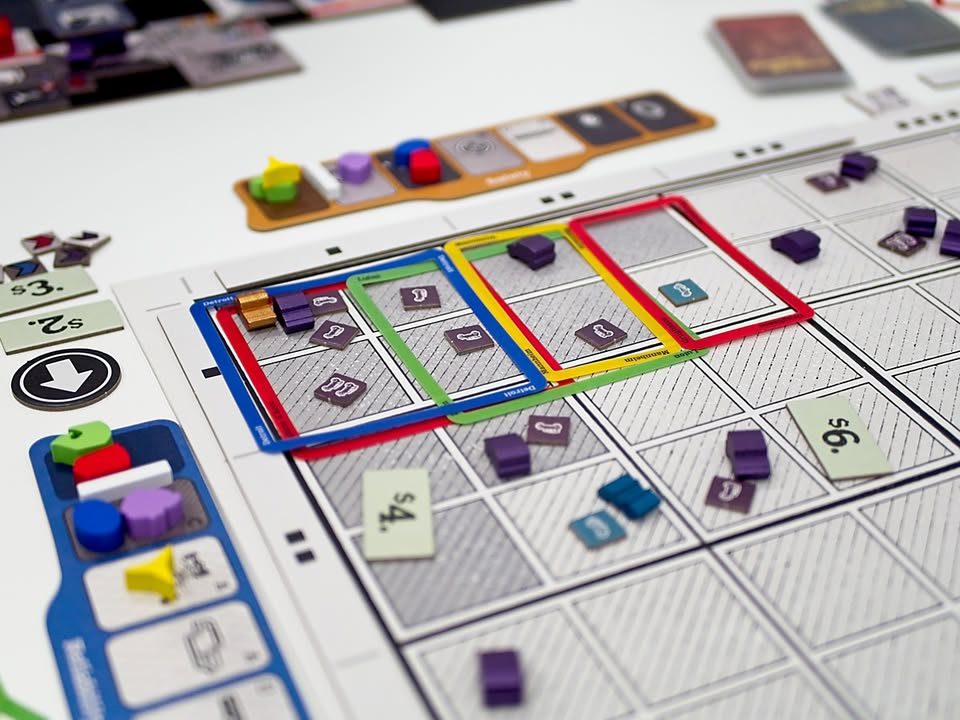
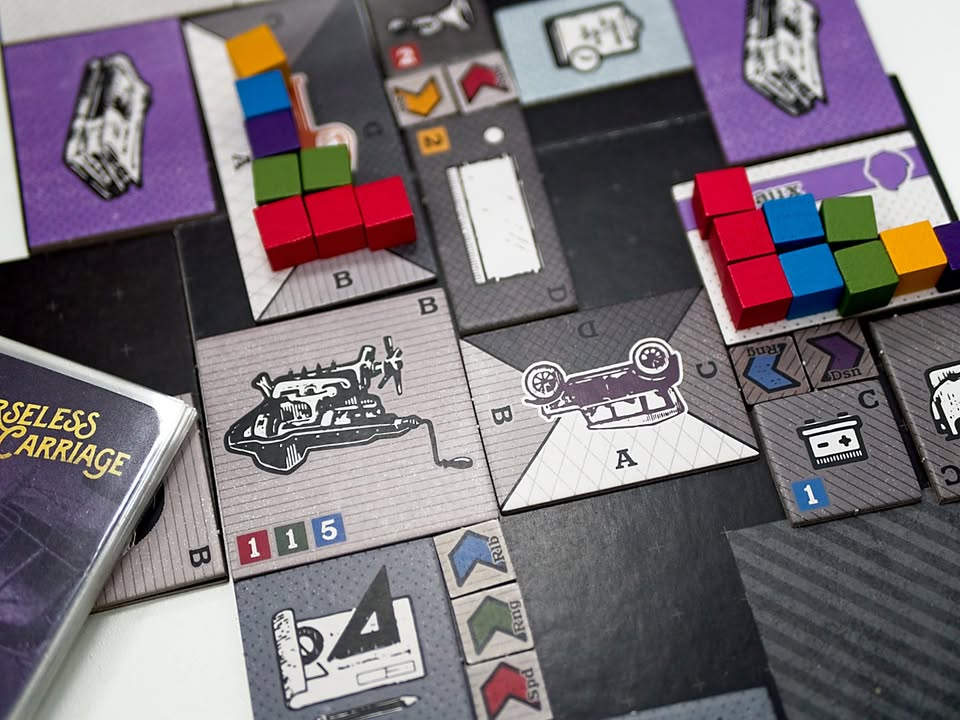
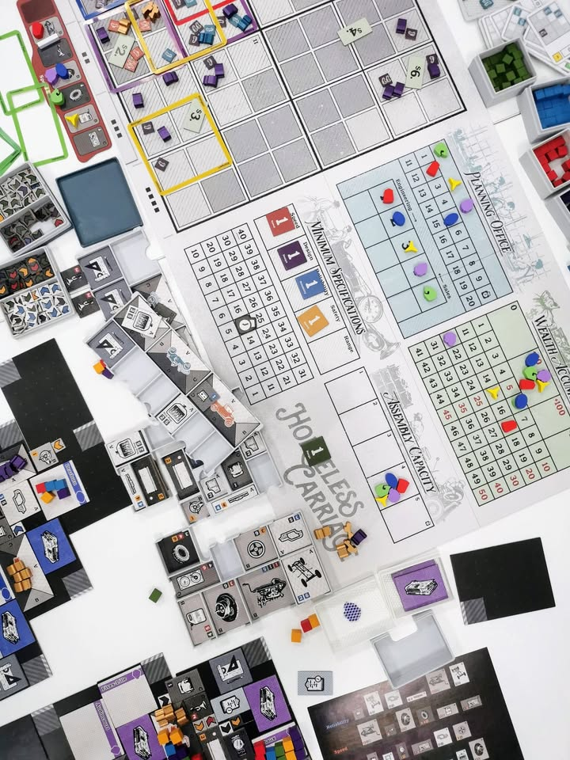
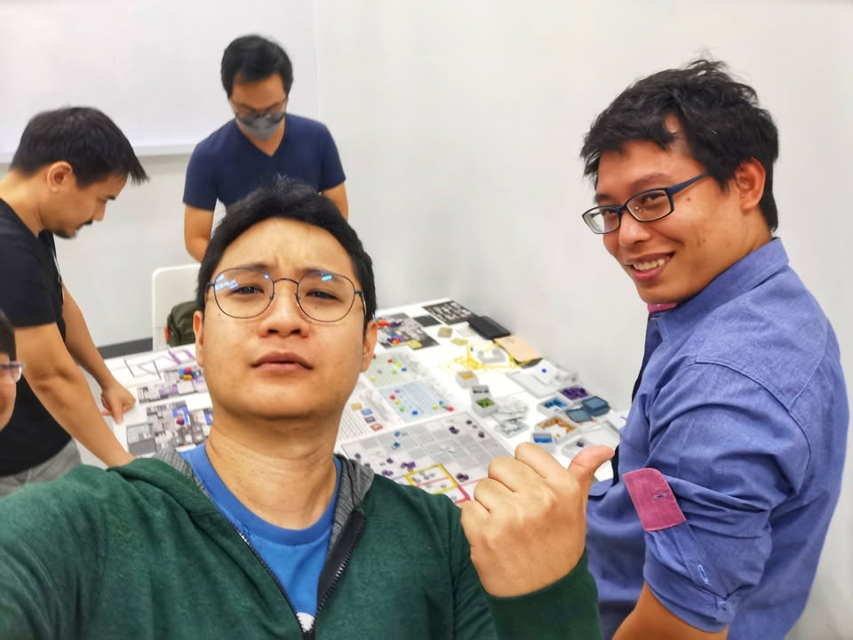

Horseless Carriage #bite_size #first_impression

เกวียนไร้อาชาเป็นเกมเผาหัวเกมใหม่จากผู้สร้าง Foodchain magnate (Jeroen Doumen, Joris Wiersinga) โดยรอบนี้จะมาให้เราทำโรงงานผลิตยานยนต์ในยุคแรกเริ่ม

.
* อันนี้เป็นความเห็นจากการเล่นครั้งเดียวนะ ขอบคุณเพจเพื่อนบ้าน Burning Board Game มากที่เอามาให้เล่น สอนเก่งมาก จนผมเข้าใจเกมเป็นอย่างดีชนะไปเรียบร้อย

.
ไอเดียเกมคือในตลาดมันจะมีลูกค้าอยู่ โดยที่ตารางในเกมมันจะบอกว่าลูกค้าใน segment นั้นต้องการ feature อะไรในรถบ้างถึงจะยอมซื้อ แบบมีอุปกรณ์เกี่ยวกับความเร็ว 2 อย่าง บวกกับมีเกี่ยวกับการออกแบบ 1 อย่างไรงี้ (ส่วนมันจะเป็นหน้าตายังไงอยู่ตรงไหนของรถลูกค้าจะไม่ได้แคร์ตรงนี้)

.
เราก็แค่ไปตั้งไลน์ผลิตในโรงงานเราให้ตรงที่เค้าอยากได้ (หรือที่เค้าคิดว่าเค้าอยากได้เพราะโดนเราปั่น ads มา....) แล้วก็ไปหยิบพนักงานขายมาขายของแล้วก็เอาเงินไปเป็นแต้ม จบ อีซี่มากๆ ซึ่งก็มีแถมอีกนิดว่าลูกค้าพวกนี้มีความเคยตัวสูงยิ่งเล่นๆไปมันจะแบบอ้าวเคยได้ feature นี้แล้ว รอบต่อๆไปก็ต้องมีด้วยนะไม่งั้นไม่ซื้อ และของใหม่ก็จะเอาเช่นกัน ทำให้เราต้องต่อเติมโรงงานในขยายไลน์งอกของมาขายเรื่อยๆ

.
แน่นอนว่าความสนุกหลักของเกมจริงๆแล้วไม่ใช่ตรงนี้ 

.
คือระบบพื้นที่ในโรงงานของเรา ไอเดียเกมมันจะให้เราเอาไทล์มาวางต่อๆกันหลักๆก็แน่นอนคือรถที่เราอยากจะขาย และแผนกขายของต้องวางติดกัน ที่เหลือก็คืออยากให้มี feature อะไรก็ต้องวางให้มันติดกับรถ

.
แต่ความบัดซบ(ท้าทาย) คืออะไหล่แต่ละชิ้นมันเลือกด้วยว่ามันต้องติดกับ 'ด้าน' ที่กำหนดของพื้นที่ประกอบรถ ซึ่งมี 4 ด้านแตกต่างกัน และไอ้พวกนี้ก็มี feature ไม่เหมือนกันด้วย และการที่เราจะหยิบได้แต่ละอย่างเราต้องไปทำการวิจัยเลื่อนแทรคมาถึงจะหยิบได้ แต่หยิบมาได้แล้วก็จะพบว่ารูปทรงมันไม่เท่ากันแถมที่แม่งโคตรรรรรรจะจำกัด เรียกว่าพลาดแค่ช่องเดียวก็ชะตาขาดได้

.
ระบบที่น่าสนใจอีกอย่างของเกมก็จะเป็นเรื่องการ manupulate ความต้องการผู้ซื้อที่ตรงนี้จะเป็นผลจากการอัพเทคของผู้เล่นเอง ถ้าอะไรมีผู้เล่นวิจัยมาเยอะคนซื้อก็จะอยากได้อยากมีบ้าง และเกมจะใช้วิธีการเติมผู้ซื้อผ่านการที่ผู้เล่นต้องลงการ์ด ads ที่จะมีผลกับทุกคน แต่เราเลือกโซนที่จะมีผลได้ โดยพื้นที่ที่ต้องการอุปกรณ์เยอะๆก็จะขายได้แพงกว่า (แต่โรงงานขยายยากและ feature ที่ต้องการมันเปลี่ยนเรื่อยๆ)

.
อีกอย่างที่อาจจะเป็นเรื่องแปลกของค่ายนี้คือกลยุทธ์แบบ catch up ที่ถ้าเราเลือกอันดับการเล่นแรกๆ (แต่จะได้ขายทีหลัง) และผู้เล่นอื่นมีการวิจัยนำหน้าเราไปมากพอเราก็จะสามารถ 'ก็อป' ชนิดโรงงานของคนที่นำเราอยู่ในสายนั้นๆได้ด้วย ตรงนี้ก็ทำให้เกิดวิธีการเล่นในอีกมิติขี้นมาด้วย

.
ข้อดีในเชิงออกแบบของเกมนี้คือมันจะให้เราปวดหัวแค่กับการทำโรงงานและการขาย พวกค่าใช้จ่ายทำโรงงานหรือเงินเดินนี้คือไม่มีเลย เป็นเกมที่ขายแล้วได้แต้มจบๆไป

.
ข้อเสียคือวางโรงงานพลาดละจะแพ้ยับ เพราะมันวางไปต่อให้มัน keep up กับความต้องการลูกค้าไม่ได้ เพราะผังมันวางแล้ววางเลย ซึ่งจริงๆถ้าเป็นแฟนเกมค่ายนี้จะไม่ได้มองเป็นข้อเสียนะเพราะอ่อนแอก็แพ้ไป แต่นั้นแหละถ้าต้องมานั่งเล่นโง่ๆ 4-5 ชั่วโมง แบบไม่มีแววชนะมันก็เสียเวลาชีวิตอยู่เหมือนกัน และความอึดอัดนี้อาจจะนำไปสู่การ AP คิดนานอีกต่างหาก แถมต่อผิด (ซึ่งผิดง่ายมาก) ก็รื้อย้อนไม่ได้อีก 

.
ถ้าคุณชอบแนวเกมของค่ายนี้อยู่แล้วก็คิดว่าต้องลองดูแหละ มันมีความผสมผสานกับเกมก่อนๆอันเป็นลายเซ็นของนักออกแบบอยู่แล้ว แต่ถ้าไม่เคยเล่นเกมค่ายนี้มาก่อนผมคิดว่าไปลองซัก Foodchain ก่อนถ้าชอบค่อยมาลองเกมนี้หรือพวก Indonesia, Zimbabwa ไรงี้ 

. 
ส่วนตัวคิดว่าสนุกตามสไตล์ แต่ก็ให้น้อยกว่าเกมอื่นๆของค่ายนะ ในแง่ว่ามันไม่ค่อยสดหรือโดดเด่นเท่าอันอื่นๆ ตัวนี้มันเหมือนกับความพยายามผสมผสานระบบเดิมของเกมตัวเองมาเกลาใช้ใหม่มากกว่า และสิ่งที่สำคัญสำหรับผมคือมันไม่ใช่เกมมีสายมีท่า แต่เน้นปวดหัวปรับแปลนโรงงานที่สร้างยากๆให้ตามตลาดที่ผู้เล่นพากันไดรฟ์ไป คือปกติผมชอบแบบเห้ยวันนี้อยากลองท่าแต่งของแบบนั้นแบบนี้ แต่ในเกมนี้สายกับท่าจะมาแนวว่า 'วิจัยน้อยเน้นก็อบ' หรือ 'วิจัยเยอะเน้นมีส่วนกำหนดตลาด' แทน ซึ่งรู้สึกไม่ได้ชอบมากเป็นพิเศษเทียบกับเกมอื่นๆของค่าย (แต่เรื่องไม่ต้องมานั่งนับเศษเงินนี้คือชนะเกมอื่นๆของค่ายแบบเด็ดขาดนะ....)

.
* ว่าจะเขียนสั้นๆทำไมยาวอีกละ -_-

.
* วันนี้ลองขับข้ามเมืองไปเล่นที่ NK Board Game Seacon Bangkae - เอ็นเคบอร์ดเกม ซีคอน บางแค ที่ไปตอนแรกงงฉิบหายอยู่ตรงไหนของห้าง ปรากฎว่าเป็นชั้น 6 ที่ต้องเดินขึ้นบันไดไปอีกที ร้านเอาโรงเรียนกวดวิชาเก่ามาทำต่อเลยทำให้มีห้องซอยย่อยเยอะดี ทำให้ทางร้านสามารถแยกกลุ่มลูกค้าได้ง่ายด้วย นี้ถ้ามีอะไรลดเสียงสะท้อนอีกหน่อยนี้คือแจ่มเลย

