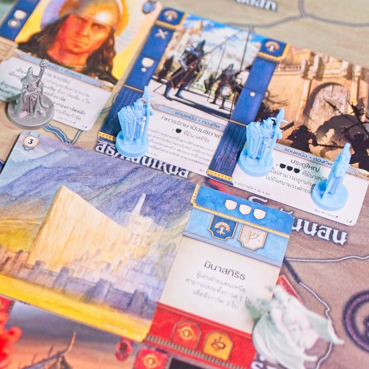
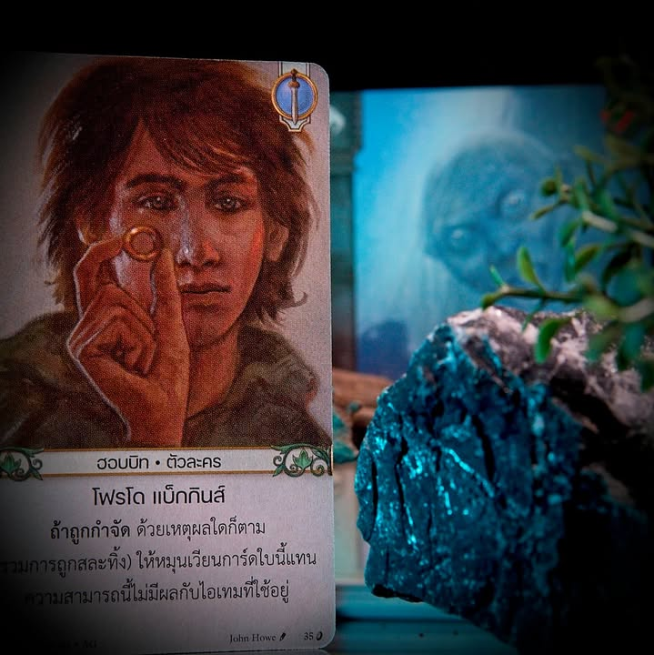
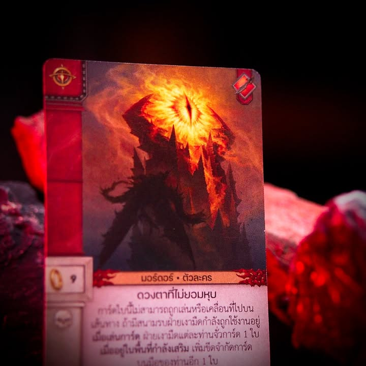
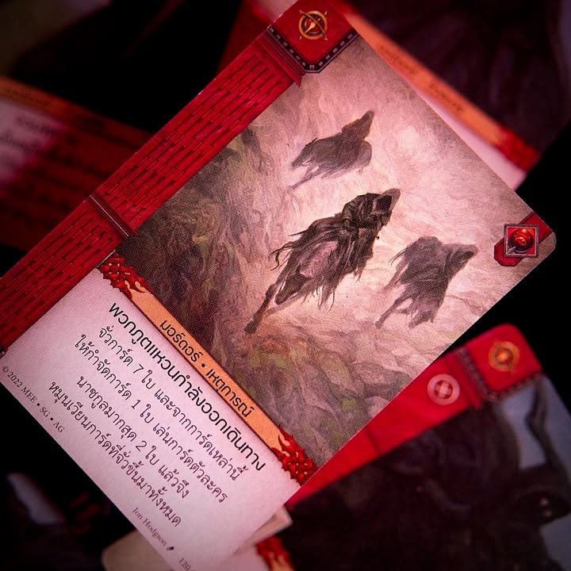

War of the Ring: The Card Game #thought

การ์ดเกมแนวทีมเพลย์ที่ว่าด้วยมหากาพย์แห่งแหวน ผลงานของ Ian Brody (Quartermaster) ซี่งโดยไอเดียแล้วมันก็เป็นการออกแบบที่อิงมาจากเกมระดับรางวัลนั้นคือ War of the Ring ฉบับเกมกระดานมาอีกที แต่คราวนี้มันกลายเป็นการ์ดเกมสำหรับ 4 คนที่ใช้เวลาและยุ่งยากน้อยกว่า

.
ผู้เล่นจะแบ่งออกเป็น 2 ฝ่ายคือฝ่ายเงามืดและฝ่ายเสรีชน และในแต่ละฝ่ายก็จะมีแยกออกไปอีก 2 ทีมคือในฝั่งเสรีชนจะมีทีมฮอบบิท และ คนเหนือ/พ่อมด/เอลฟ์ ส่วนฝั่งเงามืดก็จะมีทีมซารูมาน และเจ้าแห่งแหวน (aka. ตัวร้ายที่ present ได้ด๋อยที่สุดในประวัติศาสตร์แฟนตาซี เปิดตัวมาก็โดนตัดนิ้วแหวนหาย จนจบเรื่องยังเห็นแค่ลูกกะตา) โดยแต่ละทีมจะมีชุดการ์ดตายตัวเหมือนกันทุกเกม 

.
ไอเดียของเกมจริงๆคือการลงการ์ดในมือเพื่อต่อสู้แย่งชิงเอาพื้นที่ที่ถูกเปิดมาในแต่ละรอบซึ่งจะเปิดมา 2 แบบ คือสนามรบกับเส้นทางซึ่งก็เหมือนกับเป็นเส้นเรื่องคัทซีนเวลาดูหนัง ตัวเส้นทางก็จะค่อยๆไล่จากไชร์ไปจนถึงมอร์ดอร์ ในขณะที่สนาบรบจะสุ่มๆมา สถานที่ก็ถ้าเสพสื่อมาก็จะคุ้นเคยกันดี

.
ตัวการ์ดมีการใช้หลายแบบแต่ว่ากันง่ายๆก็เอาไปสู้ในสนามที่อยากใช้นั้นแหละ โดยตัวสนามจะกำหนดเอาไว้ด้วยว่าสนามนี้ฝ่ายไหนทีมอะไรถึงจะส่งมาสู้ได้ คือไม่ใช่เป็นเจ้าแห่งแหวนจะส่งนาซกูลมาสู้ที่ออร์ธังค์หน้าบ้านซารูมานมันบ่ด้ายยยย คือมันก็ตามโลเคชั่นแผนที่กับเนื้อเรื่องนั้นแหละ 

.
ส่วนฝั่งการ์ดเส้นทางเกมนี้เล่นกัน 9 รอบ ในแต่ละรอบเราจะสุ่มการ์ดเส้นทางประจำรอบมา พวกการ์ดตัวละครถ้าไม่ไปสนามรบก็สามารถมาที่การ์ดเส้นทางได้แต่ว่ามันจะมีกำหนดไว้ด้วยนะว่าตัวละครไหนจะมาได้ช่วงไหนของเส้นทาง แบบแมงมุมชีลอบจะมาโผล่หน้าไชร์ไม่ได้ ต้องโผล่มาตอนเส้นเรื่องช่วง 6 ขึ้นไปไรงี้

.
ตอนวัดว่าใครชนะก็ไม่ได้ยุ่งยากอะไรเอาพลังฝ่ายบุกฝ่ายรับมาดูว่าใครเยอะกว่านั้นแหละ ชนะก็เอาสนามรบมาเก็บไว้เป็นแต้ม

.
ไอเดียการลงการ์ดมีสองแบบคือส่งไปเลยกับวางไว้ข้างหน้าเพื่อดูเชิง และด้วยความที่สนามรบมันกำหนดว่าใครจะโผล่ไปได้บ้าง การเล่นเป็นทีมเพื่อบริหารความน่าจะเป็นของการแบ่งกำลังเลยค่อนข้างสำคัญในเกมนี้ เพราะว่าทุกครั้งที่ใช้การ์ดเราจะต้องทิ้งการ์ดอีกใบไปยังกอง discard เสมอ ซึ่งกว่ามันจะกลับมาใหม่ตอนที่กองจั่วหมด หมายความว่าการ์ดที่ไม่ได้ใช้ตอนนี้เราก็สามารถพักเอาไว้รอตอนท้ายเกมก็ได้ แต่ในขณะเดียวกันบางทีของที่อยากใช้ดันออกมาพร้อมกันทำให้ต้องคิดหนักอยู่นะว่าจะยอมทิ้งใบไหนไป

.
ด้วยความที่เกมนี้เล่นทุกรอบการ์ดเหมือนกันหมด เกมมันก็จะสนุกขึ้นเรื่อยๆเมื่อวงเล่นซ้ำกันหลายครั้ง เพราะมันจะเป็นการรู้และบริหารความเสี่ยงว่าอีกฝ่ายจะเล่นการ์ดนั้นนี้ไหม หรือว่าจะบุกเอาสนามรบนี้ดีไม่รอแล้ว อย่างฝั่งเซารอนอ้าวปล่อยนาซกูลออกมาหมดแล้วฝั่งเส้นทางก็สบายล่ะไปทำแต้มทางโน้นดีกว่าก็ได้อะไรแบบนั้น 

.
แต่ทั้งนี้ก็ไม่ใช่เกมแบบที่ไม่รู้การ์ดอะไรเลยแล้วจะเล่นแพ้เสมอไปนะ แต่แน่นอนว่ามันก็มี learning curve นิดหน่อยถ้าไม่เข้าใจกองการ์ดตัวเองว่าทำอะไรได้ก็จะเสียเปรียบอยู่เหมือนกัน

.
เกมนี้เล่นได้หลายจำนวนผู้เล่นก็จริงแต่ส่วนตัวคิดว่าสนุกสุดอยู่ที่ 4 ไม่แนะนำจำนวนอื่น คือผมลองสองคนมาทั้งสองโหมดล่ะคือรวมสำรับเข้าด้วยกัน ปรากฎว่าการ์ดมันออกมามั่วฉิบหายเลยจ้าาาา ยิ่งสนามรบที่ออกมาไม่ตรงกันมันก็จะแบบรู้สึกว่าตานั้นเสียเปล่ามาก ในขณะที่โหมดแบบสั้นมันก็ขาดอารมณ์ของความไม่รู้ว่าเพื่อนเราจะออกของอะไรมาช่วย คือแนะนำว่าถ้า 2 คนไปกางตัวบอร์ดเกมดีกว่าเยอะ ส่วน 4 คนก็มาลงการ์ดเกมแทน (แต่ถ้าจะเอาเรื่องธีมและเนื้อเรื่องละก็ ตัวบอร์ดเกมนี้เข้าถึงได้ดีกว่านะ)

-----------------------------------------

🐸 [กบโอเค] 

-----------------------------------------
+ Easy to teach
+ Easy to setup & tear down
+ Low complexity, medium depth
+ Manageable luck 
+ Reward experience play
- Scalability, best only at 4
= Where is 'The One Ring'? 

.
เป็นเกมที่สนุกดีครับตอนเล่น 4 คน ทำจังหวะการชิงการ์ดในแบบที่รู้สึกแบบผลัดกันแพ้ผลัดกันชนะ แต่ละฝ่ายมีท่าเก่งเป็นของตัวเอง และด้วยการ์ดที่ให้เล่นต่อรอบมีจำกัดการตัดสินใจก็เลยมีเกิดขึ้นตลอดเพราะมักชนะกันแค่ปลายเล็บ จุดที่คิดว่าทำมาดีอีกอย่างคืออารมณ์ของความเป็นทีมที่ไม่ได้แบบเหมือนต่างคนต่างเล่นกันคนละสนาม และก็ไม่ได้แบบอีกฝ่ายต้องมาชี้นิ้วบอกอะไรแบบนั้น คือรู้สึกมันวางความเป็นบุคคลที่มีเป้าหมายร่วมกันได้ดี ไม่ใช่เกมแบบทำคนเดียวก็ได้แต่แบ่งให้สองคนทำ 
--------------------------------
📌 disclosure: 
* Legendary Wargame ผู้แปล/นำเข้า/จัดจำหน่าย ส่งสินค้ามาให้ผมลองเล่น แต่ข้อเขียนนี้เป็นการแสดงความเห็นของผมที่มีต่อเกมโดยไม่ได้เป็นการรับจ้าง หรือเป็นข้อเขียนเพื่อการโฆษณา
--------------------------------

😍 กบโปรด - อวยไส้แตก ยากมากที่เล่นแล้วจะรู้สึกไม่สนุก
.
😁 กบชอบ - พร้อมจะเล่นตลอด 
.
🙂 กบโอเค - ชอบในบางแง่มุม แต่อาจจะเล่นไม่บ่อยหรือเล่นแค่บางอารมณ์
. 
😐 กบเฉย - ไม่ได้เกลียดอะไร ถ้าไม่มีตัวเลือกอื่นก็เล่นได้อยู่
.
🖕 กบไม่เล่น - ไม่ตรงจริต (ไม่ได้แปลว่าห่วยหรือไม่ดี) ขอเล่นเกมอื่นล่ะกัน
.
อนึ่ง : เป็นความรู้สึกในความ "อยากจะหยิบมาเล่นไหม?" ของผมเอง ไม่ได้เกี่ยวอะไรกับคุณภาพของเกม ดูให้เป็นแค่ "อีกความคิดเห็นหนึ่ง" เท่านั้นก็พอนะครับ :)
.
ข้อเขียนที่ยาวหน่อยถ้าใน fb อ่านยากสามารถไปอ่านใน boardnbon.wordpress.com ได้ครับจะจัดหน้าดีกว่านี้
-------------------------------------------

