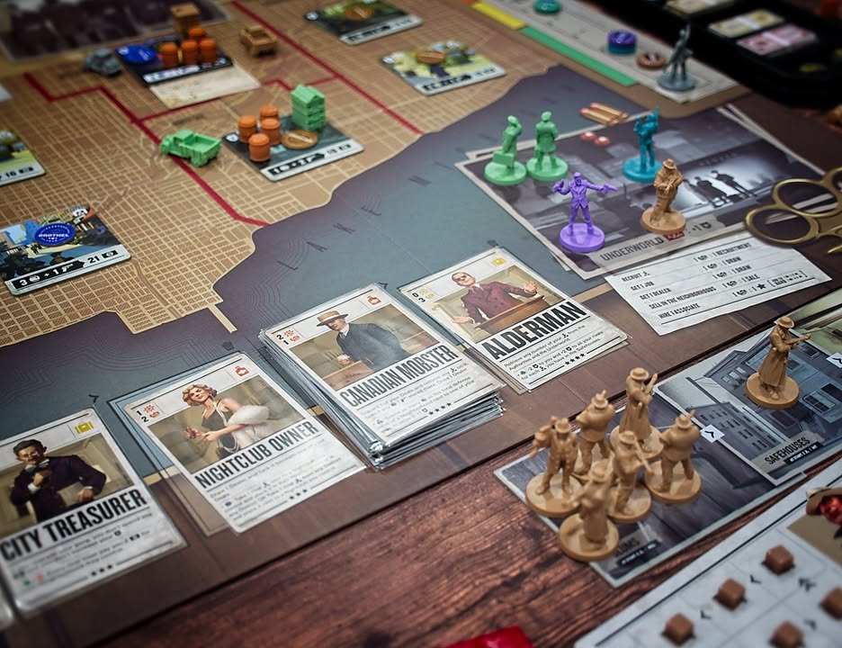
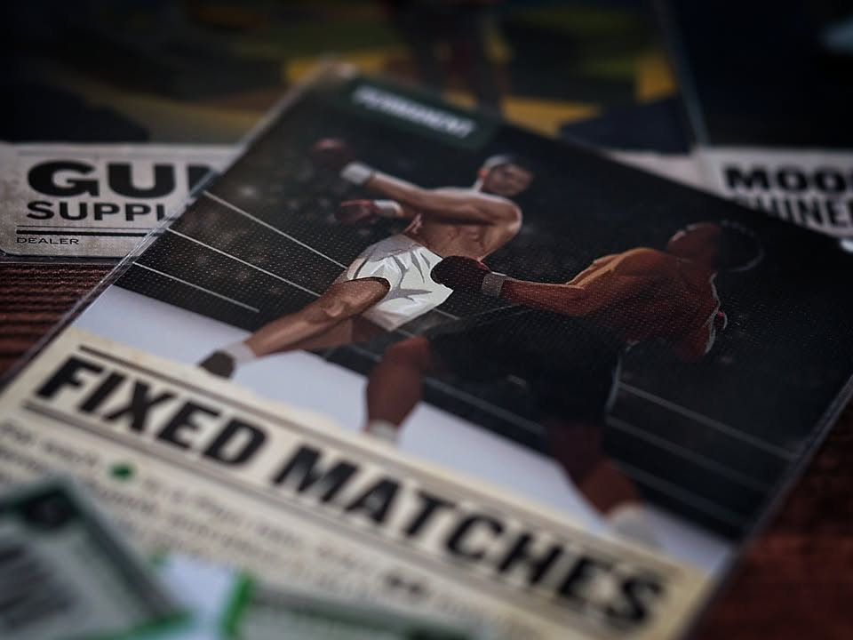
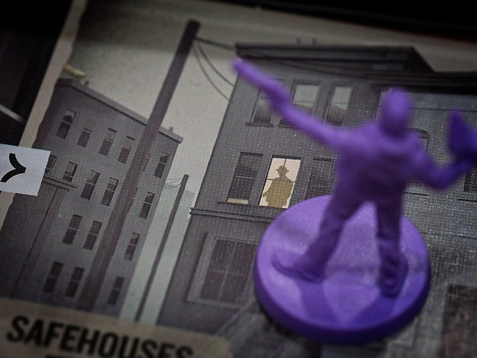
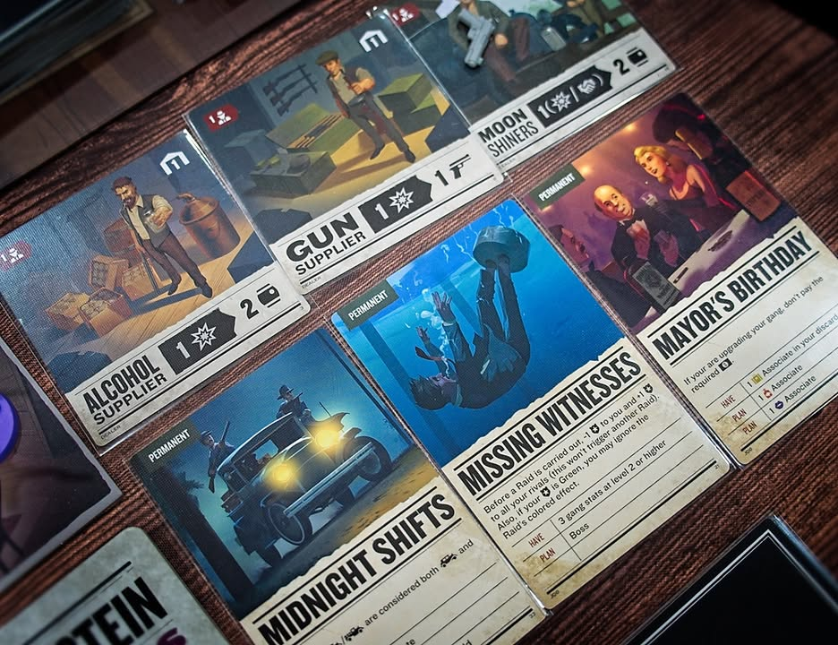

Scarface 1920 #bite_size #first_impression 

เกมธีมเจ้าพ่อมาเฟียอิตาเลี่ยนบนแผ่นดินอเมริกันที่เราจะต้องมาแย่งชิงพื้นที่ย่านการค้า ต่อรองเจรจากับเจ้าหน้าที่ เพื่อหาสุดยอดเจ้าพ่อ!

.
เป็นความเห็นสั้นๆจากการที่พึ่งเล่นไปครั้งเดียวนะ

.
ตอนเล่นคืออย่าคิดว่ามันเป็น area/majority control (ถึงภาพจะเหมือน) จริงๆเรียกว่าเกมผลิตของมาขายแบบมี conflict ได้จะตรงกว่า เพราะเกมมันชนะกันที่เงิน ซึ่งส่วนมากมาจากการขายของในถิ่นที่ตัวเองเป็นเจ้าของ และถ้าหวังว่ามันจะเป็นเกมแนวเจ้าพ่อสร้างทหารมายิงกันก็ข้ามไปเลย เกมนี้ตีโคตรไม่คุ้ม จะเสียเวลายึดที่เปล่ายังคิดหนักเลย

.
ระบบเกมจะเดินในทรง Deck Building จางๆแบบ Dune ที่ตาเราจะทิ้งการ์ดในมือเพื่อทำแอคชั่นแต่เราจะได้ทำ 3 อย่างเลยคือ เอาไอคอนและเงื่อนไขการ์ดที่เล่นไปปลดล็อกรับงานพิเศษที่จะให้โบนัสพิเศษกับเรา + เลือกใช้ความสามารถของการ์ดใบใดใบหนึ่ง + เลือกทำ 'หนึ่ง' ในแอคชั่นเบสิคสิบกว่าแบบ ซึ่งพวกแอคชั่นมันก็จะมี cost ที่เรียกเอาจากการ์ดที่เราเล่นอีกที คือลงทีนึงต้องคิดเยอะเลย

.
แอคชั่นก็จำพวกส่งคน ย้ายคน ผลิตของ ขายของ ไรงี้บางหมวดที่ท้าทายกฎหมายหน่อยเวลาทำก็จะทำให้เจ้าหน้าที่เฝ้าระวังแก๊งเรามากขี้น พอเข้าช่วงหนังสือพิมพ์ทำข่าวเนี่ยพวกแก๊งที่โฉ่งฉางก็จะโดนเล่นหนักกว่าเจ้าที่ทำตัวแอบๆ แต่ในขณะเดียวกันความแรงของการเล่นมันก็แตกต่างกันด้วย

.
เกมใช้การ์ดและแอคชั่นในการเล่าเรื่องดี อาร์ทสวยทุกอัน การ์ดแต่ละอันมันก็โกงในเวย์ของมันจนแอบรู้สึกว่ามันอาจจะ op หน่อยแต่ก็ไม่คิดว่ามันโกงเว่อร์นะ

.
เอาแบบสั้นๆคือมันเป็นเกมที่มีแนวคิดกับวิธีการเล่นแล้วก็ระบบสำหรับเกมระดับท็อปเต็มไปหมด ดารานำโดดเด่น กลไกคลีนเข้าใจง่าย ธีมที่มีการนำเสนอดี อุปกรณณ์สวย ติดอยู่นิดเดียว และเป็นหมวดเดียวที่ทำให้กลายเป็นเกมที่ผมไม่อยากเล่นซ้ำ นั้นคือ 'จังหวะการดำเนินเกม'

.
คือแม่มช้า แบบช้า หนึดมากๆ จำนวนสิ่งอยากทำในเกมมีเยอะมากและน่าสนุกทุกสิ่งแต่ในตานึงเราทำได้แค่ 1/4 ของสิ่งที่ควรจะได้ทำก็ต้องผ่านรอบรอวนกลับมาใหม่อีกล่ะ

.
เทียบกับเกมทั่วไปตานึงเราจะได้การ์ดเข้ามือมาเล่นทีละใบทำแอคชั่นวนๆกันไป แต่เกมนี้คือซื้อจั่วมาเล่นการ์ดเกือบหมดมือ อยากจะเดินไปตีก็ผลิตตานึง สร้างรถตานึง เดินตานึง ตีตานึง ในขณะที่มันยังมีอย่างอื่นให้ทำอีกมากมายแต่ทุกสิ่งมันเดินช้าจนเกมสนุกๆที่น่าจะจบใน 120 นาทีกลายเป็นเกมที่ยืดยาวแบบไม่ต่อเนื่องไปซะเฉยๆ อยากทำอะไรก็ไปได้ไม่สุดซักอย่างเล่นละหงุดหงิด interaction แบบที่ควรจะเป็นในการขัดขวางกันก็เบาบางส่วนหนึ่งเพราะมาจากการที่จะทำอะไรมันช้าจนขี้เกียจทำ แบบจะซื้อการ์ดใบนึงก็หมดไปแล้วตานึง ทำให้อารมณ์อยากปั้น deck ปั้นท่านี้จบเลยดับสนิท พอเล่นหมด deck ก็ยังต้องมาเสียตาเพื่อ reset deck อีก คือมันก็ปกติในเกมบริหารหลายๆแบบแต่กับ deck building นี้รู้สึกค่อนข้างขัดใจมาก ไม่ลื่นไหล

.
ถ้าคิดแบบเร็วๆก็ถ้ามี rule แบบที่ให้เราได้ทำแอคชั่นได้รัวๆนี้จะเปลี่ยนจากเฉยเป็นชอบได้ง่ายๆเลย เพราะวัตถุดิบเกมมันพร้อมมากๆแล้ว เสียดายมาก

.
แต่ทั้งนี้ถ้าเป็นสายยูโรที่ชอบธีมชอบ confict ทรงไม่โฉงฉางแต่ไถเงินบ่อยกับไหล engine แบบเนิบๆไม่รีบเร่งก็แนะนำนะ เกมมันนำเสนอดีจริงๆ

.
เรท - เสียดาย เสียดาย เสียดายโว๊ยยยยยยยยยยย

--------------------------------
หมวด Bite Size (พอดีคำ) นี้กะว่าจะเขียนอะไรสั้นๆประมาณนี้ล่ะกัน ใหม่บ้าง ซ้ำบ้าง เกมที่ขี้เกียจเขียนบ้าง เขียนๆไว้ก่อนเผื่อมีอารมณ์อาจจะขยายไปลง Thought บ้าง จริงๆอยากเขียนสั้นกว่านี้ แต่ยังอดไม่ได้ที่จะต้องอธิบายอะไรเพิ่มตามนิสัย เดี๋ยวค่อยๆปรับไปล่ะกัน

