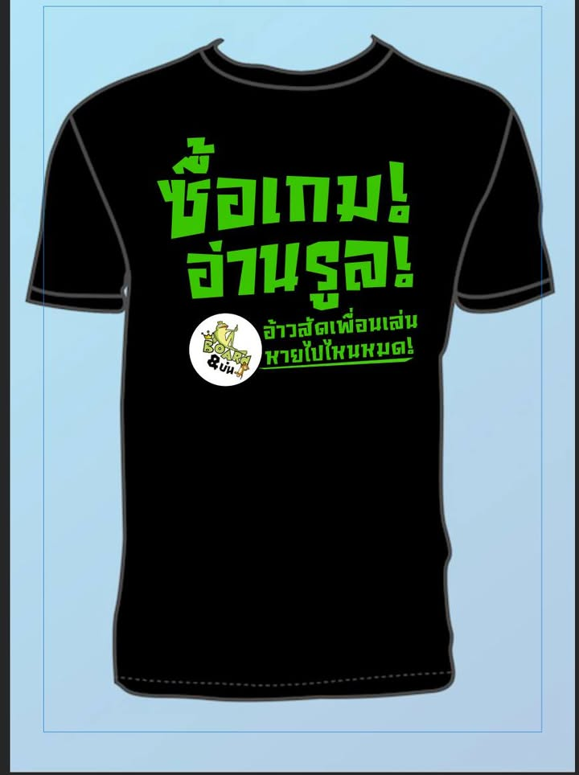
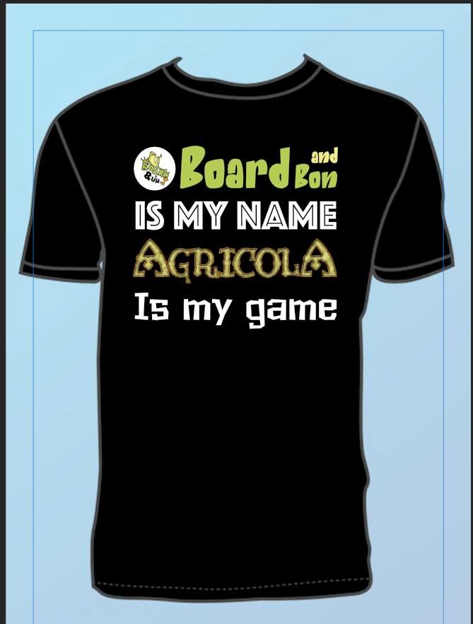
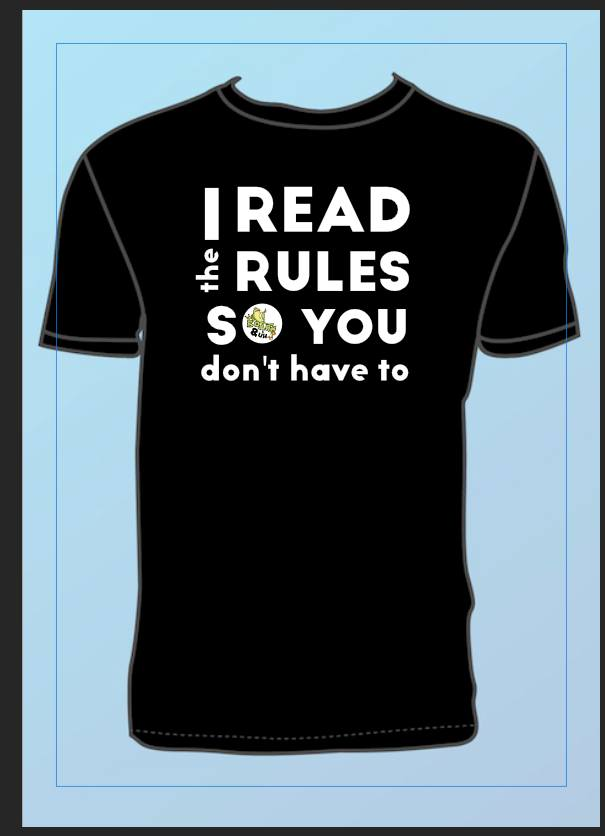

ไม่ได้ทำขาย ไม่ได้มา IC (interest check) แค่มาเล่าให้ฟังกับขอคำแนะนำเฉยๆ 

.
พอดีงาน Game Till Dawn เพจเพื่อนบ้านเจ้านึงเค้าบอกอยากทำเสื้อผมเลยเออหว่ะมีมั้งดีกว่า ก็เลยไปนั่งๆจัดวางแล้วสั่งจากร้าน online เอา ไม่แพงเท่าไร แต่พอขอมาถึงละรู้สึกว่าออกแบบได้เห่ยสัด.... แถมวางต่ำเกินไปเยอะเลย

.
วันนี้เลยมีอารมณ์อยากไปดูๆงานชาวบ้านแล้วลองออกแบบเพิ่มอีกสองสามแบบ (แบบวาดไม่ไหวอ่ะนะ ไม่มี skill) 

.
คำถามคือ แนะนำร้านสกรีนเสื้อดีหน่อยที่รับแบบตัวสองตัวทีครับ หรือถ้ามีไอเดียหรือคำแนะนำเรื่อง ตำแหน่งวาง / font / layout อะไรแนะนำก็บอกได้ครับ ขอบพระคุณล่วงหน้า

