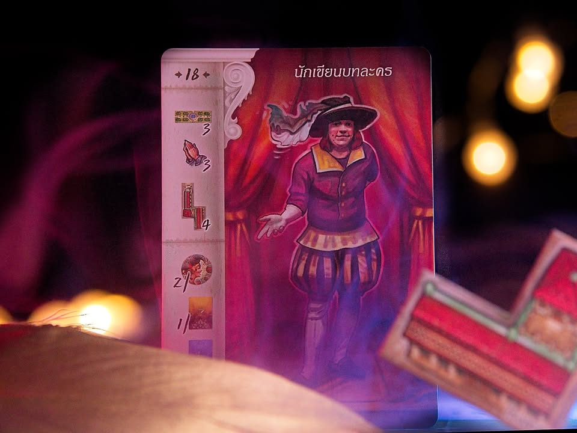
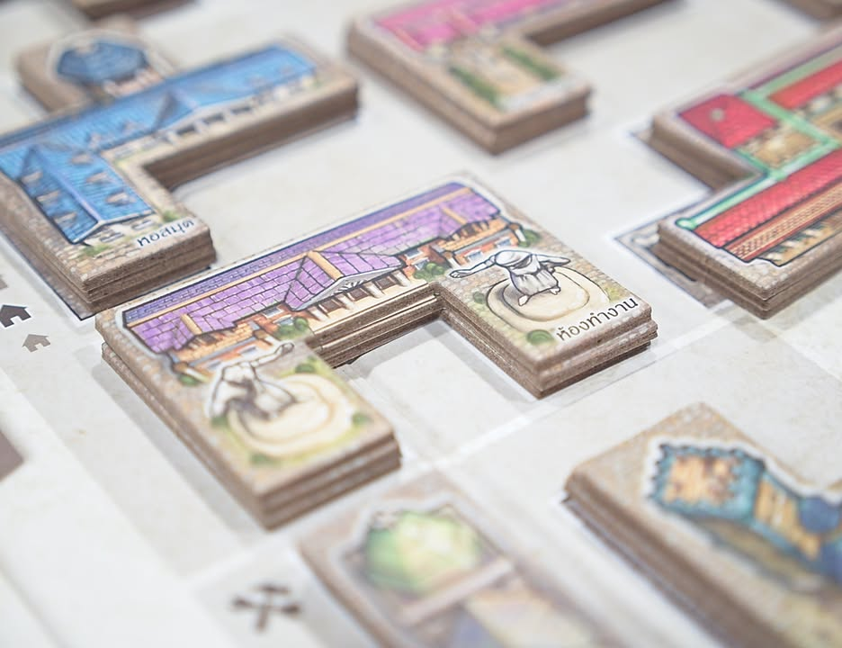
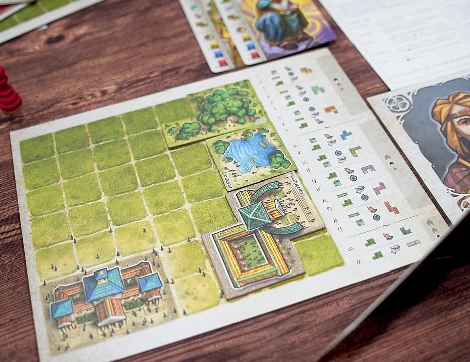

The Princes of Florence #thought 

ฟลอเรนซ์ - ศูนย์กลางทางการเงินในยุคเรืองปัญญา เป็นช่วงที่งานศิลปะจากศิลปินโลกต้องจารึกไว้ถือกำเนิดขี้นมามากมาย มีเกลันเจโล หรือเลโอนาร์โด  ดา วินชี เองก็อยู่ในยุคสมัยนี้เช่นกัน

.
แต่สิ่งที่หลายคนอาจจะไม่รู้นั้นคือศิลปินเหล่านี้นั้นจะไม่สามารถนั่งๆนอนๆกระดิกเท้าผลิตงานศิลป์ได้อย่างสบายใจเลยหากปราศจากเหล่าผู้มั่งคั่งที่จะมาคอยอุปถัมภ์ ทั้งพื้นที่และการเงินให้พวกเค้าได้ผลิตผลงานออกมา

.
และนั้นแหละหน้าที่ของพวกเรา - เหล่าเจ้าชายแห่งฟลอเรนซ์ อีกผลงานชั้นยอดจากนั้นออกแบบชั้นครู Wolfgang Kramer (El Grande, Tikal, Downforce)

.
ไอเดียของเกมตามธีมนั้นแหละเราจะมีการ์ดศิลปินหลายๆแขนงอยู่จำนวนหนึ่ง ซึ่งศิลปินพวกนี้จะผลิตงานเทพๆออกมาได้ผู้อุปถัมภ์อย่างเราก็ต้องโอ๋ไปสร้างตึก สร้างสวน ขุดบ่อ ให้สิทธิ์พิเศษบลาๆ กระทั้งจ้างตลกคาเฟ่มาเล่นมุกให้คลายเครียด

.
ซึ่งเกมจะแบ่งเป็นสองส่วนคือในตอนแรกจะเป็นการประมูลของมา และในช่วงหลังจะเป็นการใช้แอคชั่นที่จำกัดเพื่อสร้างหรือพัฒนางานให้ศิลปิน

.
ซึ่งศิลปินเนี่ยเวลาผลิตผลงานมันจะมีสิ่งที่เรียกว่า Work Value หรือคุณค่าของผลงานซึ่งผลงานจะดีไม่ดีก็อยู่ที่สิ่งอำนวนความสะดวกที่เราประเคนให้ยิ่งตรงความต้องการก็ยิ่งได้งานมีคุณค่า จากนั้นเราต้องตัดสินใจว่าจะแปลงงานศิลป์มาเป็นเงิน/แต้มเท่าไร 

.
ซึ่งไอ้คุณค่างานเนี่ยมันมีขั้นต่ำด้วยนะ ถ้ารวมกันไม่ถึงก็ห้ามผลิตออกมา  (นัยว่าต้องอายเพื่อนเศรษฐีคนอื่นหน่อยนะ) ยิ่งรอบท้ายตัวเลขขั้นต่ำยิ่งเพิ่ม และเกมนี้ศิลปินทั้้ง 21 คนนั้นมีความต้องการไขว้กันไปมาแต่ว่าไม่มีคนไหนเหมือนกันเลย แล้วตึกที่เราจะสร้างแม่มก็ทรงวางยากๆในพื้นที่แคบๆอีกต่างหาก ทำให้ต้องวางแผนและจัดลำดับการสร้างและการเล่นการ์ดเพิ่มมูลค่างานศิลป์ให้ดี รวมถึงต้องระมัดระวังเรื่องงบในการใช้จ่ายของเราด้วย

-----------------------------------------
🐸 [กบชอบ]  
-----------------------------------------

ผมชอบเกมนี้มาตั้งแต่สมัยเล่นเกมกระดานใหม่ๆตั้งกะสิบกว่าปีโน้นแล้ว มันเป็นเกม classic tier ที่เสร็จสมบูรณ์เรียบร้อย เป็นเกมสไตล์เน้นกลไกหลักอันเดียวแล้วดันไปให้สุด 

.
คนที่เหมาะกับเกมนี้จริงๆแล้วจะเป็นผู้เล่นสาย 'อ่านเกมและ keep track' จำพวกคนนี้ซื้ออันนี้ แล้วจะประเมินว่าเค้ากำลังอยากได้อะไร เราควรทำตามบ้างไหมจะได้จ้างซ้ำ อะไรทำนองนั้น แต่ถ้าไม่ได้ mindset มาทางนี้ก็คิดว่าไม่เหมาะเท่าไรเพราะจะรู้สึกว่าเกมมันกร่อยๆจั่วมั่วๆ สร้างก็ยากจัง คือเกมนี้สิ่งที่อยากทำกับจำนวนที่ทำได้มันน้อยจนอึดอัด ไม่มีพื้นที่ให้เล่นพลาดเท่าไร

.
ความสนุกจากการดูว่าชาวบ้านอยากได้อะไรเนี่ยแหละทำให้การเลือกหยิบไทล์ที่คนอื่นมาปั่นราคาแล้วหาจังหวะถอยหรือเลือกหยิบของชิ้นไหนมาประมูลเพื่อตัดคู่แข่งในของที่เราอยากได้จะได้ราคาถูกๆก็ถือเป็นหัวใจสำคัญอย่างหนึ่งของเกมนี้นะ

.
ลักษณะประจำตัวของเกมนี้คือมัน reward การเล่นซ้ำและการทำความเข้าใจในเรื่องมูลค่าของของที่จะประมูลอยู่มากๆ ซึ่งในตาแรกนั้นคุณอาจจะพบว่า..... เกมมันดูมั่วไปนิดหรืออะไรบางอย่างมันโกงไปป่ะว่ะ? 

.
ซึ่งเอาจริงๆเล่นมาก็ไม่รู้สึกว่าไทล์จำอวดมันโกงนะ (คือมันเป็นตัวเพิ่มมูลค่างานแบบ wildcard เพิ่มได้ทุกศิลปิน) ผู้เล่นมีหน้าที่ต้องไปปั่นราคามันเองและถ้ามีเยอะไปในราคาที่แพงก็แปลว่าแต้มจะไม่ค่อยมีไปด้วย คือถ้ามีคนได้จำอวดเยอะแล้วยังชนะไม่ได้แปลว่าจำอวดเก่ง แต่คนอื่นในวงน่ะอ่อน ในแง่นี้นั้นเกมนี้ไม่ใช่เกม 'ลองท่า' มันคือเกมที่ต้องอาศัยจังหวะการอ่านเกมแล้วล้อไปตามนั้น

.
ข้อเสียจริงๆคือ scalebility มันไม่ค่อยดีเท่าไรตามสไตล์เกมประมูลอะนะ แต่เห็นว่าบอท solo ดันทำมาโอเคแต่ผมยังไม่เคยลองเหมือนกัน

.
ผมยินดีมากๆที่มันกลับมาตีพิมพ์ใหม่ด้วยงานศิลป์งานหยด ไม่ต้องลำบากเอางานอาร์ทเชยๆยุคโน้นมาบิ้วคนเล่น ถ้าใครเป็นสายเกมระดับ Classic กฎไม่ต้องยากมากแต่เกมเน้นๆ หรืออยากได้เกมแนว Timeless ติดชั้นวางไว้ก็แนะนำเกมนี้ครับ แต่ถ้าชอบชิมไวๆแล้วไปเล่นเกมอื่นเกมนี้ก็ไม่เหมาะนะ ตัวเสริมนี้ถ้าเข้าใจเกมแล้วจะพบว่ามันส์ขี้นอีกเยอะเลย แต่ก็ต้องอ่านเยอะหน่อยไม่เหมาะกับเกมแรก

--------------------------------
📌 disclosure: 
* Board Game Academy / Luna Cafe ผู้แปล/นำเข้า/จัดจำหน่าย ส่งสินค้ามาให้ผมลองเล่น แต่ข้อเขียนนี้เป็นการแสดงความเห็นของผมที่มีต่อเกมโดยไม่ได้เป็นการรับจ้าง หรือเป็นข้อเขียนเพื่อการโฆษณา
--------------------------------

😍 กบโปรด - อวยไส้แตก ยากมากที่เล่นแล้วจะรู้สึกไม่สนุก
.
😁 กบชอบ - พร้อมจะเล่นตลอด 
.
🙂 กบโอเค - ชอบในบางแง่มุม แต่อาจจะเล่นไม่บ่อยหรือเล่นแค่บางอารมณ์
. 
😐 กบเฉย - ไม่ได้เกลียดอะไร ถ้าไม่มีตัวเลือกอื่นก็เล่นได้อยู่
.
🖕 กบไม่เล่น - ไม่ตรงจริต (ไม่ได้แปลว่าห่วยหรือไม่ดี) ขอเล่นเกมอื่นล่ะกัน
.
อนึ่ง : เป็นความรู้สึกในความ "อยากจะหยิบมาเล่นไหม?" ของผมเอง ไม่ได้เกี่ยวอะไรกับคุณภาพของเกม ดูให้เป็นแค่ "อีกความคิดเห็นหนึ่ง" เท่านั้นก็พอนะครับ :)

-------------------------------------------

