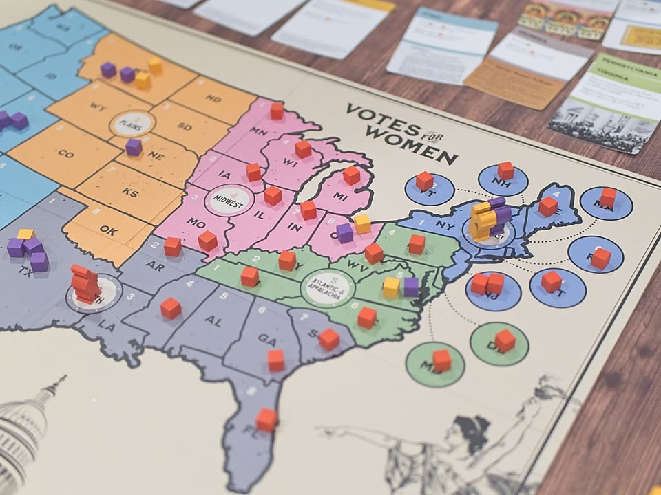
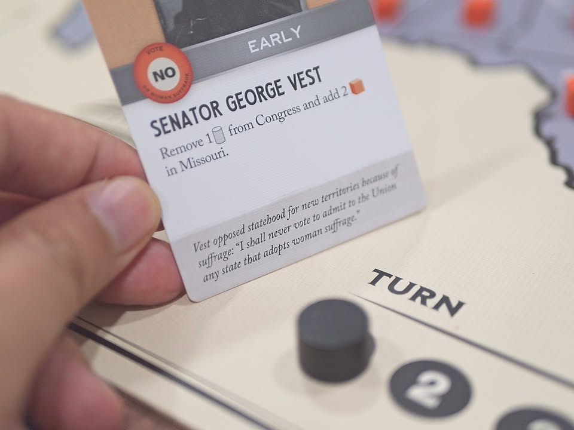
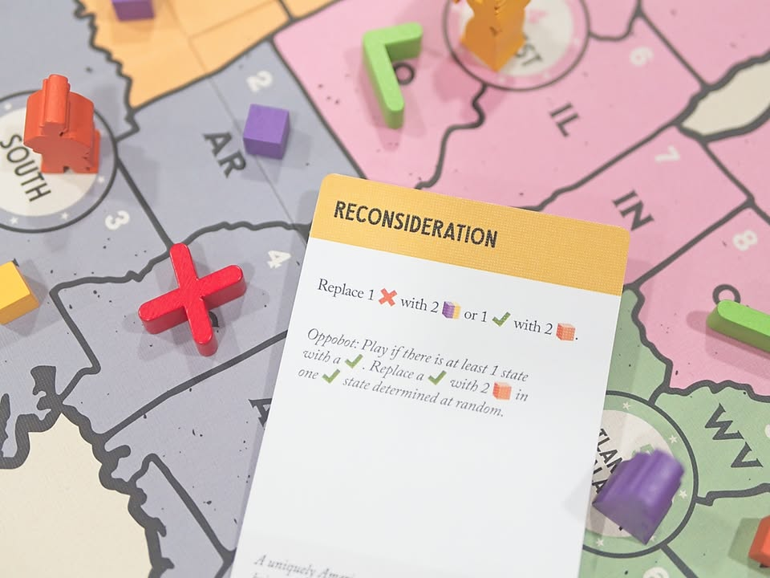
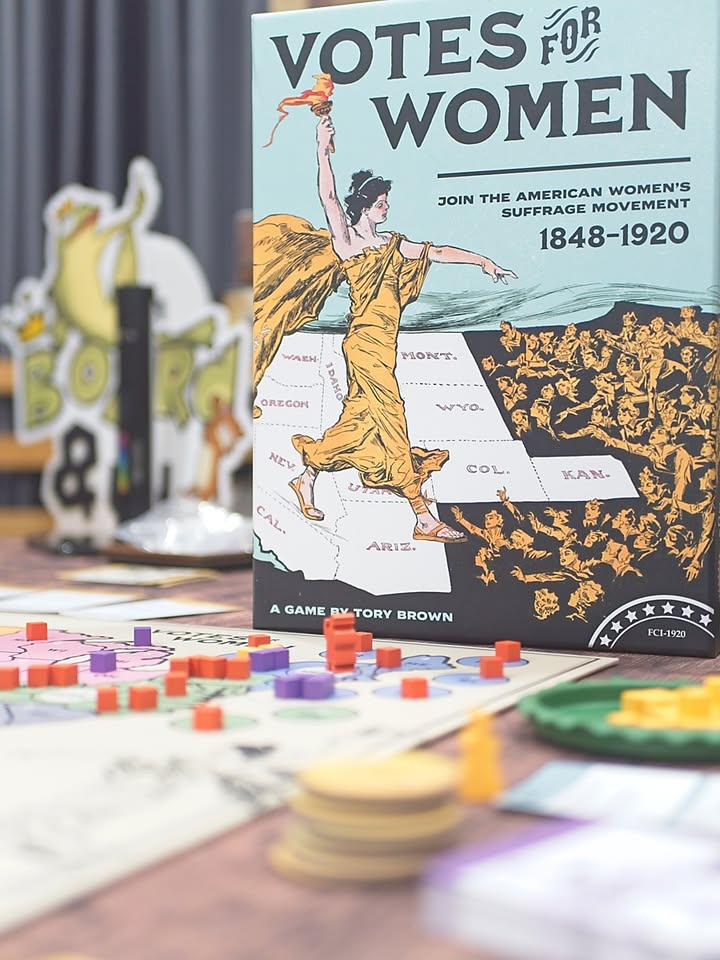

Votes for Women #bite_size #first_impression 

.
สมาชิกวุฒิสภา จอร์จ เวส - "ข้าพเจ้าจะไม่ลงคะแนนเสียงเพื่อยอมรับกฏหมายใดๆที่เกี่ยวข้องกับสิทธิสตรีไม่ว่าจะในรัฐไหนๆ"

.
แม้การเลือกตั้งจะเป็นหนี่งในเรื่องที่แสนปกติของการจัดตั้งผู้นำหรือผู้แทน แต่คุณรู้ไหมว่าในสหรัฐอเมริกาเมื่อ 100 ปีก่อนรุ่นปู่ทวดเรานี้เอง ผู้หญิงในสหรัฐอเมริกานั้นไม่มีสิทธิในการเลือกตั้ง! โอ้วนี้มันดินแดนแห่งเสรีภาพหรือสภากรีกยุคอริสโตเติล! 

.
สหรัฐอเมริกาในช่วงปี 1848-1920 นั้นสิทธิสตรียังคงอ่อนด้อยอยู่มาก เราจะได้มารับบทเป็นฝั่งผู้สนับสนุนสิทธิ์ของสตรีที่จะคอยสร้างความตื่นตัวและตระหนักในสิทธิ์ของตนรวมถึงผลักดันกฎหมายผ่านสภา ในขณะที่แน่นอนว่าอีกฝั่งนั้นก็คือเหล่าฝ่ายอนุรักษ์นิยมที่คิดว่าสตรีนั้นจะมายุ่งวุ่นวายอะไรน่ะ อยู่ทำงานบ้านไปนั้นแหละดีแล้ว ผลงานของนักออกแบบหญิง Tory Brown ผู้ซึ่งเป็นนักกิจกรรมสังคมและการเมือง โดยได้ไอเดียเกมนี้มาจาก 1960: The Making of The President อีกที

.
และปีนี้คือการครบรอบ 100 ที่บทบัญญัติเพิ่มเติมฉบับที่ 19 แห่งรัฐธรรมนูญสหรัฐฯ ที่้  'สิทธิ์ในการเลือกตั้ง' สำหรับทุกเพศได้รับการเพิ่มเติมเข้าไป 
.
.
แต่เอาจริงๆฝรั่งเศสเองผู้หญิงก็พึ่งเลือกตั้งได้ตอนปี 1945 เองนะ.... ก่อนหน้าผู้มีสิทธิจะสงวนไว้ให้ 'ผู้ชายที่เสียภาษีเกิน 1000 ฟรัง' เท่านั้น (ประมาณ 25% ของประชากรในประเทศ) เรียกได้ว่าอเมริกาล้ำหน้ากว่าเพราะเริ่มมาตั้งแต่ปี 1920 ส่วนของไทยนี้ปี 1933 แถมเท่าเทียมไม่เลือกเพศและชนชั้นตั้งแต่ฉบับแรก!! (ส่วน application แต่ละที่ออกมาเป็นอย่างไรขอละไว้....)

.
นางอิเนส มิลฮอลแลนด์ - "เหล่าเพื่อนสตรีแห่งรัฐทั้งหลายเอย จงมารวมตัวกัน! สิ่งที่เราจะสละทิ้งนั้นมีเพียงโซ่ตรวน และสิ่งที่เราจะได้รับคือประเทศชาติ"

.
เกมนี้ไอเดียจะเป็น majority control ที่แต่ละพื้นที่เป็นระบบการยึดครองแบบชักเย่อของฝั่งสนับสนุนและต่อต้านสิทธิสตรี ส่วนเกมจะเดินด้วยระบบ CGD (Card Driven Game) ตามแบบฉบับ wargame (เป็นผลให้เกมนี้ถูกเข้าชิงสาขา wargame ด้วยนะ) 

.
เกมจะเล่นแบบ fixed round ที่ผู้เล่นจะผลัดกันเล่นการ์ดโดยเลือกได้ว่าจะเล่นตาม event ที่เขียนไว้หรือจะเอาไปทอยเต๋าเพื่อเพิ่มจำนวนผู้สนับสนุนฝ่ายตัวเอง หรือเลือกทอยเพื่อล๊อบบี้เพื่อผลักดันหรือถอดกฎหมายในสภาก็ได้

.
ความน่าสนใจคือเกมนี้แพ้ชนะกันเงื่อนไขเดียวคือฝ่ายสนับสนุนต้องการเสียงจาก 3 ใน 4 ของรัฐทั้งหมด ในขณะที่ฝ่ายต่อต้านนั้นขอเพียงยึดได้ 1 ใน 4 ก็ชนะแล้ว ซึ่งในระหว่างเราก็ชักเย่อจำนวนนี้ไปๆมาๆนี้แหละ แต่เมื่อใดก็ตามที่ผู้เล่นฝั่งสนับสนุนผลักดันกฎหมายจนผ่านสภาพื้นที่ที่ได้รับเสียงท่วมท้นก็จะเริ่มถูก 'ล็อก' ว่าสนับสนุนหรือต่อต้าน และการแข่งขันของสองฝ่ายก็จะเริ่มเข้มข้นขึ้นเรื่อยๆเพราะพื้นที่ที่ให้ต่อสู้มันจะน้อยลงไปทุกครั้งที่เกมขยับเข้าจุดสุดท้าย

.
ข้อดีของเกมนี้หลักๆคือไอเดียง่ายจนน่าตกใจ ก็เล่นการ์ดวาง cube แต่ว่ามันทำจังหวะกับออกแบบการตัดสินใจได้ดีว่าในช่วงนี้เราอยากจะเอาการ์ดไหนไปทำอะไรดีถึงจะตรงแก่สถานการณ์ 

.
จุดน่าสนใจคือเกมมันทอยเต๋าเยอะแบบเยอะเหี้ยๆ แต่ดันรู้สึก related ดี ซึ่งสำหรับผมแล้วมีน้อยเกมมากที่จะได้อารมณ์แบบนี้เพราะส่วนมากก็จะแบบทอยๆให้มันจบๆไป แต่เกมนี้มันรู้สีกได้ว่าเรากำลังวางแผนความเสี่ยงอะไรอยู่ กับมีการให้เราสะสมพลังในการ reroll ได้ด้วย

.
กับแม้ข้อความทางประวัติศาสตร์จะส่งต่อผ่านการ์ดในรูปเก่าๆแต่ด้วยธีมแล้วบรรดาคำพูดของผู้คนเหล่านั้นก็สะท้อนออกมาให้รู้สึกร่วมได้จริงๆนะ ทั้ง สว.  ปากแจ๋วความคิดล้าหลัง และเหล่าสตรีผู้นำที่พยายามผลักดันในเกิดความเท่าเทียมของตัวเอง

.
ในแง่ของ team play นั้นเราจะสามารถดูการ์ดคนในทีมได้ก็แปลว่าอาจจะเกิดความคิดแบบ alpha ได้ ดังนั้นก็จะไม่เหมาะกับกลุ่มที่ไม่ชอบในส่วนนี้นะ แต่ส่วนตัวผมเล่นกันแบบปล่อยให้เล่นกันอิสระแบบปรึกษากันบ้างเพราะมันไม่ใช่เกมแบบเครียดอะไร ดูเพื่อนลุ้นทอยเต๋าก็สนุกดี ตรงนี้ผมก็เลยคิดว่าเล่น 4 คนสนุกกว่า 2 คนนะ แต่ถ้าใครชอบแนว incontrol มากๆก็ 2 คนจะดีกว่า (แต่อย่าลืมว่าเกมมันทอยเต๋าเยอะ)

.
และอีกอย่างที่ไม่เกี่ยวกับเกมแต่ว่าดี แบบโคตรดี ดีที่สุดที่เคยเห็นมาให้วงการเกมกระดาน (ไม่ได้โม้รู้สึกงี้จริงๆ) คือในกล่องมันจะแถมพวกจดหมาย หนังสือพิมพ์ บทความ ประกาศร่าง ฯลฯ กระจุกกระจิกหลายอันมาแบบเป็นของในประวัติศาสตร์ช่วงนั้นมาด้วย คือปกติเราจะเจออย่างมากแค่ booklet ใช่ป่ะ (เกมนี้ก็มีนะ) แต่เกมนี้มันล้ำไปกว่านั้นอีกขั้นอีก คือมันไม่ได้ดูแบบใส่มาส่งๆแบบโปสการ์ดอะไรก็ไม่รู้ แต่มันแฝงอะไรบ้างอย่างทางประวัติศาสตร์มาด้วยจริงๆ

.
โดยเป็น majority control ที่ไม่มีอะไรยุ่งยากแต่ให้บรรยากาศที่ลุ้นมากออกแบบมาลงตัว ยิ่งไปท้ายเกมนี้เชือดเฉือนกันแบบหัวใจจะวาย ถ้าเทียบกับเกมแนวนี้ที่เล่นใกล้ๆกันก็น่าจะซัก Campaign Trial ที่คล้ายใ่นความเป็น majority control + multi-use card และ racing ไปวัดแต้มกันตอนจบครั้งเดียว แต่เกมนี้กระชับและตรงเป้ากว่ามาก แม้จะมีการทอยเต๋าอย่างหนักหน่วงแต่ก็รู้สึกลุ้นและสูสีกับการขับเคี่ยวตลอดเวลา แถมเกมใช้เวลาไม่นานเท่าด้วย 

.
ดีใจที่ได้เล่นครับ ขอบคุณ บอร์ดเกมสนุก - Boardgame Sanook ที่แม้จะทำตัวเป็นพวกปิตาธิปไตย ชายเป็นใหญ่ไม่ยอมรับความเท่าเทียม (และแพ้พ่ายถูกบดขยี้ไปกับกงล้อแห่งความเปลี่ยนแปลงจากผู้สนับสนุน.... เล่นโดยผมเอง) แต่ก็สนุกมาก

.
ถ้าใครเคยเล่นซัก Watergate แล้วชอบก็แนะนำเกมนี้เช่นกันแต่แนะนำที่ 4 คนนะ แต่ถ้าคุณเป็นคนที่ไม่ได้อินหรือสนใจการบริหารจัดการความเสี่ยง หรือว่าอินไปกับธีมก็อาจจะคิดว่าเกมมันดวงแบบด๊วงดวงงง จากการทอยเต๋ามากไปไหมหว่า (แต่ถ้าเป็นคนที่คุ้นเคยกับ mindset แบบ wargame ก็จะไม่รู้สึกว่าแปลกนะ แต่ฝั่งยูโรจ๋าๆอาจจะไม่คุ้นเคยนิดหน่อย) 

.
และเป็นอีกเกมที่ผมคิดว่าผู้ที่สนใจการนำเหตุการณ์จริงมาทำเป็นเกมควรลองเล่นครับ (แน่นอนว่าอีกเกมก็คือ Watergate) เพราะมันเป็นอีกเกมที่เน้นความสนุกไปพร้อมๆกับสามารถเล่าเรื่องที่ต้องการจะสื่อได้อีกด้วย 

--------------------------------
หมวด Bite Size (พอดีคำ) นี้กะว่าจะเขียนอะไรสั้นๆประมาณนี้ล่ะกัน ใหม่บ้าง ซ้ำบ้าง เกมที่ขี้เกียจเขียนบ้าง เขียนๆไว้ก่อนเผื่อมีอารมณ์อาจจะขยายไปลง Thought บ้าง จริงๆอยากเขียนสั้นกว่านี้ แต่ยังอดไม่ได้ที่จะต้องอธิบายอะไรเพิ่มตามนิสัย เดี๋ยวค่อยๆปรับไปล่ะกัน

ท่านประธานครับ รัฐนี้ล็อกผลโหวตไปแล้วก็จริง แต่ขอเปลี่ยนใจได้ไหม เกมยังไม่จบ

