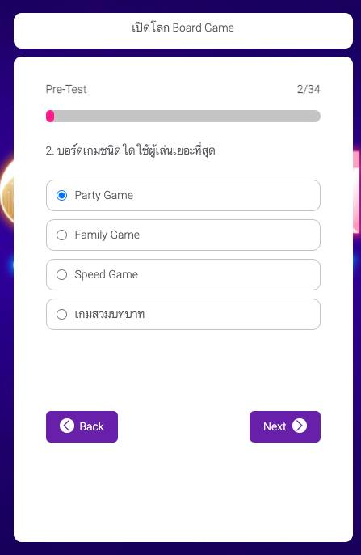
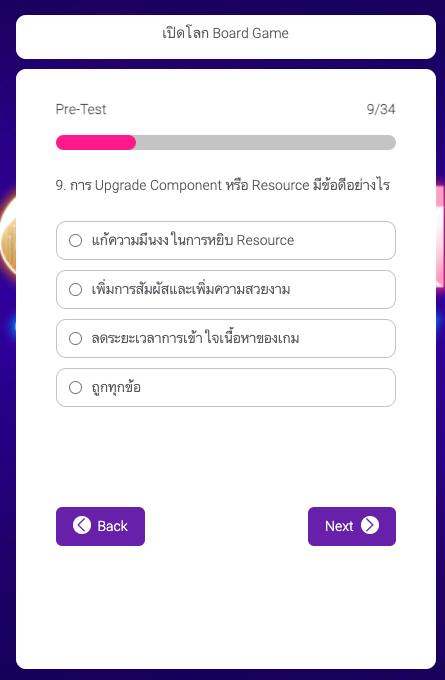
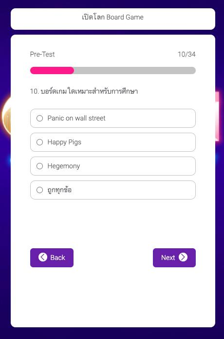
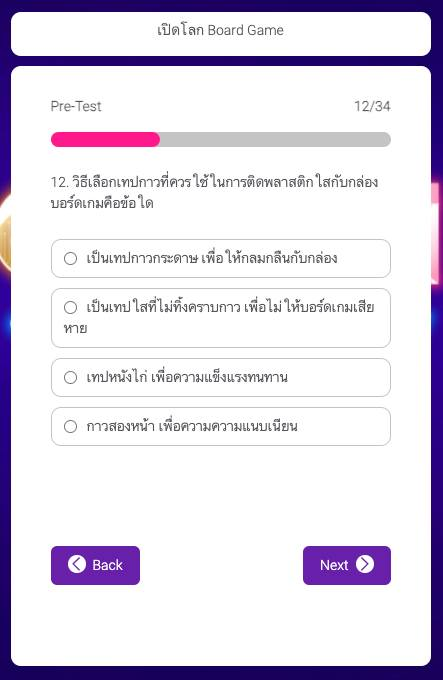
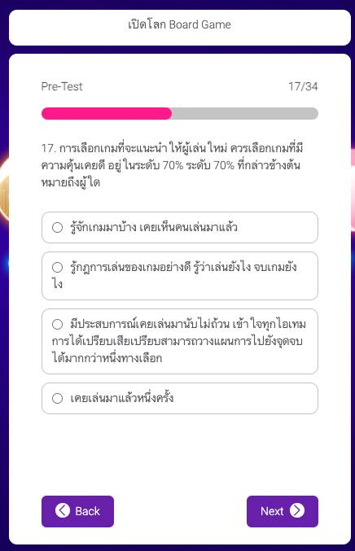
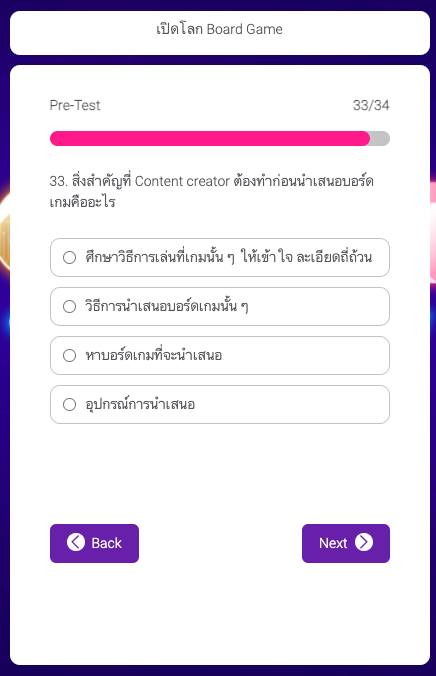

อันนี้เป็นความเห็นเกี่ยวกับ pre-test หรือการทดสอบที่เอาไว้ทำก่อนเรียนรู้ของ depagoa.com ที่ความเห็นนี้ไม่ได้สะท้อนถึงตัวบทเรียนพูดถึง pre-test อย่างเดียว เอาจริงๆก็เป็นการทดสอบที่ไม่มีความหมายอะไรได้คะแนนมากน้อยก็ไม่สำคัญเอาไว้ถามก่อน/หลังดูคลิปจบหมดเฉยๆ ประมาณว่าถ้าดูคลิปจบก็น่าจะตอบได้หมด..

.
แต่แบบมัน felt so wrong on many levels. อ่านละคันๆ คือมันก็ไม่ได้ผิดแต่มันแบบตอบแบบอื่นก็ได้นะ......เลยอยากหยิบบางคำถามที่ทำเอาเลิกคิ้วเล็กน้อย ให้ 6/10 เฉพาะวิธีการตั้งคำถามและคำตอบ pre-test อ่านละรู้สึกเอ๊ะๆๆ 

.
ซึ่งต้องแยกเรื่องนี้ออกจากเนื้อหาการให้ความรู้นะ อันนี้โพสแสดงความรู้สึกไม่ได้มาเอาดราม่า

.
อันนี้คือตัวอย่าง

.
1. บอร์ดเกมคืออะไร? คำตอบไม่ได้ผิดอะไรแต่ตัวเลือกมัน 'แคบเกินไป' จะบอกว่าผมรู้เยอะไปก็คงไม่ใช่เพราะจะบอกว่าแค่มีอุปกรณ์จับต้องมันก็ตื้นไป เพราะว่ามันมีบอร์ดเกมในแบบ digital ด้วย

.
2. บอร์ดเกมใดผู้เล่นเยอะสุด? ทำไมเกมสวมบทบาทไม่เรียก roleplay? ซึ่ง roleplaying game เราก็ไม่เรียกบอร์ดเกมนะ ถ้าใช้คำนี้จริงๆเกมเกือบทุกเกมมันก็ต้อง 'สวมบทบาท' ในบางเลเยอร์อยู่แล้วนะ ..... ในเกมนี้เราจะได้รับบทเป็น..... ชาวนาใน ศต ที่.... 

.
9. upgrade resources ดีอย่างไร? คำถามมันแปลกมากเพราะอะไรคือการ upgrade resouces มันคือ realistic token, 3d token บลาๆไม่ใช่หรือ context มันอ่านย้อนกลับได้จากบริบทก็จริง แต่มันเป็นแค่ jagon ที่ใช้แบบแคบๆนะ เพราะในอีกบริบทมันคือกลไกการออกแบบอย่างหนึ่งด้วย

.
10. เกมอะไรก็สอนคุณได้นะ อยู่ที่ว่าจะสอนอะไร paic of wall street นี้สอนได้ดีมากว่าหุ้นเนี่ยอยู่ที่การปั่นครับ ศิลปะในการชักจูงคนงี้

.
12. เรื่องเทปกาวเอาจริงๆนะร้านในไทยไม่รู้จักคำว่า acid free tapes ด้วยซ้ำนะ แล้วการห่อปกมันไม่ใช่ 'the must' ของการเข้าใจบอร์ดเกมด้วย

.
17. ควรแนะนำเกมที่คุ้นเคยดีในระดับ 70% ...... คือไม่เข้าใจว่าการตอบได้ไม่ได้มันเกี่ยวกับความเข้าใจในบอร์ดเกมยังไงนะ? แล้วอ้าวจำกติกาไม่ถึง 90% นี้จะยังมีหน้ามาหยิบเกมสอนอีกเหรอ?

.
18. อยู่ต่อหลังจบเกม .... เป็นคำถามแนว GM ที่จริงๆจะตอบยังไงก็ได้ไม่ fixed นะ

.
21. สิ่งสำคัญที่ต้องทำในการออกแบบเกมให้สมบูรณ์....จากตัวเลือกคือมันอยู่ที่โจทย์นะ คำตอบมันไม่ควร fixed แบบนี้ ถ้าอยากทำเกมให้รวยได้เงินมันก็ต้องการตลาดดีป่ะ? ขายรอบเดียวรวย

.
23. ขั้นตอนการออกแบบมีกี่ขั้นตอน .... ควรจะ list มาด้วยว่าอ้างอิงจากหลักการอะไรนะ

.
31. คู่แข่งสำคัญของนักออกแบบบอร์ดเกมไทยคือ... จริงๆมันก็ทุกอย่างไม่ใช่หรือ? 

.
33. สิ่งสำคัญที่ต้องทำก่อนนำเสนอเกม.... ก็ต้องหาเกมสิว่ะ -_- นั่งคิดนานมากข้อนี้ว่าดักป่ะหว่า แล้วบอกไม่ใช่หาเกมมันก็ไม่ใช่สิ

.
ผมดูที่ x2 ไปครึ่งนึงละก็ฟังได้เพลินๆนะแต่อันแรกๆก็กำลังคิดอยู่ว่าเหมาะกับใคร อาจจะเพราะช่วงแรกมันเป็นของที่รู้อยู่แล้วก็ได้เลยรู้สึกไม่มีอะไร catchy กับลำดับการเล่ามันค่อนข้าง linear เป็นโทนเดียวกันก็มีแอบเบลอๆนิดนึง

.
ซี่งจริงๆก็มีหัวข้อที่น่าสนใจให้ไปเรียนรู้มากมายสนใจก็ลองตามไปสมัครเรียนได้ฟรี!! https://depagoa.com/index.php/course/main/8775376c-2b6e-4d36-a57d-1be9c283ab3a

