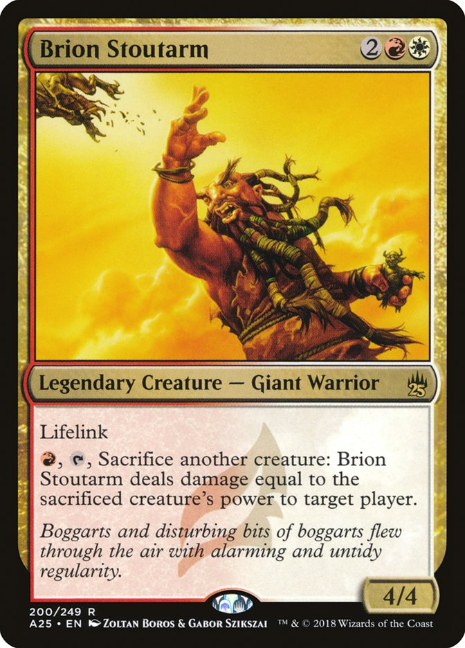

ถ้าอยากอ่านภาษาอังกฤษให้เข้าใจมากขึ้นต้องทำอย่างไร? #ว่าด้วยการใช้EDที่ไม่ได้เป็นแค่PastTense #รู้เพิ่มอีกนิดเดียวอ่านรูลรู้เรื่อง

.
แน่นอนว่าผมไม่รู้ของคนอื่น แต่สิ่งที่ผมคิดว่าทำให้ทักษะในการอ่านภาษาอังกฤษผมปลดล็อคและพัฒนาขึ้นเป็นอย่างมากคือตอนที่เข้าใจเรื่องเล็กๆ ของสิ่งที่เรียกว่า Past Participial Adjective (การขยายเมื่อนามนั้นเป็นผู้ถูกกระทำ.... เติม -ed นั้นแหละ) ซึ่งการเข้าใจสิ่งนี้ในระดับผิวๆก็ช่วยให้ผมอ่านกติกา/การ์ดเกม/นิยาย ได้เข้าใจขึ้นแบบก้าวกระโดดเลย 

.
ซึ่งสารภาพเลยว่าเข้าใจว่ามันเรียกว่า Passive Voice มาตลอดจนกระทั้งเมื่อเช้านี้ (ใครอ่านฉบับดราฟแรกๆก็จะมั่วเยอะหน่อย ต้องขอบคุณที่ทักกันเข้ามาครับ)..... 

.
จริงๆแล้วมันก็เป็นความรู้ที่ได้มาจากการที่ตอนนั้นยังเป็นเด็ก ม.ต้นทั่วไปที่ภาษาก็อ่อนด๋อยเหลือทน อ่านการ์ตูนยูกิแต่ดันไปสะพานเหล็กแล้วได้การ์ด MtG (ปลอมด้วยนะ) มาแทน แล้วต่อจากนั้นผมก็เล่นมันเรื่อยมาจนกระทั้งเลิกไปตอนเข้าวงการบอร์ดเกม

.
ตอนแรกเนี่ยก็เปิด dictionary แบบเป็นเล่มกันรายคำ แล้วก็แบบอ้าว! แกะมาทุกคำแล้วก็ยังไม่เข้าใจอยู่ดีว่าให้ทำอะไร เจอ block, blocking นี้เข้าใจ แต่ไอ้ blocked นี้มันอะไรว่ะ 'เคยบล็อก' นี้มันอิหยั่ง แล้วการ์ดมันใช้ไงว่ะเนี่ย แต่พอตอนนั้นเรียนซักคาบแล้วครูสอนเรื่อง Passive Voice ก่อนที่อยู่ๆทุกอย่างมันก็ลงล็อกหมดเลยแบบ อะ-ฮ่า นี้ไง!! อ่านการ์ดคล่องเฉยเลยพี่จ๋า ต่อยอดจนเก๋าไปซื้อ Harry Potter ภาษาอังกฤษมาเริ่มอ่านเองเลย

.
เรียกได้ว่าการเปิดการ์ด MtG เล่นในครั้งนั้นเป็นจุดเปลี่ยนสำคัญของผมเลย จากที่ไม่เข้าใจว่าเขียนแบบไหนแปลว่าอะไรใช้ยังไง ก็ได้เห็นตัวอย่างการใช้งานแบบจริงจังอยู่ตลอดเวลาจนซึมซับและใช้งานในระดับการสื่อสารทั่วไปได้อย่างไม่ลำบาก (ใช่, MtG เป็นเรื่องจริงจัง!!) 

.
เอาล่ะที่เล่ามาข้างบนคือไม่มีสาระอะไร สิ่งที่จะบอกก็คือ Past Participial Adjective ในรูปแบบที่เราเห็นกันบ่อยในเกมเนี่ยก็เป็นทรงว่า ---ED ---- ที่มาขยายว่าไอ้สิ่งนี้โดนอะไรมาแล้วมันจะเป็นยังไงต่อนั้นเอง ซึ่งเราจะเห็นได้บ่อยมากในพวกกติกาเกมต่างๆ

.
ส่วนอีกอันก็คือ Passive Voice ที่ไอเดียอย่างง่ายคือประโยคที่ประธานเป็นผู้ถูกกระทำ  โดยหลักการแบบไม่ซับซ้อนคือ Verb (กิริยา) จะกลายเป็นช่อง 3 แทน ซึ่งเราจะเห็นบ่อยให้คู่มือเกม... 

.
อย่างการ์ด Grafted Identity เราจะเห็นการใช้งาน Past Participial Adjective ได้ว่า

Enchant creature 
-> ทำการ 'ร่ายมนต์' ใส่สัตว์ประหลาด
-> ในกรณีนี้ enchant ทำงานเป็น 'verb' ว่ากำลังทำอะไรกับ creature อยู่

You control enchanted creature 
-> คุณได้ควบคุมสัตว์ประหลาดที่ 'ถูกร่ายมนต์ใส่'
-> ประโยคนี้ก็ยังเป็น Active Voice อยู่นะ แต่คำว่า 'enchanted' ที่มันจะเป็น adjective มาขยายคำว่า creature อีกทีว่านี้มันคือตัวที่โดนคุมอยู่ (ก็คือ Past Participial Adjective นั้นเอง ส่วน Participial Adjective ก็คือพวก -ing )

.
ส่วนประโยค Passive Voice นั้นในการ์ด MtG เข้าใจว่าไม่น่าจะมี เพราะมันเป็นแนวขั้นตอนในการทำงาน แต่เราจะเห็นมันบ่อยให้คู่มือและนิยายแทนครับ อย่างเช่น

"Resources are collected at the beginning of each turn."
:
"If a tie occurs, the player with the fewest cards in hand is considered the winner."
:
"Tokens are moved clockwise around the board during the resolution phase."
.
จบแล้วฮะ

.
อย่างที่บอกคือ ตอนเด็กๆที่พยายามเอาแต่ท่องคำศัพท์เนี่ยไม่ได้ช่วยอะไรเท่าไร แล้วการพยายามจะตีความสามารถการ์ดที่ยาวๆนั้นปวดหัวมาก เล่นมั่วก็เยอะ แต่พอเข้าใจเรื่องส่วนขยายปุ๊บก็พบว่าเราเข้าใจทันทีว่ามันมี 'คนทำ', 'คนกำลังทำ' และ 'คนถูกกระทำ' ไม่ใช่แบบเจอ -ed แล้วก็เอ๋อเลย มันโผล่มาทำไมนิ?? (คือแบบ -ing เนี่ยเชื่อว่าโรงเรียนสอนกันจนไม่ต้องอธิบายเวลาเห็นอยู่แล้ว)

.
หวังว่าจะเป็นทริคเล็กๆที่ช่วยใครซักคนในการอ่านคู่มือภาษาอังกฤษให้คล่องขึ้นครับ

