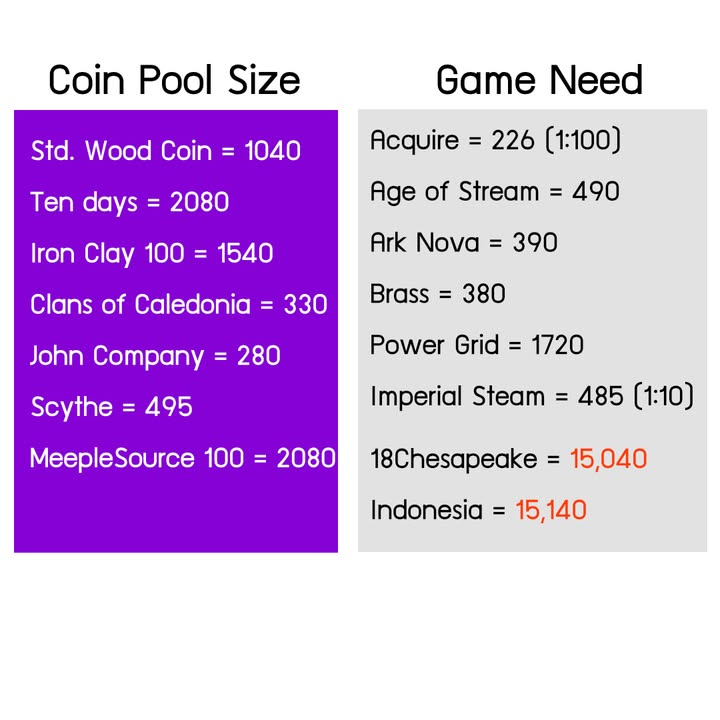
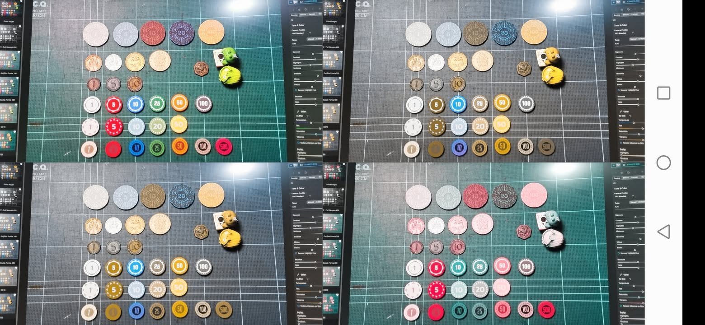
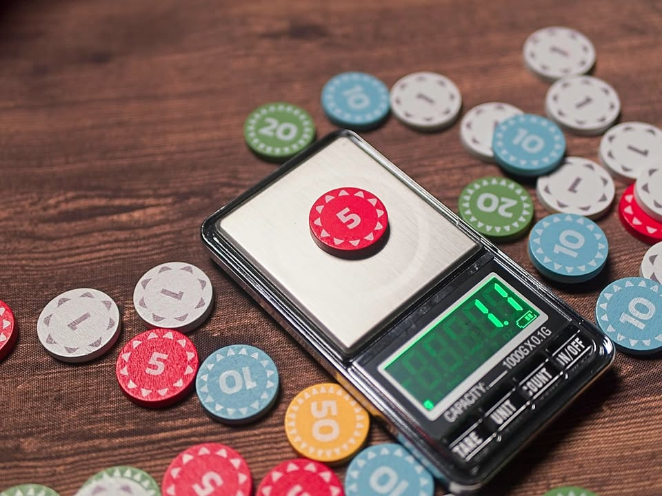

โพสนี้จะด้วยเหรียญแบบขยายเพิ่มอีกซักนิด เพราะเรามีเหรียญเจ้าใหม่เข้ามาในตลาด ก็ต้องเอามาเทียบกับของที่มีอยู่แล้วกันหน่อย โดยเหรียญอันที่ว่าก็คือ Standard Wooden Coin ที่นำเข้าโดยร้านในไทยเนี่ยแหละ 

.
เอาแบบไวๆก็คือแทบไม่ต่างกับเหรียญของ Tendays Wooden Coin ที่มาจากญี่ปุ่นเท่าไร มีน้ำหนัก ความหนา และขนาด +- กันแค่ 1 mm

.
สิ่งที่ต่างกันแบบเห็นได้ชัดคือ (เท่าที่ทราบ ณ ตอนนี้) SWC ไม่มีเหรียญหน้า 100 ทำให้มูลค่ารวมของเหรียญจะอยู่ที่ 1040 เทียบกับ TD ที่มีถึง 2080

.
ซี่งตรงนี้มันเป็นปัญหาอะไรไหม? สำหรับผมก็ไม่ครับ เพราะถ้าดูจากรูปแนบจะเห็นได้ว่าเกมยูโรส่วนมากต้องการเหรียญแค่แถวๆ 500 เท่านั้น และเกมที่ไม่ได้มานับเงินจริงจังก็ใช้กันไม่ถึง 100 ด้วย ในแง่นี้ SWC ก็จะมีเหรียญเล็กใช้บ่อยพร้อมใช้มากกว่า TD เล็กน้อย คือเปลี่ยนตัว 100 มาเป็นเพิ่มจำนวน 1 แทน

.
ส่วนเกมที่เงินไม่พอ ก็จะเห็นว่าเป็นเกมระดับต้องการ poker chip ระดับ full set เพราะเกมมันใช้เงินเข้มข้นจริงๆ หรือบางเกมก็เอาแบงก์กระดาษหลัก 100-500 ในเกมนั้นแหละแทนเอาเวลาเงินที่ไปถึงหลักแพงๆเพราะมักจะใช้ไม่บ่อย

.
สิ่งที่ผมคิดว่าน่าจะให้ความสำคัญมากกว่าก็คงเป็นที่ 'การทอน/แลกบ่อย' มากกว่า ซึ่งสำหรับผมถ้าซื้อเหรียญมาเพื่อความสะดวกแล้วจะเจ้าไหนๆ ชุดเล็กหนึ่งชุดนั้นก็ออกจะ 'พอดี' มากเกินไปซักนิด คือใช้ได้ แต่ต้องแลกเหรียญใหญ่บ่อย แนะนำว่าถ้าใช้กับเกมที่เล่น 4-5 คนก็ควรจัดสองชุดจะดีกว่า ไม่ต้องมาแย่งเหรียญ​ 1/5 กัน

.
แต่เอาเข้าจริงก็อยากให้ของ  SWC อัพเดทชุดใหญ่สำหรับหน้าเหรียญที่เยอะขึ้นมาเหมือนกันนะ ซึ่งถ้าเค้าขายดีก็คงมีรอบสองพร้อมกับขยายจำนวนให้แหละ (มั้ง)

.
แต่ถ้าถามว่าส่วนตัวผมชอบอันไหนก็บอก MeepleSource ที่ใช้มานานครับ คือผมชอบขนาดมันมากกว่าอ่ะ ถึงน้ำหนักจะใกล้กันแต่ด้วยความที่มันเล็กๆตันๆทำให้เสียงหนักแน่นกว่า ของ TD/SWC มันให้ความรู้สึกกลวงๆเบาๆ แต่ทั้งนี้ราคาร่วมส่งกับภาษีเอาตรงๆก็ไม่คุ้มเท่าไร (พอดีตอนผมอยากได้มันมีแค่เจ้าเดียวน่ะ) .... แต่ทั้งนี้ก็ ยสตน... ย้ำส่วนตัวนะ

.
ส่วนเหรียญ TD ก็เห็นว่ายังจะนำเข้ามาอยู่นะ แค่ตอนนี้ยังไม่มีรอบผลิตเฉยๆ

.
เกร็ดความรู้เล็กๆคือปกติ poker chip จะเรียง 1 5 10 20/25 ด้วยสี ขาว แดง น้ำเงิน เขียว แต่เรื่องนี้ก็ไม่ได้ตายตัวอะไร (คือแอบเห็นฝรั่งบ่นกันบ้างตอน Iron Clay ออกมาว่าสลับสีแบบนี้หยิบผิดบ่อยเพราะไม่ชิน )

.
discloser:
- content ไม่ได้ถูกว่าจ้างหรือเป็นการโฆษณา เป็นการแสดงความเห็นทั่วไป
- ผู้จัดทำได้รับเหรียญ Standard Wooden Coin จากผู้นำเข้าโดยไม่มีค่าใช้จ่าย จำนวน 1 ชุด

อันนี้เทียบผ่านโปรแกรมจำลองตาบอดสี

