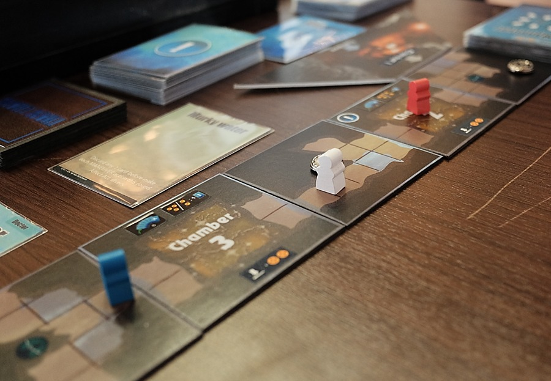
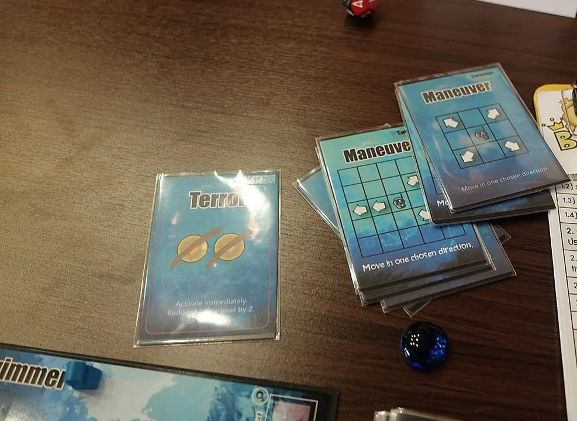
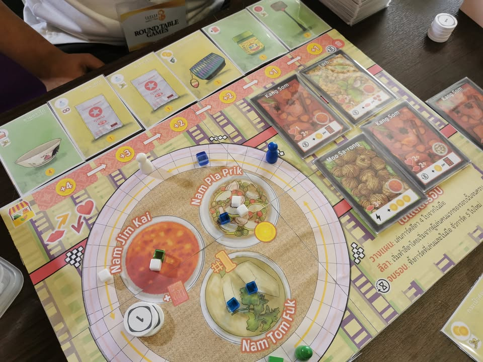
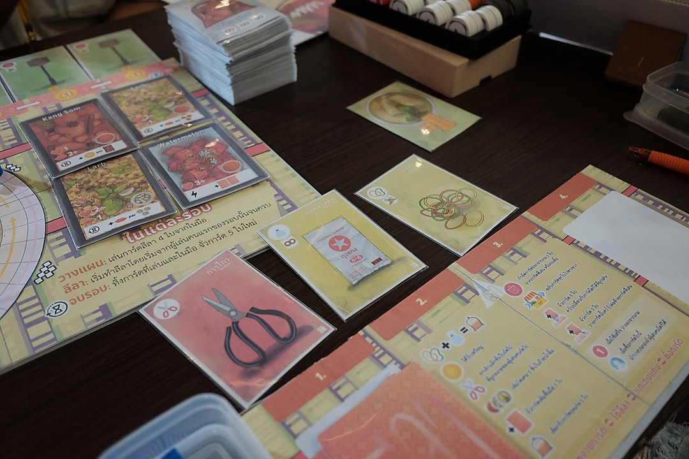
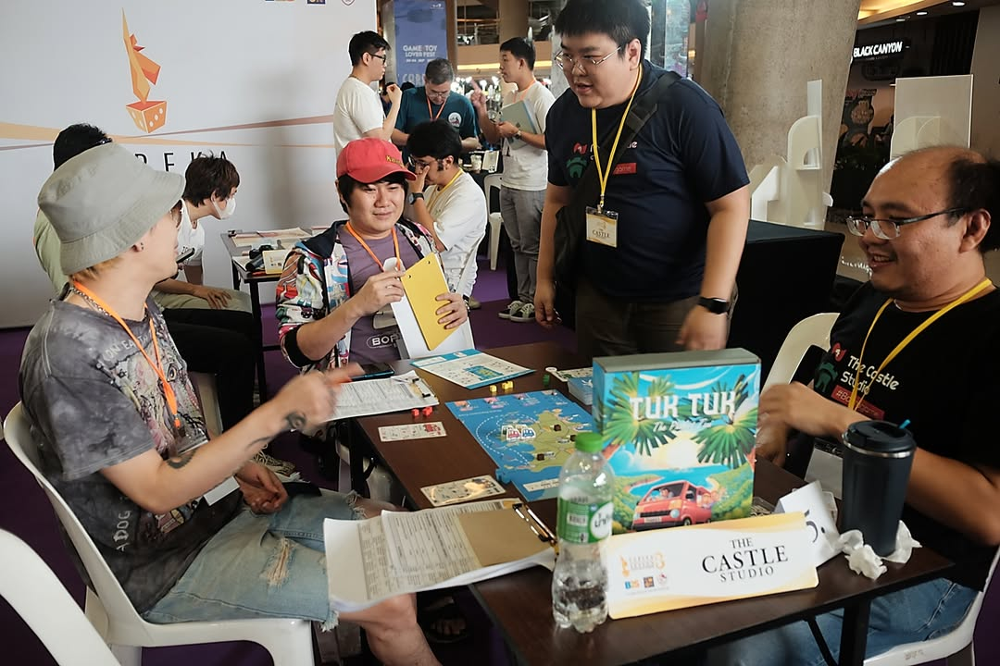
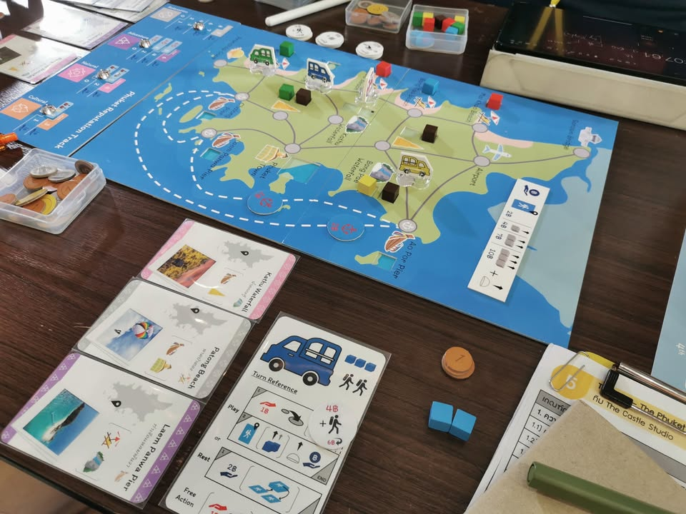
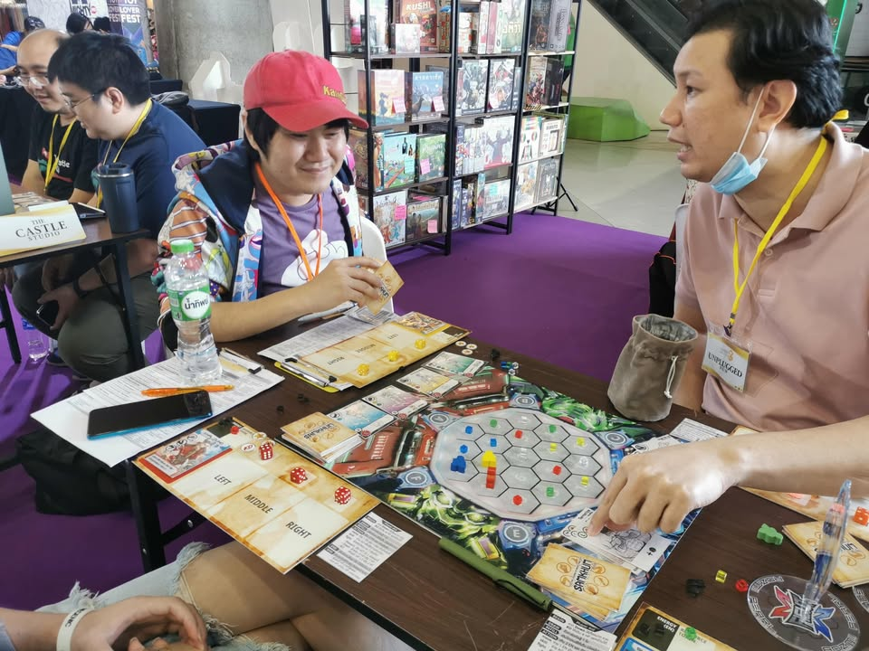
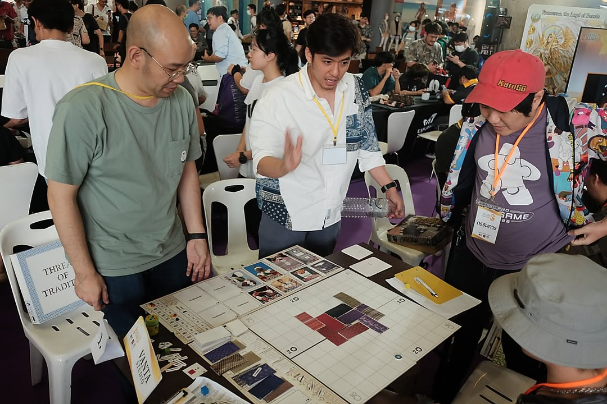
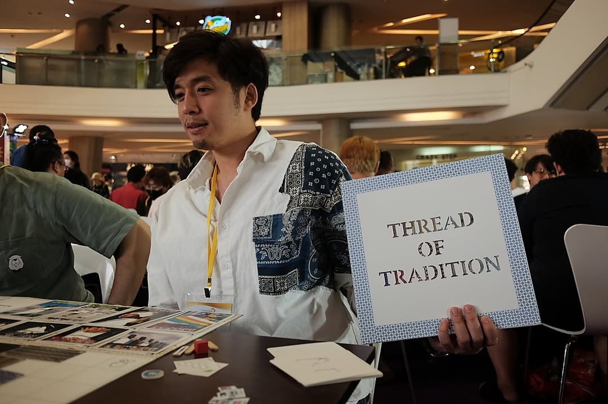

โพสนี้จะเล่าถึงเกมและความรู้สึกในงานประกวดยูเรก้าซีซั่นสามที่ผมมีโอกาสได้เป็นส่วนหนึ่งของกรรมการมาครับ

.
ซึ่งก็มีเรื่องที่ต้องบอกก่อนสองเรื่อง อย่างแรกคือผม 'มองว่า' มันเป็นงานที่กำลังมองหา 'เกมทำเสร็จแล้วพร้อมขายที่เน้น soft power ไทยกระแสหลักสำหรับผู้เล่นหน้าใหม่ใช้เวลาไม่เกิน 45 นาที' โดยผมก็จะพยายามที่จะมองเรื่องนี้เป็นหลักนะ 

.
ณ ตอนที่ได้เข้าประกวดผมคิดว่ามีเกมเดียวที่พอจะยัดลงกรอบนี้ได้โดยไม่เกี่ยวกับว่าเป็นเกมที่ดีที่สุดหรือเปล่า.... แต่ทั้งนี้การประกวดยังไม่จบผู้เข้าแข่งขันยังสามารถปรับเปลี่ยนงานได้อีก รวมถึงผมเองก็ไม่ได้มีเซย์อะไรในผลการตัดสินขั้นสุดท้าย 

.
เรื่องที่สองที่ผมจะบอกก็คือผมแค่เป็นส่วนหนึ่งของความคิดเห็นทั้งหมด ผมมีแนวทางและรสนิยมเป็นของตัวเองที่ไม่จำเป็นต้องเป็นตัวแทนของใคร ซึ่งก็คือผมชอบไม่ชอบก็ไม่ได้แปลว่าทุกคนต้องคิดเหมือนกัน หรือเกมที่ผมคิดว่าเหมาะกับหัวข้อกรรมการคนอื่นจะต้องคิดเหมือนผม และผมเขียนบทความนี้เพื่อแสดงความรู้สึกของผมเท่านั้น ผมไม่คิดว่าตัวเองเป็นกรรมการที่ดีเท่าไร แต่ผมเชื่อมั่นว่าผมมีความเป็นตัวเองชัดเจนแหละ......(เอาจริงก็น่าจะทราบกันอยู่แล้วแต่ขอย้ำหน่อย)

.
จะว่าไปทุกครั้งที่มีคนขอให้ทำอะไรแบบนี้ผมก็คิดอยู่เหมือนกันว่า..... เค้าเรียกเราไปทำดราม่าป่ะว่ะ? คือแบบผมมันแค่คนชอบบ่นเรื่องบอร์ดเกมเฉยๆ เก็ทใช่มะ? แต่นั้นแหละ package 3ก มันก็ขายได้แหละเหมือนโผล่มาท่านี้บ่อย ฮาฮา

.
กลับมาที่งานแต่ยังไม่ไปที่เกม คือการประกวดแบบนี้ผมมองว่ามันมีเกมอยู่สองแบบ กลุ่มแรกคือหยิบเอาเกมที่มีความใกล้เคียงหรือสร้างใหม่มาเพื่อกติกา ส่วนกลุ่มที่สองคือเอาเกมที่ใหญ่กว่าโจทย์ที่ตัวเองมีมา 'ลดทอนปรับแก้' ให้มันลงกรอบ อันนี้ไม่มีอะไรแค่อยากให้นึกถึงไว้ เพราะส่วนมาก (ไม่ได้จำกัดอยู่แค่เวทีนี้) เท่าที่เจอคือพอเวลาคิดไม่มากพอ ก็มักจะได้เกมลดรูปที่เหมือนนักมวยรีบรีดน้ำหนักแล้วเหนื่อยหอบต่อยไม่มีแรงออกท่าอะไรก็ดูไม่เข้าทรง....

.
แต่พูดถึงเรื่องกรรมการรอบนี้หน่อย คือ beauty อย่างหนึ่งของงานจะเป็นเสียงไม่ค่อยขาดจากกรรมการสิบกว่าคน คือมันจะกลุ่มเล็กๆที่เห็นต่างกันอยู่เสมอคือไม่ได้เคาะพิมพ์เดียวกันไปหมด แต่ทั้งนี้คือทุกคนก็มีจุดร่วมหนึ่งคือมีประสบการณ์และมุมมองที่สัมผัสเกมกระดานสมัยใหม่มาในระดับที่คิดว่าไม่น่ามีใครค้านเรื่องความสมเหตุสมผลขั้นพื้นฐานของเกม

.
งานนี้ใช้ระบบให้กรรมการเล่นแล้วกรอกคะแนนแล้วส่งเลยซึ่งผมไม่ค่อยชอบนักเพราะเกมหลังๆมันจะมีตัวเปรียบเทียบจากเกมก่อนๆหน้า โดยคะแนนจะเน้นหนักในกลุ่มระยะเวลาการสอน ความสมเหตุสมผลของธีม การนำเสนอ softpower และ visual present ของเกม โดยผมจะขอพูดแบบบรีฟมากๆ เรียงตามเกมที่ได้เล่นมานะ ส่วนหนึ่งก็เพราะอันที่เกี่ยวกับระบบหลายอย่างผมคุยกับนักออกแบบในงานไปแล้ว

//--------------------
.
เกมแรก - Tham Luang - by Life Dimensions Game - คือเกมเอาธีมว่าด้วยการช่วยเหลือผู้ประสบภัยทีมนักฟุตบอลหมูป่าในถ้ำหลวงของไทย เป็นเกม co-op เปิดไทล์สำรวจถ้ำ ระบบการเล่นจะเป็น hand management ที่ให้ผู้เล่นค่อยๆเคลื่อนที่ไปในถ้ำแบบ grid

.
personal thought -  แม้เกมจะสร้างบรรยากาศการเล่นได้ดี (แบบดีจริงๆ) ว่าได้เข้าไปสำรวจถ้ำ กับใช้ระบบเปิด event สุด vintage แล้วยังรู้สึกว่ายอมรับเพราะ event เข้ากับธีมอยู่ แต่ว่ารู้สึกเหมือนเล่นมันเกมใหญ่ที่ยังย่อมาไม่พอแล้วเอา randomness ที่ไร้การควบคุมมาใส่แทน risk management ที่จะได้มาบริหารความเสี่ยงดีๆ และ sense ของการร่วมมือระหว่างผู้เล่นยังไม่ค่อยรู้สึกนัก ส่วนหนึ่งก็เพราะอะไรๆก็สุ่มทอยเต๋า

//--------------------
.
เกมสอง -Toong Gang - by Round Table Games - เกมที่ผมจะไม่ปิดบังว่าชอบธีมมากที่สุดเพราะมันนำเสนอความ local ของบ้านเราอย่างการซื้อแกงถุง

.
เกมจะให้เราเล่นแบบ deck building ที่จะต้องทำ programing ในการเรียงการ์ดที่จะเล่นด้วย เล่นการ์ดไหนก็ทำท่านั้นก็มีซื้อของ ซื้อแกง ตัวการ์ดแต่ละใบจะมีไอคอนสีหนังยางประกอบ ถ้าเรียงสีครบกับถุงแกงที่ซื้อหยิบไว้ก็จะปลดหนังยางได้ พวกของที่ซื้อได้ก็พวกของที่แบบ local จ๋าๆเลย

.
personal thought - ระบบที่ใช้ ณ ตอนที่ผมเล่นนั้นว่ากันตรงๆยังรู้สึกว่าเต็มไปด้วยส่วนเกินตรงโน้นตรงนี้ที่ยังรีดออกมาได้อีก ส่วนหนึ่งก็น่าจะเวลาอาจไม่พอ ระบบ programing เอย ระบบคิดแต้มจบเอย ผมคิดว่าถ้ามีเวลาละก็มันยังสามารถลีนเป็นเกม 45 นาทีสวยๆที่สอนง่ายๆได้แน่ๆ คือผมชอบธีมเกมนี้นะ แต่อาจจะไม่ตรงกับไอเดียการขาย soft power กระแสหลักของตัวเวที นี้คือถ้าได้ภาพระดับ shameless buffet นี้คือเจ๋งแน่นอน

.
อนึ่งต้องขอโทษตองด้วยที่เล่นมุกไร้สาระขัดรัวๆจนดูหน้าก็รู้ว่าเอื่อมแล้วจ้าาาา........แต่วางใจได้ว่าอย่างน้อยทุกโต๊ะนี้โดนเท่าเทียมกันแน่นอน.......

//--------------------
.
เกมสาม - Tuk Tuk - The Phuket Taxi - by The Castle Studio - เกมที่จะให้เราขับรถตุ๊กตุ๊กเดินทางไปรับส่งนักท่องเที่ยวไปตามแผนที่ของเกาะ ไอเดียก็คือเราจะได้การ์ดผู้โดยสารมา เค้าก็จะมีจุดหมายที่จะไป เราก็ขับรถไปพร้อมกับจ่ายค่าน้ำมัน ทีนี้กิมมิคคือระหว่างทางเดินเราสามารถหยอด cube ทิ้งไว้ตามสถานที่ท่องเที่ยวไว้ก่อนได้ และเมื่อเราส่งนักท่องเที่ยวปลายทางแล้วเราสามารถทิ้ง cube ที่วางไว้ก่อนหน้าแทนการ 'แนะนำ' นักท่องเที่ยวเพื่อเพิ่มรายได้ของเรา

.
personal thought - เป็นเกมที่กรุงเทพแบบผมก็พึ่งอ้ออออ พึ่งรู้ว่าหน้าตาตุ๊กตุ๊กที่โน้นไม่เหมือนกับของที่กรุงเทพหว่ะ กลายเป็นเกมเสนอให้คนที่อื่นรู้จักภูเก็ตไปซะอย่างนั้น คือหน้าตามันจะประมาณกระป้อที่มาทำเป็นสองแถวไรงี้

.
ที่เหลือไม่รู้จะพูดอะไร คือไม่ใช่ว่ามันไม่ดี แต่ผมรู้สึกว่ามันเกมนิ่งเรียบเพราะโดนตัดโน้นนี้หมดเกลี้ยงมาเพื่อให้เข้ากับโจทย์ เหมือนทำอาหารคลีนที่กำจัดรสออกไปมากเกินไปกระทั้งเกลือก็ไม่ใส่ รู้สึกว่าถ้าไม่โดน restrict ด้วยแผนที่และธีมท่องเที่ยวเกาะภูเก็ตละก็เกมน่าจะมีช่องทางให้ใส่ความสนุกของแผนที่ได้มากกว่านี้ 

//--------------------
.
เกมสี่ - Sam Khum - by Unplugged Fun - ธีมว่าด้วยยุคอนาคตที่คนเอาผู้มีวิชาการต่อสู้มาต่อยตีกันในอารีน่า ไอเดียก็คือเราจะเดินนักสู้เราไปตามพื้นเพื่อเก็บเม็ดพลังหลายสี พอเก็บแล้วก็เอาไปแลกซื้อการ์ดเพื่อใช้ท่าต่างๆในตลาดโจมตีคู่ต่อสู้

.
ในทางของฝ่ายรับนั้นจะมีเลือดอยู่ 3 จุดคือซ้าย-กลาง-ขวา ก็ต้องคว่ำการ์ดป้องกันหลายแบบไว้ในช่องที่ต้องการ แต่ในหนึ่งช่องจะต้องเป็นช่องโหว่เสมอ แบบการันตีว่าต้องโดน 1 ใน 3 แหละไรงี้ อันอื่นก็มีสวนบ้างปัดป้องบ้างว่ากันไป ตีๆล้มๆกันไปถึงจุดหนี่งก็จบเกม

.
personal thought - ในมุมหนึ่งผมคิดว่าเกมมันก็สนุกดีนะ แต่อาจจะไม่ใช่ในดงคนที่ผ่านเกมกระดานสมัยใหม่มาโชกโชนอย่างกรรมการในงานนี้ คือแบบเด็กๆเคยเล่นแต่เกมเศรษฐีดั้งเดิมหรือยังไม่พ้น quest master มาไอเดียเกมนี้ก็ถือว่าใช้ได้เลย ที่เขียนแบบนี้ก็เพราะผมคิดว่าปัญหาคือเกมไม่ได้ใช้ประโยชน์จากแนวคิดเกมสมัยใหม่ซักเท่าไร มิติความ asymmetric ของตัวละครดูเบาบางเพราะทุกตัวต้องไปซื้อการ์ดกลางมาใช้ และระบบต่อสู้แบบเลือกบลัฟก็แอบคิดว่ามีระบบอีกหลายอย่างที่น่าสนใจกว่าอย่างทิ้งการ์ดเพื่อ counter หรือค้อนกรรไกรกระดาษ system 

.
แต่ทั้งนี้ไอเดียการเดินตามพื้นเพื่อเก็บพลังงานก็โอเคเลยนะ จริงๆถ้าไปในแนวทางนี้แล้วทำระบบ deck building ที่มี personal deck ตามตัวละครก็อาจจะน่าสนใจดี แต่ประเด็นคือ as is มันต้องรื้อใหม่ 

//--------------------
.
เกมห้า - Treads of Tradition - by Vanta Studio - งานของทีมแว่นตานี้ผมชอบทุกอันเลยนะเพราะมีวิธีการตีโจทย์และนำเสนอที่น่าสนใจทุกครั้งรอบนี้มากับเกมแนววางไทล์ต่อผืนผ้าเป็นรูปแบบต่างๆ ก่อนที่จะนำไปสู่ครึ่งหลังของเกมที่จะให้เราเอาภาพถ่ายที่ฉลุช่องว่างเอาไว้มาวางทับบนลายผ้าที่สวยงามเพื่อทำคะแนน

.
personal thought - ต้องออกตัวก่อนว่าผมค่อนข้างโง่แบบโง่จัดๆกับเกมแนววางไทล์ที่ต้องมอง properties 2 อย่างพร้อมกันคือ สีและสัญลักษ์ พ่วงด้วยเกมนี้มีลายผ้าที่แตกต่างกันมาซ้อนให้ตาลาย ผลคือผมต้องเล่นแบบอาศัยตัวช่วยเยอะเหมือนกัน แต่ผมก็เก็ทอยู่ว่ามันสนุกตรงไหน ในแง่ไอเดียช่วงเอารูปถ่ายมาวางบนลายผ้านี้คือ mind blow เลยไอเดียดีมาก พ่วงด้วยการฉีกแนวคิดเรื่องต้องว่างตามกรอบแบบในช่วงแรกเพราะว่าเราวางเอียงแบบไหนได้คือมันมีความสดทางไอเดียอยู่หลายอย่างที่ชอบ

.
ส่วนที่คิดว่ามีปัญหาคือมันเป็นเกมมันแบบไม่ชอบก็อาจจะเกลียดเลยประมาณหนึ่งเพราะ puzzle มันเปิดหมดต้องยืนมองนานๆพร้อมขัดใจเวลาทรงมันไม่ได้แบบ Calico หรือมองอะไรแบบพวกเกม Set อะไรแบบนั้น คือไอ้คนมองไวก็ไวเลย กับรู้สึกว่าเกมมันมีความยากในการต้องมาถามหรือไล่มองเรื่องได้ไม่ได้อยู่บ่อยเหมือนกัน (อย่างน้อยก็สำหรับผมนะ) ในเชิงเกมก็ยังคิดว่ามันมีจุดที่น่าจะสามารถทำให้ย่อยง่ายได้อีกเพื่อให้เข้าถึงได้ง่ายขึ้น

.
1 - เอาคะแนนแต่งกายยอดเยี่ยมไปเพราะชุดเข้ากับเกม
2 - เป็นอีกทีมที่ต้องขออภัยนักออกแบบที่ติดเล่นนอกเรื่องเยอะจนนักออกแบบกลัวเวลาหมดก่อนเกมจะจบ 

//--------------------
.
เกมหก - Tuk Tuk - by Life Dimensions Game - คือทีมนี้เข้ารอบสองเกม เกมนี้เป็นแนว pickup deliverly ที่เราจะไปรับผู้โดยสารจากที่หนึ่งไปส่งยังจุดที่เค้าต้องการ โดยสถานที่ก็คือพวกห้าง/วัดดังๆในกรุงเทพนี้แหละ

.
ตัวเกมเป็นตารางเราก็จะขับรถตุ๊กตุ๊กๆวนไปมา โดยไอเดียคือเราจะได้เล่นการ์ดจุดสี่้แยกที่จะบอกว่าแยกนี้เราจะเลี้ยวไปไหนได้ลงบนถนน จากนั้นก็ให้รถเราเลื่อนไปตามลูกศร นอกจากนี้ก็ยังจะมีพวกความสามารถของรถและเงินจะได้อิงจากระยะทางที่เราไปส่งผู้โดยสาร

.
personal thought - เป็นเกมที่คิดว่าสนุกแบบจูนจะเสร็จละ  คือระยะเวลาประมาณนี้ ระบบประมาณนี้ มีเรื่องที่ improvement อีกนิดหน่อย แต่ส่วนตัวไม่ได้รู้สึกชอบความอลังของ prototype เท่าไร นึกถึงตอนขายละดูเยอะเกิน แบบชอบอะไรที่ปกติแบบบอร์ดเกมทั่วไปกว่านี้มากกว่า แต่ทั้งนี้ก็มีคนที่ชอบอะไรแบบนี้อยู่เหมือนกันนะ

//--------------------
.
ก็มีแอบสงสารผู้เข้าแข่งขันเหมือนกันว่าฟังทันปล่าวเพราะกรรมการโต๊ะผมสามคนแม่งเถียงกันเองไม่หยุด พูดกันไม่ยั้งแถมไปคนละทางเพราะชอบกันคนละแบบ......แต่ผมก็สนุกดีครับขอบคุณผู้จัดที่ชวนไปเปิดหูเปิดตา กับหลายๆเกมผมคิดว่าหลายเกมต่อให้ไม่ผ่านรายการนี้ก็เอาไปทำต่อในรูปแบบอื่นที่ไม่อยู่ในกรอบกติกาการประกวดได้อีก

.
รอบตัดสินจะเหลือ 4 เกม และจะจัดที่งาน CMON EXPO THAILAND 2023 ในวันที่ 4-5 Nov ครับซึ่งไม่แน่ใจว่าผมมีบทอะไรไหมนะ แต่สำหรับงานรอบรองผมก็คือส่งคะแนนจบมีคุยนิดหน่อยแล้วก็แยกย้ายครับ

