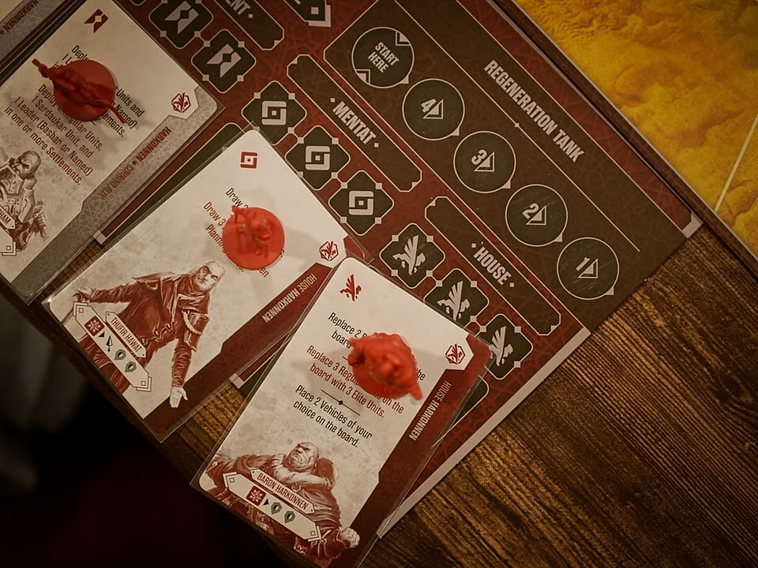
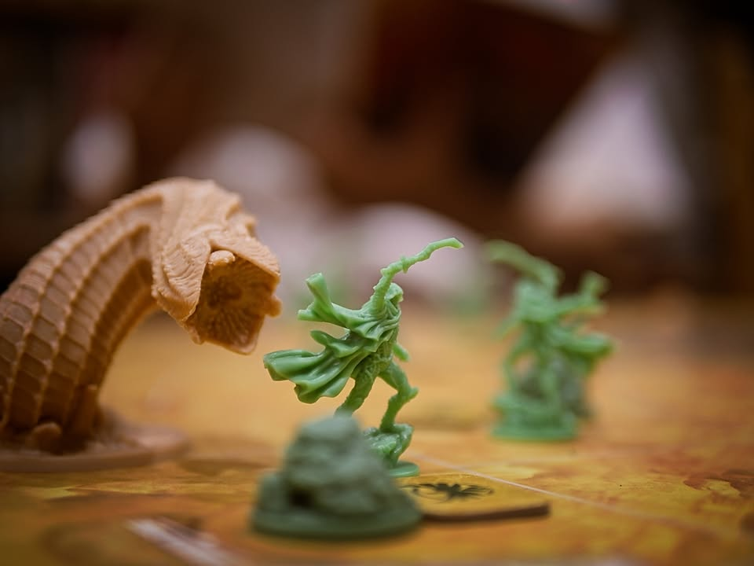

Dune: War for Arrakis

เกมสไตล์สงครามสำหรับผู้เล่น 2 คนยกพลมาตบตีกันเพื่อแย่งชิงความเป็นหนึ่งในดินแดนแห่งดูน โดยได้นักออกแบบ Francesco Nepitello ที่ทำ War of The Rings เกมที่ทำจาก Lord of The Rings ที่แฟนๆยกให้เป็นหนึ่งในเกมที่เล่าเรื่องราวของหนังสือ/นิยายได้ดีสุดๆ

---
ระบบเกมเดินด้วย action dice ที่ทั้งสองฝั่งจะทอยออกมาก่อนจากนั้นค่อยผลัดกันทำแอคชั่น แปลว่าเราจะพอรู้ทรงของแต่ละฝ่ายอยู่หน่อยๆว่าตอนนี้มันทำอะไรได้ไม่ได้ แอคชั่นค่อนข้างพื้นฐาน คือมีเดิน, ตี, เพิ่มตัว, จั่วการ์ด สองฝ่ายต่างกันไม่มากค่อนข้างตรงไปตรงมา

ซึ่งตัวเต๋าในช่วงเริ่มเกมฝั่งฮาโคเนนจะมีเยอะกว่าเกือบสองเท่า และจะมีลดลงบ้างตามจังหวะเกมถ้าส่งส่วยสไปซ์ไม่ครบโค้วต้า ในระหว่างเล่นที่เต๋ายังน้อยกว่าฝั่งอเทดิสจะได้ทำแอคชั่นเดินทางเร็วด้วยหนอนกับบังคับหนอนแทนถ้ามันโผล่มาแล้ว

---
ตัว combat ค่อนข้างคลีนคือเราก็ทอยลูกเต๋าเท่าจำนวนตัวทหาร เอาหน้าดาบกับโล่มาลบกันส่วนเกินก็ไปยิงใส่เลือดอีกฝั่งง่ายๆแค่นั้นเลย ส่วนหน้าดาวก็จะเอาไว้กรณีมี leader ที่จะได้ดาบหรือโล่แรงกว่าปกตินิดหน่อย ทหารหลักๆคือมี 2 แรงค์ความสามารถไม่ต่างกันแต่ตัวหนึ่ง 1 hp อีกตัวมี 2 hp 

เวลาสู้ยังสามารถทิ้งการ์ด event ในมือเพื่อเพิ่มจำนวนเต๋าได้ด้วย

---
ไอเดียการเล่นของฝั่งฮาโคเนนคือเป็นพ่อเมืองคนดีต้องส่งรถไปเก็บ spice เพื่อส่งตามยอดให้กับกิลต่างๆ เพราะถ้าไม่ส่งจะมีความซวยตามมา เน้นทำแต้มจากการตีรังโจรชาวบ้านที่มาบุกรุกการทำมาหากิน (คือถ้าไม่เก็ท Lore มาก่อนเกมไม่มีส่วนไหนที่แสดงถึงความเป็นฮาโคเนน, เฟรเมนเลย)

ส่วนฝั่งอะเทดิสจะแม้การต่อสู้จะสำคัญแต่วิธีชนะจะมาการทำแต้มเดินแทรค 3 ชนิดให้ถึงจำนวนที่กำหนดก็จะชนะไป โดยมิชชั่นนี้เป็นความลับว่าต้องเดินอันไหนถึงเท่าไร (แต่เอาจริงก็คือเต็มแม็กซ์ 1 ที่เหลือครึ่ง)

โดยจุดเดินเกมก็จะอยู่ที่ทุกรอบจะมีการสุ่มมิชชั่นทำคะแนนเดินแต้มของฝั่งอะเทดิสจำนวน 3 ใบ ถ้าฝั่งอเทดิสทำตามเงื่อนไขได้ก็จะได้เลื่อนแทรคสีนั้นๆตามแต่ใบจะบอก

ก็เลยเป็นเรื่องของการ balance ทั้งสองฝั่งว่าจะแบ่งคนไปตี/กันบ้านแค่ไหน  กับแบ่งไปทำ mission หรือขัด misson ยังไง พร้อมกับเดาว่ามันจะทำมิชชั่นไหนจะได้ขัดถูก

---
ความน่าสนใจของเกมก็คือการถ่ายทอดหนอนทะเลทราย คือในกติกาเกมจะเริ่มให้เต๋าฝั่งฮาโคเนนเยอะกว่าสองเท่า และในขณะที่ฝั่งฮาโคเนนยังมีเต๋าทำแอคชั่นเยอะกว่า ฝั่งอเทดิสจะทำได้แค่แอคชั่นที่ชื่อว่า desert action ที่หลักๆคือการวาง token หนอน ซึ่งเอาไว้วาร์ปเดินร่นระยะทางก็ได้หรือว่าถ้าฝ่ายฮาโคเนนมาเหยียบก็จะเปิดสุ่มมาดูว่าเจอหนอนไหม (โอกาสประมาณ 1/3) ถ้ามีหนอนเราก็ใช้แอคชั่นนี้คุมหนอนได้

อีกจุดคือตอนทุกจบรอบทุกๆจุดที่มีฝ่ายฮาโคเนนยืนอยู่จะต้องสุ่มเจอหนอนด้วยเช่นกัน ซึ่งตรงนี้พอดีเล่นไปรอบเดียวไม่แน่ใจว่าถ้าเล่นรอบที่ดวงซวยจัดๆหนอนไม่ออกเลยฝ่ายอเทดิสจะเหงาไหมนะ?

---
จุดที่ไม่ค่อยชอบเท่าไรแต่เข้าใจได้ว่าทำมาเพื่อความสมดุลย์คือพวกตัวละครพิเศษในเกมมันจะเข้าสนามได้ต่อเมื่อเล่นเต๋าแอคชั่น แต่พอเอาลงไปแล้วทุกจบรอบมันจะต้องดึงตัวกลับมาไว้ที่บอร์ดใหม่ คือมันแอบรู้สึกว่าตัวละครมันไม่อยู่กับสนามรบแต่วาร์ปไปวาร์ปมาทำมิชชั่นเฉยๆไรงี้ ผิดกับตอน War of The Rings ที่เราติดตามการเดินทางของตัวละครมากกว่า

กับอีกอันคือระบบวางไทล์เจอหนอน คือระบบมันดีแต่ต้องวางโทเคนชิ้นเล็กๆคว่ำไว้มันแอบจัดการลำบากเพราะฝั่งอเทดิสตอนวางก็ห้ามเห็นมันเลยเอาไปใส่ถุงจั่วไม่ได้ไรงี้ ออกแนวรำคาญนิดๆต้องมาคลุกๆไทล์ชนิดนี้ตลอดเกม

---
สิ่งที่ผมคิดว่าดีของเกมนี้คือการดึง balance ที่น่าสนใจ คือฝั่งฮาโคเนนถ้าโดนถล่มรถเก็บสไปซ์มากๆจะส่งส่วยไม่ได้ก็จะโดนล็อกเต๋าแอคชั่นไปเรื่อยๆ ซึ่งหมายความว่าฝั่งอเทดิสก็จะมีเวลาการเล่นแอคชั่นขยับหนอนน้อยลง คือคิดว่ามันดึงเกมได้แบบค่อนข้างเป็นธรรมชาติดี ตอนเล่นไม่รู้สึกว่าฝั่งไหนกำลัง OP ถล่มอีกฝ่ายเละอยู่เพราะต่างฝ่ายต่างมีอะไรต้องระวังทั้งคู่

ส่วนเรื่องทหารฝั่งฮาโคเนนจะปั๊มมาได้เยอะล้นๆในขณะที่ฝ่ายอเทดิสจะมีตัวจำกัดแบบหมดแล้วหมดเลย ก็ทำให้มีผลต่อกลยุทธ์การเล่นเหมือนกัน แล้วก็ฝั่งอเทดิสด้วยความที่รบแบบกองโจรเวลาเดินทหารมันจะเป็นป้ายที่อีกฝ่ายไม่รู้ว่าพามากี่ตัวชนิดไหนบ้าง

---
Frog-o-Meter: กบโอเค  
  
(My) Collection Fit: เกมสายมิเนเจอร์กล่องใหญ่ตบตีกันสองคนไม่ค่อยเหมาะกับผมเท่าไรนะ เลยต้องข้ามไป แต่ก็อยู่ในกลุ่มว่าโอเคว่างแค่สองคนชวนเล่นก็ยกมาได้
  
What I like: อุปกรณ์สวย หนอนใหญ่ยักษ์ได้ฟีลเล่นดูน ระบบการต่อสู้และทำแอคชั่นฉับไวไม่ได้รุ่มร่ามแบบพวกอเมริเทรชทั่วไปโดยที่ยังคงความสามารถในการเล่าเรื่องของการต่อสู้แย่งชิงพื้นที่ได้ดี ระบบ mission ที่ใช้ดำเนินเกมทำให้รูปแบบเกมไม่ตายตัว
  
What I dislike: เทียบกับ War of the Rings แล้วความสามารถในการ 'ระลึกถึงฉาก' ในหนัง/นิยาย แทบไม่มีก็กลืนๆไปเหมือน event ทั่วไปในเกมอื่นๆ (แต่ในขณะเดียวกันคนไม่อ่านหนังสือ LOTR จะงงงวยกับระบบโน้นนี้มากเพราะมันอิงจาก lore แต่ Dune จะไม่เจอปัญหานี้เท่าไร) ส่วน setting ฉากนี้ถ้าไม่รู้จัก Dune มาก่อนจะเหมือนฮาโคเนนเป็นเจ้าเมืองทำมาค้าขายดีๆแต่ดันมีอะเทดิสเป็นโจรมาปล้นเมือง...... ในแง่การเล่าเรื่องการมีตัวตนของ spice และความสำคัญของน้ำนี้แทบไม่มี.... เอาเป็นว่าแฟนนิยาย/หนังอย่าหวังว่าจะเล่าเรื่องเกรด War of The Rings เดี๋ยวจะเฟล

I think this game might be a good fit for...: คนที่มองหาเกมตบตีกัน 2 คนที่ไม่ได้มีมิติเรียบๆว่าต้องเล่นท่านี้ๆ มีมิเนเจอร์สวยๆใน setting dune โดยไม่สำคัญว่าจะรู้จัก dune มาก่อนไหม
  
I think this game might NOT fit for...: นี้ไม่ใช่เกม 4 คน อย่าพยายามให้เสียเวลา
  
Interaction Area: สงครามผลัดกันเดินผลัดกันตี เอาเห้ยหนอนมาาาาาาาาาาาาาาาาา

