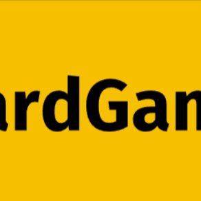

[news| ค่ายคนขี่หมู Hans im Glück ได้ทำการจดเครื่องหมายการค้าคำว่า 'Meeple' ในทวีปอเมริกาเหนือ

▫️ ก่อนหน้านี้ไปยื่นเอกสารบอกให้เกมชื่อ Meeple Inc เอาเกมลงซะ อ้างว่าตัวเองเป็นเจ้าของชื่อนี้ (ตอนนี้เกมเปลี่ยนชื่อเป็น Tabletop Inc)

▫️ เรื่องอิหยั่งว่ะคือค่ายไม่ได้เป็นคนใช้ชื่อนี้แต่แรก แต่เป็น Alison Hansel นักเล่นเกมทั่วไปนี้แหละเรียก Meeple ที่มาจากคำว่า My + People แล้วคำนี้ก็ติดปากคนกันจนเป็นคำที่ใครได้ยินก็ร้องอ้อ ซึ่ง Carcassonne ผลิตปี 2000 แต่คำว่า Meeple ถึงใช้ครั้งแรกในปี 2006 

▫️ แต่ในปี 2019 ค่ายก็เริ่มจดทะเบียนว่ารูปลักษณ์คนแบบปลาดาวเนี่ยเค้าเรียกว่า 'original meeple' ในยุโรป

▫️ CMON แย้งว่าไอ้ที่ไปจดน่ะมันไม่ได้รวมถึงเกมและของเล่นนะโว้ยยยย

▫️ปัจจุบันมีเกมราวๆ 40 เกมที่ใช้คำว่า meeple ในการตีพิมพ์ช่วง 2019 - 2024

imho - เอาตรงๆก็ภาพไนซ์กายรักโลก (เลยทำ insert กระดาษด๋อยๆ) นี้ปลิวหมด El Grande นี้ทำใหม่ก็แบบ...... เสียดายของเทพฉิบ.. ยังดีไม่ทำราคาจัญๆแบบค่าย Queen...

The word 'meeple', which board gamers around the world will recognise as meaning a stylised human-shaped playing piece, is being trademarked in the US in reaction to Carcassonne's German publisher Hans Im Glueck sending a 'cease and desist' email calling for a crowdfunding project to be taken down.

