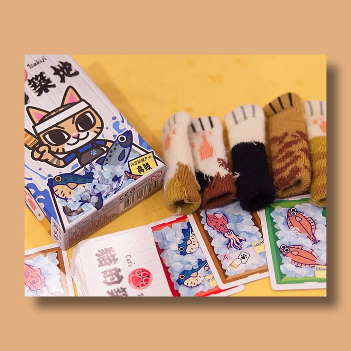
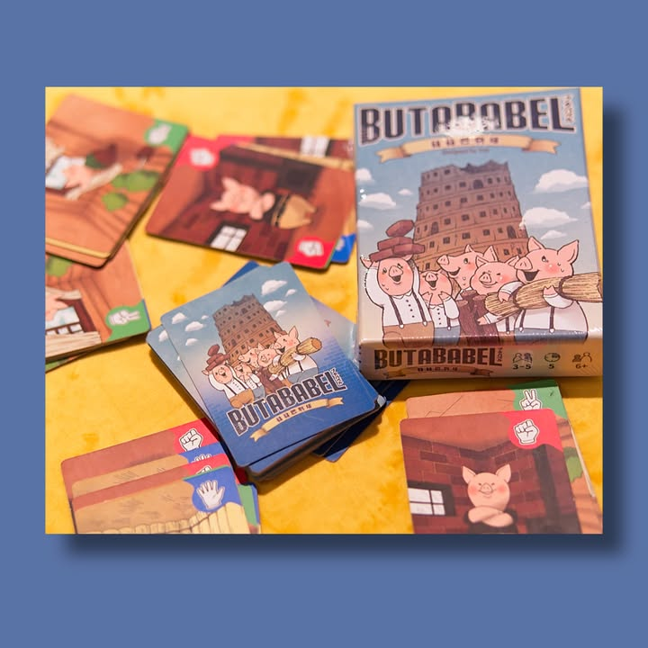
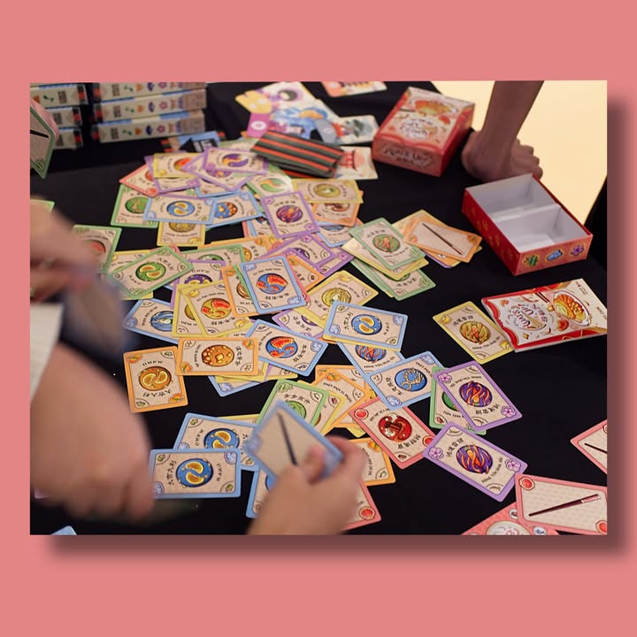
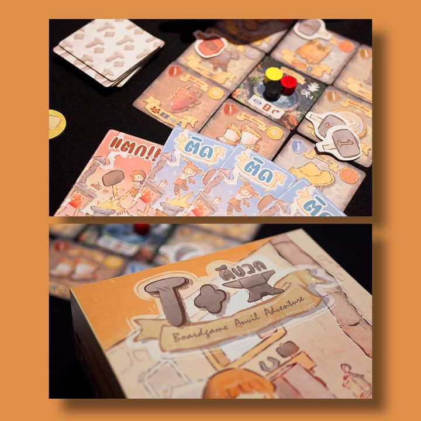

เขียนถึงเกมที่ได้ไปเล่น (และยืนฟังกติกาพร้อมกับ simmulate ในหัว) ในงานมาครับ ยังมีอีกเยอะมว๊ากกกกกกกกกกกกกกกกกก ที่ยังไม่ได้เล่นนะ (บางอันก็เล่นแล้วแต่ดันลืมถ่ายรูป….)

Kabuki Tricks - เกมทริคเทคกิ้งที่ดอกไพ่ทรั๊มสามารถเปลี่ยนแปลงได้ผ่านลำดับการ์ดตัวละคร แถมสามารถเล่นโจ๊กเกอร์เพื่อเปลี่ยนเอาระหว่างเล่นก็ได้ ก็สนุกเฮฮาดี แต่รู้สึกว่ากติกามันจุกจิกไปนิสสสสสสสส

Cat's Tsakiji - สาระคือถุงเท้าแมวในรูปมันมาพร้อมในกล่องเว๊ย!! คุ้มสัด - ส่วนเกมคือเราจะต้องเอาถุงเท้าแมวไปใส่เป็นปลอกนิ้ว นับหนึ่งสองซั่มแล้วก็ไปชี้ปลาตรงกลางใครชี้ไม่ซ้ำเพื่อนก็ได้ไป ที่เหลือก็คะแนน set collection จัดชุด

ButaBabel - เกมที่จะให้เราสร้างหอคอยการ์ดก็เล่น realtime ไปเรื่อยๆหยิบการ์ดที่เป็นค้อน กรรไกร กระดาษวางซ้อนๆกัน ทับกองตัวเองก็ได้ของเพื่อนก็ได้ พอหมดกองดูว่าใครสูงสุดก็ชนะ แต่ช้าก่อน! ถ้าสูงเกิน X ใบจากที่สองจะถือว่าท้าทายพระเจ้าทำให้ต้องแพ้ไปทันที!

MeowMeow Mia - เกมแนวบลัฟที่ผมชอบไอเดียนะ เรียกว่า reverse หมาป่าละกัน คือจะมีตำรวจคนหนึ่งอยู่วงนอก แล้วมีสายตำรวจอยู่ในกลุ่มแมว ทีนี้พวกแมวจะประชุมกันซ่อน 'สินค้า' ไว้ในตึกหนึ่งใน 4 อัน โดยที่เกมจะมีจังหวะให้ตำรวจกับสายนัดแนะกัน -โดยห้ามออกเสียง- จากนั้นตำรวจจะได้ไล่ถามแมวทีละตัวว่าของอยู่ไหน ก่อนที่จะเลือกเปิดบ้านค้นของดู
.
.
มันสนุกตอนที่ถ้าตำรวจจับของได้แก๊งแมวจะมาประชุมกันหาว่าใครเป็นสายตำรวจที่ส่งซิกกันว่ะ!

Bubble King - เกมแนว set collection แบบ realtime คือเราจะมีออร์เดอร์สินค้ามาเป็นชานม แต่ว่าเวลาหยิบของส่วนผสมมาใส่เนี่ยต้องหยิบจากกองการ์ดที่คว่ำๆสุ่มๆกันอยู่แทน!
.
.
เกมสนุกกว่าที่เล่าให้ฟังนะ อารมณ์แถวๆตอนเล่น Fit To Print น่ะ แต่อันนี้เวลาคืนของมันต้องทิ้งแบบคว่ำ ก็วุ่นวายๆตลกดี

Huat's Up! - จริงๆก็เหมือน Bubble King แหละแต่ตลกตรงที่ต้องเอาการ์ดสองใบมาถือด้วยมือคนละข้างแทนตะเกียบ แล้วต้องไปค่อยๆช้อนเอาส่วนผสมมาเก็บไว้ตรงหน้า

T+ (ตีบวก) - เกมแนว push your luck ขวัญใจเด็กเล่นเกม MMORPG คือเราเป็นช่างตีอาวุธก็ไปลงช่องว่าอยากตีอะไรจากนั้นเปิดการ์ดใน deck ซึ่งก็จะมี ติด ไม่ก็ แตก ทุกครั้งที่ตีติดก็จะมาร์คไว้ว่าตีไปได้เท่าไร อาวุธไหนถึง 10 ก็คนที่ตีได้ (ใช่นี้เกมจัญไรแย่งเพื่อนตีของได้) ก็เอาของไปเก็บไว้ทำคะแนน
.
.
เกมนี้ 'เสียดาย' คือเกมมันออกแบบมาให้วงกว้างเล่นแบบไม่คิดอะไร แต่ตัวระบบเกมจริงๆมันต่อยอดไปได้อีกเยอะมาก ทั้งระบบซื้อการ์ดเข้ากอง หรือการสะสมของจัดชุดทำคะแนน บลาๆ ซึ่งก็..... เสียดายอ่ะ แบบที่เป็นอยู่ไม่ค่อยตรงใจเท่าไรเล่นละคันๆว่าทำไมไม่มีตรงโน้นตรงนี้ฟระ

We love Ori Game

Cube Melt - เกมแนวทอยเต๋าแล้วเลือกให้ชุดหนึ่งมีผลกับตัวเองส่วนคนอื่นโดนที่เหลือ เกมไม่ค่อยมีอะไรทอยๆวนๆต้องระวังไม่ให้ตัวเองตาย (ละลายหายไป) - กล่องน่ารักดีแต่เล่นแล้วรู้สึกเฉยๆ ไม่ค่อยโดนเกมรอคนอื่นทอยเต๋าเท่าไร

Wonder Bowling - เกมให้เรียงพินโบวลิ่งไว้บนกล่องแล้วเอาไม้เคาะ เป้าหมายคือให้มันเหลือตั้งแค่ชิ้นเดียว หรือไม่ก็เหลือเท่ากับเลขบทลงโทษที่เรามี
.
.
จริงๆชอบไอเดียการเคาะของเกมมาก แต่ระบบคิดคะแนนไม่ชอบเลย ไม่ชอบมากๆ เพราะมันต้องเคาะให้เหลือเลขพอดีๆที่หลายๆครั้งจำนวนมันไม่ได้ ทำให้เกมน่าหงุดหงิดมากกว่าสนุก

Maneki Neko - เกมแนวหยิบไทล์เพื่อมาเรียงทำคะแนนแบบบิงโก รูปสวยดี แต่ส่วนตัวไม่ค่อยคลิกเท่าไรเพราะคุมอะไรตอนหยิบไม่ได้กับระบบคิดคะแนนกับการเล่นมันไม่ลีนเทียบกับการตัดสินใจที่มีในเกม
.
.
แต่แมวน่ารักดีนะ

Shop Until You Drop - เป็น set collection สนุกๆว่าด้วยนักช๊อปที่มีถุงสามถุงเวลาเก็บการ์ดมีสองแบบคือสีเดียวกันอยู่ในถุงเดียว หรือว่าทุกใบในถุงต้องเป็นน้ำหนักเปอร์เซ็นเท่ากัน แต่ที่สำคัญคือถ้าน้ำหนักถุงเกิน 100 ก็ต้องกลับบ้านไปนับคะแนนก่อน
.
. 
สนุกดีแต่กติกาคิดคะแนนมันแอบยึกยักนิดนึงแต่ชอบนะโดยเฉพาะการที่เราสามารถเรียงของในถุงระหว่างเล่นได้

