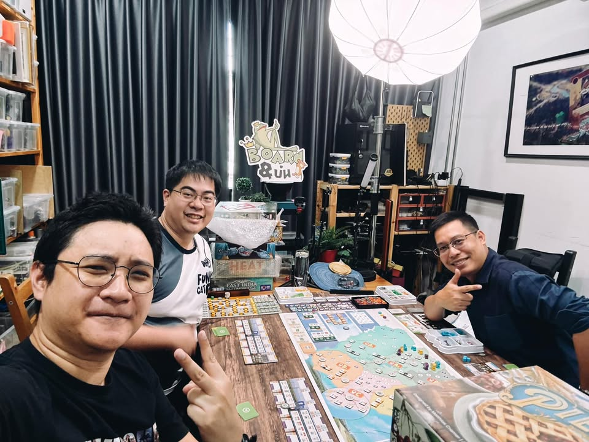

ช่วงนี้กาง Arcs แบบรัวๆจบแล้วก็อยากเล่นอีก ตอนนี้แก๊งประจำเล่นกันเป็นน่าจะครบละ น่าจะใกล้ได้ลอง campaign ซักที

ส่วนตัวถ้าไม่มองพวก essen release ในบรรดาเกมที่เล่นมาจนถึงควอเตอร์ 3 ก็คงให้เกมนี้อันดับต้นๆเลย ปีนี้ก็มีเกมนี้กับ Arborea ที่เล่นแล้วอยากซ้ำหลายๆรอบต่อกัน

ส่วนตัวคิดว่ามันเป็นเกมที่คนบางกลุ่มจะเล่นไม่ได้แบบชัดเจนแต่กลุ่มที่ชอบก็จะแบบเห้ยโดน!! มันเลยดูไฮป์กันจากหลายสื่อนอก (พอๆกับที่้ต้องมีสื่ออื่นมา counter review กลับ) ก็เลยอยากแนะนำว่าอย่าไปลองเล่นแบบตั้งความหวังอะไรไว้แล้วเตรียมรับแรงกระแทกจากความโกลาหลไม่ได้ดั่งใจ แต่เน้นรีดเค้นเอาตัวรอดดูครับ

เนื่องจากยังไม่ได้เล่น campaign แต่คิดว่าตัวหลักอย่างเดียวก็สนุกมากละสำหรับผมคุ้มค่าที่จะไม่ต้องเอาตัวเสริมมาเติม ถ้าใครชอบ eclipse ในพาร์ทตีๆกับคุยกันช่วงท้ายเกม (หรืออาจจะเกมอย่าง Kemet?) ก็คิดว่าน่าจะชอบเกมนี้นะ แต่ใดๆก็แล้วแต่มันเป็นเกมที่เข้าใจได้ไม่ยากเหมือนกันเวลาเจอใครบอกเกมเหี้ยไรเนี่ยมั่วไปหมดไม่สนุกเลย

บอร์ดแล้วบ่น - อยากบอกว่าชอบมากแต่นึกไม่ออกจะพูดยังไงให้ไม่เหมือนพวกไฮป์ชวนคนมาเล่น…..

