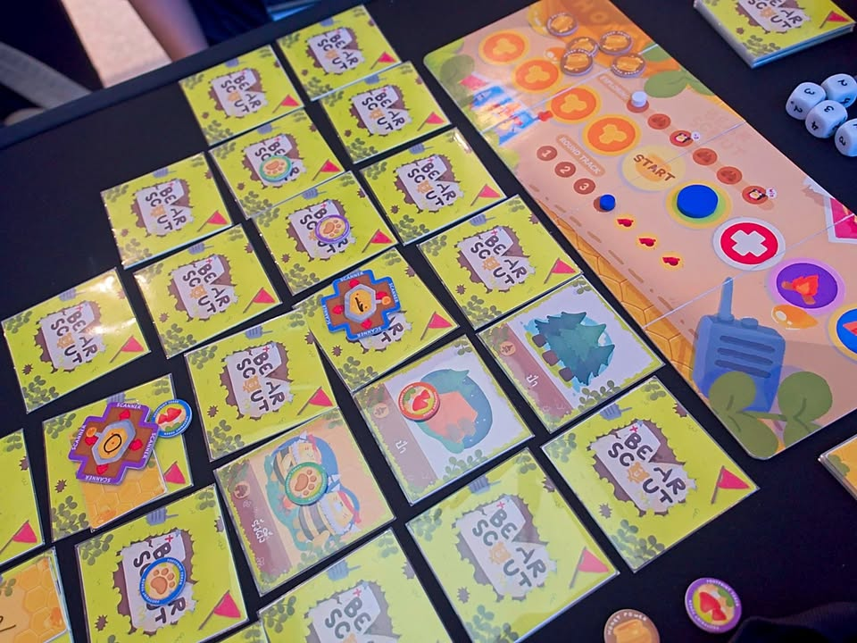
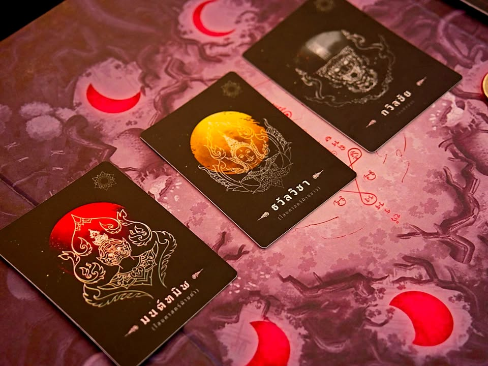
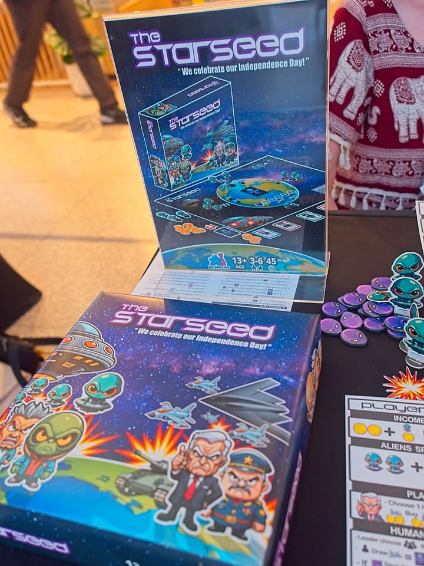
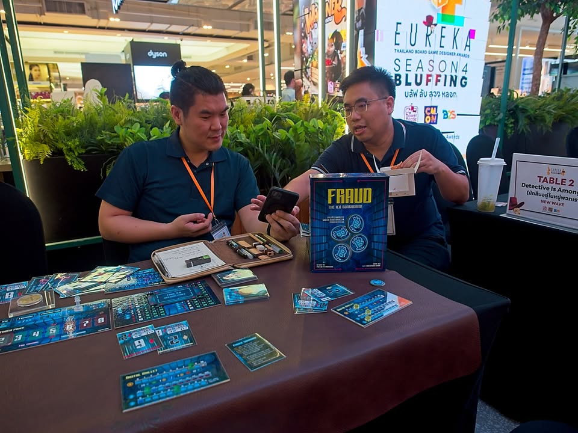
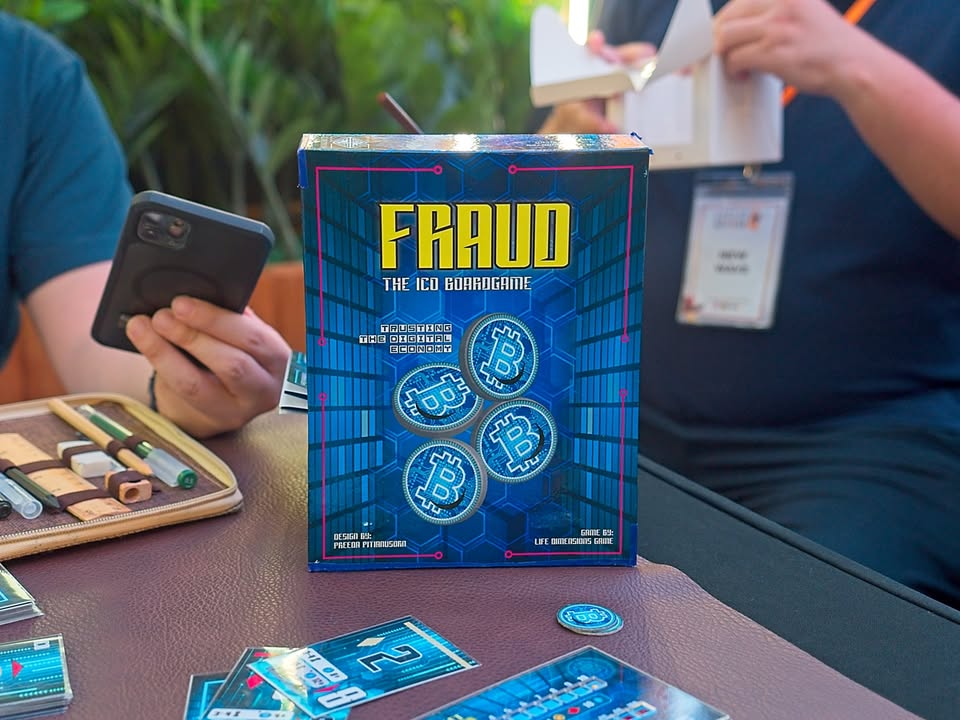

วันนี้ไปงาน Eureka 2024 มาก็จะเล่าให้ฟังนิดหน่อยครับ โดยรอบที่ผมไปมาจะเป็นรอบ semi-final 6 ทีมสุดท้ายที่เดี๋ยวเค้าจะมีรอบ final อีกทีนะ

โดยปีนี้ธีมจะเป็นหัวข้อเกมแนวบลัฟซึ่งที่ได้เล่นไปก็ประมาณนี้ เรียงตามเลขโต๊ะ ไม่ได้เรียงตามความชอบแต่อย่างใด หน้าที่ผมมีแค่ผมส่งคะแนนกับให้ความเห็นระหว่างการทดลองเล่นนะ และเนื่องจากยังไม่ได้ final อะไร ก็คงจะเล่าแค่คร่าวๆไม่ได้บอกเรื่องระบบหรือเรื่องชอบไม่ชอบอะไรนัก

1) Fraud the ICO - ธีมว่าด้วยการตั้งเหรียญคริปโตมาระดมทุนจากนักลงทุนรายอื่น ก็ต้องไปปั่นๆหาคนมาร่วมลงทุน เพราะการ์ดในมือเราจะกำหนดไว้ว่าถ้ามีคนร่วมลงทุนมากหรือน้อยจะได้ผลตอบแทนที่แตกต่างกัน ที่ต้องระวังคือเงินที่เราระดมทุนไปกับเพื่อนนั้นอาจจะโดนหลอกชักเงินไปทั้งหมดก็เป็นได้ (rug pull)
.
.
2) Detective Is Among Us - อ่านรูลตอนแรกนึกว่าหมาป่าธรรมดา แต่เล่นจริงก็มีทวิสที่น่าสนใจอยู่ เพราะว่าจะแบ่งผู้เล่นออกเป็นแก๊งมาเฟียสองทีม และมีนักสืบที่ทำหน้าที่คล้ายๆหมาป่า ผู้เล่นจะต้องเลือกว่าในรอบนั้นๆจะทำกิจกรรมผิดกฏหมายหรือว่าเมินเฉย ถ้าทำผิดแล้วดันโดนนักสืบเลือกพอดีก็เข้าซังเตไป แต่ทำไม่ทำไรก็รอด จากนั้นก็จะมานั่งรวมหัวหานักสืบกัน

ไอเดียที่น่าสนใจนักสืบมันเป็นแค่ตัวเดินเกมไม่ใช่ตัวเด่นเพราะพอกำจัดนักสืบไปได้ชาวแก๊งก็ต้องมานั่งนับเงินดูว่าทีมใครมีเยอะกว่า หรือถ้านักสืบเล่นดีจนทลายแก๊งได้แต่ถ้าดันรวยกว่าชาวแก๊งคนสุดท้ายนักสืบก็แพ้อยู่ดี
.
.
3) Pug Shot - ศีกของหมาหน้าเซเว่นจะมาแย่งชิงชิ้นกระดูก จุดเด่นคงเป็นที่การเลือกบรรจุกระสุนจริงหรือหลอกจากนั้นคนที่ถือปืนก็จะได้มาเดาทางว่าลูกที่จะเอาไปยิงเพื่อนหรือตัวเองนั้นเป็นกระสุนแบบใด เพราะว่าเราอยากจะถูกยิงด้วยลูกหลอกเพื่อทำคะแนน
.
.
4) Bear Scout - เกมแนวแบ่งทีมสไตล์อวาลอนที่เปลี่ยนเป็นหมีและผึ้งแทน ไอเดียจะเป็นแนวเปิดแผนที่ป่าเพื่อหลบรังผึ้งแทน โดยหัวหน้าหมวดจะต้องวัดใจว่าจะสามารถเชื่อถือผลสำรวจของลูกเสือตัวไหนได้บ้าง เกมนี้รูปน่ารักดี
.
.
5) The Starseed - เรียกว่าเป็นแนว Battlestar Galactica Express (หรือ Darkmoon) ละกันเป็นเกมบลัฟแบบแจกบทสองรอบ ที่เราไม่อาจจะแน่ใจได้เลยว่าเราจะเป็นฝ่ายมนุษย์หรือว่าฝ่ายผู้รุกรานจากต่างดาว 
.
.
6) อาเพศ - เกมธีมดาร์กแบบไสยเวทย์ไทยๆเป้าหมายคือการบลัฟเลือกว่าจะทำแอคชั่นพิธีกรรมเบสิคหรือว่าจะแอบเนียนส่งการ์ดทีมตัวเองเพื่อทำคะแนน รูปก็ถือว่าโหดนิดหน่อยถ้าผ่านเข้ารอบก็อาจจะโดนปรับละมั้ง?

อาจจะเขียนกว้างไปซักหน่อย (คือพยายามหลบการให้ความเห็นแหละ) แต่สิ่งหนึ่งที่คิดว่าน่าสนใจคือครึ่งหนึ่งของการประกวดเนี่ยเป็นหน้าใหม่ แล้วก็มีผลงานที่น่าสนใจอยู่ทีเดียว เรียกได้ว่ารุ่นพี่ยังไม่ทันแจ้งเกิดก็โดนเลือดใหม่มาหายใจรดต้นคอกันแล้ว

นอกเรื่องแต่ก็เกี่ยวกันนิดหน่อยคือสมัยก่อนผมอยู่วงการทำเกมดิจิตอลมาก่อน สิ่งที่รู้สึกตอนทำเกมก็คือ.... ตอนนั้นไม่น่าหลับตอนวิชาฟิสิกส์กับเลขเลยหว่ะ ทำเกมนี้แม่งใช้เยอะฉิบหาย ซึ่งสิ่งที่สังเกตจากน้องๆรุ่นใหม่จากหลายๆงานนี้โดนเรื่องเลขกันหมด คือไอเดียเกมดีแต่ตบลงล๊อกไม่ได้เพราะไม่ได้คิดเรื่องเลขหรือความน่าจะเป็นมาก่อนไรงี้ 

ก็ต้องขอขอบคุณ Tower Tactic Games ด้วยครับที่เชิญไปและก็มอบเกม Wagoner ที่ชนะเลิศปี 2022 ฉบับนำเข้าเร่งด่วนมาให้ลองครับ (ส่วนเกมล็อทใหญ่กำลังลงเรือตามมา) ไว้เดี๋ยวลองเล่นแล้วจะเอามาเล่าอีกที เป็นเกมที่คนที่เคยเล่นไว้แล้วอวยยศไว้เยอะมากจะหมั่นไส้เลยละ

พอมาดูรูปแล้วพบว่าถ่ายมานิดเดียวเองแฮะ กิจกรรมเค้าจัดเวลาได้ดีมากเลย เทส เทส พัก ไรงี้ แทบไม่ได้พักแบบเสียเปล่าเลย

