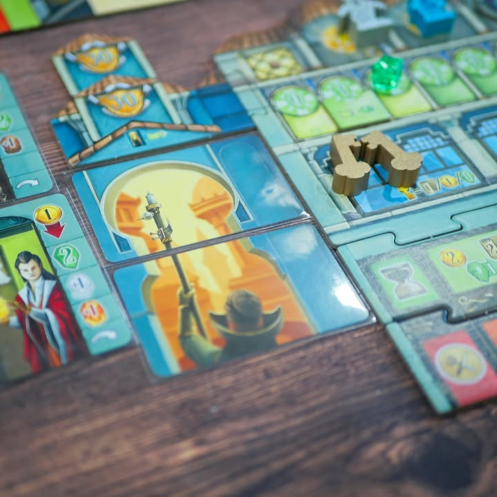
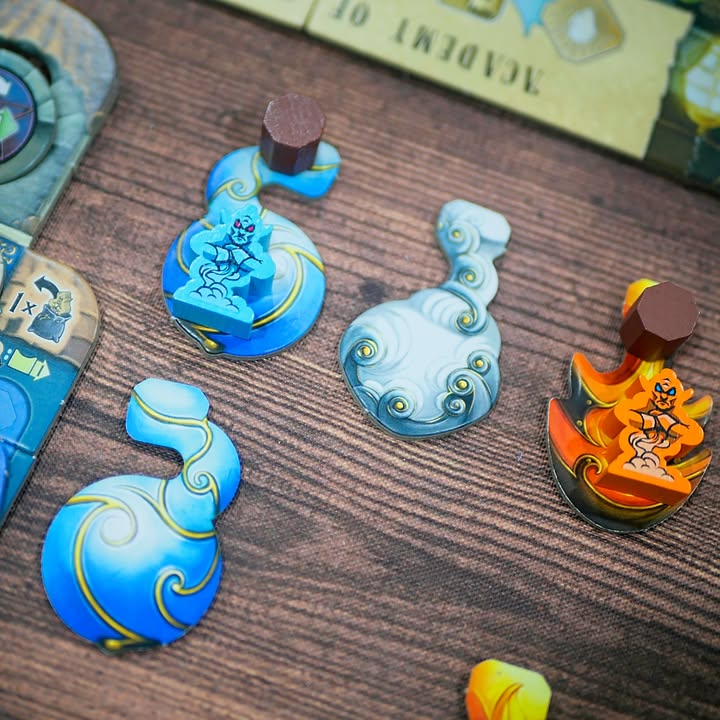

Djinn 

verdict: เกม set collection วิ่งไล่ไปทั่วเมืองเพื่อจับญินใส่ขวด สนุกแบบเพลินๆ

---
ไอเดียเกมก็ตามชื่อเลยคือญิน (ปีศาจของฝั่งอาหรับ แต่มันก็ตัวเดียวกับปีศาจในตะเกียงสีฟ้าของดิสนีย์นั้นแหละ) หลุดออกมาแล้วอยู่กระจายไปทั่วเมือง จอมเวทอย่างเราก็ต้องวิ่งแข่งกันไปทั่วเพื่อจับมันกลับมา

---
แกนหลักของเกมคือ set collection ที่เราจะต้องหาของมา 3 อย่าง อย่างแรกคือขวด อย่างที่สองคือญินที่ธาตุตรงกับขวด และฝาปิดเอาไว้ผนึก ตรงนี้ทำอุปกรณ์มาแบบอินธีมดีนะชอบ ส่วนการเดินเกมก็คือเราต้องเดินตามเส้นทางในเมืองเพื่อทำแอคชั่นในการเก็บของและปลดล็อคความสามารถแล้วก็ racing แข่งกับผู้เล่นคนอื่น

---
แผนที่ในเกมจะเป็นแบบ node ที่มีเส้นถนนเชื่อมติดกันเราก็เดินแล้วก็ทำแอคชั่นไปตามเรื่องแต่เกมมีกิมมิคว่าต้องวางให้ชัดนะว่าเดินออกแล้วเข้าทางไหนเพราะว่ามันมีผลกับการที่คนอื่นจะเดินตามหลังมาทางเดียวกันแล้วจะกลายเป็นเค้าต้องเดินข้ามหรือจ่ายของให้เราเพื่อทำแอคชั่น ก็จะแอบมีการกั๊กแบบไม่ตั้งใจเล็กๆ

---
ระบบรองๆก็ตามแบบยูโรทั่วไปนั้นแหละแต่เกมทำมาให้เยอะแยะดี มีทั้งอัพเกรดที่เก็บพักญินก่อนบรรจุขวด มีจ้างผู้ช่วย มีเก็บสะสมพลังเวทย์ไว้จับญิน มีเพิ่มพื้นทีเก็บเวทย์ มีหยิบชุดมาเพิ่มความสามารถด้วย แล้วการทำไทล์ทำนำแหน่งวางมันได้ฟีลดี ที่แปลกอีกนิดคือเกมเพิ่ม replay ด้วยความสามารถ 2 แบบให้ draft แยกกันตอนต้นเกม คือมีโบนัสที่เก่งกว่าคนอื่น (อันนี้ปกติ) กับ ข้อเสียประจำตัวที่ทำให้เล่นยากกว่าคนอื่นนิดหน่อย ตรงนี้เหมือนจะฟังดูเล็กน้อยแต่ผมคิดว่ามันเป็นการดึง balance ที่ง่ายๆแต่ได้ผลดีนะ

---
เกมนี้ Heavy Meeple เอามาป้ายตอนช่วงปีใหม่ ต้องขอบคุณที่เอาเกมมาสอนด้วยครับ

---
Frog-o-Meter: กบโอเค

(My) Collection Fit: เกมเพลินๆ เบาไปหน่อย และยังไม่มีเอกลักษณ์มากพอ เลยไม่มีที่เก็บ

What I like: ระบบการเล่นของเล่นเยอะ downtime ต่ำ, ไอเดียการเล่าเรื่องเดินทางเอาญินใส่ขวด, ระบบ upgrade tech, presentation เกมแบบมีความแตกต่างที่ดูแล้วใส่ใจในการทำกิมมิคดี

What I dislike: player interaction จางกว่าที่ชอบ ตอนแรกฟังระบบนึกว่าจะขวางกั๊กที่กัน แต่เอาจริงก็เดินอ้อม เดินข้ามกันชิลๆ 

Interaction Area: นอกจากการแข่งกันเก็บญินบางสีแล้วก็มีขวางทางเดินนิดหน่อย แต่นานๆจะเป็นทีเพราะแผนที่มันมีหลายซอยจะเดินชนกันก็ยากอยู่

