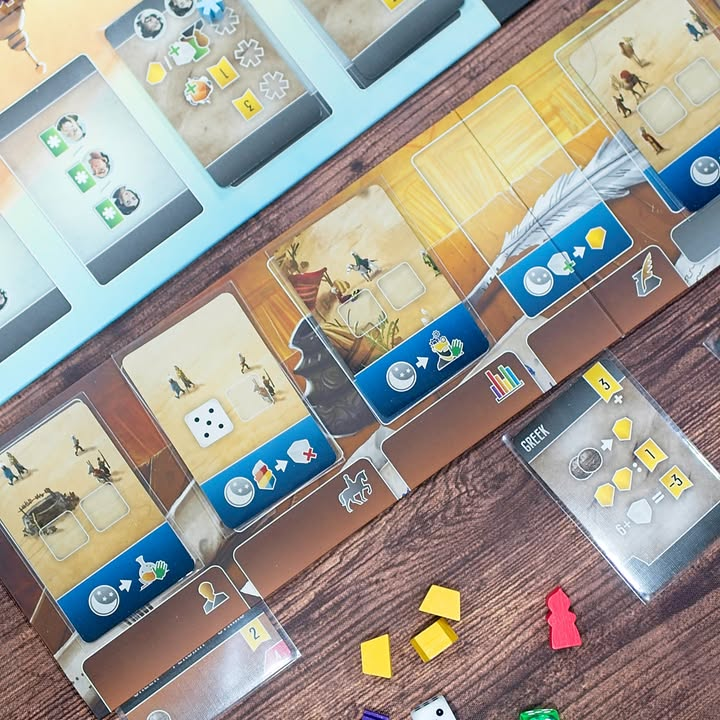
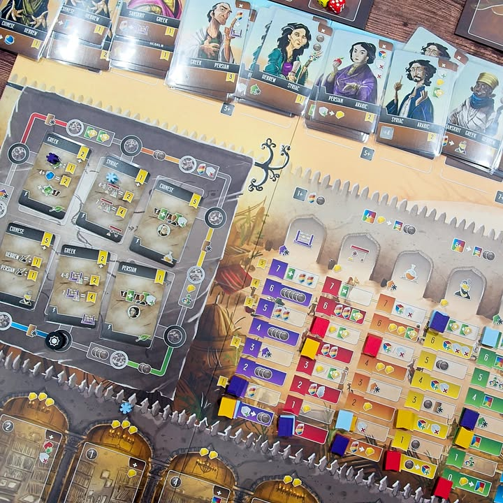

Scholars of the South Tigris

verdict: ยูโรเบอร์ต้นของปีแบบไม่ต้องคิดมาก แอคชั่นน้อยแต่ออกท่าเยอะเกมบริหารทรัพยากรเต๋าที่แค่เลขยังไม่พอต้องผสมสีอีก

---
โดยธีมจะยังจับอยู่ยุคเรื่องเรืองของฝั่งอาหรับที่ต้องการเอกสารจากทั่วทุกมุมโลกให้มาอยู่ในห้องสมุดของชาติ และแน่นอนว่าต้องมีการแปลออกมาเป็นภาษาอาราบิกด้วย

---
เกมแบ่งออกเป็นมินิเกมที่มีการรับส่งข้อมูลระหว่างกัน ตอนเขียนอาจจะงงๆหน่อยแต่ไอเดียคือบอร์ดของเราจะมีช่องวางการ์ดอยู่ เราอยากทำแอคชั่นไหนก็เอาการ์ดพร้อมกับหน้าเต๋าที่เรามีไปลง แอคชั่นจะมีทั้งแบบที่สนใจหน้าเต๋าหรือสีของชุดเต๋าด้วย ในหนึ่งหมวดแอคชั่นเราจะทำได้ครั้งเดียวแต่การ์ดที่เราใช้วางจะมีผลกับโบนัสที่เราจะได้ตอนที่เราเลือก reset board ของเรา

---
สิ่งที่เราจะทำคือจะมีผู้เล่นซักคนที่เล่นมินิเกมเดินทางไปทั่วโลกแล้วส่งเอกสารภาษาต่างประเทศมายังห้องสมุด จากนั้นก็จะมีผู้เล่นซักคนที่ไปจ้างนักวิชาการที่สามารถแปลภาษาหนึ่งไปยังอีกภาษาได้ส่งไปยังห้องทำงาน และจากนั้นใครซักคนก็จะเอาเอกสารที่ถูกส่งมาเนี่ยหยิบมาแปลพร้อมกับจ่ายคอมมิชชั่นให้คนงาน ลูปของเกมก็จะวนๆประมาณนี้ คือจะเรียกว่า economic ของอุปกรณ์ทำแต้มก็ได้ ทำเองหมดได้ก็ดีแต่ส่วนมากมันก็เราทำที่หนึ่งก็จะมีอีกซักคนเอาของเราไปใช้ประโยชน์ต่อ

---
แอคชั่นส่วนที่ต้องใช้สีคือพวก up tech เวลาเอาโบนัส หรือว่าเวลาเราจะหยิบการ์ดมาแปลเนี่ยมันจะต้องดูด้วยว่าการ์ดวางไว้ที่ตึกสีอะไร ถ้าเราไม่มีเต๋าสีนั้นๆก็หยิบออกมาไม่ได้ ส่วนมากเต๋าที่เรามีจะเป็นสีขาว แต่ว่าสามารถฟอกสีได้ด้วยคนงาน และยังสามารถผสมสีเพื่อทำแอคชั่นในกลุ่มคั่นที่สองด้วย กับพอเล่นๆไปเดี๋ยวเราจะหาเต๋าสีเฉพาะมาใส่ในถุงเราได้อีก

---
ถุง?.... ระบบบริหารอีกอย่างของเกมก็คือมันเป็น bag building นะ เวลาเราได้ลูกเต๋ามาก็ต้องใส่ถุงแล้วมาสุ่มจั่วออกมาอีกที

---
ส่วนตัวแล้วผมคิดว่านักออกแบบทำการบ้านหลายอย่างมาดีเลย คือมีเยอะส่วนมากใน Paladin กับ Viscount ที่ผมไม่ชอบเลยเพราะเกมมันไปอยู่ในโซนงึมงำต่างคนต่างเล่นแล้วมาแย่งโบนัสงงๆกว่าที่ชอบ แต่กลับมาโผล่ใน Scholars กับ Wayferer ในแบบที่เห้ยโดนใจหว่ะ เช่นเคยว่าเกมนี้ Heavy Meeple หยิบมาให้ลองเล่นตอนปีใหม่ละ

---
Frog-o-Meter: กบชอบ
  
(My) Collection Fit: ซื้อ! เป็นเกมซี่รี่ย์ทิศใต้ดีงามมากอาจจะเรียกได้ว่าเป็น best ในฝั่งยูโรกลางหนักของซีรี่ย์ (ส่วนระดับกลางให้อาคีเทค) ไม่ได้กบโปรดเพราะรู้สึกยังขาดความ punchy แรงๆบางอย่าง แต่ก็ค่อนข้าง minor นะ
  
What I like: ระบบการทำแอคชั่นที่มีแค่ 4 แบบแต่ลูกเล่นของการบริหารสีและเลข แถมพอเลือกแล้วดันมีลำดับการ revolve ให้โบนัสที่มีผลต่อการได้ของอีก แล้วคือโบนัสทำแต้มมันเยอะสิ่งอย่างให้ดูให้ทำ แต่ก็ไม่ได้ทำให้เกมยุ่งยากขี้น มีความรู้สึกแบบคนที่ชอบการเลือกแอคชั่นทรงๆ coimbra/madaira ก็อาจจะชอบ
  
What I dislike: ไม่ค่อยมีในระดับอยากหยิบมาบ่นเท่าไร จะมีนิดหน่อยก็เวลาต้องมาชะโงกดูว่าคนไหนแปลอะไรได้แล้วจะส่งงานให้ใครต่อมันดูยากนิดนึงเนื่องจากเป็นตัวหนังสือ แล้วพอคนมันหายก็อ้าวขอไปวนดูในตลาดแป๊บ.... กับเกมมันก็แอบอยู่กับตัวเองเยอะพอดูไม่ค่อยได้ไปมองบอร์ดคนอื่นเท่าไรเพราะมันไม่ต้องแย่งแอคชั่นกัน
  
Not for... : คนที่มีปัญหาในการผสมสี ฟังดูเหมือนเรื่องเล็กน้อยแต่ถ้าคนไม่เก็ทนี้สะดุดบ่อยกว่าที่คิดนะ กับใครชอบยูโรแบบแยกกันขาดเก็บก็เก็บ จ่ายซื้อก็จ่ายซื้ออาจจะคิดว่าเกมนี้มัน chain กันเยอะไป 
  
Interaction Area: เห้ยเมิงส่งนักแปลภาษาคนนี้ไปหน่อยอยากใช้งานมาก กับแข่ง majority หัวหน้ากิลด์แย่งโบนัส ส่วนที่เหลือไม่ค่อยมีอะไรหนักหน่วงก็ยูโรทำแอคชั่นตัวเองไปตามเรื่องขัดแบบไม่ได้ตั้งใจ......จริงๆนะ

