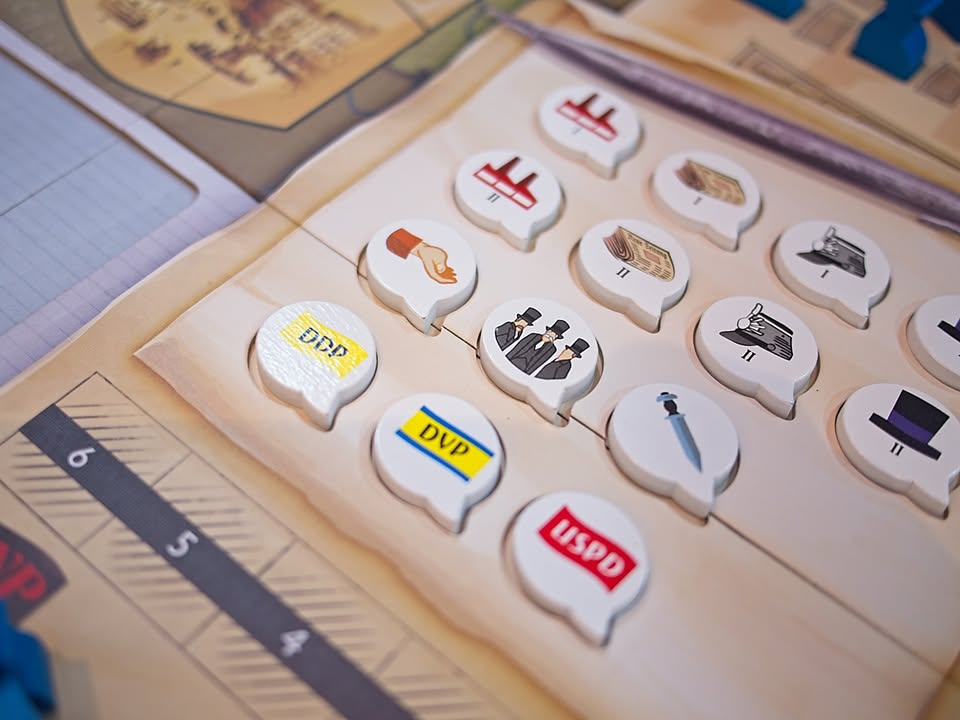
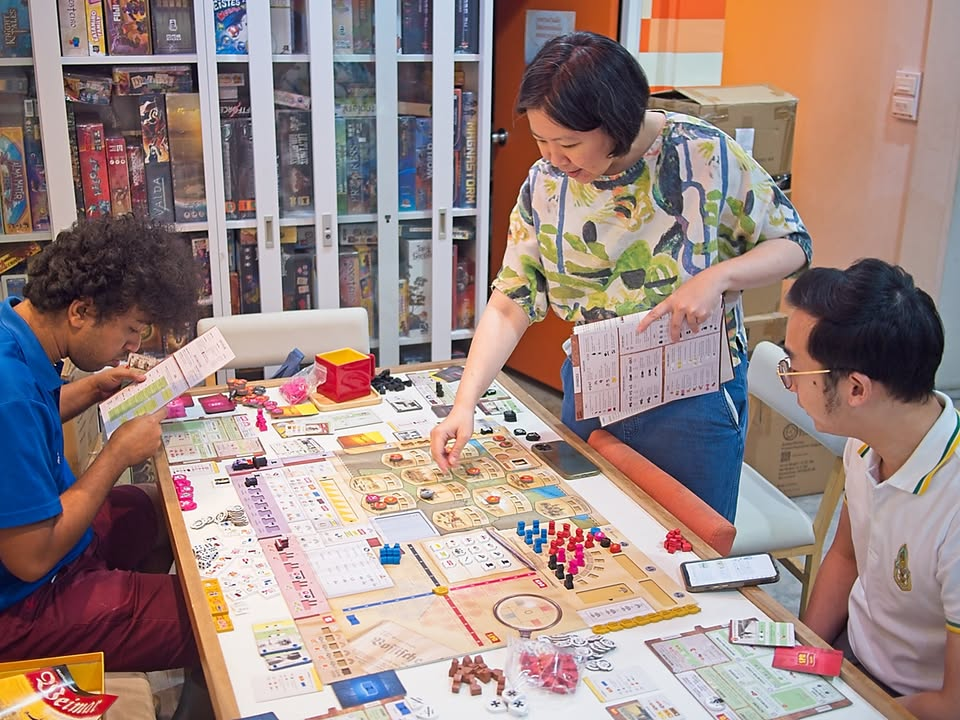

วันก่อนไปฉลองวันเกิดด้วยการไปเล่นเกมสไตล์ politic wargame สนุกๆมาสองเกมคือ Weimar: The Fight for Democracy กับ Prime Minister เลยเอามาลงแบบสั้นๆรวมกันละกัน

---
Weimar: The Fight for Democracy ที่เล่าถึงการก่อร้างสร้างตัวของพรรคการเมืองของเยอรมันในช่วงหลังสงครามโลกครั้งที่ 1 โดยแต่ละคนจะได้เป็นพรรคการเมืองที่มีอุดมการณ์ทางการเมืองที่แตกต่างกัน โดยเกมจะลากยาวไปให้เราเห็นการกำเนิดของพรรคนาซีในช่วงหลังเลยทีเดียว

---
แม้จะมี 4 พรรคการเมือง แต่ก็ยังแบ่งออกเป็นฝ่ายที่อยากจะปกป้องประชาธิปไตยและฝ่ายที่ไม่เห็นด้วยอยากจะล้มมันลง โดยฝ่ายเน้นประชาธิปไตยก็จะพยายามไปลงพื้นที่เพื่อหาเสียงเอาเก้าอี้ในสภามาบริหารประเทศทำคะแนน ในขณะที่อีกฝ่ายก็เน้นเดินขบวนก่อความไม่สงบ ซึ่งก็ชนะได้ทั้งจากการก่อความอ่อนแอแก่รัฐหรือไม่ก็สร้างเสียงสนับสนุนได้มากจนมี สส. ครึ่งสภาก็ได้

---
สิ่งที่ประทับใจคือเกมเล่นง่ายมาก (สำหรับผู้เล่นมีประสบการณ์) วันที่เล่นกันก็คือกางรูลไปอ่านไปกันตอนนั้นเลยเพราะมีเฟสการเล่นที่ชัดเจนเข้าใจตามได้เลย ระบบการเล่นเป็น Card Driven Game ที่เราเลือกได้ 3 ท่าว่าว่าจะใช้เหตุการณ์ หรือเอาพลังไปดึงมติวาระต่างๆให้มาทางพรรคเรา หรือจะเอาพลังไปส่งหัวคะแนนไปลงพื้นที่ในเมืองก็ได้ ตัวเกมเล่นแบบ full น่าจะราวๆ 6 ชั่วโมง แต่พอดีผมลองแค่โหมดแบบสั้นเล่น 2 รอบ ยังบอกอะไรไม่ได้หมดแต่ก็ชอบนะ ดูสมกับที่คนออกแบบ Watergate เป็นคนทำ

---
รวมๆก็คิดว่าสนุกดีเป็นเกมที่เล่นแล้วทำให้เรามองจากมุมของอุดมการณ์ของพรรคการเมืองที่แตกต่างกันแต่ก็ยังต้องร่วมมือกันถ้าผลประโยชน์ลงตัว ตอนเล่นก็มีการเทียบกับพรรคการเมืองบ้านเราหยิบมาพูดกันเฮฮา ข้อเสียจริงๆไม่ใช่เวลาที่อาจจะลากนานแต่เป็นที่ราคารวมส่งที่รู้สึกว่าแพงเกินไปเทียบกับความสนุก (รวมส่งกับภาษีก็มีจบหมื่นขึ้น) ส่วนหนึ่งอาจจะเป็นเพราะผมไม่ได้อินกับช่วงเวลานั้นเป็นพิเศษก็เป็นได้ 

------------------------------

เกมที่สองคือ Prime Minister เราจะมาเล่นเป็นพรรคการเมืองในอังกฤษกัน เล่น 4 คน แต่แบ่งออกเป็นสองฝ่ายคือพวกหัวหน้ากับอนุรักษ์นิยม คนหนึ่งจะเป็นหัวหน้าพรรคส่วนอีกคนจะเป็น สส ตัวกระจิ๋วในพรรค

---
เป้าหมายของเกมนี้คือการอยู่ในตำแหน่งนายกและมีคะแนน 100 คะแนน ระหว่างเล่นก็จะมีการชิงเหลี่ยมแย่งเก้าอี้กันในพรรคไปพร้อมๆกับความพยายามที่ต้องร่วมมือกันเพื่อให้พรรคตัวเองชนะการเลือกตั้งแต่รัฐบาล

---
ระบบการเล่นไม่ได้มีอะไรมากหลักๆคือเอาแอคชั่นพ้อยไปเพิ่มลดฐานเสียงในการโหวตบ้าง เอาเวลาไปดิ่มชากับควีนบ้าง เพราะถ้าควีนไม่โปรดเทียบกับคู่แข่งเราก็ไปเสนอตัวเป็นนายกไม่ได้นะ ส่วนตัวเดินเกมของคือการทีแต่ละคนจะมีการส่งกฏหมายมาให้นายกเลือกวางไว้ ก็จะมีอันที่ผ่านได้ยากง่ายและมีผลถ้าหากร่างผ่านแตกต่างกัน ก็ขึ้นอยู่ด้วยว่าฐานเสียงของพรรคมันอยู่ตรงไหน

---
คือเป็นนายกในเกมจะเหนื่อยสุด ผ่านกฏหมายได้ก็ดีไป แต่ถ้าไม่ผ่านความนิยมก็จะตกอีก เดี๋ยวพอร่วงไอ้ลูกน้องคนสนิทมันก็อาจจะมาท้าชิงตำแหน่งต่อ แถมยังมีเรื่องราวให้ต้องเสียความนิยมจากเหตุการณ์ต่างๆอีก 

---
ชอบที่เกมมันจับรายละเอียดได้หลายมุมดี มีทั้งการแย่งเก้าอี้ การสลับเปลี่ยนเก้าอี้ดนตรีของนายกเพื่อหาจังหวะในการเป็นนายกในตอนที่ดีที่สุด รวมถึงระบบคะแนนที่ถ้าเป็นพรรคเดียวกันก็จะขี่คะแนนไปด้วยกันแต่ถ้าแยกกันก็ค่อยแยกตัวนับแต้มออกมา

---
เกมนี้สนุกดี ระบบเกมมันง่ายเวลาการเล่นไม่นานทำให้กางได้ง่ายกว่ามาก ข้อเสียคงเป็นที่รูปร่างหน้าตามันดูแห้งไม่ชวนเล่นเท่าไร มีแต่ตารางดูแล้วชวนง่วงนอน แต่เกมเพลินกว่าที่เห็นมากอยู่

---
ขอบคุณ Fringer on Board Games กับ บอร์ดเกมสนุก - Boardgame Sanook ครับที่หยิบทั้งสองเกมมาให้เล่น แต่จริงๆตอนแรกนัดเล่น John Company นะ เสียดายเวลามันน้อยเกินไปจริงๆ

------------------------------
Weimar: The Fight for Democracy (เล่นแค่ short เกมนะ)

Frog-o-Meter: กบชอบ  
  
(My) Collection Fit: แพงเกิ๊นซื้อม่ายไหว สมมุติบอกมีตัวรีเทลบ้านๆกล่อง 3 พันก็อาจจะซื้อ แต่หมื่นอัพนี้เกินความชอบไปนะ
  
What I like: ระบบการเล่นที่ไม่ยุ่งยากสอนง่ายจัดสำหรับเกมแนวนี้ มีความพลิกแพลงตลอดเวลา
  
What I dislike: ไม่ค่อยมีแผนล่วงหน้าเท่าไร การ์ดตามประวัติศาสตร์มันก็มีเก่งกากต่างกันพอควร (แต่ถ้าเล่นเยอะและเข้าใจมากกว่านี้อาจจะคิดอีกแบบ)
  
Not for... : คนที่ไม่สนใจแนวประวัติศาสตร์ ชอบการเล่นแบบมาเพื่อวางแผนเนี๊ยบๆทำแต้มคอมโบสวยๆ
  
Interaction Area: ขยับอะไรก็มีแต่เพื่อนมองเพราะมันมีผลกับทุกคนในหลายมิติ

------------------------------
Prime Minister 

Frog-o-Meter: กบชอบ  
  
(My) Collection Fit: position ค่อนข้างน่าสนใจเพราะเป็น wargame เล่นง่าย อาจจะซื้อถ้าได้ราคาโอเค ไม่ก็เดี๋ยวขอไปลอง Versailles 1919 ดูก่อนว่าอันไหนน่าสนกว่ากัน
  
What I like: จริงๆเป็นเกมแนวทำคะแนนเล่นง่ายที่ขับธีมออกมาได้สนุก เล่นไปเฮฮาไป มีจังหวะการพลิกข้างไปมาได้อย่างน่าสนใจ
  
What I dislike: มันเป็นเกมที่ learning curve และ key point คือ จังหวะการเป็น รัฐบาล/ฝ่ายค้าน กับการเป็นหัวหน้าพรรคหรือลูกน้องในจังหวะที่ต้อง 'ถูกที่ถูกเวลาเท่านั้น' การเล่นพลาดตรงนี้คือแทบไม่ชนะละแต่มันจะมองออกยาก ต้องซ้ำบ่อยหน่อย
  
Not for... : คนที่ไม่สนใจแนวอาร์ทแห้งๆเป็นตาราง หรือต้องการการวางแผนกุมชัยที่เข้มข้น
  
Interaction Area: ขยับอะไรก็มีแต่เพื่อนมอง ฝ่ายโน้นมันจะส่งกฏหมายอะไรมาแล้วไอ้ลูกน้องเรามันจะเลื่อยขาเก้าอี้กรูตอนไหน แต่ไม่ปั้นให้มันเก่งก็ช่วยงานไม่ได้อีก โว๊ะ!

